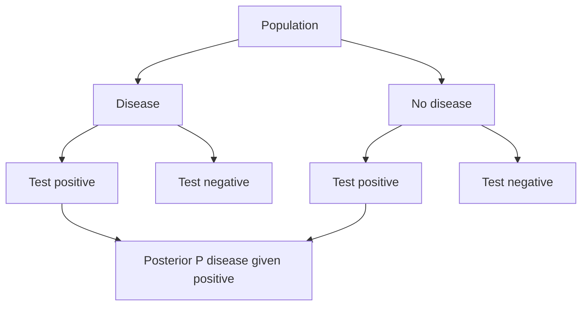

# Conditional Probability and Bayes' Theorem

Conditional probability is the mathematics of updating. It asks how the probability of an event changes after learning that another event occurred. In statistics, this is the bridge between prior information and evidence; in everyday reasoning, it is where many probability mistakes happen because the direction of conditioning matters.


*Figure: Probability trees make the conditioning structure in Bayes' theorem explicit. Image: [Wikimedia Commons](https://commons.wikimedia.org/wiki/File:Bayes_theorem_tree_diagrams.svg), Gnathan87, CC0 1.0.*

The probability chapter in Lane et al. emphasizes conditional probability through cards, disease testing, base rates, and Bayes' theorem. This page develops the same ideas formally and connects them to independence, tree diagrams, and diagnostic reasoning.

## Definitions

For events $A$ and $B$ with $P(B)\gt 0$, the **conditional probability** of $A$ given $B$ is

$$
P(A\mid B)=\frac{P(A\cap B)}{P(B)}.
$$

The vertical bar is read as "given." The condition $B$ becomes the new reference universe. The numerator keeps only the outcomes where both $A$ and $B$ occur; the denominator normalizes by the probability of being inside $B$.

The **multiplication rule** follows by rearranging:

$$
P(A\cap B)=P(A\mid B)P(B)=P(B\mid A)P(A).
$$

Events $A$ and $B$ are **independent** if learning that one occurred does not change the probability of the other:

$$
P(A\mid B)=P(A)
$$

whenever $P(B)\gt 0$. Equivalently,

$$
P(A\cap B)=P(A)P(B).
$$

A collection $A_1,\ldots,A_n$ is **mutually independent** if every finite intersection factors into the product of its probabilities. Pairwise independence alone is weaker and does not guarantee mutual independence.

A set of events $H_1,\ldots,H_k$ is a **partition** of $\Omega$ if the events are disjoint and their union is $\Omega$. Partitions often represent competing hypotheses.

## Key results

**Law of total probability.** If $H_1,\ldots,H_k$ partition $\Omega$ and $P(H_i)\gt 0$, then

$$
P(A)=\sum_{i=1}^k P(A\mid H_i)P(H_i).
$$

This says that the probability of evidence $A$ can be computed by splitting the world into cases $H_i$.

**Bayes' theorem.** For a partition $H_1,\ldots,H_k$,

$$
P(H_j\mid A)=\frac{P(A\mid H_j)P(H_j)}{\sum_{i=1}^k P(A\mid H_i)P(H_i)}.
$$

For two events $A$ and $B$,

$$
P(A\mid B)=\frac{P(B\mid A)P(A)}{P(B\mid A)P(A)+P(B\mid A^c)P(A^c)}.
$$

The terms have standard interpretations:

| Term | Bayesian name | Diagnostic-test name |
|---|---|---|
| $P(H)$ | prior probability | base rate |
| $P(E\mid H)$ | likelihood | sensitivity if $E$ is a positive test |
| $P(E)$ | evidence probability | positive-test rate |
| $P(H\mid E)$ | posterior probability | positive predictive value |

**Independence and complements.** If $A$ and $B$ are independent, then $A$ and $B^c$ are independent, $A^c$ and $B$ are independent, and $A^c$ and $B^c$ are independent. For example,

$$
\begin{aligned}
P(A\cap B^c)
&=P(A)-P(A\cap B)\\
&=P(A)-P(A)P(B)\\
&=P(A)(1-P(B))\\
&=P(A)P(B^c).
\end{aligned}
$$

**Conditional independence is different.** Events may be independent unconditionally but dependent given a third event, or dependent unconditionally but independent given a third event. This is one reason causal reasoning requires care.

Bayes' theorem can also be written in odds form. If $H$ is a hypothesis and $E$ is evidence, then

$$
\frac{P(H\mid E)}{P(H^c\mid E)}
=\frac{P(H)}{P(H^c)}
\cdot
\frac{P(E\mid H)}{P(E\mid H^c)}.
$$

The first factor is the prior odds and the second factor is the likelihood ratio. This form is useful because it shows exactly how evidence changes belief: evidence multiplies prior odds by a factor. A likelihood ratio greater than $1$ supports $H$ over $H^c$; a likelihood ratio less than $1$ supports $H^c$ over $H$.

Conditional probability also depends on the information protocol. In a medical test, a positive result is generated by a known test procedure. In a card game, seeing another player's card depends on the rules of dealing and revealing. In a search problem, the fact that a match was found may depend on how many candidates were searched. These details change the conditioning event. Before applying a formula, state the event after the vertical bar in a way that includes how the information was obtained.

Another reliable habit is to draw a probability tree before writing Bayes' theorem. The first split usually represents the hidden condition or hypothesis, and the second split represents the observed evidence. Multiplying along branches gives joint probabilities such as $P(D\cap +)$ and $P(D^c\cap +)$. Adding the branches that end in the same observation gives the denominator. This tree method is algebraically the same as Bayes' theorem, but it makes the base rate visible and reduces the chance of reversing the conditional probabilities.

## Visual



| Quantity | Symbol | In a medical test |
|---|---|---|
| Sensitivity | $P(+\mid D)$ | positive if diseased |
| Specificity | $P(-\mid D^c)$ | negative if not diseased |
| False positive rate | $P(+\mid D^c)$ | positive if not diseased |
| False negative rate | $P(-\mid D)$ | negative if diseased |
| Positive predictive value | $P(D\mid +)$ | diseased if positive |

## Worked example 1: two cards without replacement

**Problem.** Two cards are drawn from a standard $52$-card deck without replacement. Find the probability that both cards are aces. Then find the probability that the second card is an ace given that the first card is an ace.

**Method.**

1. Let $A_1$ be "first card is an ace" and $A_2$ be "second card is an ace."

2. The first draw has $4$ aces among $52$ cards:

$$
P(A_1)=\frac{4}{52}=\frac{1}{13}.
$$

3. If the first card is an ace, then $3$ aces remain among $51$ cards:

$$
P(A_2\mid A_1)=\frac{3}{51}=\frac{1}{17}.
$$

4. Apply the multiplication rule:

$$
\begin{aligned}
P(A_1\cap A_2)
&=P(A_2\mid A_1)P(A_1)\\
&=\frac{1}{17}\cdot \frac{1}{13}\\
&=\frac{1}{221}.
\end{aligned}
$$

5. Check against counting. The number of unordered two-card hands is $\binom{52}{2}=1326$. The number with two aces is $\binom{4}{2}=6$. Thus

$$
\frac{\binom{4}{2}}{\binom{52}{2}}=\frac{6}{1326}=\frac{1}{221}.
$$

**Checked answer.** $P(\text{two aces})=1/221$, and $P(A_2\mid A_1)=1/17$. The events are not independent because $P(A_2\mid A_1)\ne P(A_2)$.

## Worked example 2: base rates and a positive test

**Problem.** A disease affects $2\%$ of a population. A test has sensitivity $99\%$ and false positive rate $9\%$. If a person tests positive, what is the probability that the person has the disease?

**Method.**

1. Let $D$ be the event "has disease" and $+$ be the event "test positive."

2. Translate the problem:

$$
P(D)=0.02,\quad P(D^c)=0.98,
$$

$$
P(+\mid D)=0.99,\quad P(+\mid D^c)=0.09.
$$

3. Compute the total probability of a positive test:

$$
\begin{aligned}
P(+)
&=P(+\mid D)P(D)+P(+\mid D^c)P(D^c)\\
&=(0.99)(0.02)+(0.09)(0.98)\\
&=0.0198+0.0882\\
&=0.108.
\end{aligned}
$$

4. Apply Bayes' theorem:

$$
\begin{aligned}
P(D\mid +)
&=\frac{P(+\mid D)P(D)}{P(+)}\\
&=\frac{0.0198}{0.108}\\
&=0.1833\ldots.
\end{aligned}
$$

5. Check with natural frequencies. In $100000$ people, about $2000$ have the disease and $98000$ do not. True positives are $(0.99)(2000)=1980$. False positives are $(0.09)(98000)=8820$. Among positives, the diseased count is $1980$ out of $1980+8820=10800$, so

$$
\frac{1980}{10800}=0.1833\ldots.
$$

**Checked answer.** The probability is about $18.3\%$, not $99\%$. The low base rate creates many false positives.

## Code

```python
def bayes_binary(prior, sensitivity, false_positive_rate):
    p_pos = sensitivity * prior + false_positive_rate * (1 - prior)
    posterior = sensitivity * prior / p_pos
    return posterior, p_pos

posterior, positive_rate = bayes_binary(
    prior=0.02,
    sensitivity=0.99,
    false_positive_rate=0.09,
)

print(f"P(positive) = {positive_rate:.4f}")
print(f"P(disease | positive) = {posterior:.4f}")

# Compare with a less rare condition.
for prior in [0.02, 0.10, 0.50]:
    post, _ = bayes_binary(prior, 0.99, 0.09)
    print(f"prior={prior:.2f}, posterior={post:.3f}")
```

## Common pitfalls

- Reversing $P(A\mid B)$ and $P(B\mid A)$. A test can be very likely positive among diseased people while a positive-testing person is not very likely diseased.
- Ignoring the denominator in Bayes' theorem. The denominator includes all ways the evidence could occur.
- Treating "independent" as meaning "disjoint." Disjoint nonempty events are usually dependent: if one occurs, the other cannot.
- Assuming pairwise independence implies mutual independence. Three events can be pairwise independent while the triple intersection does not factor.
- Conditioning on a collider or selected subgroup without noticing that the conditioning event can create dependence.
- Saying "the test is $95\%$ accurate" without specifying sensitivity, specificity, and prevalence.

## Connections

- [sample spaces, events, and axioms](/math/probability/sample-spaces-events-axioms)
- [joint, marginal, and conditional distributions](/math/probability/joint-marginal-conditional-distributions)
- [probability pitfalls and intuition](/math/probability/probability-pitfalls-intuition)
- [discrete probability](/math/discrete/discrete-probability)
- [estimation and confidence intervals](/math/statistics/estimation-and-confidence-intervals)
