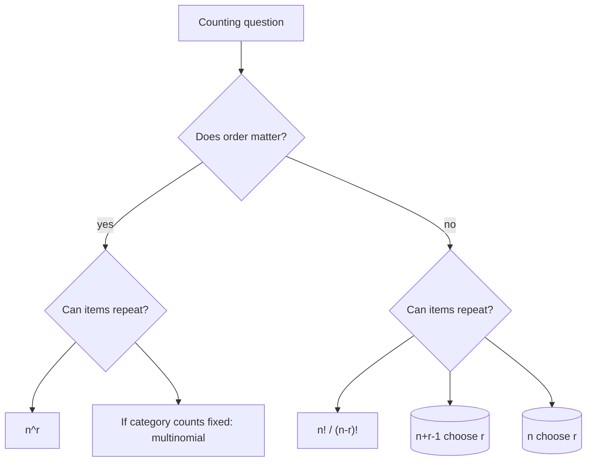

# Counting Principles

Counting is the arithmetic behind finite probability. When outcomes are equally likely, probability reduces to a ratio: favorable outcomes divided by possible outcomes. The difficulty is rarely the division; it is deciding what should be counted, whether order matters, and whether repetition is allowed.


*Figure: Pascal's triangle organizes binomial coefficients, combinations, and recurrence patterns. Image: [Wikimedia Commons](https://commons.wikimedia.org/wiki/File:PascalTriangleAnimated2.gif), Hersfold, public domain.*

This page keeps counting brief because discrete mathematics usually treats it in greater depth. The goal here is to make probability calculations reliable enough for binomial, hypergeometric, multinomial, and card-style examples. For a fuller discrete treatment, use the cross-link at the end.

## Definitions

The **multiplication principle** says that if a process has $a$ choices at one stage and $b$ choices at the next stage for each first choice, then the two-stage process has $ab$ outcomes. More generally, stages with $n_1,n_2,\ldots,n_k$ choices have

$$
n_1n_2\cdots n_k
$$

total outcomes.

A **permutation** is an ordered arrangement. If $r$ objects are selected without replacement from $n$ distinct objects, the number of ordered selections is

$$
P(n,r)=n(n-1)\cdots(n-r+1)=\frac{n!}{(n-r)!}.
$$

A **combination** is an unordered selection. If $r$ objects are selected without replacement from $n$ distinct objects, the number of unordered selections is

$$
\binom{n}{r}=\frac{n!}{r!(n-r)!}.
$$

The symbol $n!$ means

$$
n!=n(n-1)(n-2)\cdots 2\cdot 1,\quad 0!=1.
$$

A **multinomial coefficient** counts the number of ways to divide $n$ labeled positions into groups of sizes $n_1,\ldots,n_k$, where $n_1+\cdots+n_k=n$:

$$
\binom{n}{n_1,n_2,\ldots,n_k}=\frac{n!}{n_1!n_2!\cdots n_k!}.
$$

A **combination with repetition** chooses $r$ items from $n$ types when repeated choices are allowed and order does not matter:

$$
\binom{n+r-1}{r}.
$$

## Key results

| Situation | Order matters? | Repetition? | Count |
|---|---:|---:|---:|
| length $r$ strings from $n$ symbols | yes | yes | $n^r$ |
| ordered sample of $r$ from $n$ | yes | no | $\frac{n!}{(n-r)!}$ |
| unordered sample of $r$ from $n$ | no | no | $\binom{n}{r}$ |
| split $n$ positions into $k$ labeled groups | partially | no | $\frac{n!}{n_1!\cdots n_k!}$ |
| choose $r$ items from $n$ types | no | yes | $\binom{n+r-1}{r}$ |

Two identities appear constantly in probability.

**Symmetry of combinations.**

$$
\binom{n}{r}=\binom{n}{n-r}.
$$

Choosing the $r$ included objects is equivalent to choosing the $n-r$ excluded objects.

**Pascal identity.**

$$
\binom{n}{r}=\binom{n-1}{r-1}+\binom{n-1}{r}.
$$

Proof sketch: focus on a particular object, say object $n$. A size-$r$ subset either includes it, in which case choose $r-1$ more from the remaining $n-1$, or excludes it, in which case choose all $r$ from the remaining $n-1$.

**Binomial theorem.**

$$
(a+b)^n=\sum_{r=0}^n \binom{n}{r}a^r b^{n-r}.
$$

In probability, this identity explains why binomial probabilities sum to one:

$$
\sum_{r=0}^n \binom{n}{r}p^r(1-p)^{n-r}=(p+(1-p))^n=1.
$$

A useful counting workflow is to decide on a representation before calculating. If the experiment produces a sequence, count ordered sequences. If the final outcome is a set, count unordered selections. If the experiment is easier to count in ordered form but the probability question is unordered, count ordered outcomes consistently in both numerator and denominator or divide by the appropriate number of orderings. Mixing ordered and unordered counts in the same fraction is one of the most common sources of wrong answers.

Sometimes the complement is easier to count than the event itself. For example, "at least one shared birthday" is difficult to count directly because many overlap patterns are possible. Its complement, "all birthdays are different," has a clean product:

$$
\frac{365\cdot 364\cdot 363\cdots(365-n+1)}{365^n}.
$$

Then the desired probability is one minus that value. Similar complement strategies work for "at least one success," "not all distinct," and "at least one collision" problems.

For multinomial counts, remember that the coefficient counts arrangements of category labels, not probabilities. The probability of each arrangement is supplied separately by $p_1^{x_1}\cdots p_k^{x_k}$. If all categories are equally likely, the probability part may look simple, but the arrangement count is still essential.

Counting with restrictions often benefits from building the object in stages. If a password must contain at least one digit, count all passwords and subtract those with no digits. If a committee must contain members from several groups, choose the group counts first and then choose people within each group. If two selected objects cannot be adjacent, place the unrestricted objects first and then count the available gaps. The goal is not to force every problem into one formula; it is to choose stages that avoid double counting.

When inclusion-exclusion is needed, label the "bad" events clearly. For example, if counting arrangements where no task misses its deadline, define $A_i$ as "task $i$ misses its deadline." Then the desired count is the total minus the union of the bad events. This keeps the signs and intersections organized.

As a final check, estimate the scale of the answer. A probability should lie between $0$ and $1$, and a count should be an integer. If a count of favorable outcomes exceeds the total sample space, the numerator and denominator are probably based on inconsistent outcome definitions.

## Visual



| Probability model | Counting tool | Example |
|---|---|---|
| Binomial | combinations | exactly $k$ successes in $n$ independent trials |
| Hypergeometric | combinations | successes in draws without replacement |
| Multinomial | multinomial coefficients | category counts across repeated trials |
| Poker hands | combinations | unordered five-card hand |
| Passwords | multiplication principle | ordered strings with allowed symbols |

## Worked example 1: exactly two aces in a poker hand

**Problem.** A five-card hand is dealt from a standard deck. What is the probability that the hand contains exactly two aces?

**Method.**

1. A poker hand is unordered, so the total number of hands is

$$
\binom{52}{5}.
$$

2. To get exactly two aces:

   - choose $2$ of the $4$ aces;
   - choose the remaining $3$ cards from the $48$ non-aces.

   Thus the favorable count is

$$
\binom{4}{2}\binom{48}{3}.
$$

3. The probability is

$$
P=\frac{\binom{4}{2}\binom{48}{3}}{\binom{52}{5}}.
$$

4. Compute the pieces:

$$
\binom{4}{2}=6,
$$

$$
\binom{48}{3}=\frac{48\cdot 47\cdot 46}{3\cdot 2\cdot 1}=17296,
$$

$$
\binom{52}{5}=2598960.
$$

5. Substitute:

$$
P=\frac{6\cdot 17296}{2598960}=\frac{103776}{2598960}\approx 0.03993.
$$

**Checked answer.** The probability is about $3.99\%$. The structure matches the hypergeometric distribution: successes are aces, and sampling is without replacement.

## Worked example 2: multinomial category counts

**Problem.** A customer chooses one of three drink sizes on each visit: small with probability $0.25$, medium with probability $0.50$, and large with probability $0.25$. Assuming independent visits, what is the probability that in $8$ visits the customer chooses $2$ small, $5$ medium, and $1$ large?

**Method.**

1. The sequence is ordered in time, but the requested event specifies only counts. We must count how many sequences have those counts.

2. The number of sequences with $2$ S, $5$ M, and $1$ L is

$$
\binom{8}{2,5,1}=\frac{8!}{2!5!1!}.
$$

3. Compute it:

$$
\frac{8!}{2!5!1!}
=\frac{40320}{(2)(120)(1)}
=168.
$$

4. Any particular sequence with these counts has probability

$$
(0.25)^2(0.50)^5(0.25)^1.
$$

5. Multiply count by probability per sequence:

$$
\begin{aligned}
P
&=168(0.25)^2(0.50)^5(0.25)\\
&=168(0.25)^3(0.50)^5\\
&=168\left(\frac{1}{4}\right)^3\left(\frac{1}{2}\right)^5\\
&=168\cdot \frac{1}{64}\cdot \frac{1}{32}\\
&=\frac{168}{2048}\\
&=0.08203125.
\end{aligned}
$$

**Checked answer.** The probability is about $0.0820$. If we forgot the multinomial coefficient, we would compute only one particular order, not all orders with the requested counts.

## Code

```python
from math import comb, factorial

def poker_exactly_two_aces():
    favorable = comb(4, 2) * comb(48, 3)
    total = comb(52, 5)
    return favorable / total

def multinomial_probability(counts, probs):
    n = sum(counts)
    coefficient = factorial(n)
    for count in counts:
        coefficient //= factorial(count)

    probability = coefficient
    for count, prob in zip(counts, probs):
        probability *= prob ** count
    return probability

print(poker_exactly_two_aces())
print(multinomial_probability([2, 5, 1], [0.25, 0.50, 0.25]))
```

## Common pitfalls

- Counting ordered objects when the outcome is unordered, especially with card hands.
- Counting unordered objects when order actually matters, such as passwords, rankings, or sequences over time.
- Forgetting to multiply by the number of arrangements after computing the probability of one particular sequence.
- Using $\binom{n}{r}$ when sampling is with replacement. Without replacement and with replacement are different models.
- Treating categories as distinguishable when they are not, or indistinguishable when labels matter.
- Forgetting that probabilities require both a count and an equally likely sample space. Counting alone does not justify a probability model.

## Connections

- [discrete probability](/math/discrete/discrete-probability)
- [common discrete distributions](/math/probability/common-discrete-distributions)
- [sample spaces, events, and axioms](/math/probability/sample-spaces-events-axioms)
- [conditional probability and Bayes' theorem](/math/probability/conditional-probability-bayes)
- [permutations and combinations](/math/discrete/permutations-and-combinations)
