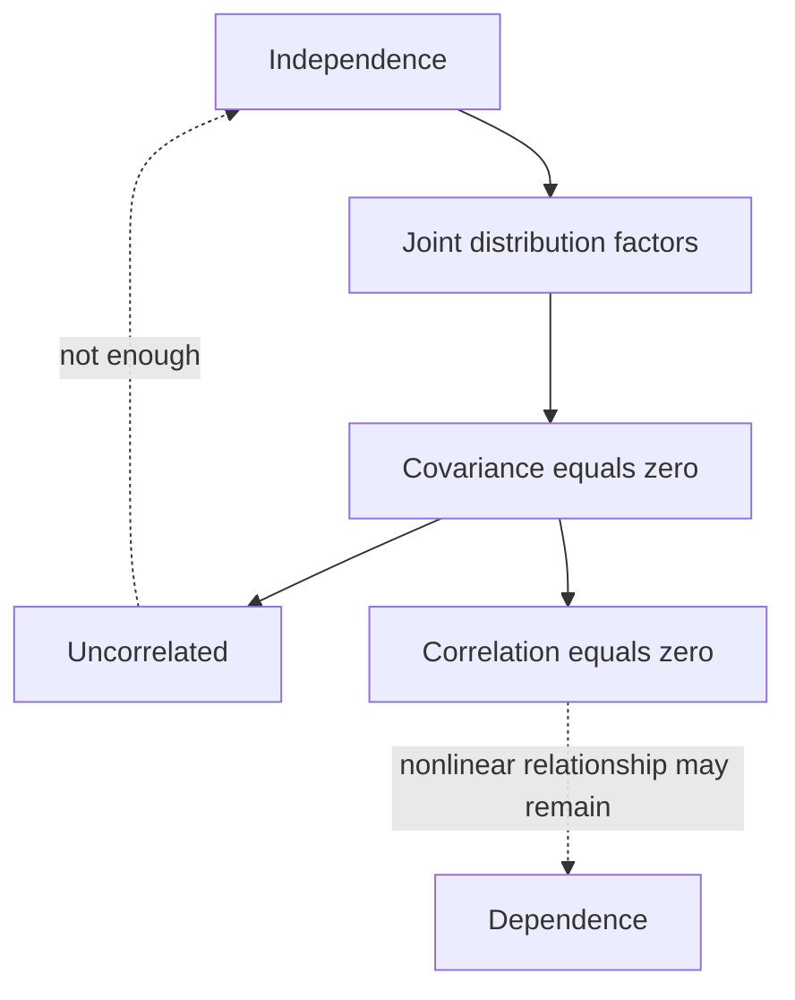

# Covariance, Correlation, and Independence

When two random variables are studied together, we often want to know whether they move together, move oppositely, or have no systematic linear relationship. Covariance measures joint variation in original units; correlation standardizes it to a number between $-1$ and $1$. Independence is stronger: it means the full distribution of one variable is unchanged by knowing the other.

This distinction matters throughout statistics. A zero correlation can be useful, but it does not by itself mean that variables are unrelated. Many nonlinear relationships have zero covariance. Conversely, independence implies zero covariance when variances exist, but the reverse implication usually fails.

## Definitions

For random variables $X$ and $Y$ with finite means, the **covariance** is

$$
\operatorname{Cov}(X,Y)=E[(X-E[X])(Y-E[Y])].
$$

An equivalent computational formula is

$$
\operatorname{Cov}(X,Y)=E[XY]-E[X]E[Y].
$$

The **correlation coefficient** is

$$
\rho_{X,Y}=\frac{\operatorname{Cov}(X,Y)}{\sigma_X\sigma_Y},
$$

where $\sigma_X=\sqrt{\operatorname{Var}(X)}$ and $\sigma_Y=\sqrt{\operatorname{Var}(Y)}$. Correlation is defined only when both standard deviations are positive and finite.

Random variables $X$ and $Y$ are **independent** if events determined by $X$ are independent of events determined by $Y$. Equivalently,

$$
P(X\in A,Y\in B)=P(X\in A)P(Y\in B)
$$

for all suitable sets $A$ and $B$.

For discrete variables, independence is equivalent to

$$
p_{X,Y}(x,y)=p_X(x)p_Y(y)
$$

for all values $x,y$. For continuous variables with densities, it is equivalent to

$$
f_{X,Y}(x,y)=f_X(x)f_Y(y)
$$

on the support.

Variables are **uncorrelated** if $\operatorname{Cov}(X,Y)=0$. This is weaker than independence.

## Key results

**Independence implies zero covariance.** If $X$ and $Y$ are independent and $E[X^2]$ and $E[Y^2]$ are finite, then

$$
E[XY]=E[X]E[Y],
$$

so

$$
\operatorname{Cov}(X,Y)=0.
$$

**Variance of a sum.**

$$
\operatorname{Var}(X+Y)=\operatorname{Var}(X)+\operatorname{Var}(Y)+2\operatorname{Cov}(X,Y).
$$

For a sum of many variables,

$$
\operatorname{Var}\left(\sum_{i=1}^n X_i\right)
=\sum_{i=1}^n \operatorname{Var}(X_i)
+2\sum_{i<j}\operatorname{Cov}(X_i,X_j).
$$

If the variables are pairwise uncorrelated, the covariance terms vanish.

**Correlation bounds.**

$$
-1\le \rho_{X,Y}\le 1.
$$

This follows from the Cauchy-Schwarz inequality:

$$
|\operatorname{Cov}(X,Y)|\le \sigma_X\sigma_Y.
$$

**Perfect correlation.** If $\rho_{X,Y}=1$ or $\rho_{X,Y}=-1$, then one variable is an exact positive or negative linear transformation of the other, except possibly on probability-zero events.

**Units.** Covariance has units equal to the product of the units of $X$ and $Y$. Correlation is unitless, which makes it easier to compare across settings.

Covariance can be read geometrically after centering. The product $(X-\mu_X)(Y-\mu_Y)$ is positive when both variables are above their means or both are below their means. It is negative when one is above its mean and the other is below. Averaging these products gives covariance. A positive covariance therefore means same-direction deviations dominate; a negative covariance means opposite-direction deviations dominate.

Correlation standardizes this average product by the two standard deviations. This standardization makes $\rho$ insensitive to changes of units such as inches to centimeters or dollars to cents. However, correlation still measures only linear association. A strong curved pattern can have correlation close to zero, and a high correlation does not imply that changing one variable causes the other to change.

For independent variables, all information about $X$ is irrelevant for predicting any event involving $Y$. For uncorrelated variables, only the best linear prediction gains no slope from $X$. That is a much narrower statement. In introductory statistics, this is why scatterplots matter alongside correlation coefficients.

Covariance matrices extend these ideas to many variables. The diagonal entries are variances, and the off-diagonal entries are covariances. Such matrices appear in multivariate normal distributions, principal component analysis, least squares, and error propagation. A valid covariance matrix must be symmetric and positive semidefinite, meaning no linear combination of the variables can have negative variance.

Correlation is also sensitive to mixtures. If data combine several subpopulations with different centers, the overall correlation can mainly reflect differences between groups rather than a relationship within each group. In probability terms, conditioning on a group variable changes the joint distribution. This is why covariance calculations should be interpreted together with the sampling process and any important conditioning variables.

When variables are binary, covariance has a direct event interpretation:

$$
\operatorname{Cov}(X,Y)=P(X=1,Y=1)-P(X=1)P(Y=1).
$$

It measures how much the joint occurrence exceeds what independence would predict. This binary form is a useful sanity check because it connects covariance directly back to event probability.

## Visual



| Relationship | Meaning | Implies zero covariance? | Implies independence? |
|---|---|---:|---:|
| independent | full joint factors | yes, if moments exist | yes |
| uncorrelated | no linear association | yes | no |
| positive covariance | above-mean values tend to pair | no | no |
| negative covariance | above-mean pairs with below-mean | no | no |
| zero correlation | standardized covariance is zero | yes | no |

## Worked example 1: covariance from a joint table

**Problem.** Let the joint PMF be:

| $p_{X,Y}(x,y)$ | $y=0$ | $y=1$ |
|---|---:|---:|
| $x=0$ | $0.20$ | $0.10$ |
| $x=1$ | $0.30$ | $0.40$ |

Compute $\operatorname{Cov}(X,Y)$ and $\rho_{X,Y}$.

**Method.**

1. Marginals:

$$
P(X=0)=0.30,\quad P(X=1)=0.70,
$$

$$
P(Y=0)=0.50,\quad P(Y=1)=0.50.
$$

2. Means:

$$
E[X]=0(0.30)+1(0.70)=0.70,
$$

$$
E[Y]=0(0.50)+1(0.50)=0.50.
$$

3. Since $XY=1$ only when $X=1$ and $Y=1$,

$$
E[XY]=1\cdot P(X=1,Y=1)=0.40.
$$

4. Covariance:

$$
\begin{aligned}
\operatorname{Cov}(X,Y)
&=E[XY]-E[X]E[Y]\\
&=0.40-(0.70)(0.50)\\
&=0.05.
\end{aligned}
$$

5. Variances:

   $X$ and $Y$ are Bernoulli with parameters $0.70$ and $0.50$:

$$
\operatorname{Var}(X)=0.70(0.30)=0.21,
$$

$$
\operatorname{Var}(Y)=0.50(0.50)=0.25.
$$

6. Correlation:

$$
\rho_{X,Y}=\frac{0.05}{\sqrt{0.21}\sqrt{0.25}}
\approx \frac{0.05}{0.2291}=0.2182.
$$

**Checked answer.** The covariance is $0.05$ and the correlation is about $0.218$. The variables are positively associated but not strongly.

## Worked example 2: zero covariance without independence

**Problem.** Let $X$ take values $-1,0,1$ with probabilities $1/3$ each, and let $Y=X^2$. Show that $X$ and $Y$ are uncorrelated but not independent.

**Method.**

1. Compute $E[X]$:

$$
E[X]=(-1)\frac{1}{3}+0\cdot\frac{1}{3}+1\cdot\frac{1}{3}=0.
$$

2. Values of $Y$ are $1,0,1$, so

$$
E[Y]=1\cdot\frac{1}{3}+0\cdot\frac{1}{3}+1\cdot\frac{1}{3}=\frac{2}{3}.
$$

3. Compute $XY=X^3$. Values are $-1,0,1$, so

$$
E[XY]=E[X^3]=(-1)\frac{1}{3}+0+1\frac{1}{3}=0.
$$

4. Covariance:

$$
\operatorname{Cov}(X,Y)=E[XY]-E[X]E[Y]=0-0\cdot\frac{2}{3}=0.
$$

5. Check independence. If $X$ and $Y$ were independent, then

$$
P(Y=0\mid X=0)=P(Y=0).
$$

   But $Y=0$ happens exactly when $X=0$, so

$$
P(Y=0\mid X=0)=1,
$$

   while

$$
P(Y=0)=\frac{1}{3}.
$$

**Checked answer.** $\operatorname{Cov}(X,Y)=0$, but $X$ and $Y$ are not independent. The relationship is perfectly nonlinear: $Y=X^2$.

## Code

```python
import numpy as np

# Joint table example.
joint = np.array([[0.20, 0.10], [0.30, 0.40]])
x_values = np.array([0, 1])
y_values = np.array([0, 1])

px = joint.sum(axis=1)
py = joint.sum(axis=0)
EX = np.sum(x_values * px)
EY = np.sum(y_values * py)
EXY = sum(x * y * joint[i, j]
          for i, x in enumerate(x_values)
          for j, y in enumerate(y_values))
cov = EXY - EX * EY
var_x = np.sum((x_values - EX)**2 * px)
var_y = np.sum((y_values - EY)**2 * py)
corr = cov / np.sqrt(var_x * var_y)
print(cov, corr)

# Zero covariance but dependence.
x = np.array([-1, 0, 1])
p = np.ones(3) / 3
y = x**2
cov_xy = np.sum(x * y * p) - np.sum(x * p) * np.sum(y * p)
print(cov_xy)
```

## Common pitfalls

- Saying "independent" when only correlation has been checked.
- Assuming zero covariance means no relationship. It only rules out linear association.
- Forgetting that covariance changes under unit scaling, while correlation does not.
- Computing sample correlation from data and treating it as the population correlation without uncertainty.
- Using covariance formulas without checking that second moments exist.
- Ignoring nonlinear plots. A curved relationship can have near-zero correlation.

## Connections

- [joint, marginal, and conditional distributions](/math/probability/joint-marginal-conditional-distributions)
- [expectation, variance, and moments](/math/probability/expectation-variance-moments)
- [functions of random variables](/math/probability/transformations-random-variables)
- [bivariate data and correlation](/math/statistics/bivariate-data-and-correlation)
- [linear regression inference](/math/statistics/linear-regression-inference)
