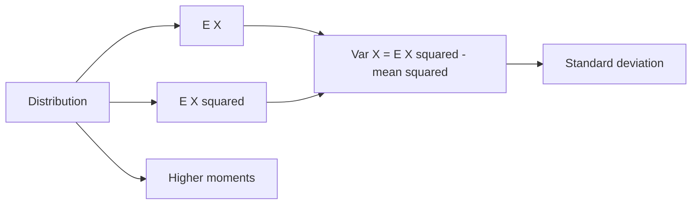

# Expectation, Variance, and Moments

Expectation summarizes the long-run center of a random variable; variance summarizes its spread; moments summarize increasingly detailed features of its distribution. These quantities are not substitutes for the full distribution, but they are often the most useful first summaries. They also power limit theorems, regression, risk calculations, and error estimates.

The key idea is weighted averaging. In a discrete distribution, values are weighted by probability masses. In a continuous distribution, values are weighted by density and integrated. The same logic also applies to functions of random variables through the law of the unconscious statistician.

## Definitions

For a discrete random variable $X$ with PMF $p_X(x)$, the **expected value** is

$$
E[X]=\sum_x x p_X(x),
$$

provided the sum converges absolutely.

For a continuous random variable with PDF $f_X(x)$,

$$
E[X]=\int_{-\infty}^{\infty} x f_X(x)\,dx,
$$

provided the integral converges absolutely.

For a function $g$, the **law of the unconscious statistician** says

$$
E[g(X)]=\sum_x g(x)p_X(x)
$$

in the discrete case, and

$$
E[g(X)]=\int_{-\infty}^{\infty} g(x)f_X(x)\,dx
$$

in the continuous case.

The **variance** is

$$
\operatorname{Var}(X)=E[(X-E[X])^2].
$$

The **standard deviation** is

$$
\operatorname{SD}(X)=\sqrt{\operatorname{Var}(X)}.
$$

The $k$-th **raw moment** is $E[X^k]$. The $k$-th **central moment** is $E[(X-\mu)^k]$, where $\mu=E[X]$. The third central moment is related to skewness, and the fourth central moment is related to kurtosis.

## Key results

**Linearity of expectation.** For constants $a,b$,

$$
E[aX+bY+c]=aE[X]+bE[Y]+c.
$$

Linearity does not require independence.

**Computational variance formula.**

$$
\operatorname{Var}(X)=E[X^2]-(E[X])^2.
$$

Proof:

$$
\begin{aligned}
\operatorname{Var}(X)
&=E[(X-\mu)^2]\\
&=E[X^2-2\mu X+\mu^2]\\
&=E[X^2]-2\mu E[X]+\mu^2\\
&=E[X^2]-2\mu^2+\mu^2\\
&=E[X^2]-\mu^2.
\end{aligned}
$$

**Scaling and shifting.**

$$
E[aX+b]=aE[X]+b,
$$

$$
\operatorname{Var}(aX+b)=a^2\operatorname{Var}(X).
$$

Adding a constant shifts the center but does not change spread. Multiplying by $a$ scales standard deviation by $\vert a\vert $ and variance by $a^2$.

**Variance of sums.**

$$
\operatorname{Var}(X+Y)=\operatorname{Var}(X)+\operatorname{Var}(Y)+2\operatorname{Cov}(X,Y).
$$

If $X$ and $Y$ are independent, then the covariance term is zero, so variances add.

**Indicator trick.** If $I_A$ is $1$ when event $A$ occurs and $0$ otherwise, then

$$
E[I_A]=P(A).
$$

This converts counting problems into expectation problems.

Expectation is linear even when variables are dependent, which makes it unusually powerful. If $X$ counts the number of students in a room who share a birthday with someone else, it may be hard to write down the full distribution of $X$. But if $X$ is written as a sum of indicator variables, then $E[X]$ can often be found by adding the probabilities that each indicator equals $1$. This technique appears in occupancy problems, randomized algorithms, and combinatorics.

Variance is less forgiving. To find the variance of a sum, dependence must be handled through covariance terms. If $X_1,\ldots,X_n$ are independent, then

$$
\operatorname{Var}\left(\sum_{i=1}^n X_i\right)=\sum_{i=1}^n \operatorname{Var}(X_i).
$$

Without independence, this formula can be badly wrong. Positive covariance increases the variance of a sum; negative covariance decreases it.

Moments may fail to exist. A distribution can have a median and many quantiles but no finite mean. It can have a finite mean but infinite variance. When a theorem assumes finite variance, that condition rules out some heavy-tailed models. Before manipulating $E[X]$ or $E[X^2]$, check that the relevant expectation is finite, especially for distributions with polynomial tails.

Expectation is not automatically a typical value. In skewed distributions, the mean can be pulled far into the tail. For waiting times, income, file sizes, and insurance losses, the median, quantiles, or tail probabilities may be more representative for user-facing summaries. Variance has a similar limitation: it summarizes spread around the mean, so it can be dominated by rare extreme values. Moments are powerful algebraic summaries, but they should be paired with distribution shape when interpretation matters.

Conditional expectation is another central extension. The quantity $E[X\mid Y]$ is itself a random variable: after $Y$ is observed, it gives the average value of $X$ under that condition. The identity

$$
E[X]=E[E[X\mid Y]]
$$

means that averaging conditional averages recovers the overall average. This is often the cleanest way to compute expectations in multi-stage experiments.

For example, if a random number of customers arrive and each customer independently spends a random amount, conditioning on the number of customers separates the count randomness from the spending randomness. The outer expectation then averages over possible customer counts. This pattern appears in compound distributions, insurance risk, and queueing models.

## Visual

| Quantity | Formula | Interpretation |
|---|---|---|
| Mean | $E[X]$ | balance point or long-run average |
| Raw second moment | $E[X^2]$ | average squared size |
| Variance | $E[(X-\mu)^2]$ | average squared deviation from mean |
| Standard deviation | $\sqrt{\operatorname{Var}(X)}$ | spread in original units |
| Skewness numerator | $E[(X-\mu)^3]$ | direction of asymmetry |
| Fourth central moment | $E[(X-\mu)^4]$ | tail weight and peakedness |



## Worked example 1: expectation and variance of one die

**Problem.** Let $X$ be the result of one fair six-sided die. Compute $E[X]$, $E[X^2]$, and $\operatorname{Var}(X)$.

**Method.**

1. The possible values are $1,2,3,4,5,6$, each with probability $1/6$.

2. Compute the expectation:

$$
\begin{aligned}
E[X]
&=\sum_{x=1}^6 x\cdot \frac{1}{6}\\
&=\frac{1+2+3+4+5+6}{6}\\
&=\frac{21}{6}\\
&=3.5.
\end{aligned}
$$

3. Compute the second raw moment:

$$
\begin{aligned}
E[X^2]
&=\sum_{x=1}^6 x^2\cdot \frac{1}{6}\\
&=\frac{1^2+2^2+3^2+4^2+5^2+6^2}{6}\\
&=\frac{1+4+9+16+25+36}{6}\\
&=\frac{91}{6}.
\end{aligned}
$$

4. Use the computational formula:

$$
\begin{aligned}
\operatorname{Var}(X)
&=E[X^2]-(E[X])^2\\
&=\frac{91}{6}-\left(\frac{7}{2}\right)^2\\
&=\frac{91}{6}-\frac{49}{4}\\
&=\frac{182-147}{12}\\
&=\frac{35}{12}.
\end{aligned}
$$

5. Standard deviation is

$$
\sqrt{\frac{35}{12}}\approx 1.7078.
$$

**Checked answer.** $E[X]=3.5$, $E[X^2]=91/6$, and $\operatorname{Var}(X)=35/12$.

## Worked example 2: expectation of an exponential random variable

**Problem.** Let $X\sim\operatorname{Exponential}(\lambda)$ with density $f(x)=\lambda e^{-\lambda x}$ for $x\ge 0$. Show that $E[X]=1/\lambda$ and $\operatorname{Var}(X)=1/\lambda^2$.

**Method.**

1. Compute the mean:

$$
E[X]=\int_0^\infty x\lambda e^{-\lambda x}\,dx.
$$

2. Use integration by parts with $u=x$ and $dv=\lambda e^{-\lambda x}dx$. Then $du=dx$ and $v=-e^{-\lambda x}$.

$$
\begin{aligned}
E[X]
&=\left[-xe^{-\lambda x}\right]_0^\infty+\int_0^\infty e^{-\lambda x}\,dx\\
&=0+\left[-\frac{1}{\lambda}e^{-\lambda x}\right]_0^\infty\\
&=\frac{1}{\lambda}.
\end{aligned}
$$

3. Compute the second moment:

$$
E[X^2]=\int_0^\infty x^2\lambda e^{-\lambda x}\,dx.
$$

4. Integration by parts gives

$$
E[X^2]=\frac{2}{\lambda}E[X]=\frac{2}{\lambda^2}.
$$

5. Now compute variance:

$$
\begin{aligned}
\operatorname{Var}(X)
&=E[X^2]-(E[X])^2\\
&=\frac{2}{\lambda^2}-\left(\frac{1}{\lambda}\right)^2\\
&=\frac{1}{\lambda^2}.
\end{aligned}
$$

**Checked answer.** $E[X]=1/\lambda$ and $\operatorname{Var}(X)=1/\lambda^2$.

## Code

```python
import numpy as np
from scipy.integrate import quad

# Die moments.
values = np.arange(1, 7)
probs = np.ones(6) / 6
mean = np.sum(values * probs)
second = np.sum(values**2 * probs)
variance = second - mean**2
print(mean, second, variance)

# Exponential moments by numerical integration.
lam = 2.5
density = lambda x: lam * np.exp(-lam * x)
mean_integral, _ = quad(lambda x: x * density(x), 0, np.inf)
second_integral, _ = quad(lambda x: x**2 * density(x), 0, np.inf)
var_integral = second_integral - mean_integral**2
print(mean_integral, var_integral)
print("theory:", 1 / lam, 1 / lam**2)
```

## Common pitfalls

- Treating expectation as the most likely value. A fair die has expected value $3.5$, which is not a possible roll.
- Assuming expectation always exists. Heavy-tailed distributions can have undefined means or variances.
- Forgetting to square the scaling constant in variance: $\operatorname{Var}(aX)=a^2\operatorname{Var}(X)$.
- Assuming $E[g(X)]=g(E[X])$. This is generally false except for linear $g$.
- Adding standard deviations instead of variances for independent sums.
- Using variance formulas that require independence without checking independence.

## Connections

- [random variables and distributions](/math/probability/random-variables-distributions)
- [covariance, correlation, and independence](/math/probability/covariance-correlation-independence)
- [moment generating and characteristic functions](/math/probability/generating-functions)
- [limit theorems](/math/probability/limit-theorems)
- [summarizing distributions](/math/statistics/summarizing-distributions)
