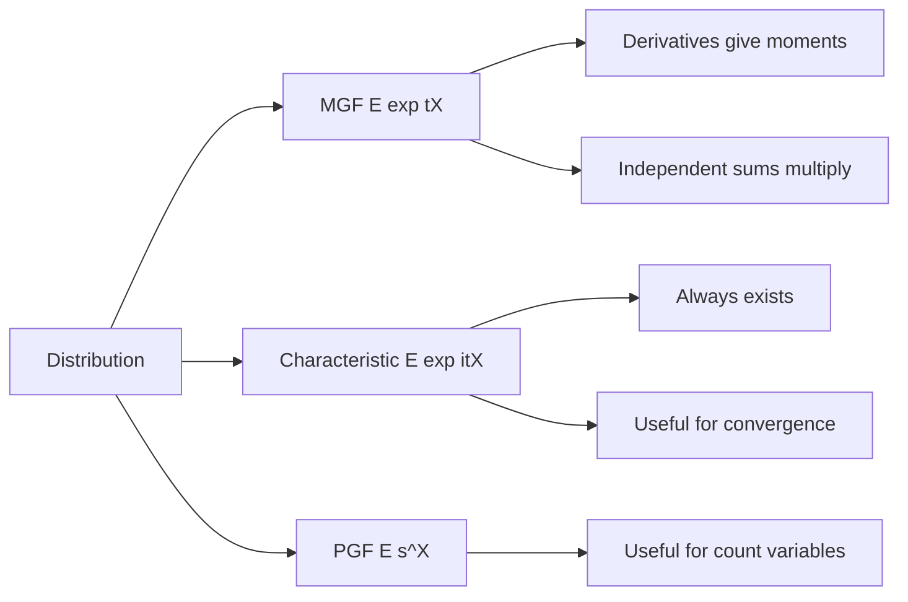

# Moment Generating and Characteristic Functions

Generating functions encode a distribution inside an expectation involving powers or exponentials. They are compact tools for finding moments, proving sums of independent random variables, and proving limit theorems. Moment generating functions are often easiest when they exist near zero. Characteristic functions always exist and are the more general theoretical tool.


*Figure: Pierre-Simon de Laplace is a key figure in probability, transforms, and potential theory. Image: [Wikimedia Commons](https://commons.wikimedia.org/wiki/File:Pierre-Simon_de_Laplace.jpg), Louis Delaistre after Armand-Charles Guilleminot, public domain.*

This page is intentionally brief relative to a full probability-theory course, but it includes the core definitions and computations students need before seeing generating functions in proofs of the central limit theorem or in distribution derivations.

## Definitions

For a random variable $X$, the **moment generating function** (MGF) is

$$
M_X(t)=E[e^{tX}],
$$

for values of $t$ where the expectation exists. If $M_X(t)$ exists on an open interval around $0$, it uniquely determines the distribution.

The **characteristic function** is

$$
\varphi_X(t)=E[e^{itX}],
$$

where $i^2=-1$. Characteristic functions exist for every random variable because $\vert e^{itX}\vert =1$.

For a nonnegative integer-valued random variable $X$, the **probability generating function** (PGF) is

$$
G_X(s)=E[s^X]=\sum_{k=0}^{\infty}P(X=k)s^k.
$$

The MGF generates raw moments by differentiation:

$$
M_X^{(k)}(0)=E[X^k],
$$

when the derivatives exist.

The characteristic function similarly generates moments through derivatives at zero when the corresponding moments exist:

$$
\varphi_X^{(k)}(0)=i^k E[X^k].
$$

## Key results

**Sums of independent variables.** If $X$ and $Y$ are independent, then

$$
M_{X+Y}(t)=M_X(t)M_Y(t),
$$

where the MGFs exist. Proof:

$$
\begin{aligned}
M_{X+Y}(t)
&=E[e^{t(X+Y)}]\\
&=E[e^{tX}e^{tY}]\\
&=E[e^{tX}]E[e^{tY}]\\
&=M_X(t)M_Y(t).
\end{aligned}
$$

The same multiplication rule holds for characteristic functions.

**Recovering mean and variance.**

$$
E[X]=M_X'(0),
$$

$$
E[X^2]=M_X''(0),
$$

$$
\operatorname{Var}(X)=M_X''(0)-[M_X'(0)]^2.
$$

**MGF of common distributions.**

| Distribution | MGF $M_X(t)$ | Valid $t$ |
|---|---|---|
| Bernoulli$(p)$ | $1-p+pe^t$ | all real $t$ |
| Binomial$(n,p)$ | $(1-p+pe^t)^n$ | all real $t$ |
| Poisson$(\lambda)$ | $\exp(\lambda(e^t-1))$ | all real $t$ |
| Exponential$(\lambda)$ | $\lambda/(\lambda-t)$ | $t\lt \lambda$ |
| Normal$(\mu,\sigma^2)$ | $\exp(\mu t+\sigma^2t^2/2)$ | all real $t$ |

**Characteristic functions and convergence.** A sequence of random variables converges in distribution if their characteristic functions converge pointwise to a characteristic function, under standard continuity conditions. This is one route to proving the central limit theorem.

MGFs are especially convenient for sums because multiplication is simpler than convolution. Instead of deriving the full distribution of $X_1+\cdots+X_n$ by repeatedly summing or integrating over all possible decompositions, one can multiply the MGFs and then recognize the result. This is how the binomial MGF follows immediately from independent Bernoulli variables, and how sums of independent normal variables can be shown to remain normal.

Characteristic functions play the same role but with fewer existence problems. A Cauchy random variable, for example, has no finite mean and no MGF around zero, but it still has a characteristic function. This makes characteristic functions the standard tool in more advanced probability.

There is also a related object called the **cumulant generating function**:

$$
K_X(t)=\log M_X(t).
$$

When it exists, derivatives of $K_X$ at zero give cumulants. The first cumulant is the mean, the second is the variance, and higher cumulants encode skewness and tail behavior. Cumulants are useful because independent sums add cumulant generating functions:

$$
K_{X+Y}(t)=K_X(t)+K_Y(t).
$$

This additivity is one reason generating functions appear naturally in asymptotic approximations.

PGFs are particularly useful for count variables because probabilities can be recovered from coefficients. If

$$
G_X(s)=\sum_{k=0}^{\infty}p_k s^k,
$$

then $p_k$ is the coefficient of $s^k$. Derivatives at $s=1$ give factorial moments:

$$
G_X'(1)=E[X],
$$

and

$$
G_X''(1)=E[X(X-1)].
$$

These are convenient for branching processes, occupancy counts, and sums of independent nonnegative integer-valued random variables. As with MGFs, independence turns sums into products:

$$
G_{X+Y}(s)=G_X(s)G_Y(s).
$$

Generating functions also provide quick distribution checks. If a derived MGF matches the known MGF of a named family on an interval around zero, then the derived random variable has that distribution. For example, the product of two normal MGFs is another normal MGF, with means and variances added. This avoids doing a convolution integral.

Still, a generating function is not a substitute for assumptions. The multiplication rule encodes independence, and recognition of a named MGF depends on using the same parameterization as the reference formula.

In practice, generating functions are often used backward. One computes a transform, simplifies it algebraically, and then identifies it as the transform of a known distribution. The final step should always include the valid range of the transform variable, since that range is part of the MGF statement.

That range also helps detect algebra mistakes: an exponential MGF cannot be valid for all real $t$.

## Visual



| Function | Best for | Main limitation |
|---|---|---|
| MGF | moments and named distributions | may not exist away from $0$ |
| Characteristic function | theory and convergence | complex-valued |
| PGF | nonnegative integer counts | limited to count variables |

## Worked example 1: Bernoulli and binomial MGFs

**Problem.** Find the MGF of a Bernoulli$(p)$ random variable, then use it to get the MGF, mean, and variance of a Binomial$(n,p)$ random variable.

**Method.**

1. Let $X\sim\operatorname{Bernoulli}(p)$. Then $X=1$ with probability $p$ and $X=0$ with probability $1-p$.

2. Compute the MGF:

$$
\begin{aligned}
M_X(t)
&=E[e^{tX}]\\
&=e^{t\cdot 0}(1-p)+e^{t\cdot 1}p\\
&=1-p+pe^t.
\end{aligned}
$$

3. Let $Y=X_1+\cdots+X_n$, where the $X_i$ are independent Bernoulli$(p)$. Then $Y\sim\operatorname{Binomial}(n,p)$.

4. Use the multiplication rule:

$$
M_Y(t)=\prod_{i=1}^n M_{X_i}(t)=(1-p+pe^t)^n.
$$

5. Find the mean:

$$
M_Y'(t)=n(1-p+pe^t)^{n-1}pe^t.
$$

   At $t=0$,

$$
M_Y'(0)=n(1)^{n-1}p=np.
$$

6. The variance is easier from the independent sum:

$$
\operatorname{Var}(Y)=\sum_{i=1}^n \operatorname{Var}(X_i)=np(1-p).
$$

**Checked answer.** The binomial MGF is $(1-p+pe^t)^n$, with mean $np$ and variance $np(1-p)$.

## Worked example 2: MGF of an exponential distribution

**Problem.** Let $X\sim\operatorname{Exponential}(\lambda)$ with density $\lambda e^{-\lambda x}$ for $x\ge0$. Find the MGF and use it to compute $E[X]$ and $\operatorname{Var}(X)$.

**Method.**

1. Start from the definition:

$$
M_X(t)=E[e^{tX}]=\int_0^\infty e^{tx}\lambda e^{-\lambda x}\,dx.
$$

2. Combine exponents:

$$
M_X(t)=\lambda\int_0^\infty e^{-(\lambda-t)x}\,dx.
$$

3. The integral converges only if $\lambda-t\gt 0$, so $t\lt \lambda$.

4. Evaluate:

$$
\begin{aligned}
M_X(t)
&=\lambda\left[-\frac{1}{\lambda-t}e^{-(\lambda-t)x}\right]_0^\infty\\
&=\frac{\lambda}{\lambda-t}.
\end{aligned}
$$

5. Differentiate:

$$
M_X'(t)=\frac{\lambda}{(\lambda-t)^2}.
$$

   Thus

$$
E[X]=M_X'(0)=\frac{\lambda}{\lambda^2}=\frac{1}{\lambda}.
$$

6. Differentiate again:

$$
M_X''(t)=\frac{2\lambda}{(\lambda-t)^3}.
$$

   Then

$$
E[X^2]=M_X''(0)=\frac{2}{\lambda^2}.
$$

7. Variance:

$$
\operatorname{Var}(X)=\frac{2}{\lambda^2}-\left(\frac{1}{\lambda}\right)^2
=\frac{1}{\lambda^2}.
$$

**Checked answer.** $M_X(t)=\lambda/(\lambda-t)$ for $t\lt \lambda$, $E[X]=1/\lambda$, and $\operatorname{Var}(X)=1/\lambda^2$.

## Code

```python
import sympy as sp

t, p, n, lam = sp.symbols("t p n lam", positive=True)

# Bernoulli MGF and binomial MGF.
M_bern = 1 - p + p * sp.exp(t)
M_binom = M_bern ** n
print("Bernoulli MGF:", M_bern)
print("Binomial MGF:", M_binom)

# Exponential MGF and moments.
M_exp = lam / (lam - t)
mean_exp = sp.diff(M_exp, t).subs(t, 0)
second_exp = sp.diff(M_exp, t, 2).subs(t, 0)
var_exp = sp.simplify(second_exp - mean_exp**2)
print("Exponential mean:", mean_exp)
print("Exponential variance:", var_exp)

# Numeric characteristic function estimate for a normal sample.
import numpy as np
rng = np.random.default_rng(2)
x = rng.normal(loc=1.0, scale=2.0, size=100_000)
u = 0.3
phi_hat = np.mean(np.exp(1j * u * x))
phi_theory = np.exp(1j * 1.0 * u - (2.0**2) * u**2 / 2)
print(phi_hat, phi_theory)
```

## Common pitfalls

- Assuming an MGF exists for every distribution. Characteristic functions always exist; MGFs may fail.
- Forgetting that the MGF must exist on an interval around $0$ to guarantee uniqueness by the usual theorem.
- Multiplying MGFs for sums without independence.
- Confusing raw moments $E[X^k]$ with central moments $E[(X-\mu)^k]$.
- Dropping the domain restriction, such as $t\lt \lambda$ for an exponential MGF.
- Treating complex characteristic functions as optional decoration. They are often the right tool for rigorous convergence results.

## Connections

- [expectation, variance, and moments](/math/probability/expectation-variance-moments)
- [common discrete distributions](/math/probability/common-discrete-distributions)
- [common continuous distributions](/math/probability/common-continuous-distributions)
- [limit theorems](/math/probability/limit-theorems)
- [random variables and distributions](/math/probability/random-variables-distributions)
