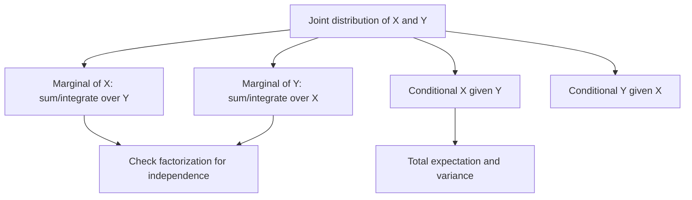

# Joint, Marginal, and Conditional Distributions

Most probability models involve more than one random variable. A student's study time and exam score, two components in a system, or the two coordinates of a random point are not separate stories; their relationship is often the point of the model. Joint distributions describe variables together. Marginal distributions describe one variable after ignoring the others. Conditional distributions describe one variable after another has been observed.


*Figure: Probability trees make the conditioning structure in Bayes' theorem explicit. Image: [Wikimedia Commons](https://commons.wikimedia.org/wiki/File:Bayes_theorem_tree_diagrams.svg), Gnathan87, CC0 1.0.*

This page generalizes conditional probability from events to random variables. It prepares for covariance, independence, transformations, and Markov chains, all of which depend on understanding what information is contained in a joint distribution.

## Definitions

For discrete random variables $X$ and $Y$, the **joint PMF** is

$$
p_{X,Y}(x,y)=P(X=x,Y=y).
$$

The **marginal PMFs** are obtained by summing over the other variable:

$$
p_X(x)=\sum_y p_{X,Y}(x,y),
$$

$$
p_Y(y)=\sum_x p_{X,Y}(x,y).
$$

If $p_Y(y)\gt 0$, the **conditional PMF** of $X$ given $Y=y$ is

$$
p_{X\mid Y}(x\mid y)=\frac{p_{X,Y}(x,y)}{p_Y(y)}.
$$

For continuous random variables, the **joint PDF** $f_{X,Y}(x,y)$ satisfies

$$
P((X,Y)\in A)=\iint_A f_{X,Y}(x,y)\,dx\,dy.
$$

The marginal PDFs are

$$
f_X(x)=\int_{-\infty}^{\infty} f_{X,Y}(x,y)\,dy,
$$

$$
f_Y(y)=\int_{-\infty}^{\infty} f_{X,Y}(x,y)\,dx.
$$

If $f_Y(y)\gt 0$, the conditional density is

$$
f_{X\mid Y}(x\mid y)=\frac{f_{X,Y}(x,y)}{f_Y(y)}.
$$

The **joint CDF** is

$$
F_{X,Y}(x,y)=P(X\le x,Y\le y).
$$

## Key results

**Factorization by conditioning.**

For discrete variables,

$$
p_{X,Y}(x,y)=p_{X\mid Y}(x\mid y)p_Y(y).
$$

For continuous variables,

$$
f_{X,Y}(x,y)=f_{X\mid Y}(x\mid y)f_Y(y).
$$

This is the random-variable version of $P(A\cap B)=P(A\mid B)P(B)$.

**Independence.** Random variables $X$ and $Y$ are independent if, for all suitable $x,y$,

$$
F_{X,Y}(x,y)=F_X(x)F_Y(y).
$$

In the discrete case, this is equivalent to

$$
p_{X,Y}(x,y)=p_X(x)p_Y(y)
$$

for all $x,y$. In the continuous case, it is equivalent to

$$
f_{X,Y}(x,y)=f_X(x)f_Y(y)
$$

where densities exist.

**Expectation from a joint distribution.** For discrete variables,

$$
E[g(X,Y)]=\sum_x\sum_y g(x,y)p_{X,Y}(x,y).
$$

For continuous variables,

$$
E[g(X,Y)]=\int_{-\infty}^{\infty}\int_{-\infty}^{\infty}
g(x,y)f_{X,Y}(x,y)\,dx\,dy.
$$

**Law of total expectation.**

$$
E[X]=E[E[X\mid Y]].
$$

**Law of total variance.**

$$
\operatorname{Var}(X)=E[\operatorname{Var}(X\mid Y)]+\operatorname{Var}(E[X\mid Y]).
$$

These laws say that overall variation can be split into within-condition variation and between-condition variation.

The support of a joint distribution is often the most important part of the problem. If the support is rectangular, such as $0\lt x\lt 1$ and $0\lt y\lt 1$, integration limits are usually independent. If the support is triangular, circular, or constrained by inequalities such as $0\lt y\lt x\lt 1$, the limits change with the variable being integrated. Many wrong marginal densities come from integrating over the right formula but the wrong region.

Conditional distributions can be ordinary distributions in their own right. After observing $Y=y$, the function $p_{X\mid Y}(x\mid y)$ or $f_{X\mid Y}(x\mid y)$ must still sum or integrate to $1$ over $x$. This gives a useful check. If the conditional distribution does not normalize, the denominator or support is wrong.

Conditional expectation compresses a conditional distribution into a single function:

$$
E[X\mid Y=y].
$$

As $y$ changes, this value can trace a regression curve. In linear regression, the corresponding statistical model focuses on how the conditional mean of a response changes with predictors.

Marginalization can also hide structure. Two groups may have different conditional relationships between $X$ and $Y$, while the combined marginal relationship looks weaker, stronger, or even reversed. This is the probability mechanism behind Simpson's paradox. Whenever a joint distribution includes a meaningful grouping variable, compare conditional distributions as well as the aggregate marginal distribution.

For more than two variables, the same ideas scale by summing or integrating over the variables not currently of interest. A Bayesian network, for example, is a structured factorization of a large joint distribution into smaller conditional pieces.

## Visual



| Operation | Discrete | Continuous |
|---|---|---|
| joint probability/density | $p_{X,Y}(x,y)$ | $f_{X,Y}(x,y)$ |
| marginalize $Y$ | $\sum_y p_{X,Y}(x,y)$ | $\int f_{X,Y}(x,y)\,dy$ |
| condition on $Y=y$ | $p_{X,Y}(x,y)/p_Y(y)$ | $f_{X,Y}(x,y)/f_Y(y)$ |
| compute probability in region | sum over cells | double integral |

## Worked example 1: joint table, marginals, and conditionals

**Problem.** The joint PMF of $X$ and $Y$ is:

| $p_{X,Y}(x,y)$ | $y=0$ | $y=1$ |
|---|---:|---:|
| $x=0$ | $0.20$ | $0.10$ |
| $x=1$ | $0.30$ | $0.40$ |

Find the marginal distributions, $P(X=1\mid Y=1)$, and determine whether $X$ and $Y$ are independent.

**Method.**

1. Check total probability:

$$
0.20+0.10+0.30+0.40=1.
$$

2. Marginal distribution of $X$:

$$
P(X=0)=0.20+0.10=0.30,
$$

$$
P(X=1)=0.30+0.40=0.70.
$$

3. Marginal distribution of $Y$:

$$
P(Y=0)=0.20+0.30=0.50,
$$

$$
P(Y=1)=0.10+0.40=0.50.
$$

4. Conditional probability:

$$
P(X=1\mid Y=1)=\frac{P(X=1,Y=1)}{P(Y=1)}
=\frac{0.40}{0.50}=0.80.
$$

5. Check independence. If independent, then

$$
P(X=1,Y=1)=P(X=1)P(Y=1)=0.70(0.50)=0.35.
$$

   But the table gives $0.40$.

**Checked answer.** The marginals are $P(X=0)=0.30$, $P(X=1)=0.70$, $P(Y=0)=0.50$, $P(Y=1)=0.50$. Also $P(X=1\mid Y=1)=0.80$, and $X,Y$ are not independent.

## Worked example 2: a continuous joint density

**Problem.** Let

$$
f_{X,Y}(x,y)=2
$$

on the triangular region $0\lt y\lt x\lt 1$, and $0$ otherwise. Find $f_X(x)$, $f_Y(y)$, and $f_{Y\mid X}(y\mid x)$.

**Method.**

1. Verify normalization. The triangular region has area $1/2$, so the integral of constant density $2$ over it is $1$.

2. For fixed $x$, the possible $y$ values satisfy $0\lt y\lt x$. Therefore

$$
f_X(x)=\int_0^x 2\,dy=2x,\quad 0<x<1.
$$

3. For fixed $y$, the possible $x$ values satisfy $y\lt x\lt 1$. Therefore

$$
f_Y(y)=\int_y^1 2\,dx=2(1-y),\quad 0<y<1.
$$

4. Conditional density of $Y$ given $X=x$:

$$
f_{Y\mid X}(y\mid x)=\frac{f_{X,Y}(x,y)}{f_X(x)}
=\frac{2}{2x}
=\frac{1}{x},
$$

   for $0\lt y\lt x$.

5. Interpret. Given $X=x$, the conditional density of $Y$ is uniform on $(0,x)$.

6. Check normalization:

$$
\int_0^x \frac{1}{x}\,dy=1.
$$

**Checked answer.** $f_X(x)=2x$, $f_Y(y)=2(1-y)$, and $Y\mid X=x\sim \operatorname{Uniform}(0,x)$.

## Code

```python
import numpy as np

# Discrete joint table example.
joint = np.array([
    [0.20, 0.10],
    [0.30, 0.40],
])

px = joint.sum(axis=1)
py = joint.sum(axis=0)
conditional_x1_given_y1 = joint[1, 1] / py[1]
independent = np.allclose(joint, np.outer(px, py))

print("P_X:", px)
print("P_Y:", py)
print("P(X=1 | Y=1):", conditional_x1_given_y1)
print("independent:", independent)

# Monte Carlo check for triangular density f=2 on 0<y<x<1.
rng = np.random.default_rng(0)
n = 100_000
# Sample X from density 2x using inverse CDF X=sqrt(U).
x = np.sqrt(rng.random(n))
y = rng.random(n) * x
print("sample mean X:", x.mean())
print("sample mean Y:", y.mean())
```

## Common pitfalls

- Confusing joint and marginal probabilities. A joint table cell is not the same as a row total.
- Dividing by the wrong marginal when computing conditionals.
- Assuming a joint density value is a probability. Probabilities require integrating over a region.
- Checking independence at only one cell and declaring success. Factorization must hold over the whole support.
- Forgetting support constraints when integrating. In triangular or curved regions, limits depend on the other variable.
- Treating zero covariance as independence. That implication holds only under special conditions, not generally.

## Connections

- [conditional probability and Bayes' theorem](/math/probability/conditional-probability-bayes)
- [covariance, correlation, and independence](/math/probability/covariance-correlation-independence)
- [functions of random variables](/math/probability/transformations-random-variables)
- [Markov chains intro](/math/probability/markov-chains)
- [bivariate data and correlation](/math/statistics/bivariate-data-and-correlation)
