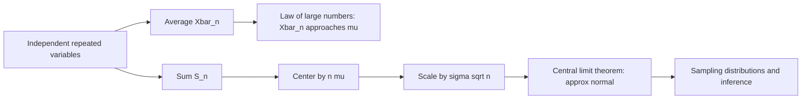

# Limit Theorems

Limit theorems explain why averages stabilize and why normal distributions appear so often. The law of large numbers says that sample averages converge toward the expected value. The central limit theorem says that, after centering and scaling, sums of many weakly behaved independent variables become approximately normal. These results are the mathematical reason repeated measurement can produce reliable estimates.

Lane et al.'s sampling-distributions chapter uses the central limit theorem to explain why sample means are often nearly normal even when the parent population is not. This page focuses on the probability-theory statements and calculations, while the statistics section handles inference applications.

## Definitions

Let $X_1,X_2,\ldots$ be random variables with common mean $\mu$. The **sample mean** is

$$
\overline{X}_n=\frac{1}{n}\sum_{i=1}^n X_i.
$$

A sequence $Y_n$ **converges in probability** to $Y$ if, for every $\epsilon\gt 0$,

$$
P(|Y_n-Y|>\epsilon)\to 0
$$

as $n\to\infty$.

A sequence $Y_n$ **converges almost surely** to $Y$ if

$$
P\left(\lim_{n\to\infty}Y_n=Y\right)=1.
$$

Almost sure convergence is stronger than convergence in probability.

A sequence $Y_n$ **converges in distribution** to $Y$ if

$$
F_{Y_n}(y)\to F_Y(y)
$$

at every continuity point $y$ of $F_Y$.

The **standard normal** random variable is denoted by $Z\sim N(0,1)$, with CDF $\Phi$.

## Key results

**Weak law of large numbers.** If $X_1,X_2,\ldots$ are independent and identically distributed with $E[X_i]=\mu$ and finite variance $\sigma^2$, then

$$
\overline{X}_n \xrightarrow{P} \mu.
$$

A proof sketch uses Chebyshev's inequality. Since

$$
E[\overline{X}_n]=\mu
$$

and, by independence,

$$
\operatorname{Var}(\overline{X}_n)=\frac{\sigma^2}{n},
$$

Chebyshev gives

$$
P(|\overline{X}_n-\mu|\ge \epsilon)
\le \frac{\sigma^2}{n\epsilon^2}\to 0.
$$

**Strong law of large numbers.** Under standard conditions such as independent identically distributed variables with $E[\vert X_1\vert ]\lt \infty$,

$$
\overline{X}_n \to \mu
$$

almost surely.

**Central limit theorem.** If $X_1,\ldots,X_n$ are independent identically distributed with mean $\mu$ and variance $\sigma^2\gt 0$, then

$$
\frac{\sum_{i=1}^n X_i-n\mu}{\sigma\sqrt{n}}
\xrightarrow{d} N(0,1).
$$

Equivalently,

$$
\frac{\overline{X}_n-\mu}{\sigma/\sqrt{n}}
\xrightarrow{d} N(0,1).
$$

**Normal approximation to binomial.** If $X\sim\operatorname{Binomial}(n,p)$, then for large $n$,

$$
\frac{X-np}{\sqrt{np(1-p)}}\approx N(0,1).
$$

A continuity correction often improves the approximation:

$$
P(a\le X\le b)\approx
P(a-0.5\le Y\le b+0.5)
$$

where $Y\sim N(np,np(1-p))$.

The LLN and CLT answer different questions. The LLN says the sample mean becomes close to $\mu$; it does not describe the detailed shape of the error. The CLT describes that error after multiplying by $\sqrt{n}$. In practical terms, the typical size of $\overline{X}_n-\mu$ is on the order of $1/\sqrt{n}$, not $1/n$. Quadrupling the sample size roughly halves the standard error.

The assumptions matter. Independence can be weakened in some advanced versions, and identical distribution can also be relaxed, but some control over dependence and tail size is still needed. Heavy-tailed variables with infinite variance may converge to non-normal stable laws rather than to a normal distribution. Strong dependence can prevent averaging from reducing uncertainty at the usual rate.

The CLT is about distributions, not about individual observations becoming normal. If the original data are skewed, individual future observations remain skewed. What becomes approximately normal is the standardized sum or average. This distinction is central in statistics: a sample mean can be approximately normal even when the raw data are not.

Continuity corrections illustrate another practical issue: a theorem may give the limiting shape, but finite-sample accuracy depends on details. A binomial count is discrete, while the normal approximation is continuous. Replacing $P(70\le X\le 90)$ with an area from $69.5$ to $90.5$ aligns integer bars with continuous intervals. For highly skewed distributions or tail probabilities, simulation or exact computation may be better than a rough CLT approximation.

Limit theorems justify many methods, but they do not remove the need for diagnostics. If data are dependent over time, clustered by group, or generated by a changing process, the effective sample size may be much smaller than the raw count.

The standard error $\sigma/\sqrt{n}$ is the practical bridge from the CLT to statistics. It quantifies the spread of sample means across repeated samples. If $\sigma$ is unknown, statistics replaces it with an estimate, which leads to $t$ procedures under normal-sample assumptions. That inferential step is covered in the statistics section, but the probability source is the variance of the sample mean.

For proportions, the same logic gives standard error

$$
\sqrt{\frac{p(1-p)}{n}}.
$$

This comes from treating each trial as Bernoulli.

As sample size grows, the standard error shrinks, but model bias does not automatically disappear. Averaging many biased measurements converges to the wrong center. Limit theorems control random error under assumptions; they do not fix bad measurement, sampling bias, or a misspecified target.

## Visual



| Theorem | What converges? | Type of convergence | Main message |
|---|---|---|---|
| Weak LLN | $\overline{X}_n$ | probability | averages get close to $\mu$ |
| Strong LLN | $\overline{X}_n$ | almost surely | long-run average settles at $\mu$ |
| CLT | standardized sum or mean | distribution | shape becomes normal |
| Normal approximation | binomial counts | approximation | large count probabilities use $Z$ |

## Worked example 1: LLN bound for coin flips

**Problem.** A fair coin is flipped $n=1000$ times. Let $\overline{X}_n$ be the sample proportion of heads, where $X_i=1$ for heads and $0$ for tails. Use Chebyshev's inequality to bound

$$
P(|\overline{X}_n-0.5|\ge 0.05).
$$

**Method.**

1. For one flip,

$$
X_i\sim\operatorname{Bernoulli}(0.5).
$$

2. Mean and variance:

$$
E[X_i]=0.5,
$$

$$
\operatorname{Var}(X_i)=0.5(1-0.5)=0.25.
$$

3. The sample mean has variance

$$
\operatorname{Var}(\overline{X}_n)=\frac{0.25}{1000}=0.00025.
$$

4. Chebyshev's inequality says

$$
P(|\overline{X}_n-\mu|\ge \epsilon)
\le \frac{\operatorname{Var}(\overline{X}_n)}{\epsilon^2}.
$$

5. Substitute $\epsilon=0.05$:

$$
\begin{aligned}
P(|\overline{X}_n-0.5|\ge 0.05)
&\le \frac{0.00025}{(0.05)^2}\\
&=\frac{0.00025}{0.0025}\\
&=0.10.
\end{aligned}
$$

6. Interpretation. Chebyshev guarantees the probability is at most $10\%$. The exact probability is smaller, but Chebyshev works broadly without requiring a binomial table.

**Checked answer.** The Chebyshev upper bound is $0.10$.

## Worked example 2: CLT approximation for a binomial count

**Problem.** Suppose $X\sim\operatorname{Binomial}(200,0.40)$. Approximate $P(70\le X\le 90)$ using the normal approximation with continuity correction.

**Method.**

1. Compute mean:

$$
\mu=np=200(0.40)=80.
$$

2. Compute variance and standard deviation:

$$
\sigma^2=np(1-p)=200(0.40)(0.60)=48,
$$

$$
\sigma=\sqrt{48}\approx 6.9282.
$$

3. Apply continuity correction:

$$
P(70\le X\le 90)\approx P(69.5\le Y\le 90.5),
$$

   where $Y\sim N(80,48)$.

4. Standardize lower endpoint:

$$
z_1=\frac{69.5-80}{6.9282}\approx -1.5155.
$$

5. Standardize upper endpoint:

$$
z_2=\frac{90.5-80}{6.9282}\approx 1.5155.
$$

6. Use the standard normal CDF:

$$
P(69.5\le Y\le 90.5)=\Phi(1.5155)-\Phi(-1.5155).
$$

7. With $\Phi(1.5155)\approx 0.9352$ and $\Phi(-1.5155)\approx 0.0648$,

$$
P(70\le X\le 90)\approx 0.8704.
$$

**Checked answer.** The CLT approximation is about $0.870$.

## Code

```python
import numpy as np
from scipy.stats import binom, norm

# LLN simulation.
rng = np.random.default_rng(3)
n = 1000
reps = 20_000
samples = rng.binomial(1, 0.5, size=(reps, n))
means = samples.mean(axis=1)
sim_prob = np.mean(np.abs(means - 0.5) >= 0.05)
chebyshev_bound = 0.25 / (n * 0.05**2)
print("simulation:", sim_prob)
print("Chebyshev bound:", chebyshev_bound)

# CLT approximation for Binomial(200, 0.40).
n, p = 200, 0.40
mu = n * p
sigma = np.sqrt(n * p * (1 - p))
approx = norm.cdf((90.5 - mu) / sigma) - norm.cdf((69.5 - mu) / sigma)
exact = binom.cdf(90, n, p) - binom.cdf(69, n, p)
print("normal approximation:", approx)
print("exact binomial:", exact)
```

## Common pitfalls

- Thinking the LLN says short-run outcomes must balance out. It says averages stabilize as $n$ grows, not that tails "owe" heads.
- Using the CLT for very small samples without checking the parent distribution or skew.
- Forgetting to scale by $\sqrt{n}$ in the CLT.
- Confusing convergence in probability with convergence in distribution.
- Applying the normal approximation to a binomial when $np$ or $n(1-p)$ is too small.
- Forgetting the continuity correction for discrete-to-continuous approximations when accuracy matters.

## Connections

- [expectation, variance, and moments](/math/probability/expectation-variance-moments)
- [common discrete distributions](/math/probability/common-discrete-distributions)
- [common continuous distributions](/math/probability/common-continuous-distributions)
- [sampling distributions and CLT](/math/statistics/sampling-distributions-and-clt)
- [normal, t, chi-square, and F distributions](/math/statistics/normal-t-chi-square-and-f-distributions)
