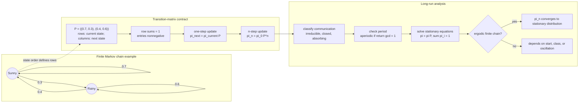

# Markov Chains

A Markov chain is a model for random movement among states where the next state depends on the current state, not on the full past. This is a simple assumption, but it leads to a rich theory for queues, genetics, board games, web ranking, weather models, text generation, inventory systems, and random walks.

This page introduces finite discrete-time Markov chains. The central objects are states, transition probabilities, transition matrices, multi-step probabilities, and stationary distributions. The emphasis is on computation and interpretation rather than advanced convergence theory.

## Definitions

A **discrete-time stochastic process** is a sequence of random variables

$$
X_0,X_1,X_2,\ldots
$$

indexed by time. A process has the **Markov property** if

$$
P(X_{n+1}=j\mid X_n=i,X_{n-1}=i_{n-1},\ldots,X_0=i_0)
=P(X_{n+1}=j\mid X_n=i).
$$

The possible values are called **states**. For a finite chain with states $1,\ldots,m$, the **transition probability** from state $i$ to state $j$ is

$$
p_{ij}=P(X_{n+1}=j\mid X_n=i).
$$

The **transition matrix** is

$$
P=
\begin{pmatrix}
p_{11} & p_{12} & \cdots & p_{1m}\\
p_{21} & p_{22} & \cdots & p_{2m}\\
\vdots & \vdots & \ddots & \vdots\\
p_{m1} & p_{m2} & \cdots & p_{mm}
\end{pmatrix}.
$$

Each row sums to $1$:

$$
\sum_{j=1}^m p_{ij}=1.
$$

An **initial distribution** is a row vector

$$
\pi^{(0)}=(P(X_0=1),\ldots,P(X_0=m)).
$$

The distribution after $n$ steps is

$$
\pi^{(n)}=\pi^{(0)}P^n.
$$

A distribution $\pi$ is **stationary** if

$$
\pi=\pi P
$$

and

$$
\sum_i \pi_i=1.
$$

## Key results

**Chapman-Kolmogorov equation.** The $n$-step transition matrix is $P^n$. Its $(i,j)$ entry gives

$$
P(X_n=j\mid X_0=i).
$$

Matrix multiplication works because a path from $i$ to $j$ in two steps must pass through some intermediate state $k$:

$$
P^2_{ij}=\sum_k p_{ik}p_{kj}.
$$

**Stationary distribution.** A stationary distribution is unchanged by one transition. If the chain is irreducible and aperiodic on a finite state space, then the distribution often converges to the unique stationary distribution regardless of the initial state.

**Absorbing states.** A state $i$ is absorbing if

$$
p_{ii}=1.
$$

Once entered, it cannot be left. Absorbing chains are useful for modeling completion, ruin, failure, or success.

**Detailed balance.** A distribution $\pi$ satisfies detailed balance if

$$
\pi_i p_{ij}=\pi_j p_{ji}
$$

for all states $i,j$. Detailed balance implies stationarity.

**Expected long-run proportions.** Under standard finite irreducible aperiodic conditions, $\pi_j$ is the long-run fraction of time spent in state $j$.

Several classification terms help decide what long-run behavior to expect. A state $j$ is **reachable** from state $i$ if there is some $n$ such that $(P^n)_{ij}\gt 0$. Two states **communicate** if each is reachable from the other. A finite chain is **irreducible** if all states communicate, meaning the state space is one connected class under possible transitions.

A state has **period** $d$ if returns to that state can occur only at multiples of $d$, and $d$ is the greatest common divisor of possible return times. A state with period $1$ is **aperiodic**. Periodicity can cause oscillation: a chain may have a stationary distribution but fail to settle toward it from every starting state.

A state is **recurrent** if the chain returns to it with probability $1$ after leaving, and **transient** if there is a positive probability of never returning. In a finite irreducible chain, all states are recurrent. These ideas explain why the existence of a stationary distribution is not the whole story; the structure of communication and return times controls convergence.

Markov modeling often succeeds or fails based on state design. If tomorrow's demand depends on today's inventory and yesterday's unfilled orders, then a state containing only today's inventory is not Markov. Expanding the state to include the missing memory can restore the Markov property.

Absorbing-chain calculations use the same matrix ideas with a different goal. Instead of long-run proportions among recurring states, one may ask for the probability of eventual absorption in a success state or the expected time until absorption. Games that end, machines that eventually fail, and random walks with barriers can often be written this way. The transition matrix is partitioned into transient and absorbing states, and powers of the matrix show probability mass gradually moving into absorbing states.

Simulation is often the simplest first check for a Markov model. By generating a long path and counting state frequencies or transition frequencies, one can compare empirical behavior with stationary calculations. Simulation does not prove the theorem, but it catches row-order mistakes and impossible transitions quickly.

Markov chains can be time-homogeneous or time-inhomogeneous. This page assumes the same transition matrix $P$ is used at every step. If transition probabilities change with time, write $P_0,P_1,P_2,\ldots$ instead, and the $n$-step update becomes a product of different matrices. Time-inhomogeneous chains can model seasons, learning systems, or policies that change over time, but stationary-distribution ideas need more care.

Continuous-time Markov chains use rates rather than one-step probabilities. They are important in queues and reliability, but their generator matrices are beyond this introductory page.

For finite chains, drawing the directed graph of possible transitions is often the fastest way to spot closed classes, absorbing states, and unreachable states before doing matrix algebra.

## Visual



The Markov-chain diagram separates the state graph from the matrix contract that drives computation. Directed transition arrows give the one-step probabilities, while the matrix subgraph shows row normalization, distribution updates, and powers of $P$. The long-run branch makes convergence depend on communication classes and periodicity, not just on solving $\pi=\pi P$.

| Concept | Formula | Meaning |
|---|---|---|
| one-step transition | $p_{ij}$ | chance next state is $j$ from $i$ |
| transition matrix | $P$ | all one-step probabilities |
| $n$-step transition | $P^n$ | probabilities after $n$ steps |
| next distribution | $\pi^{(1)}=\pi^{(0)}P$ | update probabilities |
| stationary distribution | $\pi=\pi P$ | unchanged by transitions |

## Worked example 1: weather chain after several days

**Problem.** A simple weather chain has states Sunny and Rainy with transition matrix

$$
P=
\begin{pmatrix}
0.7 & 0.3\\
0.4 & 0.6
\end{pmatrix},
$$

where rows are today's weather and columns are tomorrow's weather. If today is Sunny, find the probability it is Rainy two days from now.

**Method.**

1. Today's distribution is

$$
\pi^{(0)}=(1,0).
$$

2. Two days from now:

$$
\pi^{(2)}=\pi^{(0)}P^2.
$$

3. Compute $P^2$:

$$
P^2=
\begin{pmatrix}
0.7 & 0.3\\
0.4 & 0.6
\end{pmatrix}
\begin{pmatrix}
0.7 & 0.3\\
0.4 & 0.6
\end{pmatrix}.
$$

4. The Sunny to Rainy entry is

$$
(P^2)_{SR}=0.7(0.3)+0.3(0.6)=0.21+0.18=0.39.
$$

5. Therefore

$$
\pi^{(2)}=(1,0)P^2=(0.61,0.39).
$$

**Checked answer.** The probability of Rainy two days from now, starting Sunny, is $0.39$.

## Worked example 2: stationary distribution of the weather chain

**Problem.** Find the stationary distribution for the same chain:

$$
P=
\begin{pmatrix}
0.7 & 0.3\\
0.4 & 0.6
\end{pmatrix}.
$$

**Method.**

1. Let

$$
\pi=(s,r),
$$

   where $s$ is long-run Sunny probability and $r$ is long-run Rainy probability.

2. Stationarity requires

$$
(s,r)
\begin{pmatrix}
0.7 & 0.3\\
0.4 & 0.6
\end{pmatrix}
=(s,r).
$$

3. This gives equations:

$$
0.7s+0.4r=s,
$$

$$
0.3s+0.6r=r.
$$

   The two equations are redundant with $s+r=1$.

4. Use the first equation:

$$
0.7s+0.4r=s
$$

   so

$$
0.4r=0.3s.
$$

5. Thus

$$
r=\frac{0.3}{0.4}s=0.75s.
$$

6. Use $s+r=1$:

$$
s+0.75s=1,
$$

$$
1.75s=1,
$$

$$
s=\frac{4}{7}.
$$

7. Then

$$
r=1-\frac{4}{7}=\frac{3}{7}.
$$

**Checked answer.** The stationary distribution is

$$
\pi=\left(\frac{4}{7},\frac{3}{7}\right)\approx(0.5714,0.4286).
$$

## Code

```python
import numpy as np

P = np.array([
    [0.7, 0.3],
    [0.4, 0.6],
])

pi0 = np.array([1.0, 0.0])
pi2 = pi0 @ np.linalg.matrix_power(P, 2)
print("distribution after two days:", pi2)

# Stationary distribution: solve (P.T - I) pi = 0 with sum(pi)=1.
A = P.T - np.eye(2)
A[-1, :] = 1.0
b = np.array([0.0, 1.0])
stationary = np.linalg.solve(A, b)
print("stationary:", stationary)

# Simulate a long path.
rng = np.random.default_rng(4)
state = 0
counts = np.zeros(2)
for _ in range(100_000):
    counts[state] += 1
    state = rng.choice([0, 1], p=P[state])
print("simulated proportions:", counts / counts.sum())
```

## Common pitfalls

- Multiplying distributions on the wrong side. This page uses row vectors, so updates are $\pi P$.
- Forgetting that rows of the transition matrix must sum to $1$.
- Confusing $p_{ij}$ with $p_{ji}$. Direction matters.
- Assuming a stationary distribution automatically means convergence from every initial state. Periodicity or reducibility can block convergence.
- Treating the Markov property as saying the past is irrelevant in every sense. The past can matter through the current state.
- Using a Markov chain when the state definition omits important memory. Add state variables if the next transition depends on more history.

## Connections

- [conditional probability and Bayes' theorem](/math/probability/conditional-probability-bayes)
- [joint, marginal, and conditional distributions](/math/probability/joint-marginal-conditional-distributions)
- [limit theorems](/math/probability/limit-theorems)
- [matrices and matrix algebra](/math/linear-algebra/matrices-and-matrix-algebra)
- [random variables and distributions](/math/probability/random-variables-distributions)
