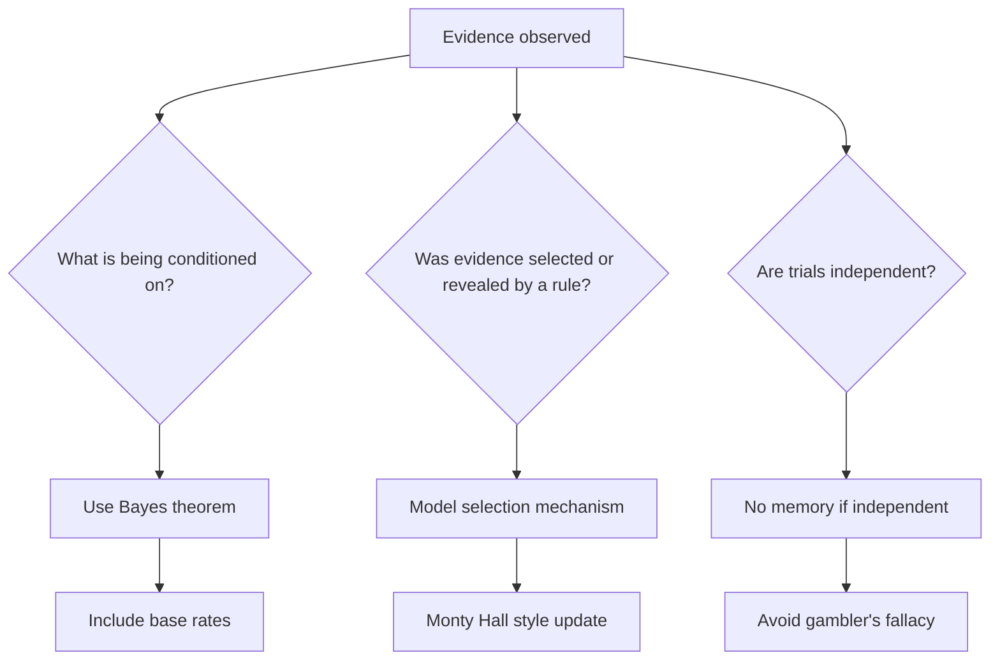

# Probability Pitfalls and Intuition

Probability is precise, but human intuition about uncertainty is often biased. We overreact to vivid evidence, neglect base rates, confuse one conditional probability with its reverse, and expect small samples to look more regular than they should. Good probability habits are not just formula habits; they are modeling habits.

This page collects several recurring traps. The goal is not to memorize puzzle answers but to learn the diagnostic questions: What is the sample space? What is being conditioned on? What information did the selection process reveal? Are we confusing a probability of evidence with a probability of guilt, disease, or truth?

## Definitions

The **base-rate fallacy** occurs when someone underweights the prior probability of a condition or hypothesis and overweights a test result or other evidence.

The **prosecutor's fallacy** occurs when someone confuses

$$
P(\text{evidence}\mid \text{innocent})
$$

with

$$
P(\text{innocent}\mid \text{evidence}).
$$

These are generally very different.

The **gambler's fallacy** is the belief that, after a streak in independent trials, the opposite outcome becomes more likely. For independent fair coin flips,

$$
P(\text{heads next}\mid \text{previous ten were tails})=\frac{1}{2}.
$$

The **Monty Hall problem** is a conditional probability puzzle in which a host's rule for revealing information changes the probabilities. The important point is that the host does not open a door at random from all doors; the host avoids the prize and avoids the player's chosen door.

**Selection bias** occurs when the observed data are produced by a selection mechanism that changes the distribution. Conditioning on being observed can distort apparent probabilities.

## Key results

**Conditioning direction matters.**

Bayes' theorem gives

$$
P(H\mid E)=\frac{P(E\mid H)P(H)}{P(E)}.
$$

A small $P(E\mid H^c)$ can still leave $P(H\mid E)$ modest if $P(H)$ is very small or if many alternative hypotheses could also explain the evidence.

**Natural frequencies reduce errors.** Instead of saying "the false positive rate is $1\%$ and prevalence is $0.1\%$," imagine $100000$ people. Count true positives and false positives. Ratios among counts are often easier to reason about than nested percentages.

**Independent trials have no memory.** If trials are independent, previous outcomes do not alter the next probability. Streaks may feel meaningful, but independence says the conditional probability is unchanged.

**Information policies matter.** In Monty Hall, switching wins with probability $2/3$ under the standard host rule. If the host sometimes opens a random door or behaves strategically, the answer can change.

**Rare events are not impossible.** A tiny probability can matter if the number of opportunities is huge. Conversely, a surprising event after many unreported attempts may not be strong evidence.

Good probabilistic reasoning often starts by choosing the right reference class. If a medical study reports risk for a broad population, that risk may not apply to a subgroup with different age, exposure, or prior symptoms. If a model reports the probability of a sports upset before the season, that is different from the probability after injuries, weather, and opponent strength are known. The base rate should match the information actually available.

Calibration is another useful habit. A forecaster who says "70% chance" many times should be right about $70\%$ of the time among those cases. One event cannot prove a probability wrong merely because the less likely outcome happened. Repeated performance against stated probabilities is the right scale for judging probabilistic forecasts.

Finally, distinguish surprise from evidence. A specific lottery sequence is extremely unlikely, but some sequence must occur. An outcome becomes evidence against a model when it belongs to a class of outcomes that the model made collectively unlikely before the result was observed.

## Visual



| Pitfall | Mistaken thought | Correction |
|---|---|---|
| Base-rate fallacy | "The test is accurate, so I probably have it" | include prevalence |
| Prosecutor's fallacy | "Evidence is rare, so innocence is rare" | reverse conditioning with Bayes |
| Gambler's fallacy | "Tails is due" | independent trials do not compensate |
| Monty Hall | "Two doors remain, so $1/2$ each" | host's reveal is informative |
| Multiple comparisons | "This rare pattern is amazing" | count how many patterns were possible |

## Worked example 1: Monty Hall

**Problem.** There are three doors. One hides a car and two hide goats. You choose Door 1. The host, who knows where the car is, opens a goat door among the two doors you did not choose. You may stay with Door 1 or switch to the remaining unopened door. What strategy maximizes the chance of winning?

**Method.**

1. Your first choice is correct with probability

$$
P(\text{initially correct})=\frac{1}{3}.
$$

2. Your first choice is wrong with probability

$$
P(\text{initially wrong})=\frac{2}{3}.
$$

3. If your first choice is correct, the host opens one of the two goat doors. Switching moves you away from the car, so switching loses.

4. If your first choice is wrong, the car is behind one of the two unchosen doors and the other unchosen door has a goat. The host must open the goat door. Switching moves you to the only remaining unopened unchosen door, which has the car.

5. Therefore:

$$
P(\text{win by staying})=P(\text{initially correct})=\frac{1}{3},
$$

$$
P(\text{win by switching})=P(\text{initially wrong})=\frac{2}{3}.
$$

6. Check by cases:

   | Car location | Initial Door 1? | Host opens | Switch result |
   |---|---:|---|---|
   | Door 1 | correct | Door 2 or 3 | lose |
   | Door 2 | wrong | Door 3 | win |
   | Door 3 | wrong | Door 2 | win |

**Checked answer.** Switching wins with probability $2/3$, staying wins with probability $1/3$, under the standard host rule.

## Worked example 2: prosecutor's fallacy with a database match

**Problem.** A DNA-like profile has a random match probability of $1$ in $1,000,000$ among unrelated innocent people. A city has $5,000,000$ possible people who could have been searched. A suspect matches. Ignoring other evidence, explain why $P(\text{match}\mid \text{innocent})=10^{-6}$ is not the same as $P(\text{innocent}\mid \text{match})$.

**Method.**

1. The statement "random match probability is $10^{-6}$" means

$$
P(\text{match}\mid \text{a specified innocent person})=10^{-6}.
$$

2. If $5,000,000$ innocent people are searched, the expected number of innocent matches is

$$
5,000,000\cdot 10^{-6}=5.
$$

3. That does not prove there are exactly $5$ false matches, but it shows that a match somewhere in a large search is not as surprising as a match for one pre-specified person.

4. To compute $P(\text{innocent}\mid \text{match})$, Bayes' theorem needs a prior probability that the suspect is the source and a model of the search process:

$$
P(\text{innocent}\mid \text{match})
=\frac{P(\text{match}\mid \text{innocent})P(\text{innocent})}{P(\text{match})}.
$$

5. The denominator includes matches from the true source and matches from innocent people:

$$
P(\text{match})=
P(\text{match}\mid \text{source})P(\text{source})
+P(\text{match}\mid \text{innocent})P(\text{innocent}).
$$

6. If the suspect was found by searching a huge database, the selection process must be included. The evidence is not "this pre-specified suspect matched"; it is closer to "someone in a large database matched."

**Checked answer.** The random match probability is a likelihood, not a posterior probability of innocence or guilt. The posterior depends on priors, the number of opportunities for false matches, and the search procedure.

## Code

```python
import numpy as np

rng = np.random.default_rng(5)

def simulate_monty_hall(n=100_000):
    wins_switch = 0
    wins_stay = 0
    for _ in range(n):
        car = rng.integers(0, 3)
        choice = rng.integers(0, 3)
        possible_opens = [d for d in range(3) if d != choice and d != car]
        opened = rng.choice(possible_opens)
        remaining = [d for d in range(3) if d != choice and d != opened][0]
        wins_stay += (choice == car)
        wins_switch += (remaining == car)
    return wins_stay / n, wins_switch / n

stay, switch = simulate_monty_hall()
print("stay:", stay)
print("switch:", switch)

# Expected false matches in a database search.
database_size = 5_000_000
random_match_probability = 1 / 1_000_000
expected_false_matches = database_size * random_match_probability
print("expected false matches:", expected_false_matches)
```

## Common pitfalls

- Reversing conditional probabilities, especially in tests, legal evidence, and classification.
- Ignoring base rates because the evidence feels strong.
- Treating independent random trials as if they self-correct in the short run.
- Forgetting that a revealed clue may be informative because of the rule used to reveal it.
- Evaluating a surprising event after seeing it without accounting for all the other surprising events that could have been noticed.
- Treating a model probability as a fact about the world without checking whether the model assumptions match the situation.

## Connections

- [conditional probability and Bayes' theorem](/math/probability/conditional-probability-bayes)
- [sample spaces, events, and axioms](/math/probability/sample-spaces-events-axioms)
- [common discrete distributions](/math/probability/common-discrete-distributions)
- [limit theorems](/math/probability/limit-theorems)
- [statistical literacy and data](/math/statistics/statistical-literacy-and-data)
