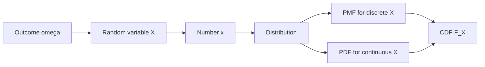

# Random Variables and Distributions

A random variable converts outcomes into numbers. Instead of listing every detailed outcome in the sample space, we often care about a numerical summary: the number of heads, the waiting time until a machine fails, the maximum of several measurements, or whether a test result is positive. Distributions describe how probability is assigned to those numerical values.


*Figure: A Galton box turns repeated random left-right choices into an approximate bell-shaped distribution. Image: [Wikimedia Commons](https://commons.wikimedia.org/wiki/File:Galton_Box.svg), Marcin Floryan, CC BY-SA 3.0.*

This page is the bridge between event-based probability and the distribution-centered language used in statistics, simulation, and modeling. Lane et al. use probability distributions for binomial, Poisson, normal, and sampling-distribution examples. Here we build the general vocabulary: random variables, probability mass functions, probability density functions, and cumulative distribution functions.

## Definitions

A **random variable** is a function

$$
X:\Omega\to \mathbb{R}
$$

that assigns a real number to each outcome. The word "variable" is traditional, but formally $X$ is a function.

A random variable is **discrete** if its possible values are finite or countably infinite. Its **probability mass function** (PMF) is

$$
p_X(x)=P(X=x).
$$

The PMF satisfies

$$
p_X(x)\ge 0,\quad \sum_x p_X(x)=1.
$$

A random variable is **continuous** if probabilities are described by a **probability density function** (PDF) $f_X(x)$ such that

$$
P(a\le X\le b)=\int_a^b f_X(x)\,dx.
$$

The PDF satisfies

$$
f_X(x)\ge 0,\quad \int_{-\infty}^{\infty} f_X(x)\,dx=1.
$$

The **cumulative distribution function** (CDF) is defined for every real random variable by

$$
F_X(x)=P(X\le x).
$$

The CDF is nondecreasing, right-continuous, and satisfies

$$
\lim_{x\to -\infty}F_X(x)=0,\quad \lim_{x\to \infty}F_X(x)=1.
$$

For a continuous random variable with density $f_X$,

$$
F_X(x)=\int_{-\infty}^{x} f_X(t)\,dt,
$$

and, where differentiable,

$$
f_X(x)=F_X'(x).
$$

The **support** of a distribution is the set of values where the PMF or PDF is positive. A **parameter** is a fixed constant that indexes a family of distributions, such as the success probability $p$ in a Bernoulli distribution or the rate $\lambda$ in an exponential distribution.

## Key results

The CDF is the most universal way to describe a distribution because it works for discrete, continuous, and mixed random variables. Probability over intervals can be recovered from it:

$$
P(a<X\le b)=F_X(b)-F_X(a).
$$

For continuous random variables, endpoint choices usually do not matter because

$$
P(X=a)=\int_a^a f_X(x)\,dx=0.
$$

For discrete random variables, endpoint choices matter because points can have positive probability.

If $X$ is discrete with PMF $p_X$, then its CDF is a step function:

$$
F_X(x)=\sum_{t\le x}p_X(t).
$$

If $X$ is continuous with PDF $f_X$, then probabilities are areas under the curve:

$$
P(a\le X\le b)=\int_a^b f_X(x)\,dx.
$$

Do not interpret density height as probability. A density can exceed $1$ on a short interval; the area, not the height, is the probability.

A **quantile** is an inverse-CDF value. A number $q_\alpha$ is an $\alpha$-quantile if

$$
P(X\le q_\alpha)\ge \alpha
$$

and

$$
P(X\ge q_\alpha)\ge 1-\alpha.
$$

For continuous strictly increasing CDFs, this is simply

$$
q_\alpha=F_X^{-1}(\alpha).
$$

Two random variables can have the same distribution even if they are defined on different sample spaces. For instance, the indicator of heads in a coin toss and the indicator of drawing a red card from a balanced red/black deck are different functions on different experiments, but both can be Bernoulli$(1/2)$. Distributional statements describe probabilities of values, not the underlying physical mechanism.

Random variables can also be mixed. A delivery time might have a positive probability of being exactly $0$ if an item is already available, plus a continuous density over positive waiting times if it must be shipped. Such variables are neither purely discrete nor purely continuous, but their CDF still works. This is one reason the CDF is more fundamental than either a PMF or a PDF.

When modeling, the support is as important as the formula. A normal distribution may approximate adult heights well near the center but still gives tiny probability to negative heights. A beta distribution is often better for proportions because its support is exactly $(0,1)$. A Poisson distribution can count events but cannot model negative values or fixed upper limits. Matching support prevents many silent modeling errors.

CDFs also make inequalities precise. The event $X\le x$ is always meaningful, but phrases such as "around $x$" or "near $x$" require an interval. In continuous models, changing from $\lt $ to $\le$ usually makes no difference; in discrete models, it can change the answer by a point mass. When using software, check whether a function returns $P(X\le x)$, $P(X\lt x)$, $P(X\ge x)$, or $P(X\gt x)$.

## Visual

| Feature | Discrete random variable | Continuous random variable |
|---|---|---|
| Probability object | PMF $p_X(x)=P(X=x)$ | PDF $f_X(x)$ |
| Total probability | $\sum_x p_X(x)=1$ | $\int f_X(x)\,dx=1$ |
| Point probability | can be positive | usually $P(X=x)=0$ |
| Interval probability | sum masses | integrate density |
| CDF shape | step function | often smooth curve |
| Example | number of heads | waiting time |



## Worked example 1: distribution of the sum of two dice

**Problem.** Let $X$ be the sum of two fair six-sided dice. Find the PMF and compute $P(5\le X\le 9)$.

**Method.**

1. The sample space has $36$ equally likely ordered outcomes $(i,j)$.

2. Count outcomes by sum:

   | $x$ | 2 | 3 | 4 | 5 | 6 | 7 | 8 | 9 | 10 | 11 | 12 |
   |---:|---:|---:|---:|---:|---:|---:|---:|---:|---:|---:|---:|
   | count | 1 | 2 | 3 | 4 | 5 | 6 | 5 | 4 | 3 | 2 | 1 |

3. Convert counts to probabilities:

$$
p_X(x)=\frac{\text{count at sum }x}{36}.
$$

4. The event $5\le X\le 9$ includes sums $5,6,7,8,9$, so

$$
\begin{aligned}
P(5\le X\le 9)
&=\frac{4+5+6+5+4}{36}\\
&=\frac{24}{36}\\
&=\frac{2}{3}.
\end{aligned}
$$

5. Check by complement. The excluded sums are $2,3,4,10,11,12$, with counts $1+2+3+3+2+1=12$. Thus the desired probability is $1-12/36=2/3$.

**Checked answer.** $P(5\le X\le 9)=2/3$. The random variable compresses $36$ outcomes into $11$ possible numerical values.

## Worked example 2: a continuous density

**Problem.** Suppose $X$ has density

$$
f_X(x)=
\begin{aligned}
&2x,\quad 0\le x\le 1,\\
&0,\quad \text{otherwise}.
\end{aligned}
$$

Find $F_X(x)$ and compute $P(0.25\le X\le 0.75)$.

**Method.**

1. First verify it is a density:

$$
\int_0^1 2x\,dx = \left[x^2\right]_0^1=1.
$$

2. For $x\lt 0$, no mass has accumulated:

$$
F_X(x)=0.
$$

3. For $0\le x\le 1$,

$$
F_X(x)=\int_0^x 2t\,dt=x^2.
$$

4. For $x\gt 1$, all mass has accumulated:

$$
F_X(x)=1.
$$

5. Now compute the interval probability:

$$
\begin{aligned}
P(0.25\le X\le 0.75)
&=F_X(0.75)-F_X(0.25)\\
&=(0.75)^2-(0.25)^2\\
&=0.5625-0.0625\\
&=0.5.
\end{aligned}
$$

6. Check by integration:

$$
\int_{0.25}^{0.75}2x\,dx
=\left[x^2\right]_{0.25}^{0.75}
=0.5.
$$

**Checked answer.** $F_X(x)=0$ for $x\lt 0$, $F_X(x)=x^2$ for $0\le x\le 1$, and $F_X(x)=1$ for $x\gt 1$. The interval probability is $0.5$.

## Code

```python
import numpy as np

# PMF for the sum of two dice.
outcomes = [(i, j) for i in range(1, 7) for j in range(1, 7)]
sums = np.array([i + j for i, j in outcomes])

values, counts = np.unique(sums, return_counts=True)
pmf = counts / counts.sum()

for value, probability in zip(values, pmf):
    print(f"P(X={value}) = {probability:.4f}")

mask = (values >= 5) & (values <= 9)
print("P(5 <= X <= 9) =", pmf[mask].sum())

# Continuous example: F(x)=x^2 on [0,1].
def cdf(x):
    x = np.asarray(x)
    return np.where(x < 0, 0, np.where(x <= 1, x**2, 1))

print("P(0.25 <= X <= 0.75) =", cdf(0.75) - cdf(0.25))
```

## Common pitfalls

- Forgetting that a random variable is a function on outcomes, not the outcome itself.
- Treating a density value $f_X(x)$ as if it were $P(X=x)$.
- Ignoring support. Formulas such as $2x$ are densities only on the interval where they are defined.
- Assuming endpoint choices never matter. They do not matter for continuous distributions, but they do matter for discrete distributions.
- Using a PDF when the problem gives a CDF, or differentiating a discrete CDF as if it were smooth.
- Failing to check that probabilities or densities normalize to one.

## Connections

- [common discrete distributions](/math/probability/common-discrete-distributions)
- [common continuous distributions](/math/probability/common-continuous-distributions)
- [expectation, variance, and moments](/math/probability/expectation-variance-moments)
- [functions of random variables](/math/probability/transformations-random-variables)
- [sampling distributions and CLT](/math/statistics/sampling-distributions-and-clt)
