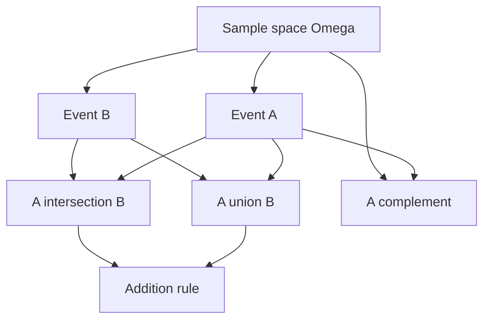

# Sample Spaces, Events, and Axioms

Probability begins by separating two ideas that everyday language often mixes together: the outcomes that could happen and the numerical rules used to describe how likely those outcomes are. A sample space lists the possible outcomes of an experiment, while events are the subsets of outcomes we ask questions about. Once those objects are clear, probability is not a collection of gambling tricks; it is a measure on events.

This page gives the formal starting point for the rest of probability theory. Lane et al.'s statistics text introduces probability through equally likely outcomes, relative frequencies, simple compound events, and base rates. A probability-theory course keeps those examples but places them inside Kolmogorov's axioms, which work equally well for finite dice rolls, countably infinite waiting times, and continuous measurements such as lifetimes.

## Definitions

A **random experiment** is a process whose outcome is not known in advance but whose possible outcomes can be specified. The **sample space** is the set of all possible outcomes and is usually denoted by $\Omega$ or $S$.

An **event** is a subset of the sample space. If the observed outcome $\omega$ lies in event $A$, we say that event $A$ occurred. Common event operations are:

- **Complement:** $A^c = \{\omega \in \Omega : \omega \notin A\}$.
- **Union:** $A \cup B = \{\omega : \omega \in A \text{ or } \omega \in B\}$.
- **Intersection:** $A \cap B = \{\omega : \omega \in A \text{ and } \omega \in B\}$.
- **Difference:** $A \setminus B = A \cap B^c$.
- **Disjoint events:** $A$ and $B$ are disjoint if $A \cap B = \varnothing$.

A **probability space** is a triple $(\Omega, \mathcal{F}, P)$ where:

1. $\Omega$ is the sample space.
2. $\mathcal{F}$ is a collection of events, called a sigma-algebra, closed under complements and countable unions.
3. $P$ assigns a number $P(A)$ to each event $A \in \mathcal{F}$.

In a finite or countable sample space, it is common to assign probabilities to individual outcomes and then add. If $\Omega = \{\omega_1,\omega_2,\ldots\}$ and $p_i = P(\{\omega_i\})$, then $p_i \ge 0$, $\sum_i p_i = 1$, and

$$
P(A) = \sum_{\omega_i \in A} p_i.
$$

When all finite outcomes are equally likely, the classical rule is

$$
P(A)=\frac{\# A}{\# \Omega}.
$$

This rule is useful but not a definition of probability in general. It applies only when the outcomes are equally likely and the sample space is finite.

## Key results

The Kolmogorov axioms are the foundation:

| Axiom | Statement | Meaning |
|---|---|---|
| Nonnegativity | $P(A) \ge 0$ | An event cannot have negative probability. |
| Normalization | $P(\Omega)=1$ | Something in the sample space occurs. |
| Countable additivity | If $A_1,A_2,\ldots$ are pairwise disjoint, then $P(\cup_i A_i)=\sum_i P(A_i)$ | Probabilities of non-overlapping alternatives add. |

Several rules follow immediately.

**Complement rule.** Since $A$ and $A^c$ are disjoint and $A \cup A^c = \Omega$,

$$
P(A^c)=1-P(A).
$$

**Empty event.** Since $\Omega$ and $\varnothing$ are disjoint and $\Omega \cup \varnothing=\Omega$,

$$
P(\varnothing)=0.
$$

**Monotonicity.** If $A \subseteq B$, then

$$
B = A \cup (B \setminus A)
$$

with disjoint pieces, so

$$
P(B)=P(A)+P(B\setminus A) \ge P(A).
$$

**Addition rule.** For any two events,

$$
P(A \cup B)=P(A)+P(B)-P(A \cap B).
$$

The subtraction is necessary because outcomes in $A \cap B$ were counted once in $P(A)$ and once in $P(B)$.

**Finite inclusion-exclusion.** For three events,

$$
\begin{aligned}
P(A \cup B \cup C)
&=P(A)+P(B)+P(C)\\
&\quad -P(A\cap B)-P(A\cap C)-P(B\cap C)\\
&\quad +P(A\cap B\cap C).
\end{aligned}
$$

The pattern alternates between adding single events, subtracting pairwise intersections, and adding the triple intersection.

The axioms also separate probability from the physical story that motivated it. A coin, a weather forecast, and a randomized algorithm can all be modeled by the same probability rules once the sample space and event class are chosen. The hard modeling work is deciding which outcomes belong in $\Omega$ and which probability assignment is appropriate. In finite examples, the phrase "equally likely" must be justified by symmetry or design. In continuous examples, the probability of a single point is usually zero, so events must be intervals, regions, or other measurable sets. This is why the sigma-algebra $\mathcal{F}$ appears in the formal definition: probability is assigned to events that the model is prepared to measure, not to arbitrary verbal descriptions.

## Visual



| Event expression | Plain-language reading | Probability rule |
|---|---|---|
| $A^c$ | $A$ does not occur | $1-P(A)$ |
| $A \cap B$ | both $A$ and $B$ occur | depends on dependence |
| $A \cup B$ | at least one of $A,B$ occurs | $P(A)+P(B)-P(A\cap B)$ |
| $A \setminus B$ | $A$ occurs but $B$ does not | $P(A)-P(A\cap B)$ |
| disjoint $A,B$ | no shared outcomes | $P(A\cup B)=P(A)+P(B)$ |

## Worked example 1: two dice and event algebra

**Problem.** Roll two fair six-sided dice. Let $A$ be the event that the sum is $7$, and let $B$ be the event that at least one die shows $6$. Find $P(A)$, $P(B)$, $P(A\cap B)$, and $P(A\cup B)$.

**Method.**

1. The sample space is ordered pairs:

$$
\Omega=\{(i,j): i,j\in\{1,2,3,4,5,6\}\}.
$$

   There are $6\cdot 6=36$ equally likely outcomes.

2. Event $A$ contains the pairs whose sum is $7$:

$$
A=\{(1,6),(2,5),(3,4),(4,3),(5,2),(6,1)\}.
$$

   Therefore $\#A=6$ and

$$
P(A)=\frac{6}{36}=\frac{1}{6}.
$$

3. Event $B$ contains outcomes with a $6$ in the first coordinate or second coordinate. There are $6$ outcomes with first die $6$ and $6$ outcomes with second die $6$, but $(6,6)$ is counted twice:

$$
\#B=6+6-1=11.
$$

   Hence

$$
P(B)=\frac{11}{36}.
$$

4. For $A\cap B$, the sum must be $7$ and at least one die must be $6$. From the list for $A$, only $(1,6)$ and $(6,1)$ qualify:

$$
P(A\cap B)=\frac{2}{36}=\frac{1}{18}.
$$

5. Use the addition rule:

$$
\begin{aligned}
P(A\cup B)
&=P(A)+P(B)-P(A\cap B)\\
&=\frac{6}{36}+\frac{11}{36}-\frac{2}{36}\\
&=\frac{15}{36}\\
&=\frac{5}{12}.
\end{aligned}
$$

**Checked answer.** Direct counting confirms this: $A\cup B$ has the $11$ outcomes in $B$ plus the $4$ sum-seven outcomes without a $6$, for $15$ outcomes out of $36$.

## Worked example 2: a countably infinite sample space

**Problem.** A coin is tossed until the first head appears. Let $T$ be the toss number on which the first head appears. For a fair coin, find $P(T\le 3)$ and $P(T\gt 3)$.

**Method.**

1. The sample space can be written as

$$
\Omega=\{H,TH,TTH,TTTH,\ldots\}.
$$

   Equivalently, the outcome is $T\in\{1,2,3,\ldots\}$.

2. The event $T=k$ means the first $k-1$ tosses are tails and the $k$-th toss is heads:

$$
P(T=k)=\left(\frac{1}{2}\right)^{k-1}\left(\frac{1}{2}\right)=\left(\frac{1}{2}\right)^k.
$$

3. Add the disjoint cases $T=1,2,3$:

$$
\begin{aligned}
P(T\le 3)
&=P(T=1)+P(T=2)+P(T=3)\\
&=\frac{1}{2}+\frac{1}{4}+\frac{1}{8}\\
&=\frac{7}{8}.
\end{aligned}
$$

4. Use the complement rule:

$$
P(T>3)=1-P(T\le 3)=1-\frac{7}{8}=\frac{1}{8}.
$$

5. Check directly. The event $T\gt 3$ means the first three tosses are all tails:

$$
P(T>3)=P(TTT)=\left(\frac{1}{2}\right)^3=\frac{1}{8}.
$$

**Checked answer.** $P(T\le 3)=7/8$ and $P(T\gt 3)=1/8$. The probabilities over the infinite sample space still sum to one because

$$
\sum_{k=1}^{\infty}\left(\frac{1}{2}\right)^k=1.
$$

## Code

```python
from fractions import Fraction

omega = [(i, j) for i in range(1, 7) for j in range(1, 7)]
A = {(i, j) for (i, j) in omega if i + j == 7}
B = {(i, j) for (i, j) in omega if i == 6 or j == 6}

def prob(event):
    return Fraction(len(event), len(omega))

print("P(A) =", prob(A))
print("P(B) =", prob(B))
print("P(A and B) =", prob(A & B))
print("P(A or B) =", prob(A | B))

# Verify the addition rule.
lhs = prob(A | B)
rhs = prob(A) + prob(B) - prob(A & B)
print("addition rule holds:", lhs == rhs)
```

## Common pitfalls

- Treating a sample space as equally likely without checking the modeling assumption. The unordered sums of two dice, for example, are not equally likely.
- Forgetting that $A\cup B$ is inclusive: it includes outcomes where both $A$ and $B$ occur.
- Adding $P(A)+P(B)$ for overlapping events without subtracting $P(A\cap B)$.
- Confusing the impossible event $\varnothing$ with events that have probability zero in continuous models. A point such as $\{0.5\}$ can have probability zero under a continuous distribution without being logically impossible.
- Defining events vaguely. "A high value" is not an event until the cutoff is specified.
- Assuming probability one means guaranteed in every philosophical sense. In continuous probability, probability-one events may still exclude exceptional outcomes.

## Connections

- [conditional probability and Bayes' theorem](/math/probability/conditional-probability-bayes)
- [random variables and distributions](/math/probability/random-variables-distributions)
- [counting principles](/math/probability/counting-principles)
- [discrete probability](/math/discrete/discrete-probability)
- [sampling distributions and CLT](/math/statistics/sampling-distributions-and-clt)
