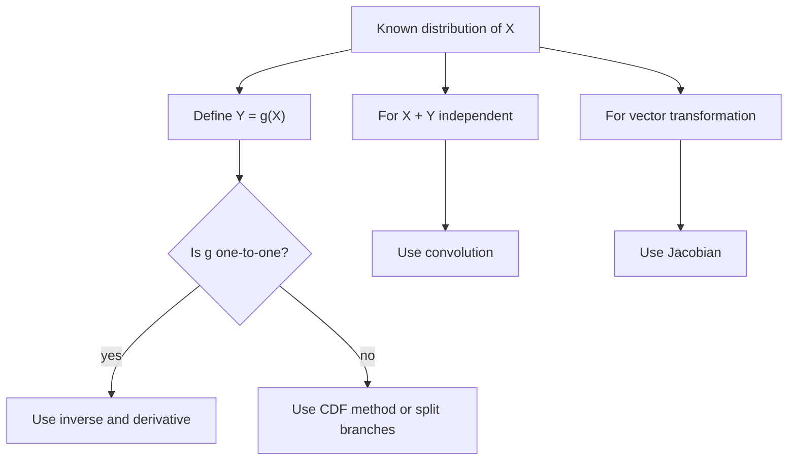

# Functions of Random Variables

Many useful random variables are built from other random variables. If $X$ is a measurement, then $X^2$, $\log X$, $aX+b$, $\max(X_1,\ldots,X_n)$, and $X+Y$ are all transformations. Probability theory gives systematic ways to derive the distribution of the transformed variable rather than guessing from simulation.


*Figure: A Galton box turns repeated random left-right choices into an approximate bell-shaped distribution. Image: [Wikimedia Commons](https://commons.wikimedia.org/wiki/File:Galton_Box.svg), Marcin Floryan, CC BY-SA 3.0.*

Transformations are also the engine behind standardization, change of variables in continuous distributions, sums of independent variables, and many sampling distributions. The main tools are the CDF method, one-to-one density transformations, Jacobians, and convolution.

## Definitions

If $Y=g(X)$, then $Y$ is a **function of a random variable**. Its distribution is determined by

$$
F_Y(y)=P(Y\le y)=P(g(X)\le y).
$$

This is called the **CDF method**. It is often the safest method because it works even when $g$ is not one-to-one.

If $X$ is continuous with density $f_X$ and $Y=g(X)$ where $g$ is differentiable and one-to-one with inverse $x=g^{-1}(y)$, then

$$
f_Y(y)=f_X(g^{-1}(y))\left|\frac{d}{dy}g^{-1}(y)\right|.
$$

For a vector transformation $(U,V)=g(X,Y)$ with inverse $(x,y)=h(u,v)$, the joint density is

$$
f_{U,V}(u,v)=f_{X,Y}(h(u,v))\left|J_h(u,v)\right|,
$$

where $J_h$ is the determinant of the Jacobian matrix of the inverse transformation.

If $X$ and $Y$ are independent continuous random variables, the density of their sum $S=X+Y$ is the **convolution**

$$
f_S(s)=\int_{-\infty}^{\infty} f_X(x)f_Y(s-x)\,dx.
$$

For discrete variables,

$$
P(S=s)=\sum_x P(X=x)P(Y=s-x).
$$

## Key results

**Linear transformations.** If $Y=aX+b$ and $a\ne 0$, then

$$
F_Y(y)=
\begin{aligned}
&F_X\left(\frac{y-b}{a}\right),\quad a>0,\\
&1-F_X\left(\frac{y-b}{a}\right),\quad a<0 \text{ with endpoint care}.
\end{aligned}
$$

For densities,

$$
f_Y(y)=\frac{1}{|a|}f_X\left(\frac{y-b}{a}\right).
$$

Means and variances transform as

$$
E[aX+b]=aE[X]+b,
$$

$$
\operatorname{Var}(aX+b)=a^2\operatorname{Var}(X).
$$

**Monotone transformations.** If $g$ is strictly increasing, then

$$
F_Y(y)=F_X(g^{-1}(y)).
$$

If $g$ is strictly decreasing, inequalities reverse.

**Order statistics.** If $X_1,\ldots,X_n$ are independent with CDF $F$, then the maximum $M=\max_i X_i$ has CDF

$$
F_M(m)=P(X_1\le m,\ldots,X_n\le m)=F(m)^n.
$$

The minimum $L=\min_i X_i$ satisfies

$$
P(L>l)=P(X_1>l,\ldots,X_n>l)=(1-F(l))^n.
$$

A practical transformation workflow is:

1. Find the support of the new variable before doing algebra.
2. Decide whether the transformation is one-to-one on that support.
3. If it is one-to-one, use the inverse and derivative formula.
4. If it is not one-to-one, split the support into one-to-one branches or use the CDF method.
5. Check that the resulting density integrates to $1$.

For example, $Y=X^2$ is not one-to-one on $(-1,1)$, but it is one-to-one on $(-1,0)$ and $(0,1)$. The transformed density receives contributions from both branches. The CDF method automatically accounts for both branches, which is why it is often safer.

In multivariable transformations, the Jacobian factor measures local area distortion. A transformation may stretch a small rectangle in $(u,v)$-space into a larger or smaller region in $(x,y)$-space. The absolute determinant corrects the density so that probability mass is preserved. The sign of the determinant is irrelevant for probability, which is why the absolute value is used.

For sums, convolution is a distribution-level version of adding all possible ways to reach the same total. In the continuous case, the integral sweeps over every possible value $x$ of the first variable and pairs it with $s-x$ for the second variable.

Transformations are also how simulation turns simple random numbers into useful samples. Many pseudorandom generators first produce values that are approximately Uniform$(0,1)$. If $F$ is a continuous CDF and $U\sim\operatorname{Uniform}(0,1)$, then

$$
X=F^{-1}(U)
$$

has CDF $F$. This is the inverse-transform method. It works especially well when the inverse CDF is available in closed form or can be computed numerically. For example, if $U\sim\operatorname{Uniform}(0,1)$, then $X=-\log(1-U)/\lambda$ is Exponential$(\lambda)$.

Another common transformation is standardization. If $X$ has mean $\mu$ and standard deviation $\sigma\gt 0$, then

$$
Z=\frac{X-\mu}{\sigma}
$$

has mean $0$ and variance $1$. Standardization does not usually make a variable normal; it only changes location and scale. It becomes a standard normal variable only when the original $X$ was normal.

Absolute values, squares, maxima, and ratios deserve special care because they can merge many original outcomes into the same transformed value. Whenever a transformation collapses information, expect multiple inverse branches or support boundaries. A quick sketch of the function often prevents algebraic mistakes.

For ratios, also check where the denominator can be zero or close to zero, since this often creates heavy tails and may destroy moments.

## Visual



| Task | Tool | Warning |
|---|---|---|
| $Y=aX+b$ | linear density formula | divide by $\vert a\vert $ |
| $Y=g(X)$ monotone | inverse transformation | support changes |
| $Y=X^2$ | CDF method or split branches | two preimages for $y\gt 0$ |
| $S=X+Y$ independent | convolution | independence required |
| $(U,V)=g(X,Y)$ | Jacobian | use inverse Jacobian |

## Worked example 1: squaring a uniform variable

**Problem.** Let $X\sim\operatorname{Uniform}(-1,1)$ and let $Y=X^2$. Find the CDF and PDF of $Y$.

**Method.**

1. The support of $Y$ is $0\le Y\le 1$.

2. For $0\le y\le 1$,

$$
F_Y(y)=P(Y\le y)=P(X^2\le y).
$$

3. Rewrite the event:

$$
X^2\le y \quad \Longleftrightarrow \quad -\sqrt{y}\le X\le \sqrt{y}.
$$

4. Since $X$ is uniform on an interval of length $2$,

$$
P(-\sqrt{y}\le X\le \sqrt{y})
=\frac{2\sqrt{y}}{2}
=\sqrt{y}.
$$

5. Therefore

$$
F_Y(y)=
\begin{aligned}
&0,\quad y<0,\\
&\sqrt{y},\quad 0\le y\le 1,\\
&1,\quad y>1.
\end{aligned}
$$

6. Differentiate on $(0,1)$:

$$
f_Y(y)=\frac{d}{dy}\sqrt{y}=\frac{1}{2\sqrt{y}}.
$$

**Checked answer.** $Y$ has density $f_Y(y)=1/(2\sqrt{y})$ on $0\lt y\lt 1$. The density is high near zero because many $X$ values near zero produce very small squares.

## Worked example 2: sum of two independent uniforms

**Problem.** Let $X,Y$ be independent Uniform$(0,1)$ random variables. Find the density of $S=X+Y$.

**Method.**

1. Use convolution:

$$
f_S(s)=\int_{-\infty}^{\infty} f_X(x)f_Y(s-x)\,dx.
$$

2. Since both densities equal $1$ on $(0,1)$, the integrand is $1$ when

$$
0<x<1
$$

   and

$$
0<s-x<1.
$$

3. The second inequality means

$$
s-1<x<s.
$$

4. Therefore $x$ must lie in the overlap

$$
(0,1)\cap(s-1,s).
$$

5. For $0\lt s\lt 1$, the overlap is $(0,s)$, length $s$, so

$$
f_S(s)=s.
$$

6. For $1\le s\lt 2$, the overlap is $(s-1,1)$, length $2-s$, so

$$
f_S(s)=2-s.
$$

7. Outside $0\lt s\lt 2$, there is no overlap.

**Checked answer.**

$$
f_S(s)=
\begin{aligned}
&s,\quad 0<s<1,\\
&2-s,\quad 1\le s<2,\\
&0,\quad \text{otherwise}.
\end{aligned}
$$

The density is triangular and integrates to $1$.

## Code

```python
import numpy as np
import matplotlib.pyplot as plt

rng = np.random.default_rng(1)
n = 200_000

# Example 1: Y = X^2 for X uniform(-1, 1).
x = rng.uniform(-1, 1, size=n)
y = x**2
print("P(Y <= 0.25) simulation:", np.mean(y <= 0.25))
print("P(Y <= 0.25) theory:", np.sqrt(0.25))

# Example 2: sum of two uniforms.
u = rng.uniform(0, 1, size=n)
v = rng.uniform(0, 1, size=n)
s = u + v
print("mean of sum:", s.mean())
print("P(0.5 <= S <= 1.5):", np.mean((s >= 0.5) & (s <= 1.5)))

# Optional plot when running locally.
plt.hist(s, bins=80, density=True, alpha=0.5)
grid = np.linspace(0, 2, 200)
density = np.where(grid < 1, grid, 2 - grid)
plt.plot(grid, density, color="black")
plt.show()
```

## Common pitfalls

- Forgetting the derivative factor in one-to-one transformations.
- Using the inverse transformation formula when the function is not one-to-one without splitting branches.
- Losing support restrictions after a transformation.
- Treating convolution as valid without independence.
- Confusing the Jacobian of the forward transformation with the Jacobian of the inverse transformation.
- Forgetting endpoint behavior for decreasing transformations and CDF calculations.

## Connections

- [random variables and distributions](/math/probability/random-variables-distributions)
- [joint, marginal, and conditional distributions](/math/probability/joint-marginal-conditional-distributions)
- [expectation, variance, and moments](/math/probability/expectation-variance-moments)
- [common continuous distributions](/math/probability/common-continuous-distributions)
- [sampling distributions and CLT](/math/statistics/sampling-distributions-and-clt)
