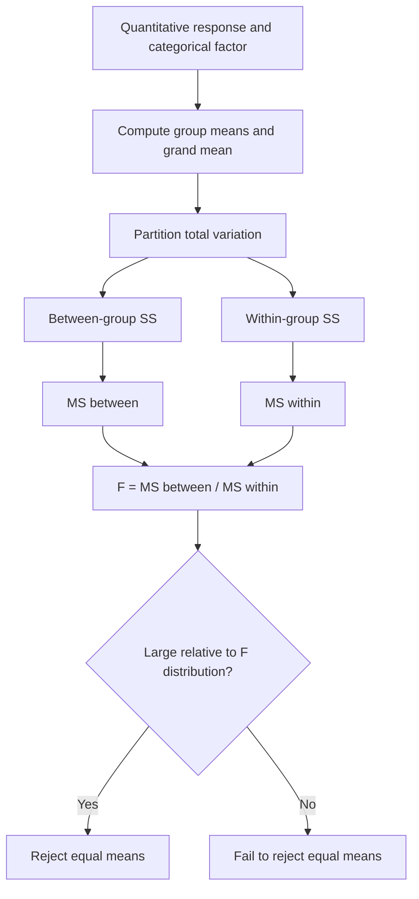

# ANOVA

Analysis of variance, or ANOVA, compares means by partitioning variability. Instead of testing every pair of means separately at the start, a one-way ANOVA asks whether group membership explains a meaningful share of the total variation in a quantitative response. The Lane text presents ANOVA after tests for means because ANOVA generalizes mean comparison to three or more groups and to factorial designs.

The name can be confusing: ANOVA tests hypotheses about means by analyzing variances. If group means are far apart relative to variation within groups, the between-group mean square becomes large compared with the within-group mean square, producing a large $F$ statistic. If group means differ only by the amount expected from within-group noise, the $F$ statistic tends to be near 1.


*Figure: $F$ distribution density curves for several degrees-of-freedom choices. Image: [Wikimedia Commons](https://commons.wikimedia.org/wiki/File:F-distribution_pdf.svg), IkamusumeFan, CC BY-SA 4.0.*

## Definitions

In a **one-way ANOVA**, one categorical explanatory variable, called a factor, has $k$ levels or groups. The response variable is quantitative. The null hypothesis is

$$
H_0:\mu_1=\mu_2=\cdots=\mu_k.
$$

The alternative is that not all group means are equal.

Let $x_{ij}$ be observation $j$ in group $i$. Let $\bar{x}_i$ be the mean of group $i$, $n_i$ be its sample size, and $\bar{x}$ be the grand mean across all $N$ observations. Total variation is measured by

$$
SS_{\text{total}}=\sum_i\sum_j(x_{ij}-\bar{x})^2.
$$

Between-group variation is

$$
SS_{\text{between}}=\sum_i n_i(\bar{x}_i-\bar{x})^2.
$$

Within-group variation, also called error variation, is

$$
SS_{\text{within}}=\sum_i\sum_j(x_{ij}-\bar{x}_i)^2.
$$

These satisfy the decomposition

$$
SS_{\text{total}}=SS_{\text{between}}+SS_{\text{within}}.
$$

Mean squares divide sums of squares by degrees of freedom:

$$
MS_{\text{between}}=\frac{SS_{\text{between}}}{k-1},
$$

$$
MS_{\text{within}}=\frac{SS_{\text{within}}}{N-k}.
$$

The ANOVA test statistic is

$$
F=\frac{MS_{\text{between}}}{MS_{\text{within}}}.
$$

Under the null hypothesis and assumptions, $F$ follows an $F$ distribution with $k-1$ and $N-k$ degrees of freedom.

## Key results

ANOVA assumptions include independent observations, approximately normal response distributions within groups or sufficient sample sizes, and reasonably similar within-group variances for the classical fixed-effects one-way ANOVA. The method is fairly robust to mild normality departures when group sizes are balanced, but strong skewness, outliers, dependence, or severe unequal variances can distort conclusions.

A significant one-way ANOVA tells us that at least one population mean differs from another. It does not identify which means differ. Follow-up comparisons, such as Tukey's HSD, planned contrasts, or adjusted pairwise tests, are needed for specific group differences.

Two-way ANOVA includes two factors and can test main effects and an interaction. A **main effect** asks whether the mean response differs across levels of one factor, averaging over the other factor. An **interaction** asks whether the effect of one factor depends on the level of the other. Interactions are often more scientifically interesting than main effects because they reveal conditional patterns.

An effect-size measure for one-way ANOVA is eta squared:

$$
\eta^2=\frac{SS_{\text{between}}}{SS_{\text{total}}}.
$$

It estimates the proportion of observed total variation accounted for by group membership. Like all effect sizes, it should be interpreted in context, not by a universal label alone.

ANOVA is closely related to regression. A one-way ANOVA can be written as a linear model with indicator variables for the groups, and the omnibus $F$ test compares a model with group indicators against a model with only an intercept. This connection matters because it unifies methods that can otherwise seem separate. Regression, ANOVA, and many designed-experiment analyses all ask whether a model explains enough variation to justify its complexity. The difference is mainly in how predictors are coded and which comparisons are planned in advance.

Planned comparisons should be distinguished from exploratory comparisons. If researchers specify before collecting data that Method C should exceed the average of Methods A and B, that contrast can be tested directly. If researchers inspect all group means and then test only the largest-looking difference, the Type I error rate is no longer the one advertised by a single comparison. ANOVA workflows therefore need both statistical calculation and a transparent comparison plan.

## Visual



| Source | Sum of squares | df | Mean square | Role |
|---|---:|---:|---:|---|
| Between groups | $SS_{\text{between}}$ | $k-1$ | $MS_{\text{between}}$ | variation explained by group |
| Within groups | $SS_{\text{within}}$ | $N-k$ | $MS_{\text{within}}$ | residual variation |
| Total | $SS_{\text{total}}$ | $N-1$ | not used in $F$ | total observed variation |

## Worked example 1: One-way ANOVA by hand

Problem: Three study methods are compared with four students per method. Scores are:

| Method A | Method B | Method C |
|---:|---:|---:|
| 78 | 85 | 88 |
| 82 | 86 | 90 |
| 80 | 84 | 92 |
| 79 | 87 | 91 |

Compute the ANOVA table and test whether the means differ.

Method:

1. Group means:

$$
\bar{x}_A=\frac{78+82+80+79}{4}=79.75,
$$

$$
\bar{x}_B=\frac{85+86+84+87}{4}=85.5,
$$

$$
\bar{x}_C=\frac{88+90+92+91}{4}=90.25.
$$

2. Grand mean:

$$
\bar{x}=\frac{319+342+361}{12}=\frac{1022}{12}=85.1667.
$$

3. Between-group sum of squares:

$$
\begin{aligned}
SS_B &=4(79.75-85.1667)^2+4(85.5-85.1667)^2+4(90.25-85.1667)^2\\
&=4(29.340)+4(0.111)+4(25.840)\\
&=117.36+0.44+103.36\\
&=221.16.
\end{aligned}
$$

4. Within-group sum of squares:

For A, squared deviations from 79.75 are $3.0625,5.0625,0.0625,0.5625$, summing to 8.75.

For B, squared deviations from 85.5 are $0.25,0.25,2.25,2.25$, summing to 5.00.

For C, squared deviations from 90.25 are $5.0625,0.0625,3.0625,0.5625$, summing to 8.75.

Thus

$$
SS_W=8.75+5.00+8.75=22.50.
$$

5. Degrees of freedom:

$$
df_B=k-1=3-1=2,
$$

$$
df_W=N-k=12-3=9.
$$

6. Mean squares:

$$
MS_B=221.16/2=110.58,
$$

$$
MS_W=22.50/9=2.50.
$$

7. $F$ statistic:

$$
F=110.58/2.50=44.23.
$$

Answer: The $F$ statistic is about 44.23 with $df=(2,9)$, giving a very small p-value. Reject the null hypothesis of equal means. The study methods differ in mean score.

Checked answer: Within-group variation is small compared with the separation among group means, so a large $F$ statistic is expected.

## Worked example 2: Interpreting a two-way interaction

Problem: A two-way study compares mean task score by training type, online versus in-person, and practice schedule, spaced versus massed. The cell means are:

| | Spaced practice | Massed practice |
|---|---:|---:|
| Online | 84 | 78 |
| In-person | 88 | 87 |

Decide whether the pattern suggests an interaction.

Method:

1. Compute the effect of practice schedule within online training:

$$
84-78=6.
$$

Spaced practice is 6 points higher than massed practice online.

2. Compute the effect of practice schedule within in-person training:

$$
88-87=1.
$$

Spaced practice is 1 point higher than massed practice in person.

3. Compare these simple effects:

$$
6-1=5.
$$

4. Because the practice effect differs by training type, the means suggest an interaction.

Answer: Yes, the table suggests an interaction: spaced practice appears much more beneficial in the online condition than in the in-person condition. Formal significance would require the within-cell variability, sample sizes, and ANOVA interaction test.

Checked answer: Main effects alone would average over the other factor and could hide the conditional pattern. The interaction check compares differences of differences.

## Code

```python
import pandas as pd
import statsmodels.api as sm
from statsmodels.formula.api import ols

scores = [78, 82, 80, 79, 85, 86, 84, 87, 88, 90, 92, 91]
method = ["A"] * 4 + ["B"] * 4 + ["C"] * 4
df = pd.DataFrame({"score": scores, "method": method})

model = ols("score ~ C(method)", data=df).fit()
anova_table = sm.stats.anova_lm(model, typ=2)
print(anova_table)

ss_between = anova_table.loc["C(method)", "sum_sq"]
ss_total = ss_between + anova_table.loc["Residual", "sum_sq"]
print("eta squared:", ss_between / ss_total)
```

Statsmodels uses formula notation. `C(method)` tells the model to treat method as a categorical factor rather than a numeric predictor.

## Common pitfalls

- Running many unadjusted pairwise $t$ tests instead of starting with a planned ANOVA or adjusted comparisons.
- Thinking a significant ANOVA identifies exactly which groups differ.
- Ignoring interactions in two-way designs and interpreting main effects alone.
- Forgetting that ANOVA assumes independent observations within and across groups.
- Treating ordinal ratings with few levels as if they were precise normal measurements without checking whether that is defensible.
- Reporting only the p-value and omitting group means, variability, and an effect-size measure.

## Connections

- [Tests for means](/math/statistics/tests-for-means)
- [Hypothesis testing logic](/math/statistics/hypothesis-testing-logic)
- [Normal, t, chi-square, and F distributions](/math/statistics/normal-t-chi-square-and-f-distributions)
- [Linear regression inference](/math/statistics/linear-regression-inference)
- [Effect size, nonparametric methods, and resampling](/math/statistics/effect-size-nonparametric-and-resampling)
