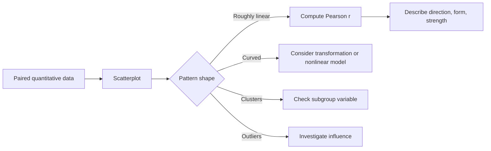

# Bivariate Data and Correlation

Bivariate data record two variables on the same cases. The first statistical task is to ask how the variables move together: Do larger values of one tend to appear with larger values of the other? Is the pattern linear, curved, clustered, or dominated by an outlier? The Lane text introduces bivariate data before regression because correlation and scatterplots provide the language of association.

Association is useful even when causation is not justified. A scatterplot of study time and exam score can support prediction and reveal unusual cases. It does not, by itself, prove that more study caused the higher score. Students who study more may differ in preparation, attendance, motivation, or course load. The central statistical habit is to describe the relationship accurately while respecting what the study design can and cannot establish.


*Figure: Scatterplots with varied Pearson correlation coefficients. Image: [Wikimedia Commons](https://commons.wikimedia.org/wiki/File:Correlation_examples2.svg), DenisBoigelot and Imagecreator, public domain.*

## Definitions

A **bivariate data set** contains paired observations $(x_i,y_i)$ for $i=1,\dots,n$. Each pair belongs to the same case. The pairing is essential: a list of heights from one group and weights from another group is not bivariate data about body size.

A **scatterplot** places the explanatory or predictor variable on the horizontal axis and the response variable on the vertical axis. If the roles are not clear, either variable may be placed on either axis, but the interpretation should say whether the goal is association, prediction, or explanation.

The **Pearson correlation coefficient** $r$ measures the direction and strength of a linear association between two quantitative variables:

$$
r=\frac{1}{n-1}\sum_{i=1}^{n}
\left(\frac{x_i-\bar{x}}{s_x}\right)
\left(\frac{y_i-\bar{y}}{s_y}\right).
$$

It is always between $-1$ and $1$. A value near $1$ indicates a strong positive linear association; a value near $-1$ indicates a strong negative linear association; a value near $0$ indicates little linear association. A value near $0$ does not rule out a curved relationship.

The **covariance** is

$$
s_{xy}=\frac{\sum_{i=1}^{n}(x_i-\bar{x})(y_i-\bar{y})}{n-1}.
$$

Correlation is standardized covariance:

$$
r=\frac{s_{xy}}{s_xs_y}.
$$

An **outlier** in bivariate data is a point that differs from the overall pattern. An **influential point** is a point that substantially changes a statistical summary, such as a correlation or regression line, when included or removed. An observation can be an outlier without being highly influential, and a high-leverage observation can be influential even if it follows the trend.

## Key results

Correlation is unitless and unchanged by positive linear transformations of either variable. If height is converted from inches to centimeters, or income from dollars to thousands of dollars, $r$ does not change. If one variable is multiplied by a negative number, the sign of $r$ changes but its magnitude does not.

Correlation measures linear association, not slope. A correlation of $0.80$ does not mean that $y$ increases by $0.80$ units for every one-unit increase in $x$. Slope belongs to regression and has units; correlation has no units.

Correlation is symmetric:

$$
r_{xy}=r_{yx}.
$$

The correlation between height and weight is the same as the correlation between weight and height. Regression is not symmetric because predicting weight from height is not the same fitted equation as predicting height from weight.

The squared correlation $r^2$ has a special interpretation in simple linear regression with an intercept: it is the proportion of sample variation in $y$ explained by the fitted linear relationship with $x$. This link is developed further in [linear regression inference](/math/statistics/linear-regression-inference).

Several cautions are essential. Restricting the range of one variable can reduce correlation. Combining different subgroups can create or hide associations. Outliers can inflate or deflate $r$. Categorical variables require different tools unless encoded with a meaningful design. Most importantly, correlation does not imply causation; an association may be caused by $x$, by $y$, by a third variable, by selection effects, or by coincidence.

A useful reporting sentence for correlation has four parts: direction, form, strength, and context. For example, "Among the 86 sampled apartments, rent and floor area had a strong positive roughly linear association." This is better than saying only "$r=0.82$." The number gives a compact measure, but the sentence reminds the reader what cases were studied, what variables were paired, and that the association is being described as linear. If the scatterplot shows curvature, clusters, or unequal spread, report those features before relying on a single correlation coefficient.

## Visual



| Feature in scatterplot | What to report | Why it matters |
|---|---|---|
| Direction | positive, negative, none | Indicates how variables move together |
| Form | linear, curved, clustered | Determines whether Pearson $r$ is appropriate |
| Strength | weak, moderate, strong | Describes tightness around a pattern |
| Outliers | unusual points | May change summaries or reveal data problems |
| Context | units and population | Prevents overgeneralized conclusions |

## Worked example 1: Computing Pearson correlation

Problem: Six students report weekly study hours and exam scores:

| Student | Hours $x$ | Score $y$ |
|---|---:|---:|
| A | 2 | 68 |
| B | 3 | 70 |
| C | 5 | 78 |
| D | 6 | 82 |
| E | 8 | 88 |
| F | 9 | 91 |

Compute the Pearson correlation.

Method:

1. Compute means:

$$
\bar{x}=\frac{2+3+5+6+8+9}{6}=5.5,
$$

$$
\bar{y}=\frac{68+70+78+82+88+91}{6}=79.5.
$$

2. Compute deviations and products:

| $x$ | $y$ | $x-\bar{x}$ | $y-\bar{y}$ | product |
|---:|---:|---:|---:|---:|
| 2 | 68 | -3.5 | -11.5 | 40.25 |
| 3 | 70 | -2.5 | -9.5 | 23.75 |
| 5 | 78 | -0.5 | -1.5 | 0.75 |
| 6 | 82 | 0.5 | 2.5 | 1.25 |
| 8 | 88 | 2.5 | 8.5 | 21.25 |
| 9 | 91 | 3.5 | 11.5 | 40.25 |

3. Sum products:

$$
\sum (x-\bar{x})(y-\bar{y})=127.5.
$$

4. Compute sums of squared deviations:

$$
\sum(x-\bar{x})^2=35.5,
$$

$$
\sum(y-\bar{y})^2=401.5.
$$

5. Use the equivalent formula:

$$
r=\frac{\sum(x-\bar{x})(y-\bar{y})}
{\sqrt{\sum(x-\bar{x})^2\sum(y-\bar{y})^2}}
=\frac{127.5}{\sqrt{35.5(401.5)}}.
$$

6. Calculate:

$$
r\approx\frac{127.5}{119.40}\approx 0.977.
$$

Answer: The correlation is about $0.98$, indicating a very strong positive linear association in this sample.

Checked answer: The sign is positive because high hours pair with high scores and low hours pair with low scores. The magnitude is close to 1 because the points lie nearly on a straight upward line.

## Worked example 2: Detecting a misleading zero correlation

Problem: A researcher records $x=-2,-1,0,1,2$ and $y=4,1,0,1,4$ from a physical experiment. Compute enough to explain why Pearson correlation is misleading.

Method:

1. Find the means:

$$
\bar{x}=\frac{-2-1+0+1+2}{5}=0,
$$

$$
\bar{y}=\frac{4+1+0+1+4}{5}=2.
$$

2. Compute products $(x-\bar{x})(y-\bar{y})$:

| $x$ | $y$ | $x-\bar{x}$ | $y-\bar{y}$ | product |
|---:|---:|---:|---:|---:|
| -2 | 4 | -2 | 2 | -4 |
| -1 | 1 | -1 | -1 | 1 |
| 0 | 0 | 0 | -2 | 0 |
| 1 | 1 | 1 | -1 | -1 |
| 2 | 4 | 2 | 2 | 4 |

3. Sum the products:

$$
-4+1+0-1+4=0.
$$

4. Since the covariance numerator is zero, Pearson $r=0$.

Answer: The Pearson correlation is 0, but the relationship is perfectly curved: $y=x^2$. The correlation is not wrong; it is answering the narrower question of linear association. A scatterplot would reveal a U-shaped pattern.

Checked answer: The data are symmetric around $x=0$, so positive and negative products cancel. This cancellation is exactly why relying only on $r$ can miss nonlinear structure.

## Code

```python
import numpy as np
import matplotlib.pyplot as plt
from scipy import stats

hours = np.array([2, 3, 5, 6, 8, 9])
scores = np.array([68, 70, 78, 82, 88, 91])

r, p_value = stats.pearsonr(hours, scores)
print(f"r = {r:.3f}, two-sided p-value = {p_value:.4f}")

plt.scatter(hours, scores)
plt.xlabel("study hours per week")
plt.ylabel("exam score")
plt.title("Study time and exam score")
plt.show()
```

The p-value tests a no-linear-correlation null under model assumptions. It should not replace the scatterplot, and it should not be read as evidence of causation without a design that supports causal interpretation.

## Common pitfalls

- Computing $r$ before making a scatterplot.
- Saying "no relationship" when $r$ is near zero, even though a curved relationship may exist.
- Interpreting correlation as slope or as percent increase.
- Letting one extreme point determine the story without checking influence.
- Combining subgroups whose separate relationships differ from the overall relationship.
- Using correlation to claim causation from observational data.

## Connections

- [Graphing distributions](/math/statistics/graphing-distributions)
- [Summarizing distributions](/math/statistics/summarizing-distributions)
- [Linear regression inference](/math/statistics/linear-regression-inference)
- [Hypothesis testing logic](/math/statistics/hypothesis-testing-logic)
- [Effect size, nonparametric methods, and resampling](/math/statistics/effect-size-nonparametric-and-resampling)
