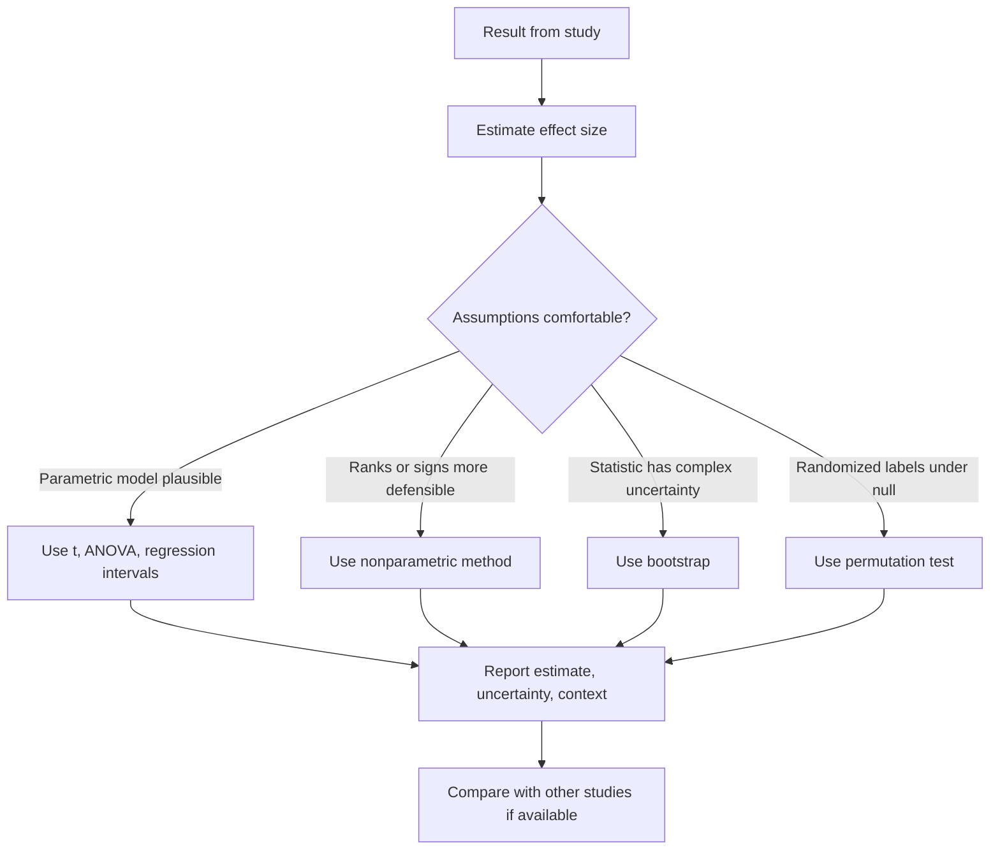

# Effect Size, Nonparametric Methods, and Resampling

Statistical significance asks whether data are surprising under a null model. It does not say whether an effect is large, important, stable, or useful. Effect sizes, meta-analytic thinking, nonparametric methods, and resampling all push analysis beyond a single p-value. The Lane text includes power, effect size, and distribution-free tests near the end because they refine how statistical evidence should be judged.


*Figure: Anscombe's quartet shows why visualization matters even when numerical summaries agree. Image: [Wikimedia Commons](https://commons.wikimedia.org/wiki/File:AnscombeQuartet.svg), Gabry, CC BY-SA 3.0.*

These tools answer different but related questions. Effect sizes put results on interpretable scales. Meta-analysis combines evidence across studies. Nonparametric tests reduce reliance on normality or interval-scale assumptions. Bootstrap intervals estimate uncertainty by resampling the observed data. Permutation tests build a null distribution by rearranging labels according to the null hypothesis. Together, they encourage a more complete view of evidence.

## Definitions

An **effect size** is a numerical measure of the magnitude of a phenomenon. For a one-sample or paired mean difference, a standardized effect size may be

$$
d=\frac{\bar{x}-\mu_0}{s}
$$

or, for paired differences,

$$
d_z=\frac{\bar{d}}{s_d}.
$$

For two independent means, Cohen's $d$ often uses a pooled standard deviation:

$$
d=\frac{\bar{x}_1-\bar{x}_2}{s_p},
$$

where

$$
s_p=\sqrt{\frac{(n_1-1)s_1^2+(n_2-1)s_2^2}{n_1+n_2-2}}.
$$

For proportions, common effect measures include the **risk difference**

$$
\hat{p}_1-\hat{p}_2,
$$

the **relative risk**

$$
\frac{\hat{p}_1}{\hat{p}_2},
$$

and the **odds ratio**

$$
\frac{a/b}{c/d}=\frac{ad}{bc}
$$

for a $2\times2$ table with cell counts $a,b,c,d$.

A **meta-analysis** combines effect estimates from multiple studies, often weighting more precise studies more heavily. A simple fixed-effect weighted mean is

$$
\hat{\theta}_{meta}=
\frac{\sum w_i\hat{\theta}_i}{\sum w_i},
$$

where a common weight is inverse variance:

$$
w_i=\frac{1}{SE_i^2}.
$$

A **nonparametric method** is a method that does not assume a specific parametric form such as normality. The sign test uses only directions of paired differences. The Wilcoxon signed-rank test uses ranks of absolute paired differences with signs. The Mann-Whitney test, also called Wilcoxon rank-sum, compares two independent groups using ranks.

A **bootstrap** resamples cases with replacement from the observed data to approximate the sampling distribution of a statistic. A **permutation test** rearranges labels or signs in a way that represents the null hypothesis, then compares the observed statistic with the randomization distribution.

## Key results

Effect sizes are not assumption-free labels. Cohen's $d$ depends on the standard deviation used, the measurement scale, and the population. A value called "small" in one field may be practically large in another. Report units when possible; standardized units help compare studies but can hide practical meaning.

Nonparametric tests often test hypotheses about distributions or typical ranks, not always exactly the same mean hypothesis as a $t$ test. The sign test is robust but may have low power because it ignores magnitudes. Wilcoxon signed-rank uses more information but assumes the distribution of paired differences is reasonably symmetric for its usual median-difference interpretation. Mann-Whitney is often described as a median test, but that interpretation is clean only under similar distribution shapes; more generally it tests stochastic ordering.

Bootstrap methods are powerful because they can estimate uncertainty for statistics with complicated formulas. The basic percentile bootstrap interval takes the middle percentiles of bootstrap statistics. However, the bootstrap depends on the observed sample representing the population well. It cannot fix biased sampling, extreme dependence, or severe undercoverage of rare population features.

Permutation tests are attractive because their null distribution is generated from the actual data and randomization structure. For a two-group randomized experiment under a sharp null of no treatment effect, treatment labels are exchangeable. Shuffling labels repeatedly gives a valid reference distribution for the difference in means. The p-value is the fraction of shuffled statistics at least as extreme as the observed statistic, with a small adjustment often used to avoid zero p-values in simulation.

## Visual



| Tool | Main question | Strength | Limitation |
|---|---|---|---|
| Cohen's $d$ | How large is a mean difference in SD units? | Comparable scale | Depends on SD and context |
| Odds ratio | How much larger are odds? | Common in case-control studies | Can exaggerate risk when outcomes are common |
| Sign test | Are positive and negative paired changes balanced? | Very few assumptions | Ignores magnitude |
| Mann-Whitney | Do one group's values tend to be larger? | Rank-based, robust | Not simply a median test in all settings |
| Bootstrap | How variable is a statistic? | Flexible | Needs representative sample |
| Permutation test | Is observed statistic extreme under relabeling null? | Design-based | Exchangeability must be justified |

## Worked example 1: Effect size and meta-analytic weighted average

Problem: Two independent groups complete a reaction-time task. Group A has $n_1=24$, $\bar{x}_1=510$ ms, $s_1=80$ ms. Group B has $n_2=22$, $\bar{x}_2=455$ ms, $s_2=70$ ms. Compute Cohen's $d$ for A minus B. Then combine three study estimates of the same standardized effect: 0.40 with $SE=0.20$, 0.55 with $SE=0.25$, and 0.20 with $SE=0.10$ using inverse-variance weights.

Method:

1. Compute pooled variance:

$$
s_p^2=\frac{(24-1)80^2+(22-1)70^2}{24+22-2}.
$$

2. Expand:

$$
(23)(6400)=147200,
$$

$$
(21)(4900)=102900.
$$

3. Add and divide:

$$
s_p^2=\frac{147200+102900}{44}
=\frac{250100}{44}
=5684.09.
$$

4. Pooled standard deviation:

$$
s_p=\sqrt{5684.09}=75.39.
$$

5. Cohen's $d$:

$$
d=\frac{510-455}{75.39}
=\frac{55}{75.39}
=0.73.
$$

6. For the meta-analytic weighted mean, compute weights:

$$
w_1=1/0.20^2=25,
$$

$$
w_2=1/0.25^2=16,
$$

$$
w_3=1/0.10^2=100.
$$

7. Weighted estimate:

$$
\hat{\theta}_{meta}=
\frac{25(0.40)+16(0.55)+100(0.20)}{25+16+100}.
$$

8. Numerator and denominator:

$$
10+8.8+20=38.8,
$$

$$
25+16+100=141.
$$

9. Result:

$$
\hat{\theta}_{meta}=38.8/141=0.275.
$$

Answer: The reaction-time standardized difference is about $d=0.73$, with Group A slower than Group B by about 0.73 pooled standard deviations. The inverse-variance weighted combined estimate is about 0.275 because the third study has the smallest standard error and receives the largest weight.

Checked answer: The largest weight is 100 for $SE=0.10$, so the combined estimate should be pulled toward 0.20. The computed value 0.275 confirms that behavior.

## Worked example 2: Sign test and permutation-test logic

Problem: Ten patients record pain score before and after a therapy. The paired differences after minus before are

$$
-3,\ -1,\ -2,\ 0,\ -4,\ 1,\ -2,\ -1,\ -3,\ -2.
$$

Use a sign-test idea to test whether pain tends to decrease. Then describe how a permutation test for the mean difference would work.

Method:

1. Remove zero differences for the sign test because they give no direction. The nonzero differences are

$$
-3,\ -1,\ -2,\ -4,\ 1,\ -2,\ -1,\ -3,\ -2.
$$

2. There are 9 nonzero differences.
3. A decrease corresponds to a negative difference. Count negative signs:

$$
8 \text{ negative},\quad 1 \text{ positive}.
$$

4. Under the null hypothesis of no tendency to increase or decrease, each nonzero sign is like a fair coin flip, so $X\sim\mathrm{Binomial}(9,0.5)$ for the number of negative signs.
5. For a one-sided test favoring decreases:

$$
P(X\ge8)=P(X=8)+P(X=9).
$$

6. Compute:

$$
P(X=8)=\binom{9}{8}(0.5)^9=9/512,
$$

$$
P(X=9)=\binom{9}{9}(0.5)^9=1/512.
$$

7. Add:

$$
P(X\ge8)=10/512=0.0195.
$$

8. For a paired permutation test of the mean difference, assume the null makes the sign of each paired difference exchangeable. Randomly flip the signs of the observed nonzero differences many times, compute the mean difference each time, and compare the observed mean with that null distribution.

Answer: The sign-test p-value is about 0.0195, giving evidence that pain tends to decrease after therapy. A permutation test would use the magnitudes as well as signs by randomly flipping signs under the null and measuring how extreme the observed mean decrease is.

Checked answer: The result is plausible because 8 of 9 nonzero changes are decreases. The sign test ignores that some decreases are larger than others; the permutation mean-difference test would use those magnitudes.

## Code

```python
import numpy as np
from scipy import stats

rng = np.random.default_rng(42)
diff = np.array([-3, -1, -2, 0, -4, 1, -2, -1, -3, -2])
nonzero = diff[diff != 0]

# Sign test p-value for decrease: count negative signs
neg = np.sum(nonzero < 0)
n = len(nonzero)
p_sign = stats.binom.sf(neg - 1, n, 0.5)
print(f"negative signs = {neg}/{n}, sign-test p = {p_sign:.4f}")

# Paired permutation by random sign flips
observed = nonzero.mean()
stats_null = []
for _ in range(20_000):
    signs = rng.choice([-1, 1], size=n)
    stats_null.append((np.abs(nonzero) * signs).mean())
stats_null = np.array(stats_null)
p_perm = np.mean(stats_null <= observed)
print(f"observed mean diff = {observed:.3f}, permutation p = {p_perm:.4f}")

# Bootstrap confidence interval for the median difference
boot_medians = []
for _ in range(20_000):
    sample = rng.choice(diff, size=len(diff), replace=True)
    boot_medians.append(np.median(sample))
print(np.percentile(boot_medians, [2.5, 97.5]))
```

The sign test uses an exact binomial tail. The permutation test simulates the null distribution by sign-flipping paired differences. The bootstrap interval resamples observed pairs and summarizes uncertainty for the median difference.

## Common pitfalls

- Treating p-values as effect sizes.
- Calling a standardized effect "large" without domain context.
- Using odds ratios as if they were risk ratios when outcomes are common.
- Thinking nonparametric means assumption-free. Rank and sign methods still have design and interpretation assumptions.
- Bootstrapping a biased or unrepresentative sample and expecting the resampling to fix the bias.
- Permuting labels when the design does not make labels exchangeable.

## Connections

- [Hypothesis testing logic](/math/statistics/hypothesis-testing-logic)
- [Tests for means](/math/statistics/tests-for-means)
- [ANOVA](/math/statistics/anova)
- [Proportions and chi-square tests](/math/statistics/proportions-and-chi-square-tests)
- [Linear regression inference](/math/statistics/linear-regression-inference)
