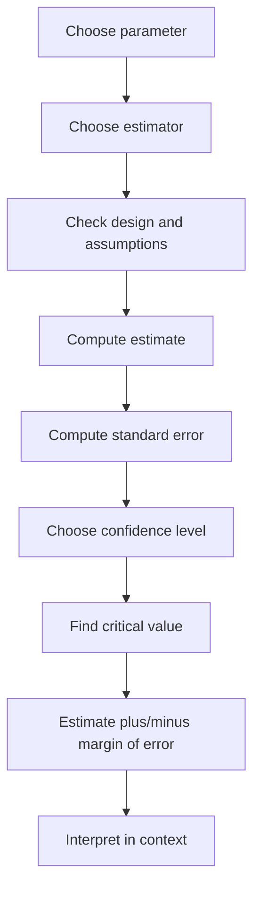

# Estimation and Confidence Intervals

Estimation is the statistical task of using sample data to learn about an unknown population parameter. A point estimate gives one best single number, while a confidence interval gives a range of plausible parameter values produced by a method with a known long-run success rate. The Lane text separates estimation from hypothesis testing because estimation asks "how large is the effect or parameter?" rather than only "is it inconsistent with a null value?"

Confidence intervals are easy to compute mechanically and easy to misinterpret. A 95% confidence interval is not a statement that the fixed parameter has a 95% probability of being in this one computed interval under the usual frequentist interpretation. It means that the procedure, used repeatedly in the same way, would capture the true parameter in about 95% of repetitions. The observed interval is then reported as the set of parameter values reasonably compatible with the data and model.

## Definitions

A **point estimator** is a statistic used to estimate a parameter. The sample mean $\bar{X}$ estimates a population mean $\mu$, the sample proportion $\hat{p}$ estimates a population proportion $p$, and the sample correlation $r$ estimates a population correlation $\rho$.

A **point estimate** is the value of the estimator after observing data. If a sample of 80 students has mean study time 9.4 hours per week, then 9.4 is a point estimate of the population mean study time for the target population.

An estimator is **unbiased** if its expected value equals the parameter it estimates:

$$
E(\hat{\theta})=\theta.
$$

An estimator is **consistent** if it gets closer to the parameter as sample size increases under suitable conditions. **Efficiency** concerns variability: among unbiased estimators, a more efficient estimator has a smaller standard error.

A **confidence interval** has the general form

$$
\mathrm{estimate}\ \pm\ \mathrm{critical\ value}\times \mathrm{standard\ error}.
$$

The term after the plus-minus sign is the **margin of error**. The standard error measures sample-to-sample variability of the estimator. The critical value is chosen from a reference distribution so the method has the desired long-run confidence level.

For a mean with unknown population standard deviation, a common one-sample $t$ interval is

$$
\bar{x}\pm t^*_{n-1}\frac{s}{\sqrt{n}}.
$$

For a large-sample population proportion interval, a common introductory form is

$$
\hat{p}\pm z^*\sqrt{\frac{\hat{p}(1-\hat{p})}{n}}.
$$

The confidence level, such as 90%, 95%, or 99%, is selected before looking at the data.

## Key results

Higher confidence requires a wider interval if the data and sample size are fixed. A 99% interval uses a larger critical value than a 95% interval because the procedure must capture the parameter more often in repeated sampling.

Larger sample size usually narrows an interval because standard errors shrink like $1/\sqrt{n}$. For a mean,

$$
\frac{s}{\sqrt{n}}
$$

decreases as $n$ grows, provided the sample standard deviation is similar. To cut the margin of error in half, the sample size often needs to be about four times as large.

For a one-sample mean, the $t$ interval rests on independence and either approximate normality of the population or a sample large enough for the sampling distribution of $\bar{X}$ to be approximately normal. Outliers and strong skewness are more serious in small samples.

For a difference between two independent means, a common Welch interval is

$$
(\bar{x}_1-\bar{x}_2)\pm t^*SE,
$$

where

$$
SE=\sqrt{\frac{s_1^2}{n_1}+\frac{s_2^2}{n_2}}.
$$

Welch's method is often preferred because it does not require equal population variances.

For a difference between paired observations, the interval is built from the within-pair differences $d_i$:

$$
\bar{d}\pm t^*_{n-1}\frac{s_d}{\sqrt{n}}.
$$

The pairing changes the analysis. Treating paired data as independent throws away the design and usually gives the wrong standard error.

A confidence interval should be read together with the measurement scale and the study design. An interval from 0.2 to 0.4 seconds may be huge for a reaction-time experiment and trivial for a shipping-time study. An interval from 3% to 8% may support a practical decision if the cost of intervention is low, but not if the intervention is expensive or risky. The interval also inherits any weakness in data collection: nonresponse, convenience sampling, measurement error, and unmodeled clustering can all make the printed interval too optimistic. The arithmetic margin of error measures random sampling uncertainty, not every source of uncertainty in the project.

When presenting an interval, include the confidence level, parameter, population, and units in the same sentence. "The interval is 29.7 to 35.1" is incomplete. "A 95% confidence interval for the population mean delivery time is 29.7 to 35.1 minutes" is interpretable and auditable.

## Visual



| Parameter | Estimate | Typical standard error | Common interval |
|---|---:|---:|---|
| Mean $\mu$ | $\bar{x}$ | $s/\sqrt{n}$ | $t$ interval |
| Proportion $p$ | $\hat{p}$ | $\sqrt{\hat{p}(1-\hat{p})/n}$ | large-sample $z$ interval |
| Difference in means | $\bar{x}_1-\bar{x}_2$ | $\sqrt{s_1^2/n_1+s_2^2/n_2}$ | Welch $t$ interval |
| Paired mean difference | $\bar{d}$ | $s_d/\sqrt{n}$ | paired $t$ interval |
| Regression slope | $b_1$ | $SE(b_1)$ | $t$ interval |

## Worked example 1: Confidence interval for a mean

Problem: A sample of 25 delivery orders has mean time $\bar{x}=32.4$ minutes and sample standard deviation $s=6.5$ minutes. Construct a 95% confidence interval for the population mean delivery time, assuming the sample is random and no severe outliers are present.

Method:

1. Identify the parameter: $\mu$, the population mean delivery time.
2. Use a one-sample $t$ interval because $\sigma$ is unknown.
3. Degrees of freedom:

$$
df=n-1=25-1=24.
$$

4. For 95% confidence and $df=24$, the two-sided critical value is approximately

$$
t^*\approx2.064.
$$

5. Compute the standard error:

$$
SE=\frac{s}{\sqrt{n}}=\frac{6.5}{\sqrt{25}}=\frac{6.5}{5}=1.3.
$$

6. Compute the margin of error:

$$
ME=t^*SE=2.064(1.3)=2.6832.
$$

7. Form the interval:

$$
32.4\pm2.6832=(29.7168,\ 35.0832).
$$

Answer: A 95% confidence interval for the mean delivery time is approximately $(29.7,\ 35.1)$ minutes.

Checked answer: The interval is centered at 32.4, and its width is plausible because the standard error is 1.3 minutes and a 95% $t$ critical value is about 2.

## Worked example 2: Confidence interval for a proportion

Problem: In a random sample of 600 customers, 138 say they would pay for same-day delivery. Construct an approximate 95% confidence interval for the population proportion.

Method:

1. Estimate the proportion:

$$
\hat{p}=\frac{138}{600}=0.23.
$$

2. Check large-sample counts:

$$
n\hat{p}=600(0.23)=138,
$$

$$
n(1-\hat{p})=600(0.77)=462.
$$

Both are much larger than 10, so the normal approximation is reasonable.

3. For 95% confidence, use $z^*=1.96$.
4. Compute the standard error:

$$
SE=\sqrt{\frac{0.23(0.77)}{600}}
=\sqrt{\frac{0.1771}{600}}
=\sqrt{0.0002952}
\approx0.01718.
$$

5. Compute margin of error:

$$
ME=1.96(0.01718)\approx0.0337.
$$

6. Form the interval:

$$
0.23\pm0.0337=(0.1963,\ 0.2637).
$$

Answer: The approximate 95% confidence interval is $(0.196,\ 0.264)$, or about 19.6% to 26.4%.

Checked answer: The interval is centered at the observed proportion 23%. The margin of error is about 3.4 percentage points, reasonable for a sample of 600 and a proportion near 0.25.

## Code

```python
import numpy as np
from scipy import stats

# Mean confidence interval
n = 25
xbar = 32.4
s = 6.5
alpha = 0.05
t_star = stats.t.ppf(1 - alpha / 2, df=n - 1)
mean_ci = (xbar - t_star * s / np.sqrt(n), xbar + t_star * s / np.sqrt(n))
print("mean CI:", mean_ci)

# Proportion confidence interval
x = 138
n = 600
phat = x / n
z_star = stats.norm.ppf(0.975)
se = np.sqrt(phat * (1 - phat) / n)
prop_ci = (phat - z_star * se, phat + z_star * se)
print("proportion CI:", prop_ci)
```

The code keeps the critical values explicit. That makes it easy to change from 95% to 90% or 99% confidence without rewriting the statistical logic.

## Common pitfalls

- Saying "there is a 95% probability that $\mu$ is in this interval" in a frequentist interpretation.
- Forgetting that the confidence interval estimates a population parameter, not the range containing 95% of individual observations.
- Using $z$ instead of $t$ for a small-sample mean with unknown population standard deviation.
- Ignoring sampling design; a confidence interval from a biased sample can be precisely wrong.
- Treating paired data as two independent samples.
- Reporting a confidence interval without units or context.

## Connections

- [Sampling distributions and the central limit theorem](/math/statistics/sampling-distributions-and-clt)
- [Hypothesis testing logic](/math/statistics/hypothesis-testing-logic)
- [Tests for means](/math/statistics/tests-for-means)
- [Proportions and chi-square tests](/math/statistics/proportions-and-chi-square-tests)
- [Linear regression inference](/math/statistics/linear-regression-inference)
