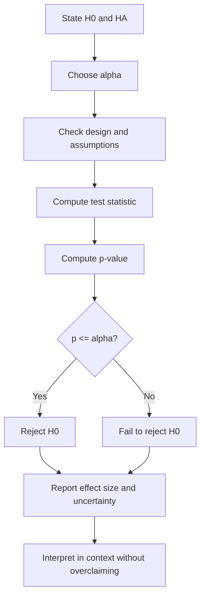

# Hypothesis Testing Logic

Hypothesis testing is a formal way to compare observed data with what would be expected if a specified null claim were true. The Lane text presents the logic of significance testing, one- and two-tailed tests, errors, power, and common misconceptions because this topic is widely used and widely misread. A test is not a machine for proving a research hypothesis; it is a probability calculation under a model.

The core question is: If the null hypothesis were true and the assumptions were reasonable, how surprising would a statistic at least as extreme as the observed one be? The answer is the p-value. A small p-value indicates that the data are unusual under the null model, but it does not measure the probability that the null is true, the probability that the result will replicate, or the practical importance of the effect.

## Definitions

The **null hypothesis** $H_0$ is the reference claim tested by the procedure. It often states no difference, no association, or a specific parameter value. The **alternative hypothesis** $H_A$ states the direction or kind of departure the test is designed to detect.

A **test statistic** is a standardized summary of how far the data are from what $H_0$ predicts. Examples include

$$
z=\frac{\hat{p}-p_0}{\sqrt{p_0(1-p_0)/n}},
$$

$$
t=\frac{\bar{x}-\mu_0}{s/\sqrt{n}},
$$

and

$$
\chi^2=\sum\frac{(O-E)^2}{E}.
$$

A **p-value** is the probability, assuming $H_0$ and the model assumptions are true, of obtaining a test statistic as extreme as or more extreme than the observed statistic in the direction specified by $H_A$.

The **significance level** $\alpha$ is the prechosen threshold for rejecting $H_0$. Common values are 0.10, 0.05, and 0.01. If $p\le\alpha$, the result is called statistically significant at level $\alpha$.

A **Type I error** occurs when the test rejects a true null hypothesis. The probability of a Type I error is controlled by $\alpha$ under the test assumptions. A **Type II error** occurs when the test fails to reject a false null hypothesis. Its probability is $\beta$. **Power** is

$$
1-\beta,
$$

the probability of rejecting $H_0$ when a specified alternative is true.

A test is **one-tailed** if the alternative predicts a direction, such as $\mu\gt \mu_0$. It is **two-tailed** if the alternative allows departures in either direction, such as $\mu\ne\mu_0$.

## Key results

The general testing workflow is:

1. State $H_0$ and $H_A$ before looking for significance.
2. Choose $\alpha$ and the test procedure.
3. Check the design and model assumptions.
4. Compute the test statistic.
5. Compute the p-value or compare with a critical value.
6. Make a decision about $H_0$.
7. Interpret the result in context, including effect size and uncertainty.

The decision rule is

$$
\text{reject }H_0 \text{ if } p\le\alpha.
$$

Otherwise, **fail to reject** $H_0$. This phrase matters. A non-significant result is not proof that $H_0$ is true; it may reflect a small effect, noisy data, low power, or a model mismatch.

Confidence intervals and two-sided tests are linked. For many standard procedures, a two-sided test at $\alpha=0.05$ rejects $H_0:\theta=\theta_0$ exactly when the 95% confidence interval for $\theta$ excludes $\theta_0$. The interval provides additional information by showing the range of plausible effect sizes.

Power increases when the true effect is larger, sample size is larger, measurement variability is smaller, or $\alpha$ is larger. Power also depends on whether the test matches the design. Paired data analyzed with a paired test can have much higher power than the same data incorrectly analyzed as independent groups.

Statistical significance is not practical significance. A tiny effect can be statistically significant in a huge sample, and a practically important effect can be non-significant in a small noisy sample. Reporting an effect estimate and confidence interval should accompany a p-value whenever possible.

The null hypothesis is a model, not a personal belief. In many applications, the exact null of zero difference is already known to be an approximation because real systems rarely match exactly. The test is still useful if the null represents a meaningful reference point: no treatment effect, no linear association, equal category probabilities, or a regulatory target. The conclusion should therefore say what the data show relative to that reference. A good final sentence includes the test decision, the estimated effect, uncertainty, and a context-aware limitation.

## Visual



| Truth about $H_0$ | Decision: reject $H_0$ | Decision: fail to reject $H_0$ |
|---|---|---|
| $H_0$ true | Type I error, probability $\alpha$ | Correct non-rejection |
| $H_0$ false | Correct rejection, power $1-\beta$ | Type II error, probability $\beta$ |

## Worked example 1: One-sample mean test

Problem: A filling machine is calibrated to a mean of 250 ml. A quality engineer samples 36 bottles and finds $\bar{x}=252.1$ ml with $s=5.4$ ml. Test at $\alpha=0.05$ whether the mean fill differs from 250 ml.

Method:

1. State hypotheses:

$$
H_0:\mu=250,
$$

$$
H_A:\mu\ne250.
$$

2. Use a one-sample $t$ test because $\sigma$ is unknown.
3. Compute the standard error:

$$
SE=\frac{s}{\sqrt{n}}=\frac{5.4}{\sqrt{36}}=\frac{5.4}{6}=0.9.
$$

4. Compute the test statistic:

$$
t=\frac{252.1-250}{0.9}=\frac{2.1}{0.9}=2.333.
$$

5. Degrees of freedom:

$$
df=36-1=35.
$$

6. For a two-sided test, the p-value is

$$
p=2P(T_{35}\ge2.333).
$$

Using software or a $t$ table gives approximately $p=0.0255$.

7. Compare with $\alpha=0.05$:

$$
0.0255\le0.05.
$$

Answer: Reject $H_0$. The sample provides statistically significant evidence that the machine's mean fill differs from 250 ml. The observed mean is higher, so the practical concern is possible overfilling.

Checked answer: The statistic is positive because the sample mean exceeds 250. Since the test is two-sided, both unusually high and unusually low means count as evidence against $H_0$.

## Worked example 2: Interpreting Type I error and power

Problem: A new training program is tested with $H_0$: the program does not change mean score, and $H_A$: the program increases mean score. The researcher chooses $\alpha=0.01$ and designs the study to have 80% power for a 5-point increase. Interpret $\alpha$, power, and the two possible errors.

Method:

1. $\alpha=0.01$ means that if the program truly has no effect and assumptions hold, the test will falsely reject the null about 1% of the time in repeated studies.
2. 80% power for a 5-point increase means that if the true increase is exactly 5 points under the assumed variability and design, the test will reject $H_0$ about 80% of the time.
3. Type I error in this context: concluding the program increases scores when it actually has no effect.
4. Type II error in this context: failing to detect an increase when the program truly increases the mean by the specified amount.
5. The Type II error probability at that specified alternative is

$$
\beta=1-\mathrm{power}=1-0.80=0.20.
$$

Answer: The design is conservative about false positives because $\alpha=0.01$. It still has a 20% chance of missing a true 5-point improvement under the assumptions used in the power calculation.

Checked answer: Power is tied to a particular alternative effect size. The statement "the test has 80% power" is incomplete unless the effect size, sample size, variability, and test direction are known.

## Code

```python
import numpy as np
from scipy import stats

# One-sample t test from worked example 1
n = 36
xbar = 252.1
s = 5.4
mu0 = 250
t_stat = (xbar - mu0) / (s / np.sqrt(n))
p_value = 2 * (1 - stats.t.cdf(abs(t_stat), df=n - 1))
print(f"t = {t_stat:.3f}, p = {p_value:.4f}")

# Critical-value view for alpha = 0.05, two-sided
t_crit = stats.t.ppf(0.975, df=n - 1)
print(f"critical values: +/-{t_crit:.3f}")
print("reject:", abs(t_stat) >= t_crit)
```

The code shows the equivalence between p-value and critical-value decisions. Both approaches require the same test statistic and reference distribution.

## Common pitfalls

- Saying the p-value is the probability that $H_0$ is true.
- Saying "accept $H_0$" after a non-significant result.
- Choosing a one-tailed test after seeing the data direction.
- Confusing statistical significance with practical importance.
- Ignoring assumptions because the calculation is easy.
- Reporting only a p-value without an estimate, confidence interval, or sample size.

## Connections

- [Estimation and confidence intervals](/math/statistics/estimation-and-confidence-intervals)
- [Tests for means](/math/statistics/tests-for-means)
- [ANOVA](/math/statistics/anova)
- [Proportions and chi-square tests](/math/statistics/proportions-and-chi-square-tests)
- [Effect size, nonparametric methods, and resampling](/math/statistics/effect-size-nonparametric-and-resampling)
