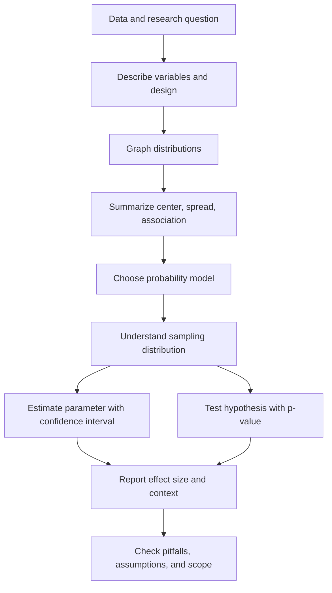

# Statistics

This statistics section is based on *Introduction to Statistics, Online Edition*, identified from the source PDF cover and table of contents. The primary author and editor listed on the cover are David M. Lane of Rice University, with other authors David Scott, Mikki Hebl, Rudy Guerra, Dan Osherson, and Heidi Zimmer of the University of Houston, Downtown Campus. The cover states that the work is in the public domain, and the table of contents organizes the course around introductory statistical literacy, graphing, summaries, probability, research design, sampling distributions, estimation, hypothesis testing, mean tests, power, regression, ANOVA, transformations, chi-square methods, distribution-free tests, effect size, case studies, and glossary material.

The notes below turn that textbook scope into a focused wiki sequence. They are not a replacement for reading the examples in the source text; they are structured study pages that emphasize definitions, formulas, worked examples, visuals, Python snippets, pitfalls, and cross-links. The sequence moves from data description to probability models, then from sampling distributions to inference, and finally to regression, ANOVA, categorical tests, effect size, and resampling.

## Definitions

**Statistics** is the discipline of collecting, organizing, displaying, analyzing, interpreting, and making decisions from data. In everyday use, a statistic can be a single numerical summary, such as a mean salary or a polling percentage. In the course sense, statistics is a toolkit for reasoning under uncertainty.

**Descriptive statistics** summarize observed data. They include graphs, tables, measures of center, measures of variability, percentiles, z-scores, and descriptions of shape. Descriptive work answers questions such as "What happened in this data set?" and "How are these values distributed?"

**Inferential statistics** uses sample data to learn about a larger population or process. Inference includes estimation, confidence intervals, hypothesis tests, regression inference, ANOVA, chi-square tests, and resampling methods. Inferential work answers questions such as "What is a plausible range for the population mean?" or "Would data this extreme be unusual if the null hypothesis were true?"

A **population** is the full set of cases about which a question is asked. A **sample** is the subset observed. A **parameter** is a numerical feature of the population, such as $\mu$ or $p$. A **statistic** is a numerical feature of a sample, such as $\bar{x}$ or $\hat{p}$. The core inferential problem is that the statistic is known while the parameter is usually unknown.

A **variable** is a measured or recorded characteristic of a case. Variables may be categorical or quantitative. Categorical variables may be nominal or ordinal. Quantitative variables may be discrete or continuous and are often treated as interval or ratio measurements depending on whether a meaningful zero exists.

A **probability model** assigns probabilities to possible outcomes. It provides the mathematical reference for uncertainty, such as the binomial distribution for successes in repeated trials, the normal distribution for many measurement models and approximations, and the chi-square distribution for squared discrepancies in categorical tests.

A **sampling distribution** is the distribution of a statistic over repeated samples. It is the conceptual engine behind standard errors, confidence intervals, and p-values. The central limit theorem explains why sample means are often approximately normal even when the raw data are not.

## Key results

The source book's table of contents supports the following course map:

| Source chapter | Main idea | Wiki pages |
|---:|---|---|
| 1. Introduction | statistics, variables, percentiles, measurement, distributions | [Statistical literacy and data](/math/statistics/statistical-literacy-and-data), [Summarizing distributions](/math/statistics/summarizing-distributions) |
| 2. Graphing Distributions | qualitative and quantitative displays | [Graphing distributions](/math/statistics/graphing-distributions) |
| 3. Summarizing Distributions | center, variability, shape, transformations | [Summarizing distributions](/math/statistics/summarizing-distributions) |
| 4. Describing Bivariate Data | scatterplots and Pearson correlation | [Bivariate data and correlation](/math/statistics/bivariate-data-and-correlation) |
| 5. Probability | events, counting, binomial, Poisson, base rates | [Probability basics](/math/statistics/probability-basics), [Random variables and probability distributions](/math/statistics/random-variables-and-distributions) |
| 6. Research Design | measurement, sampling, experiments, causation | [Statistical literacy and data](/math/statistics/statistical-literacy-and-data), [Hypothesis testing logic](/math/statistics/hypothesis-testing-logic) |
| 7. Normal Distributions | normal curve and standard normal | [Normal, t, chi-square, and F distributions](/math/statistics/normal-t-chi-square-and-f-distributions) |
| 8. Advanced Graphs | Q-Q plots, contour plots, 3D plots | [Graphing distributions](/math/statistics/graphing-distributions), [Linear regression inference](/math/statistics/linear-regression-inference) |
| 9. Sampling Distributions | means, differences, correlations, proportions | [Sampling distributions and the central limit theorem](/math/statistics/sampling-distributions-and-clt) |
| 10. Estimation | estimators and confidence intervals | [Estimation and confidence intervals](/math/statistics/estimation-and-confidence-intervals) |
| 11. Logic of Hypothesis Testing | p-values, errors, tails, misconceptions | [Hypothesis testing logic](/math/statistics/hypothesis-testing-logic) |
| 12. Testing Means | one-sample, independent, paired comparisons | [Tests for means](/math/statistics/tests-for-means) |
| 13. Power | power and factors affecting power | [Hypothesis testing logic](/math/statistics/hypothesis-testing-logic), [Effect size, nonparametric methods, and resampling](/math/statistics/effect-size-nonparametric-and-resampling) |
| 14. Regression | least squares, inference, influence, multiple regression | [Linear regression inference](/math/statistics/linear-regression-inference) |
| 15. Analysis of Variance | one-way, multi-factor, within-subjects ANOVA | [ANOVA](/math/statistics/anova) |
| 16. Transformations | logs, Tukey ladder, Box-Cox | [Summarizing distributions](/math/statistics/summarizing-distributions), [Linear regression inference](/math/statistics/linear-regression-inference) |
| 17. Chi Square | goodness-of-fit and contingency tables | [Proportions and chi-square tests](/math/statistics/proportions-and-chi-square-tests) |
| 18. Distribution-Free Tests | randomization and rank tests | [Effect size, nonparametric methods, and resampling](/math/statistics/effect-size-nonparametric-and-resampling) |
| 19. Effect Size | proportions, mean differences, variance explained | [Effect size, nonparametric methods, and resampling](/math/statistics/effect-size-nonparametric-and-resampling) |
| 20-21. Case Studies and Glossary | applied examples and terms | all pages in this section |

The central formula pattern in introductory statistics is

$$
\text{statistic}=\text{signal}+\text{noise}.
$$

Descriptive summaries estimate signal in the observed data. Probability models describe noise or random variation. Inference compares signal to a standard error:

$$
\text{standardized statistic}=
\frac{\text{estimate}-\text{null value}}{\text{standard error}}.
$$

This pattern appears in a one-proportion z test, a one-sample $t$ test, regression slope inference, and many other procedures. The details differ, but the logic is stable: define the parameter, choose an estimator, understand its sampling distribution, compute uncertainty, and interpret the result in context.

Another key result is that design controls the strength of conclusions. A randomized experiment can support causal claims more directly than an observational study. A probability sample supports generalization better than a convenience sample. A paired design requires paired analysis. A result can be computationally correct and still scientifically weak if the data were collected in a way that does not answer the research question.

## Visual



| Part of the wiki | Statistical role | First page to read |
|---|---|---|
| Data literacy | Define cases, variables, samples, populations | [Statistical literacy and data](/math/statistics/statistical-literacy-and-data) |
| Description | Display and summarize observed data | [Graphing distributions](/math/statistics/graphing-distributions) |
| Probability | Model uncertainty before inference | [Probability basics](/math/statistics/probability-basics) |
| Sampling | Explain standard errors and repeated-sampling behavior | [Sampling distributions and the central limit theorem](/math/statistics/sampling-distributions-and-clt) |
| Estimation | Estimate unknown parameters with uncertainty | [Estimation and confidence intervals](/math/statistics/estimation-and-confidence-intervals) |
| Testing | Compare data with a null model | [Hypothesis testing logic](/math/statistics/hypothesis-testing-logic) |
| Modeling | Analyze relationships among variables | [Linear regression inference](/math/statistics/linear-regression-inference) |
| Robustness | Effect sizes, ranks, bootstrap, permutation | [Effect size, nonparametric methods, and resampling](/math/statistics/effect-size-nonparametric-and-resampling) |

## Worked example 1: Choosing a page and a method

Problem: A researcher has data from 120 randomly sampled employees. Each employee reports commute mode, weekly remote-work days, job satisfaction on a 1 to 7 scale, and annual salary. The researcher asks four questions:

1. What commute modes are most common?
2. What is the typical salary?
3. Is salary associated with remote-work days?
4. Is mean job satisfaction different for employees with 0, 1-2, and 3+ remote-work days?

Choose the appropriate part of the statistics sequence for each question and name a likely method.

Method:

1. Commute mode is categorical. The question asks for common categories, so start with [graphing distributions](/math/statistics/graphing-distributions). A bar chart and frequency table are appropriate.
2. Salary is quantitative and often right-skewed. Start with [summarizing distributions](/math/statistics/summarizing-distributions). Use a histogram, median, IQR, mean, and standard deviation. The median may be more representative if a few salaries are very high.
3. Salary and remote-work days are two variables. If remote-work days is numeric and the relationship looks roughly linear, use [bivariate data and correlation](/math/statistics/bivariate-data-and-correlation) and possibly [linear regression inference](/math/statistics/linear-regression-inference). If remote-work days has only a few categories, group comparisons may be clearer.
4. Job satisfaction is an ordered rating. If treated as approximately quantitative and the three remote-work groups are independent, [ANOVA](/math/statistics/anova) is a possible method. If the rating scale is strongly ordinal or distributions are very nonnormal, [effect size, nonparametric methods, and resampling](/math/statistics/effect-size-nonparametric-and-resampling) suggests rank-based or permutation alternatives.

Answer: The four questions map to categorical graphing, distribution summaries, bivariate/regression analysis, and ANOVA or robust alternatives. The choice is not formula-first; it follows variable type, design, and research question.

Checked answer: Every method named matches the response variable and design. No causal claim is made because the data are sampled employees, not randomly assigned work schedules.

## Worked example 2: Reading a statistical claim skeptically

Problem: A headline says, "Students who use a new study app score 12 points higher, proving the app works." The article says 500 app users were compared with 500 nonusers from the same school district. App users had mean score 84 and nonusers had mean score 72. No random assignment was used. Critique the claim and identify what statistics can and cannot say.

Method:

1. Compute the observed mean difference:

$$
84-72=12.
$$

2. Identify the design. Students chose or did not choose to use the app. That is observational, not randomized.
3. Identify possible confounders. App users may differ in prior achievement, family resources, teacher quality, motivation, attendance, device access, or course level.
4. State what descriptive statistics can say: in these data, app users scored 12 points higher on average.
5. State what inferential statistics might say if sampling and assumptions are adequate: the district-level association may be estimated with a confidence interval, and a regression could adjust for measured confounders.
6. State what cannot be concluded from this information alone: the app is proven to cause a 12-point increase.

Answer: The headline overclaims. The observed difference is real as a descriptive statistic for the sample, but the design does not prove causation. A better statement is: "In this district sample, app users had higher average scores than nonusers; because use was not randomly assigned, the difference may reflect other student or school factors."

Checked answer: The critique separates magnitude, uncertainty, and causality. It does not dismiss the data; it limits the conclusion to what the design supports.

## Code

```python
import pandas as pd

pages = pd.DataFrame([
    ("Data literacy", "/math/statistics/statistical-literacy-and-data"),
    ("Graphs", "/math/statistics/graphing-distributions"),
    ("Summaries", "/math/statistics/summarizing-distributions"),
    ("Probability", "/math/statistics/probability-basics"),
    ("Sampling distributions", "/math/statistics/sampling-distributions-and-clt"),
    ("Confidence intervals", "/math/statistics/estimation-and-confidence-intervals"),
    ("Hypothesis tests", "/math/statistics/hypothesis-testing-logic"),
    ("Regression", "/math/statistics/linear-regression-inference"),
], columns=["topic", "path"])

print(pages)

def recommend(variable_type, question):
    if variable_type == "categorical" and "association" in question:
        return "Use a contingency table and chi-square test."
    if variable_type == "quantitative" and "mean" in question:
        return "Use estimation, t tests, or ANOVA depending on groups."
    if "prediction" in question:
        return "Use regression after checking a scatterplot and residuals."
    return "Start with graphs and summaries."

print(recommend("quantitative", "compare mean across groups"))
```

The snippet is not a statistical test. It is a small decision aid showing how analysis choices start from variable type and question type before moving to formulas.

## Common pitfalls

- Starting with a test name before identifying cases, variables, population, and design.
- Treating the table of contents as separate silos. Graphing, summaries, probability, and inference are connected steps in one workflow.
- Reading "statistically significant" as "important" or "causal."
- Ignoring the difference between a sample statistic and a population parameter.
- Using a method because it is familiar rather than because its assumptions match the data.
- Forgetting to report uncertainty, effect size, and context when interpreting results.

## Connections

- [Statistical literacy and data](/math/statistics/statistical-literacy-and-data)
- [Graphing distributions](/math/statistics/graphing-distributions)
- [Summarizing distributions](/math/statistics/summarizing-distributions)
- [Probability basics](/math/statistics/probability-basics)
- [Sampling distributions and the central limit theorem](/math/statistics/sampling-distributions-and-clt)
- [Estimation and confidence intervals](/math/statistics/estimation-and-confidence-intervals)
- [Hypothesis testing logic](/math/statistics/hypothesis-testing-logic)
- [Linear regression inference](/math/statistics/linear-regression-inference)
