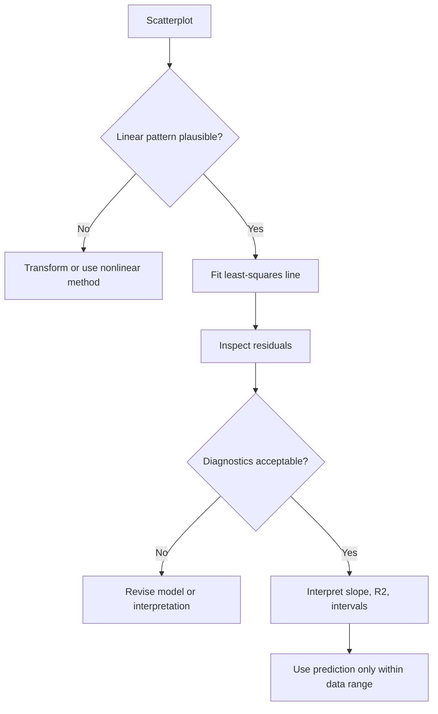

# Linear Regression Inference

Linear regression models the mean of a quantitative response as a linear function of one or more predictors. In simple linear regression, one predictor $x$ is used to predict a response $y$ through a fitted line. The Lane text introduces regression after correlation because regression adds direction: it distinguishes the predictor from the response, estimates a slope, and supports prediction, diagnostics, and inference about the linear relationship.

A regression line is not merely a line drawn through a scatterplot by eye. It is the line that minimizes the sum of squared residuals. That least-squares criterion gives precise formulas, but the model must still be checked. Outliers, curvature, nonconstant variance, dependence, and extrapolation can make a technically correct line misleading.


*Figure: Linear regression line fitted to random data points. Image: [Wikimedia Commons](https://commons.wikimedia.org/wiki/File:Linear_regression.svg), Sewaqu, public domain.*

## Definitions

The **simple linear regression model** is

$$
Y_i=\beta_0+\beta_1x_i+\varepsilon_i,
$$

where $\beta_0$ is the intercept, $\beta_1$ is the population slope, and $\varepsilon_i$ is the random error for observation $i$. The fitted line is

$$
\hat{y}=b_0+b_1x.
$$

The **slope** $b_1$ estimates the expected change in $Y$ for a one-unit increase in $X$. The **intercept** $b_0$ estimates the mean response when $x=0$, if $x=0$ is meaningful and within the range of data.

The **residual** for observation $i$ is

$$
e_i=y_i-\hat{y}_i.
$$

Least squares chooses $b_0$ and $b_1$ to minimize

$$
SSE=\sum_{i=1}^{n}(y_i-\hat{y}_i)^2.
$$

For simple linear regression,

$$
b_1=\frac{\sum(x_i-\bar{x})(y_i-\bar{y})}{\sum(x_i-\bar{x})^2},
$$

and

$$
b_0=\bar{y}-b_1\bar{x}.
$$

The **coefficient of determination** is

$$
R^2=1-\frac{SSE}{SST},
$$

where

$$
SST=\sum(y_i-\bar{y})^2.
$$

In simple regression with an intercept, $R^2=r^2$.

## Key results

Inference for the slope commonly tests

$$
H_0:\beta_1=0
$$

against a one- or two-sided alternative. The test statistic is

$$
t=\frac{b_1-0}{SE(b_1)},
$$

with $df=n-2$ in simple regression. A confidence interval for the slope is

$$
b_1\pm t^*_{n-2}SE(b_1).
$$

The standard error of the estimate, also called residual standard error, is

$$
s_e=\sqrt{\frac{SSE}{n-2}}.
$$

It measures typical vertical scatter around the fitted line in response units.

Regression assumptions for classical inference include linear mean structure, independent errors, constant error variance, and approximately normal errors for small-sample p-values and intervals. The predictor values need not be normally distributed. Residual plots are central: plot residuals against fitted values and predictors to check curvature and changing spread; use Q-Q plots to assess normality; inspect leverage and influence.

A **confidence interval for the mean response** at a given $x_0$ estimates the average $Y$ among cases with that predictor value. A **prediction interval** estimates a new individual response at $x_0$. Prediction intervals are wider because they include both uncertainty in the mean and individual-level noise.

Extrapolation occurs when using the line outside the observed range of $x$. It can be very misleading because linear patterns often hold only locally.

Regression interpretation should separate prediction, explanation, and causation. A model can predict well without revealing a causal mechanism, especially when predictors are proxies for other variables. A model can estimate an association after adjustment for measured covariates, but unmeasured confounding may remain. A randomized experiment with a regression analysis can support stronger causal language because treatment assignment is controlled by design. In observational regression, use language such as "is associated with" or "predicts" unless the design and assumptions justify a causal claim.

Multiple regression extends the same idea to several predictors. A coefficient then estimates the expected change in the response for a one-unit increase in that predictor, holding the other predictors in the model constant. That phrase is powerful but easy to overstate: it means statistically adjusted within the fitted model, not physically held constant by an experiment.

Influence diagnostics ask whether one or a few observations are driving the fitted relationship. A point with an unusual $x$ value has high leverage; a point with a large residual has poor fit; a point with both can strongly change the slope. Removing such a point without justification is not acceptable, but fitting the model with and without it can reveal whether the conclusion is stable. If the story changes completely, the final analysis should say so and investigate the observation's source.

Good regression reporting includes the fitted equation, units, uncertainty for key coefficients, residual diagnostics, and the observed predictor range.

## Visual



| Quantity | Formula | Interpretation |
|---|---:|---|
| Slope | $b_1=S_{xy}/S_{xx}$ | predicted change in $y$ per one-unit $x$ increase |
| Intercept | $b_0=\bar{y}-b_1\bar{x}$ | predicted $y$ at $x=0$ |
| Residual | $e_i=y_i-\hat{y}_i$ | vertical prediction error |
| SSE | $\sum e_i^2$ | unexplained variation |
| $R^2$ | $1-SSE/SST$ | proportion of sample variation explained |
| Slope test | $t=b_1/SE(b_1)$ | evidence of nonzero linear slope |

## Worked example 1: Fitting a least-squares line

Problem: A small data set records study hours $x$ and exam scores $y$:

| Student | $x$ | $y$ |
|---|---:|---:|
| A | 2 | 68 |
| B | 3 | 70 |
| C | 5 | 78 |
| D | 6 | 82 |
| E | 8 | 88 |
| F | 9 | 91 |

Find the least-squares line and predict the score for 7 hours.

Method:

1. From the correlation page, the means are

$$
\bar{x}=5.5,\quad \bar{y}=79.5.
$$

2. Compute

$$
S_{xy}=\sum(x_i-\bar{x})(y_i-\bar{y})=127.5.
$$

3. Compute

$$
S_{xx}=\sum(x_i-\bar{x})^2=35.5.
$$

4. Slope:

$$
b_1=\frac{127.5}{35.5}=3.5915.
$$

5. Intercept:

$$
b_0=\bar{y}-b_1\bar{x}=79.5-3.5915(5.5).
$$

6. Calculate:

$$
b_0=79.5-19.753=59.747.
$$

7. Fitted line:

$$
\hat{y}=59.747+3.592x.
$$

8. Predict at $x=7$:

$$
\hat{y}=59.747+3.592(7)=59.747+25.144=84.891.
$$

Answer: The fitted line is approximately $\hat{y}=59.75+3.59x$. For 7 study hours, the predicted exam score is about 84.9.

Checked answer: The slope is positive, matching the scatterplot. The prediction at 7 hours lies between the observed scores for 6 and 8 hours, which is reasonable.

## Worked example 2: Interpreting slope inference and prediction

Problem: A regression of monthly electricity cost on average daily temperature uses $n=40$ months. The fitted slope is $b_1=2.80$ dollars per degree, with $SE(b_1)=0.90$. Test whether the population slope differs from 0 at $\alpha=0.05$, and construct a 95% confidence interval.

Method:

1. State hypotheses:

$$
H_0:\beta_1=0,
$$

$$
H_A:\beta_1\ne0.
$$

2. Degrees of freedom:

$$
df=n-2=40-2=38.
$$

3. Test statistic:

$$
t=\frac{2.80}{0.90}=3.111.
$$

4. A two-sided p-value with 38 degrees of freedom is about 0.0035.
5. Since $0.0035\lt 0.05$, reject $H_0$.
6. For a 95% interval with $df=38$, $t^*\approx2.024$.
7. Margin of error:

$$
ME=2.024(0.90)=1.8216.
$$

8. Interval:

$$
2.80\pm1.8216=(0.9784,\ 4.6216).
$$

Answer: There is statistically significant evidence of a nonzero linear slope. The estimated cost increase is \$2.80 per degree, with a 95% confidence interval from about \$0.98 to \$4.62 per degree.

Checked answer: The interval does not include 0, agreeing with the two-sided test at $\alpha=0.05$. The conclusion is about association and prediction unless the data came from a design supporting causation.

## Code

```python
import pandas as pd
import statsmodels.api as sm

df = pd.DataFrame({
    "hours": [2, 3, 5, 6, 8, 9],
    "score": [68, 70, 78, 82, 88, 91],
})

X = sm.add_constant(df["hours"])
model = sm.OLS(df["score"], X).fit()
print(model.summary())

new_X = sm.add_constant(pd.DataFrame({"hours": [7]}), has_constant="add")
prediction = model.get_prediction(new_X)
print(prediction.summary_frame(alpha=0.05))
```

The summary includes slope, intercept, standard errors, p-values, and $R^2$. The prediction frame includes both a confidence interval for the mean score at 7 hours and a prediction interval for an individual student.

## Common pitfalls

- Interpreting the intercept when $x=0$ is outside the observed range or meaningless.
- Treating correlation and regression slope as the same quantity.
- Extrapolating beyond the data range because the fitted line has an equation.
- Ignoring residual plots and relying only on $R^2$.
- Reading a statistically significant slope as proof of causation.
- Confusing confidence intervals for the mean response with prediction intervals for individuals.

## Connections

- [Bivariate data and correlation](/math/statistics/bivariate-data-and-correlation)
- [Summarizing distributions](/math/statistics/summarizing-distributions)
- [Hypothesis testing logic](/math/statistics/hypothesis-testing-logic)
- [ANOVA](/math/statistics/anova)
- [Effect size, nonparametric methods, and resampling](/math/statistics/effect-size-nonparametric-and-resampling)
