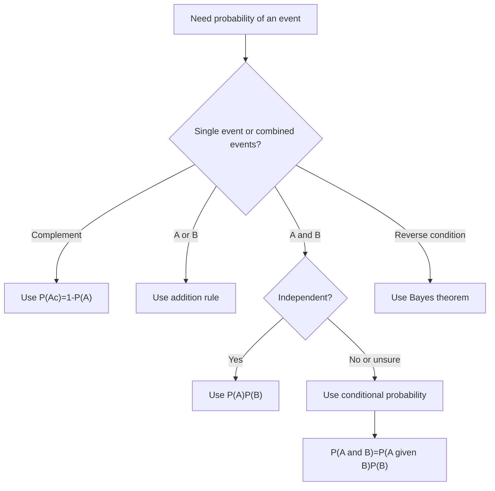

# Probability Basics

Probability supplies the language for uncertainty in statistical inference. A sample result is rarely interpreted as a fixed fact about a population; instead, it is interpreted against a probability model for what could have happened under repeated sampling or repeated trials. The Lane text introduces probability before sampling distributions because confidence intervals, p-values, power, and regression inference all depend on probability statements.

The practical goal is not to memorize gambling examples. It is to learn how events combine, how conditional information changes probabilities, and how independence differs from mutual exclusivity. These ideas appear whenever a researcher asks whether a medical test is reliable, whether two traits are associated, whether a result is surprising under a null hypothesis, or whether base rates change the interpretation of evidence.

## Definitions

A **random experiment** is a process with uncertain outcome but describable possible results. The **sample space** $S$ is the set of all possible outcomes. An **event** is a subset of the sample space. If $A$ is an event, then $P(A)$ is its probability and must satisfy

$$
0 \le P(A) \le 1.
$$

The complement of $A$, written $A^c$, is the event that $A$ does not occur. The complement rule is

$$
P(A^c)=1-P(A).
$$

The union $A\cup B$ is the event that $A$ or $B$ or both occur. The intersection $A\cap B$ is the event that both occur. The general addition rule is

$$
P(A\cup B)=P(A)+P(B)-P(A\cap B).
$$

Events are **mutually exclusive** if they cannot occur together, so $P(A\cap B)=0$. In that special case,

$$
P(A\cup B)=P(A)+P(B).
$$

The **conditional probability** of $A$ given $B$ is

$$
P(A\mid B)=\frac{P(A\cap B)}{P(B)},\quad P(B)>0.
$$

This is not usually equal to $P(B\mid A)$. Conditional probabilities reverse the reference group: $P(A\mid B)$ is among cases where $B$ occurred, while $P(B\mid A)$ is among cases where $A$ occurred.

Events $A$ and $B$ are **independent** if knowing that one occurred does not change the probability of the other:

$$
P(A\mid B)=P(A)
$$

or equivalently

$$
P(A\cap B)=P(A)P(B).
$$

Independence is not the same as mutual exclusivity. If two nonempty events are mutually exclusive, the occurrence of one makes the other impossible, so they are dependent.

## Key results

Bayes' theorem reverses conditional probabilities:

$$
P(A\mid B)=\frac{P(B\mid A)P(A)}{P(B)}.
$$

When $A$ and $A^c$ split the sample space, the denominator can be expanded:

$$
P(A\mid B)=
\frac{P(B\mid A)P(A)}
{P(B\mid A)P(A)+P(B\mid A^c)P(A^c)}.
$$

This form is essential for diagnostic testing and statistical literacy. A rare condition can have a low probability even after a positive test if the false-positive rate is not very small relative to the base rate.

Counting rules support equally likely probability calculations. If a task has $m$ choices followed by $n$ choices, the multiplication rule gives $mn$ ordered outcomes. The number of permutations of $n$ distinct objects taken $r$ at a time is

$$
P(n,r)=\frac{n!}{(n-r)!},
$$

where order matters. The number of combinations is

$$
\binom{n}{r}=\frac{n!}{r!(n-r)!},
$$

where order does not matter.

A probability model must match the mechanism. Drawing cards without replacement creates dependence between draws. Tossing a fair coin repeatedly is often modeled as independent trials. Sampling people from a finite population without replacement is not exactly independent, although independence may be a useful approximation when the population is much larger than the sample.

## Visual



| Idea | Formula | Warning |
|---|---|---|
| Complement | $P(A^c)=1-P(A)$ | Only covers "not A" |
| Addition | $P(A\cup B)=P(A)+P(B)-P(A\cap B)$ | Do not double-count overlap |
| Conditional | $P(A\mid B)=P(A\cap B)/P(B)$ | Denominator is the given group |
| Independence | $P(A\cap B)=P(A)P(B)$ | Must be justified, not assumed |
| Bayes | $P(A\mid B)=P(B\mid A)P(A)/P(B)$ | Base rates matter |
| Combination | $\binom{n}{r}$ | Use only when order does not matter |

## Worked example 1: Conditional probability from a two-way table

Problem: A survey of 200 students records whether they commute and whether they work at least 10 hours per week.

| | Work 10+ hours | Work under 10 hours | Total |
|---|---:|---:|---:|
| Commute | 54 | 36 | 90 |
| Do not commute | 26 | 84 | 110 |
| Total | 80 | 120 | 200 |

Find $P(\text{commute})$, $P(\text{work})$, $P(\text{commute and work})$, $P(\text{work}\mid\text{commute})$, and decide whether commuting and working appear independent.

Method:

1. Convert counts to probabilities by dividing by 200:

$$
P(\text{commute})=\frac{90}{200}=0.45.
$$

2. Work probability:

$$
P(\text{work})=\frac{80}{200}=0.40.
$$

3. Joint probability:

$$
P(\text{commute and work})=\frac{54}{200}=0.27.
$$

4. Conditional probability among commuters:

$$
P(\text{work}\mid\text{commute})=\frac{54}{90}=0.60.
$$

5. Check independence. If independent, the joint probability should equal the product of marginal probabilities:

$$
P(\text{commute})P(\text{work})=0.45(0.40)=0.18.
$$

Answer: The observed joint probability is 0.27, not 0.18, and the conditional probability of working among commuters is 0.60, not the overall work probability 0.40. In this sample, commuting and working appear associated rather than independent.

Checked answer: The table totals are consistent: $54+36+26+84=200$. The conditional denominator is 90 because the phrase "given commute" restricts attention to commuters.

## Worked example 2: Bayes' theorem with a medical test

Problem: A condition affects 2% of a population. A screening test has sensitivity 95%, meaning $P(+\mid D)=0.95$, and specificity 90%, meaning $P(-\mid D^c)=0.90$. If a randomly chosen person tests positive, what is the probability they have the condition?

Method:

1. State the base rate:

$$
P(D)=0.02,\quad P(D^c)=0.98.
$$

2. Translate specificity into false-positive probability:

$$
P(+\mid D^c)=1-P(-\mid D^c)=1-0.90=0.10.
$$

3. Compute the positive probability using total probability:

$$
\begin{aligned}
P(+) &= P(+\mid D)P(D)+P(+\mid D^c)P(D^c) \\
&=0.95(0.02)+0.10(0.98) \\
&=0.019+0.098 \\
&=0.117.
\end{aligned}
$$

4. Apply Bayes' theorem:

$$
P(D\mid +)=\frac{0.95(0.02)}{0.117}
=\frac{0.019}{0.117}
\approx 0.162.
$$

Answer: The probability of having the condition after a positive test is about 16.2%. This may seem low because the test is fairly sensitive, but the condition is rare and the false-positive rate applies to the much larger disease-free group.

Checked answer: In 10,000 people, about 200 have the condition and 9,800 do not. The test finds about 190 true positives and 980 false positives. Among $190+980=1,170$ positives, only $190/1,170\approx 0.162$ have the condition.

## Code

```python
def bayes_positive(prevalence, sensitivity, specificity):
    p_d = prevalence
    p_not_d = 1 - prevalence
    p_pos_d = sensitivity
    p_pos_not_d = 1 - specificity
    p_pos = p_pos_d * p_d + p_pos_not_d * p_not_d
    return (p_pos_d * p_d) / p_pos

posterior = bayes_positive(prevalence=0.02, sensitivity=0.95, specificity=0.90)
print(f"P(condition | positive) = {posterior:.3f}")

# Two-way table check from worked example 1
commute_work = 54
commuters = 90
workers = 80
total = 200
print("P(work | commute):", commute_work / commuters)
print("P(work):", workers / total)
```

The function exposes the three inputs that drive diagnostic interpretation: prevalence, sensitivity, and specificity. Changing prevalence often changes the answer more dramatically than intuition expects.

## Common pitfalls

- Confusing $P(A\mid B)$ with $P(B\mid A)$.
- Treating mutually exclusive events as independent. Except for impossible events, mutual exclusivity creates dependence.
- Forgetting to subtract the overlap in the addition rule.
- Ignoring base rates when interpreting tests, alarms, and screening tools.
- Assuming sampling without replacement is independent in small populations.
- Using combinations when order matters, or permutations when it does not.

## Connections

- [Random variables and probability distributions](/math/statistics/random-variables-and-distributions)
- [Normal, t, chi-square, and F distributions](/math/statistics/normal-t-chi-square-and-f-distributions)
- [Sampling distributions and the central limit theorem](/math/statistics/sampling-distributions-and-clt)
- [Hypothesis testing logic](/math/statistics/hypothesis-testing-logic)
- [Proportions and chi-square tests](/math/statistics/proportions-and-chi-square-tests)
