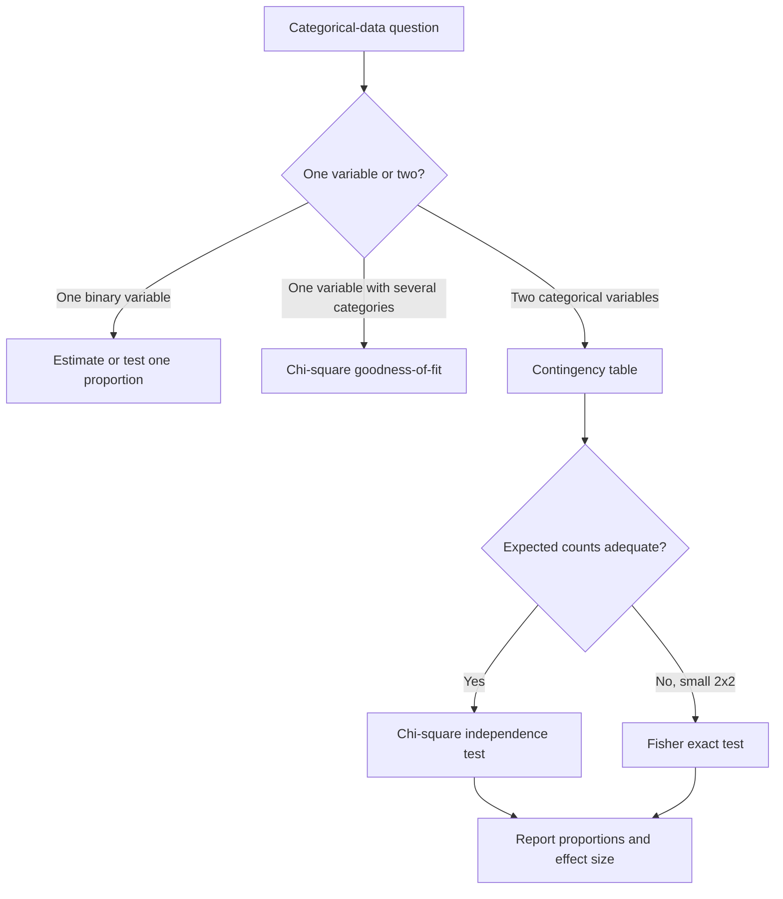

# Proportions and Chi-Square Tests

Many statistical questions involve counts rather than measurements: how many respondents prefer each candidate, how many parts are defective, how many patients improved, or whether two categorical variables are associated. The Lane text treats proportions and chi-square tests as central tools for categorical data. They connect probability, sampling distributions, and hypothesis testing in a setting where means and standard deviations are not the natural summaries.

The main distinction is between one categorical variable and two categorical variables. With one variable, we may estimate or test a population proportion, or test whether several category probabilities match a claimed distribution. With two variables, we ask whether the variables are independent or associated in a population. The calculations use counts, but the interpretation must return to proportions, context, and design.


*Figure: Chi-square density curves for different degrees of freedom. Image: [Wikimedia Commons](https://commons.wikimedia.org/wiki/File:Chi-square_distributionPDF.svg), Jona, CC BY-SA 4.0.*

## Definitions

A **sample proportion** is

$$
\hat{p}=\frac{x}{n},
$$

where $x$ is the number of sampled cases with the characteristic and $n$ is the sample size.

A **one-proportion z test** tests

$$
H_0:p=p_0
$$

with statistic

$$
z=\frac{\hat{p}-p_0}{\sqrt{p_0(1-p_0)/n}}.
$$

The null value $p_0$ is used in the standard error because the p-value is computed under the null hypothesis.

A **confidence interval for a proportion** often has the approximate form

$$
\hat{p}\pm z^*\sqrt{\frac{\hat{p}(1-\hat{p})}{n}}.
$$

For small samples or proportions near 0 or 1, improved intervals such as Wilson or exact methods are preferable.

A **chi-square goodness-of-fit test** compares observed counts $O_i$ in one categorical variable with expected counts $E_i$ from a hypothesized distribution:

$$
\chi^2=\sum_{i=1}^{k}\frac{(O_i-E_i)^2}{E_i}.
$$

The degrees of freedom are often $k-1$ when no parameters are estimated from the data.

A **contingency table** displays counts for two categorical variables. A **chi-square test of independence** asks whether row and column variables are independent in the population. If row total $R_i$, column total $C_j$, and grand total $N$ are known, the expected count under independence is

$$
E_{ij}=\frac{R_iC_j}{N}.
$$

The test statistic is again

$$
\chi^2=\sum\frac{(O-E)^2}{E},
$$

summed over all cells.

## Key results

For a one-proportion z test, the normal approximation works best when expected successes and failures under the null are sufficiently large:

$$
np_0 \ge 10,\quad n(1-p_0)\ge10
$$

is a common introductory rule. For intervals, the analogous check often uses $n\hat{p}$ and $n(1-\hat{p})$.

For a two-way table with $r$ rows and $c$ columns, the degrees of freedom for the chi-square independence test are

$$
df=(r-1)(c-1).
$$

The chi-square statistic is always nonnegative. Larger values indicate larger discrepancies between observed and expected counts. The p-value is an upper-tail probability:

$$
P(\chi^2_{df}\ge \chi^2_{\text{observed}}).
$$

Expected counts, not observed counts, determine whether the large-sample chi-square approximation is reliable. A common rule is that all expected counts should be at least 5, though modern practice is more nuanced. When counts are small in a $2\times2$ table, Fisher's exact test is often used.

For a $2\times2$ table, effect sizes include risk difference, relative risk, odds ratio, and phi. For larger tables, Cramer's $V$ summarizes association strength:

$$
V=\sqrt{\frac{\chi^2}{N\min(r-1,c-1)}}.
$$

The p-value answers whether the data are surprising under independence; effect size answers how strong the association is.

Percentages should usually be reported in the direction that matches the question. If the rows are class years and the question is whether first-year and upper-year students prefer different formats, compare row percentages. If the columns are formats and the question is what kinds of students choose each format, compare column percentages. The same table can support both summaries, but mixing denominators in one sentence creates confusion. Always name the denominator: "60% of commuters work 10+ hours" is clearer than "60% work," especially when several groups appear in the table.

## Visual



| Test | Data | Null hypothesis | Statistic | df |
|---|---|---|---|---:|
| One-proportion z | binary counts | $p=p_0$ | standardized $\hat{p}$ | normal |
| Goodness-of-fit | one categorical variable | probabilities match claim | $\sum(O-E)^2/E$ | $k-1$ |
| Independence | two categorical variables | variables independent | $\sum(O-E)^2/E$ | $(r-1)(c-1)$ |
| Fisher exact | small $2\times2$ table | variables independent | hypergeometric probability | exact |

## Worked example 1: One-proportion z test

Problem: A city claims that 60% of commuters use public transit at least once per week. In a random sample of 250 commuters, 135 report using public transit weekly. Test the claim against a two-sided alternative at $\alpha=0.05$.

Method:

1. State hypotheses:

$$
H_0:p=0.60,
$$

$$
H_A:p\ne0.60.
$$

2. Compute the sample proportion:

$$
\hat{p}=\frac{135}{250}=0.54.
$$

3. Check expected counts under the null:

$$
np_0=250(0.60)=150,
$$

$$
n(1-p_0)=250(0.40)=100.
$$

Both are large enough for the normal approximation.

4. Compute the null standard error:

$$
SE_0=\sqrt{\frac{0.60(0.40)}{250}}
=\sqrt{\frac{0.24}{250}}
=\sqrt{0.00096}
\approx0.03098.
$$

5. Compute the z statistic:

$$
z=\frac{0.54-0.60}{0.03098}
=\frac{-0.06}{0.03098}
\approx -1.94.
$$

6. Two-sided p-value:

$$
p=2P(Z\le -1.94)\approx2(0.0262)=0.0524.
$$

Answer: Since $p\approx0.0524\gt 0.05$, fail to reject $H_0$ at the 5% level. The data are close to the threshold but do not provide statistically significant evidence that the true proportion differs from 60% at $\alpha=0.05$.

Checked answer: The sample proportion is 6 percentage points below the claim. With $SE\approx3.1$ percentage points, the observed difference is just under two standard errors.

## Worked example 2: Chi-square test of independence

Problem: A survey records preferred study format and class year for 180 students.

| | Online | Hybrid | In-person | Total |
|---|---:|---:|---:|---:|
| First-year | 18 | 22 | 20 | 60 |
| Upper-year | 24 | 28 | 68 | 120 |
| Total | 42 | 50 | 88 | 180 |

Test whether study-format preference is independent of class year.

Method:

1. State hypotheses:

$$
H_0:\text{preference and class year are independent},
$$

$$
H_A:\text{they are associated}.
$$

2. Compute expected counts using $E_{ij}=R_iC_j/N$.

For first-year online:

$$
E=\frac{60(42)}{180}=14.
$$

First-year hybrid:

$$
E=\frac{60(50)}{180}=16.67.
$$

First-year in-person:

$$
E=\frac{60(88)}{180}=29.33.
$$

Upper-year expected counts are 28, 33.33, and 58.67.

3. Compute contributions:

$$
\frac{(18-14)^2}{14}=1.143,
$$

$$
\frac{(22-16.67)^2}{16.67}=1.706,
$$

$$
\frac{(20-29.33)^2}{29.33}=2.970,
$$

$$
\frac{(24-28)^2}{28}=0.571,
$$

$$
\frac{(28-33.33)^2}{33.33}=0.853,
$$

$$
\frac{(68-58.67)^2}{58.67}=1.485.
$$

4. Sum:

$$
\chi^2\approx1.143+1.706+2.970+0.571+0.853+1.485=8.728.
$$

5. Degrees of freedom:

$$
df=(2-1)(3-1)=2.
$$

6. The p-value is $P(\chi^2_2\ge8.728)\approx0.0127$.

Answer: Reject independence at $\alpha=0.05$. There is evidence of an association between class year and preferred study format. The table suggests upper-year students choose in-person more often than expected under independence.

Checked answer: All expected counts exceed 5, so the chi-square approximation is reasonable. The largest discrepancy is first-year in-person, where the observed count 20 is much lower than expected 29.33.

## Code

```python
import numpy as np
from scipy import stats

# One-proportion z test
x, n, p0 = 135, 250, 0.60
phat = x / n
se0 = np.sqrt(p0 * (1 - p0) / n)
z = (phat - p0) / se0
p_value = 2 * stats.norm.cdf(-abs(z))
print(f"z = {z:.3f}, p = {p_value:.4f}")

# Chi-square independence test
table = np.array([[18, 22, 20],
                  [24, 28, 68]])
chi2, p, df, expected = stats.chi2_contingency(table, correction=False)
print(f"chi2 = {chi2:.3f}, df = {df}, p = {p:.4f}")
print(expected)
```

The chi-square function returns the expected-count table. Always inspect it; a p-value is not enough if the approximation conditions are poor.

## Common pitfalls

- Using the sample proportion in the standard error for a hypothesis test instead of the null proportion.
- Treating the chi-square statistic as if negative discrepancies cancel positive discrepancies. Squaring prevents cancellation.
- Interpreting a significant chi-square test without examining which cells drive the association.
- Forgetting that counts must be independent; repeated responses from the same person break the usual test.
- Using chi-square tests for percentages without the underlying counts.
- Reporting association as causation in an observational contingency table.

## Connections

- [Probability basics](/math/statistics/probability-basics)
- [Random variables and probability distributions](/math/statistics/random-variables-and-distributions)
- [Normal, t, chi-square, and F distributions](/math/statistics/normal-t-chi-square-and-f-distributions)
- [Hypothesis testing logic](/math/statistics/hypothesis-testing-logic)
- [Effect size, nonparametric methods, and resampling](/math/statistics/effect-size-nonparametric-and-resampling)
