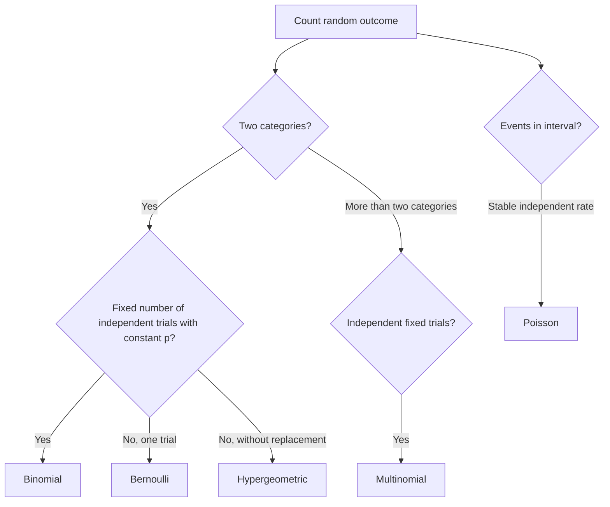

# Random Variables and Probability Distributions

A random variable turns uncertain outcomes into numbers. Once outcomes are numeric, we can describe their long-run behavior with a probability distribution, compute expected values, and model real processes such as successes in repeated trials, arrivals in a time interval, or draws from a finite collection. The Lane text introduces the binomial, Poisson, multinomial, and hypergeometric distributions as probability models that later support inference.


*Figure: A Galton box turns repeated random left-right choices into an approximate bell-shaped distribution. Image: [Wikimedia Commons](https://commons.wikimedia.org/wiki/File:Galton_Box.svg), Marcin Floryan, CC BY-SA 3.0.*

The art is matching assumptions to context. A binomial model is natural for a fixed number of independent success/failure trials with constant success probability. A Poisson model is natural for counts of rare events in a fixed interval when events occur independently at a stable rate. A hypergeometric model is natural for sampling without replacement. When the model assumptions fail, the formula may still produce a number, but the number no longer answers the intended question.

## Definitions

A **random variable** $X$ assigns a numerical value to each outcome of a random process. A **discrete random variable** has countable possible values, such as 0, 1, 2, and so on. A **continuous random variable** has possible values over intervals, such as time, length, or measurement error.

A **probability mass function** for a discrete random variable gives

$$
P(X=x)
$$

for each possible value $x$. The probabilities must be nonnegative and sum to 1. A **cumulative distribution function** is

$$
F(x)=P(X\le x).
$$

For continuous variables, probabilities are areas under a density curve rather than heights at individual points. For a continuous random variable, $P(X=a)=0$ for any exact value $a$, even though intervals can have positive probability.

The **expected value** or mean of a discrete random variable is

$$
E(X)=\sum_x xP(X=x).
$$

The **variance** is

$$
\mathrm{Var}(X)=E[(X-\mu)^2],
$$

where $\mu=E(X)$. Standard deviation is $\sqrt{\mathrm{Var}(X)}$.

A **Bernoulli trial** has two outcomes, usually called success and failure, with success probability $p$. If $X$ is 1 for success and 0 for failure, then $X$ has a Bernoulli distribution with $E(X)=p$ and $\mathrm{Var}(X)=p(1-p)$.

If $X$ counts successes in $n$ independent Bernoulli trials with constant success probability $p$, then $X$ has a **binomial distribution**:

$$
P(X=k)=\binom{n}{k}p^k(1-p)^{n-k},\quad k=0,1,\dots,n.
$$

A **Poisson distribution** with rate $\lambda$ models counts in a fixed interval:

$$
P(X=k)=e^{-\lambda}\frac{\lambda^k}{k!},\quad k=0,1,2,\dots.
$$

For a Poisson random variable, $E(X)=\lambda$ and $\mathrm{Var}(X)=\lambda$.

## Key results

The binomial distribution has mean and variance

$$
E(X)=np,
$$

$$
\mathrm{Var}(X)=np(1-p).
$$

These results match the idea that $X$ is the sum of $n$ independent Bernoulli variables. Expected values add, and independent variances add. If $X=X_1+\cdots+X_n$ and each $X_i$ is Bernoulli($p$), then

$$
E(X)=E(X_1)+\cdots+E(X_n)=np.
$$

The hypergeometric distribution models the number of successes in $n$ draws without replacement from a population of $N$ objects containing $K$ successes:

$$
P(X=k)=\frac{\binom{K}{k}\binom{N-K}{n-k}}{\binom{N}{n}}.
$$

This distribution differs from the binomial because the draws are dependent: after one success is drawn, fewer successes remain.

The multinomial distribution generalizes the binomial to more than two categories. If $n$ independent trials fall into $c$ categories with probabilities $p_1,\dots,p_c$, then counts $X_1,\dots,X_c$ have probability

$$
P(X_1=x_1,\dots,X_c=x_c)=
\frac{n!}{x_1!\cdots x_c!}p_1^{x_1}\cdots p_c^{x_c},
$$

where $x_1+\cdots+x_c=n$.

The Poisson distribution can approximate a binomial distribution when $n$ is large, $p$ is small, and $\lambda=np$ is moderate. This approximation is useful for rare-event counts, but it should not hide the assumptions: events should occur independently and at a stable average rate across the interval.

Distribution choice is also a modeling claim. If a call center receives more calls during lunch than at midnight, a single Poisson rate for the whole day may be too crude even if the total count is a nonnegative integer. If survey responses are clustered by classroom, a binomial model that treats every student response as independent may underestimate variability. If a quality inspector samples a large warehouse without replacement but the sample is tiny relative to the warehouse, a binomial approximation may be acceptable. The formulas become useful only after the data-generating process has been described clearly enough to defend the assumptions.

## Visual

| Distribution | Random variable | Parameters | Mean | Variance | Typical setting |
|---|---|---:|---:|---:|---|
| Bernoulli | one success/failure trial | $p$ | $p$ | $p(1-p)$ | one yes/no outcome |
| Binomial | successes in fixed $n$ trials | $n,p$ | $np$ | $np(1-p)$ | independent repeated trials |
| Poisson | events in interval | $\lambda$ | $\lambda$ | $\lambda$ | arrivals, rare counts |
| Hypergeometric | successes without replacement | $N,K,n$ | $nK/N$ | depends on finite correction | finite sampling |
| Multinomial | counts in several categories | $n,p_1,\dots,p_c$ | $np_j$ for category $j$ | category-specific | survey choices |



## Worked example 1: Binomial probability

Problem: A website experiment has a historical conversion probability of $p=0.12$. Suppose 20 independent visitors see a page. Let $X$ be the number who convert. Find $P(X=3)$, $P(X\le 1)$, and the mean and standard deviation.

Method:

1. Identify the model. There are $n=20$ fixed trials, each visitor either converts or does not, and the problem assumes independent visitors with constant $p=0.12$. Thus $X\sim\mathrm{Binomial}(20,0.12)$.
2. Compute $P(X=3)$:

$$
P(X=3)=\binom{20}{3}(0.12)^3(0.88)^{17}.
$$

3. Evaluate the combination:

$$
\binom{20}{3}=\frac{20!}{3!17!}=1140.
$$

4. Substitute:

$$
P(X=3)=1140(0.001728)(0.1142)\approx 0.225.
$$

5. Compute $P(X\le 1)$:

$$
P(X\le 1)=P(X=0)+P(X=1).
$$

6. Calculate terms:

$$
P(X=0)=(0.88)^{20}\approx 0.0776,
$$

$$
P(X=1)=\binom{20}{1}(0.12)(0.88)^{19}\approx 0.2117.
$$

7. Add:

$$
P(X\le 1)\approx 0.0776+0.2117=0.2893.
$$

8. Mean and standard deviation:

$$
E(X)=np=20(0.12)=2.4,
$$

$$
\sigma=\sqrt{np(1-p)}=\sqrt{20(0.12)(0.88)}\approx 1.45.
$$

Answer: $P(X=3)\approx 0.225$, $P(X\le1)\approx 0.289$, the expected number of conversions is 2.4, and the standard deviation is about 1.45.

Checked answer: A value of 3 conversions is near the expected value 2.4, so a probability around 0.225 is plausible. Zero or one conversion is below average but not rare with only 20 visitors.

## Worked example 2: Hypergeometric versus binomial

Problem: A shipment contains 50 devices, 6 of which are defective. An inspector selects 5 devices without replacement. What is the probability that exactly 2 are defective? Why is a binomial model not exact?

Method:

1. Identify parameters: $N=50$ total devices, $K=6$ defectives, $n=5$ draws, and $k=2$ defective draws.
2. Use the hypergeometric formula:

$$
P(X=2)=\frac{\binom{6}{2}\binom{44}{3}}{\binom{50}{5}}.
$$

3. Compute pieces:

$$
\binom{6}{2}=15,
$$

$$
\binom{44}{3}=\frac{44\cdot43\cdot42}{3\cdot2\cdot1}=13244,
$$

$$
\binom{50}{5}=2118760.
$$

4. Substitute:

$$
P(X=2)=\frac{15(13244)}{2118760}
=\frac{198660}{2118760}
\approx 0.0938.
$$

Answer: The exact probability is about 0.094. A binomial model with $p=6/50=0.12$ would treat each draw as independent with constant defect probability. That is not exact because after a defective device is drawn, only 5 defectives remain among 49 devices; the probability changes.

Checked answer: The numerator counts ways to choose 2 defectives and 3 nondefectives. The denominator counts all possible sets of 5 devices, so the ratio matches the sampling mechanism.

## Code

```python
from scipy.stats import binom, hypergeom, poisson

# Binomial conversion example
n, p = 20, 0.12
print("P(X=3):", binom.pmf(3, n, p))
print("P(X<=1):", binom.cdf(1, n, p))
print("mean:", binom.mean(n, p), "sd:", binom.std(n, p))

# Hypergeometric inspection example
N, K, draws = 50, 6, 5
print("P(exactly 2 defective):", hypergeom.pmf(2, N, K, draws))

# Poisson rare-event example: average 4 calls per hour
print("P(6 calls in an hour):", poisson.pmf(6, mu=4))
```

SciPy uses `pmf` for discrete probability mass functions and `cdf` for cumulative probabilities. Naming the parameters in comments is useful because different distributions use different conventions.

## Common pitfalls

- Using a binomial model for sampling without replacement from a small finite population.
- Forgetting that "at most 1" means $P(X=0)+P(X=1)$.
- Treating expected value as the most likely exact outcome. The expectation can be non-integer.
- Using the Poisson distribution for counts whose rate changes sharply over time or space.
- Ignoring dependence among trials, such as multiple purchases by the same customer.
- Rounding intermediate probabilities too aggressively.

## Connections

- [Probability basics](/math/statistics/probability-basics)
- [Normal, t, chi-square, and F distributions](/math/statistics/normal-t-chi-square-and-f-distributions)
- [Sampling distributions and the central limit theorem](/math/statistics/sampling-distributions-and-clt)
- [Proportions and chi-square tests](/math/statistics/proportions-and-chi-square-tests)
- [Hypothesis testing logic](/math/statistics/hypothesis-testing-logic)
