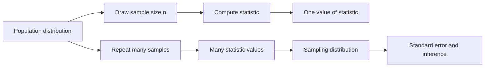

# Sampling Distributions and the Central Limit Theorem

A sampling distribution is the probability distribution of a statistic over repeated samples. This idea is the bridge from descriptive statistics to inference. A single sample mean may be 72.4, but the sampling distribution asks what values the sample mean would take if the same sampling procedure were repeated again and again. The Lane text emphasizes sampling distributions because confidence intervals, hypothesis tests, and standard errors are all built from them.

The central limit theorem is the most important approximation in introductory statistics. It explains why sample means are often approximately normal even when the original observations are not. This is the reason normal and $t$ procedures appear so widely. The theorem does not say that the raw data become normal; it says that the distribution of the sample mean becomes approximately normal under suitable conditions as sample size grows.


*Figure: Simulation of sample-mean distributions under the central limit theorem. Image: [Wikimedia Commons](https://commons.wikimedia.org/wiki/File:Central_Limit_Theorem.png), Daniel Resende, CC BY-SA 4.0.*

## Definitions

A **statistic** is a number computed from sample data, such as $\bar{X}$, $S$, $\hat{p}$, or $r$. Because samples vary, a statistic is itself a random variable before the data are observed.

The **sampling distribution** of a statistic is the distribution of that statistic across all possible samples of a fixed size drawn by the same method from the same population. For the sample mean, the statistic is

$$
\bar{X}=\frac{1}{n}\sum_{i=1}^{n}X_i.
$$

The **standard error** of a statistic is the standard deviation of its sampling distribution. For the sample mean from independent observations with population standard deviation $\sigma$,

$$
SE(\bar{X})=\frac{\sigma}{\sqrt{n}}.
$$

For a sample proportion,

$$
SE(\hat{p})=\sqrt{\frac{p(1-p)}{n}}.
$$

In practice, unknown population quantities are often replaced by estimates, such as $s$ for $\sigma$ or $\hat{p}$ for $p$.

The **central limit theorem** states that if $X_1,\dots,X_n$ are independent and identically distributed with mean $\mu$ and finite standard deviation $\sigma$, then for large $n$,

$$
\bar{X}\approx N\left(\mu,\frac{\sigma^2}{n}\right).
$$

Equivalently,

$$
Z=\frac{\bar{X}-\mu}{\sigma/\sqrt{n}}
$$

is approximately standard normal for large $n$.

## Key results

The mean of the sampling distribution of $\bar{X}$ is

$$
E(\bar{X})=\mu.
$$

This means the sample mean is an unbiased estimator of the population mean under random sampling. The variability of $\bar{X}$ decreases as sample size increases:

$$
SE(\bar{X})=\frac{\sigma}{\sqrt{n}}.
$$

The square-root relationship is important. To cut the standard error in half, the sample size must be multiplied by four. Doubling the sample size reduces the standard error by a factor of $\sqrt{2}$, not by half.

If the population itself is normal, then the sampling distribution of $\bar{X}$ is exactly normal for any sample size. If the population is not normal, the central limit theorem provides an approximation that improves as $n$ increases. Skewed and heavy-tailed populations require larger sample sizes than symmetric light-tailed populations.

For proportions, when $np$ and $n(1-p)$ are sufficiently large, the sampling distribution of $\hat{p}$ is approximately normal:

$$
\hat{p}\approx N\left(p,\frac{p(1-p)}{n}\right).
$$

The same conceptual rule applies: the statistic varies from sample to sample, but its distribution has a predictable center and spread if the sampling process is understood.

Sampling distributions should not be confused with bootstrap distributions, simulated histograms of raw data, or the distribution of a population. A sampling distribution is a theoretical repeated-sampling object tied to a statistic and a sample size. In teaching, we often approximate it by simulation: repeatedly draw samples, compute the statistic, and plot the results. That simulation is useful because it makes the repeated-sampling idea visible, but the target concept is still the distribution that would arise from the sampling design. This distinction becomes important when interpreting standard errors: a standard error of 2 grams for a mean does not mean individual packages usually vary by 2 grams; it means sample means of that size usually vary by about 2 grams.

The CLT also explains why inference can be more stable for averages than for individual outcomes. Individual delivery times may be right-skewed because unusually long delays are possible, but the average of many deliveries has less relative skew and smaller spread. This does not make every sample size "large enough." A sample of 10 from a mildly skewed population may work reasonably, while a sample of 100 from a population with extreme outliers or strong dependence may still be difficult. The theorem is a guide to approximation, not permission to ignore the data-generating process.

In practice, always pair the CLT with a plot of the original data and a clear statement of sampling independence.

## Visual



| Quantity | Raw-data distribution | Sampling distribution |
|---|---|---|
| What varies? | Individual observations $X$ | Statistic such as $\bar{X}$ |
| Center | Population mean $\mu$ | $E(\bar{X})=\mu$ |
| Spread | Population standard deviation $\sigma$ | $SE(\bar{X})=\sigma/\sqrt{n}$ |
| Shape | Any population shape | Often approximately normal for means |
| Sample-size effect | More observations show more detail | Larger $n$ makes statistic less variable |

## Worked example 1: Standard error of the mean

Problem: A manufacturer knows that fill weights for a product have mean $\mu=500$ grams and standard deviation $\sigma=12$ grams. Random samples of $n=36$ packages are taken. Find the mean and standard error of $\bar{X}$, and compute $P(\bar{X}\gt 503)$ assuming the CLT approximation is appropriate.

Method:

1. The center of the sampling distribution is

$$
E(\bar{X})=\mu=500.
$$

2. The standard error is

$$
SE(\bar{X})=\frac{\sigma}{\sqrt{n}}=\frac{12}{\sqrt{36}}=\frac{12}{6}=2.
$$

3. Standardize $\bar{X}=503$:

$$
z=\frac{503-500}{2}=1.5.
$$

4. Convert to an upper-tail normal probability:

$$
P(\bar{X}>503)=P(Z>1.5)=1-\Phi(1.5).
$$

5. From a standard normal table, $\Phi(1.5)\approx0.9332$.

$$
P(\bar{X}>503)\approx1-0.9332=0.0668.
$$

Answer: The sampling distribution of the mean is centered at 500 grams with standard error 2 grams. The probability that a random sample of 36 packages has mean above 503 grams is about 0.067.

Checked answer: A sample mean of 503 is only 3 grams above the population mean, but because averages of 36 packages vary less than individual packages, that is 1.5 standard errors above the mean.

## Worked example 2: Why increasing sample size stabilizes estimates

Problem: A survey question has true support level $p=0.60$. Compare the standard error of $\hat{p}$ for sample sizes $n=100$, $n=400$, and $n=1600$.

Method:

1. Use

$$
SE(\hat{p})=\sqrt{\frac{p(1-p)}{n}}.
$$

2. For $n=100$:

$$
SE=\sqrt{\frac{0.60(0.40)}{100}}
=\sqrt{0.0024}
\approx0.0490.
$$

3. For $n=400$:

$$
SE=\sqrt{\frac{0.24}{400}}
=\sqrt{0.0006}
\approx0.0245.
$$

4. For $n=1600$:

$$
SE=\sqrt{\frac{0.24}{1600}}
=\sqrt{0.00015}
\approx0.0122.
$$

Answer: The standard errors are about 0.049, 0.0245, and 0.0122. Multiplying sample size by four cuts the standard error in half. This is why very precise estimates can require very large samples.

Checked answer: The sequence halves each time because $100\to400\to1600$ multiplies sample size by four at each step, and standard error scales as $1/\sqrt{n}$.

## Code

```python
import numpy as np
import matplotlib.pyplot as plt

rng = np.random.default_rng(7)

# Skewed population: exponential with mean 1
population = rng.exponential(scale=1.0, size=200_000)

for n in [5, 30, 100]:
    sample_means = np.array([
        rng.choice(population, size=n, replace=True).mean()
        for _ in range(5000)
    ])
    print(n, sample_means.mean(), sample_means.std(ddof=1))
    plt.hist(sample_means, bins=40, alpha=0.45, density=True, label=f"n={n}")

plt.xlabel("sample mean")
plt.ylabel("density")
plt.legend()
plt.title("Sampling distributions from a skewed population")
plt.show()
```

The simulation makes two CLT ideas visible: the distribution of sample means becomes more symmetric as $n$ grows, and its spread decreases. The population remains skewed; only the sampling distribution changes.

## Common pitfalls

- Saying the central limit theorem makes the original data normal.
- Forgetting that standard error describes sample-to-sample variation of a statistic, not variation among individuals.
- Expecting standard error to shrink linearly with sample size.
- Applying normal approximations to proportions when expected successes or failures are too small.
- Ignoring dependence. Clustered, repeated, or networked observations can make the usual standard error too small.
- Treating one simulated sampling distribution as a substitute for understanding the sampling design.

## Connections

- [Summarizing distributions](/math/statistics/summarizing-distributions)
- [Normal, t, chi-square, and F distributions](/math/statistics/normal-t-chi-square-and-f-distributions)
- [Estimation and confidence intervals](/math/statistics/estimation-and-confidence-intervals)
- [Hypothesis testing logic](/math/statistics/hypothesis-testing-logic)
- [Tests for means](/math/statistics/tests-for-means)
