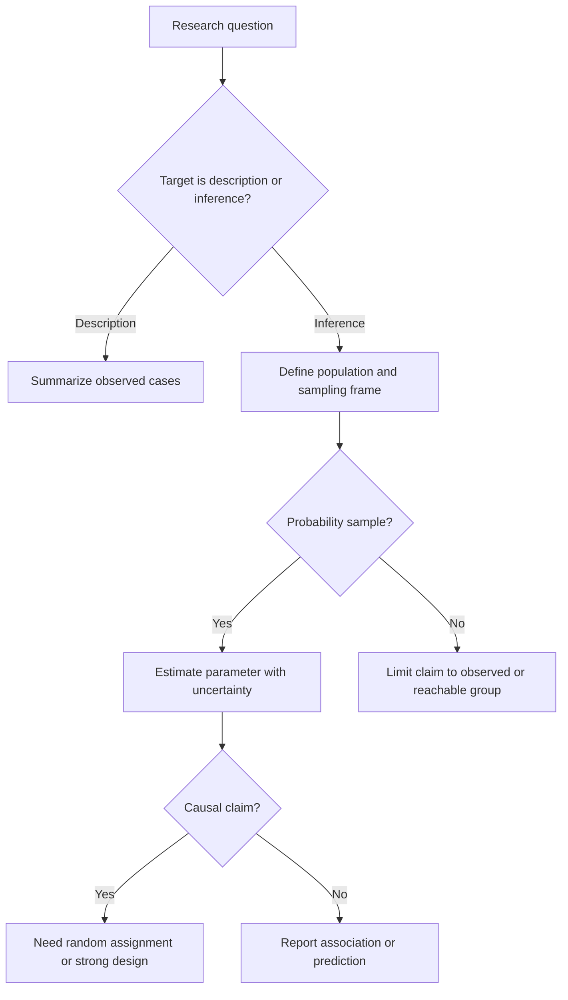

# Statistical Literacy and Data

Statistics is the discipline of learning from data. In the Lane text, the first chapter stresses two complementary meanings of the word: statistics can be numerical summaries, and statistics can also be the set of methods used to collect, display, analyze, interpret, and make decisions from data. A student who only learns formulas can compute impressive numbers and still miss the point if the data were poorly sampled, the variables were badly defined, or the conclusion goes beyond what the study design permits.


*Figure: Anscombe's quartet shows why visualization matters even when numerical summaries agree. Image: [Wikimedia Commons](https://commons.wikimedia.org/wiki/File:AnscombeQuartet.svg), Gabry, CC BY-SA 3.0.*

Statistical literacy begins before calculation. It asks what the cases are, what variable was measured on each case, whether the data describe a whole population or only a sample, and whether the study was designed for description, inference, prediction, or causal explanation. These distinctions support every later topic in this statistics section, from [graphing distributions](/math/statistics/graphing-distributions) through [hypothesis testing](/math/statistics/hypothesis-testing-logic).

## Definitions

A **case** or **observational unit** is the entity on which information is recorded: a person, school, county, clinical visit, manufactured part, or repeated trial. A **variable** is a recorded characteristic of a case. For example, in a study of first-year college students, each student is a case; high-school GPA, intended major, number of credits, and whether the student lives on campus are variables.

A **population** is the full collection of cases about which a question is asked. A **sample** is the subset of cases actually observed. The distinction matters because a sample statistic can be computed exactly from the sample, while a population parameter is usually unknown and must be estimated. If the population is "all currently enrolled students at one university," a sample of 300 students can support a narrower claim than a sample intended to represent all college students in the United States.

A **parameter** is a numerical feature of a population, such as the population mean $\mu$, population standard deviation $\sigma$, or population proportion $p$. A **statistic** is a numerical feature of a sample, such as the sample mean $\bar{x}$, sample standard deviation $s$, or sample proportion $\hat{p}$. Inferential statistics studies how sample statistics behave when samples are selected by a chance process.

**Descriptive statistics** summarize observed data: tables, graphs, means, medians, proportions, ranges, and standard deviations. **Inferential statistics** uses data from a sample to draw a quantified conclusion about a wider population or process. **Statistical literacy** is the practical habit of checking whether a statistical statement is meaningful, complete, and supported by the design that produced the data.

Variables are usually classified by both type and level of measurement. A **categorical variable** puts cases into groups; it may be nominal, such as blood type or political party, or ordinal, such as pain rating categories. A **quantitative variable** records a numerical amount. Quantitative variables may be discrete, such as the number of absences, or continuous, such as reaction time. The classic levels of measurement are nominal, ordinal, interval, and ratio. A ratio variable has a meaningful zero, so ratios such as "twice as long" make sense. An interval variable has meaningful differences but not necessarily meaningful ratios.

Sampling language must be precise. A **simple random sample** gives every possible sample of size $n$ the same chance of selection. A **stratified random sample** divides the population into known strata and samples within each stratum, often to preserve important population proportions. **Random assignment** is different: it assigns already selected participants to treatment conditions. Random sampling supports generalization; random assignment supports causal comparison.

## Key results

The first key result is not a formula but a chain of reasoning: good inference requires alignment between question, population, sampling frame, measurement, and analysis. If a survey asks only subscribers of a sports website about national health policy, the numerical summaries may be correct for the respondents but weak evidence about the nation. The validity problem is not fixed by a larger sample if the sampling mechanism remains biased.

For a categorical variable with $k$ categories, the sample proportion in category $j$ is

$$
\hat{p}_j = \frac{n_j}{n},
$$

where $n_j$ is the number of sampled cases in that category and $n$ is the total sample size. The proportions satisfy

$$
\sum_{j=1}^{k}\hat{p}_j = 1.
$$

For a quantitative variable, a common sample summary is the mean

$$
\bar{x} = \frac{1}{n}\sum_{i=1}^{n}x_i.
$$

This formula is descriptive when applied to the observed data. It becomes inferential only when the sample design justifies treating $\bar{x}$ as an estimate of an unknown population mean $\mu$.

Bias is systematic error in how data are generated or interpreted. Sampling bias occurs when some population members are more likely to appear in the sample than others in a way related to the variable of interest. Measurement bias occurs when the instrument or wording systematically pushes responses in one direction. Nonresponse bias occurs when those who do not respond differ from those who do. Confounding occurs when an apparent relationship between explanatory and response variables is mixed with the effect of another variable.

The core literacy rule is: association alone is not causation. To argue causation, a study needs temporal order, association, plausible mechanism, and serious attention to alternative explanations. Randomized experiments are especially powerful because random assignment tends to balance lurking variables across treatment groups, at least on average.

## Visual

| Concept | Typical notation | What is known exactly? | Main risk if confused |
|---|---:|---|---|
| Population mean | $\mu$ | Usually unknown | Claiming a sample average is exact for everyone |
| Sample mean | $\bar{x}$ | Known after data collection | Treating it as unbiased without checking sampling |
| Population proportion | $p$ | Usually unknown | Overstating a survey result |
| Sample proportion | $\hat{p}$ | Known after data collection | Ignoring margin of error |
| Random sampling | design feature | Selection probabilities | Generalizing from a biased sample |
| Random assignment | experiment feature | Treatment allocation | Confusing causation with representativeness |



## Worked example 1: Separating a sample statistic from a population claim

Problem: A campus newspaper surveys 80 students leaving the library at 9 p.m. on a Tuesday. The survey asks whether students support extending library hours. Sixty-eight students say yes. Identify the cases, variable, sample, possible population, sample proportion, and main limitation.

Method:

1. The cases are the 80 students who answered the survey.
2. The variable is support for extending library hours, a categorical yes/no variable.
3. The sample is the 80 students leaving the library at that time.
4. A possible target population is all students at the university, but the actual sampling frame is much narrower: students using the library on a Tuesday evening.
5. The sample proportion is

$$
\hat{p}=\frac{68}{80}=0.85.
$$

6. As a percentage, this is

$$
0.85 \times 100\% = 85\%.
$$

Answer: In the sample, 85% supported extended hours. That is a valid descriptive statistic for the observed respondents. It is not automatically strong evidence that 85% of all students support extended hours, because students leaving the library at night are likely to benefit more from longer hours than students who rarely use the library. A more defensible inference would require a sampling plan that reaches students across class years, majors, commuter status, and library-use patterns.

Checked answer: The arithmetic is correct because $68+12=80$ and $68/80=0.85$. The conclusion is checked by matching the sample source to the target population.

## Worked example 2: Choosing a measurement level and a summary

Problem: A health study records the following variables for 12 clinic patients: age in years, smoking status with categories current/former/never, pain rating on a 1 to 5 ordered scale, systolic blood pressure, and insurance plan name. Classify each variable and choose one appropriate summary.

Method:

1. Age in years is quantitative and ratio. A meaningful zero age exists, and ratios such as "twice as old" are meaningful for age measured from birth. A mean or median can summarize it.
2. Smoking status is categorical nominal if the categories are current, former, and never. There is not a single natural order that preserves equal spacing. A frequency table or set of proportions is appropriate.
3. Pain rating is categorical ordinal. The order from 1 to 5 matters, but the gap between 1 and 2 is not guaranteed to equal the gap between 4 and 5. A median or bar chart is safer than treating it as a precise interval measurement.
4. Systolic blood pressure is quantitative ratio. Differences and ratios are meaningful in physical units, although medical interpretation often focuses on thresholds. A mean, median, standard deviation, and histogram can be useful.
5. Insurance plan name is categorical nominal. Counts and proportions are appropriate.

Answer: The correct classifications are age: quantitative ratio; smoking: categorical nominal; pain rating: ordinal; systolic blood pressure: quantitative ratio; insurance plan: categorical nominal. The chosen summaries should respect those levels: means for genuine quantitative measurements, medians for ordinal scales, and counts or proportions for nominal categories.

Checked answer: The check is conceptual. If arithmetic operations on category labels would be meaningless, do not summarize with a mean. If order exists but equal spacing is doubtful, prefer ordinal summaries.

## Code

```python
import pandas as pd

df = pd.DataFrame({
    "age": [18, 19, 20, 21, 22, 24, 25, 27, 31, 34, 38, 41],
    "smoking": ["never", "never", "former", "never", "current", "former",
                "never", "current", "former", "never", "current", "former"],
    "pain": [1, 2, 2, 3, 4, 3, 1, 5, 4, 2, 3, 4],
    "systolic": [112, 118, 121, 119, 130, 126, 115, 138, 132, 120, 129, 135],
})

print(df["smoking"].value_counts(normalize=True).rename("proportion"))
print("median pain:", df["pain"].median())
print("mean systolic:", df["systolic"].mean())
print("sample size:", len(df))
```

This snippet deliberately mixes summaries: proportions for a nominal variable, a median for an ordinal rating, and a mean for a quantitative measurement. That habit prevents many early statistical mistakes.

## Common pitfalls

- Treating a statistic as a parameter. Write "85% of respondents" unless the sampling design justifies "85% of students."
- Confusing random sampling with random assignment. Sampling concerns who enters the study; assignment concerns which condition they receive.
- Using numerical summaries for arbitrary category codes. A mean of ZIP codes, jersey numbers, or insurance-plan IDs is not meaningful.
- Ignoring the population hidden in the question. A sample can be excellent for one population and useless for another.
- Assuming a large biased sample is better than a small careful one. Large biased samples can give very precise wrong answers.
- Making a causal claim from observational data without considering confounding, timing, and alternative explanations.

## Connections

- [Graphing distributions](/math/statistics/graphing-distributions)
- [Summarizing distributions](/math/statistics/summarizing-distributions)
- [Probability basics](/math/statistics/probability-basics)
- [Hypothesis testing logic](/math/statistics/hypothesis-testing-logic)
- [Effect size, nonparametric methods, and resampling](/math/statistics/effect-size-nonparametric-and-resampling)
