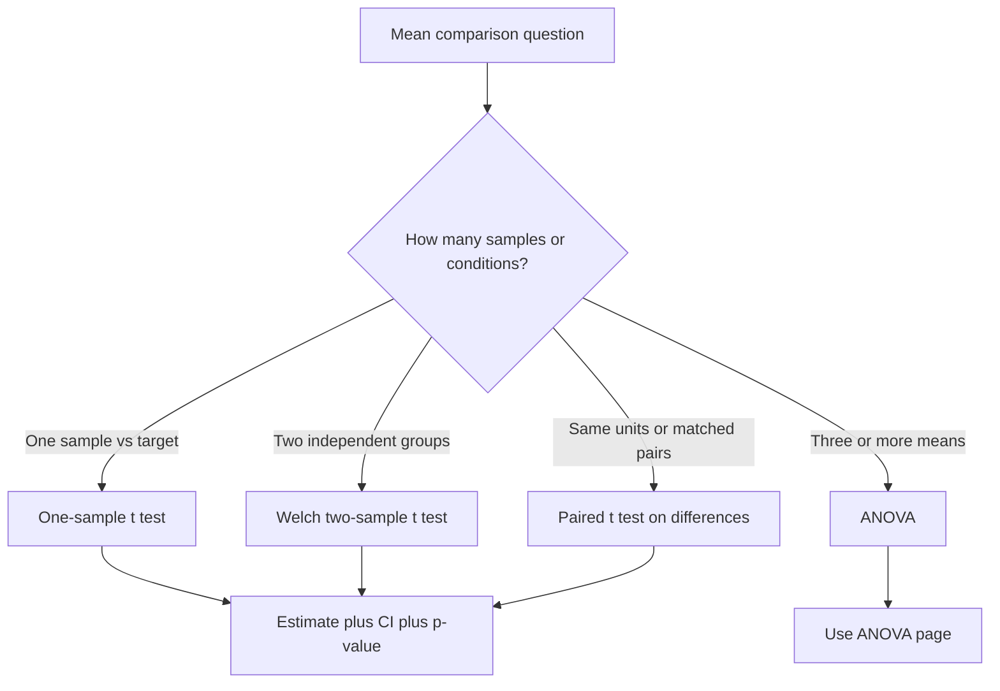

# Tests for Means

Tests for means compare observed sample means with null hypotheses about population means. They are among the most common procedures in introductory statistics because many variables are quantitative: reaction times, exam scores, blood pressure, monthly revenue, machine fill volume, and so on. The Lane text discusses tests of a single mean, independent-group differences, and correlated-pair differences as separate cases because the standard error changes with the design.

The central question is not simply how many means are being compared. It is whether observations are independent, paired, or grouped. A before-after study on the same people is not an independent two-sample study. A treatment-control comparison with different people in each group is not a paired study. Choosing the wrong test means choosing the wrong standard error, which changes the p-value and interval.

## Definitions

A **one-sample $t$ test** compares a sample mean $\bar{x}$ with a hypothesized population mean $\mu_0$:

$$
t=\frac{\bar{x}-\mu_0}{s/\sqrt{n}},
$$

with $df=n-1$ under the usual assumptions.

An **independent two-sample test** compares means from two unrelated groups. The Welch $t$ statistic is

$$
t=\frac{\bar{x}_1-\bar{x}_2-\Delta_0}
{\sqrt{s_1^2/n_1+s_2^2/n_2}},
$$

where $\Delta_0$ is the null difference, usually 0. Welch's test uses an approximate degrees of freedom formula and does not require equal variances.

A **pooled two-sample $t$ test** assumes equal population variances. It estimates a common variance by

$$
s_p^2=\frac{(n_1-1)s_1^2+(n_2-1)s_2^2}{n_1+n_2-2}.
$$

Because equal variances are often uncertain, Welch's test is a safer default in many applied settings.

A **paired $t$ test** compares two measurements taken on matched units or the same unit twice. Define differences

$$
d_i=x_{i,\text{after}}-x_{i,\text{before}}.
$$

Then test the mean difference with a one-sample $t$ test on the $d_i$ values:

$$
t=\frac{\bar{d}-\mu_{d,0}}{s_d/\sqrt{n}}.
$$

The usual null is $\mu_{d,0}=0$.

## Key results

The design determines the denominator. For a one-sample mean, the standard error is $s/\sqrt{n}$. For independent groups, the standard error combines two independent sources of variation:

$$
SE=\sqrt{\frac{s_1^2}{n_1}+\frac{s_2^2}{n_2}}.
$$

For paired data, the standard error uses the variability of differences:

$$
SE=\frac{s_d}{\sqrt{n}}.
$$

Pairing is useful when units differ substantially at baseline but within-unit changes are measured precisely. If each patient serves as their own control, the paired analysis removes some between-person variation.

Assumptions for $t$ procedures include independent sampling or independent pairs, quantitative response data, and a sampling distribution of the mean or mean difference that is approximately normal. For small samples, the raw data or differences should not show severe skewness or extreme outliers. For large samples, the central limit theorem makes $t$ methods more robust, though dependence and biased sampling remain serious problems.

A test for means should usually be accompanied by a confidence interval and an effect size. A statistically significant difference of 0.2 points on a 100-point scale may be unimportant; a non-significant difference of 8 points in a small pilot study may still be practically promising.

The same sample summaries can lead to different conclusions when the research question changes. If the goal is quality control, a one-sample test may compare a process mean with a fixed target. If the goal is a treatment comparison, an independent or paired design determines the analysis. If the goal is equivalence or noninferiority, the null and alternative are reversed from the usual "no difference" test, and a standard two-sided significance test is not enough. For introductory work, the main discipline is to write the parameter and hypotheses in words before calculating. That step exposes whether the mean, mean difference, or paired mean difference is really the quantity of interest.

Graphical checks should use the unit of analysis. For paired data, graph the differences, not just the two marginal distributions before and after. For independent groups, compare group histograms or box plots and look for severe imbalance in spread, skewness, or outliers. These checks do not replace the test, but they explain whether the test is summarizing the data in a defensible way.

## Visual



| Design | Data structure | Statistic | Degrees of freedom |
|---|---|---|---|
| One-sample | one quantitative variable | $(\bar{x}-\mu_0)/(s/\sqrt{n})$ | $n-1$ |
| Independent groups | separate groups | Welch $t$ | approximate |
| Equal-variance groups | separate groups | pooled $t$ | $n_1+n_2-2$ |
| Paired | differences within pairs | $\bar{d}/(s_d/\sqrt{n})$ | $n-1$ pairs |

## Worked example 1: Welch two-sample test

Problem: A study compares weekly exercise minutes for two independent groups. Group A has $n_1=18$, $\bar{x}_1=142$, and $s_1=35$. Group B has $n_2=20$, $\bar{x}_2=118$, and $s_2=30$. Test at $\alpha=0.05$ whether the population means differ.

Method:

1. State hypotheses:

$$
H_0:\mu_A-\mu_B=0,
$$

$$
H_A:\mu_A-\mu_B\ne0.
$$

2. Difference in sample means:

$$
\bar{x}_1-\bar{x}_2=142-118=24.
$$

3. Welch standard error:

$$
SE=\sqrt{\frac{35^2}{18}+\frac{30^2}{20}}
=\sqrt{\frac{1225}{18}+\frac{900}{20}}.
$$

4. Compute components:

$$
\frac{1225}{18}=68.06,\quad \frac{900}{20}=45.
$$

5. Continue:

$$
SE=\sqrt{68.06+45}=\sqrt{113.06}=10.63.
$$

6. Test statistic:

$$
t=\frac{24}{10.63}=2.26.
$$

7. Welch degrees of freedom are approximate. Software gives about $df=34$ for these values.
8. The two-sided p-value for $t=2.26$ with about 34 degrees of freedom is about 0.030.

Answer: Reject $H_0$ at the 0.05 level. The data provide evidence that the population mean weekly exercise minutes differ, with Group A higher by about 24 minutes in the sample.

Checked answer: The standard error is about 10.6, so the observed difference is a little more than two standard errors from zero, consistent with a p-value below 0.05.

## Worked example 2: Paired test on before-after data

Problem: Eight participants complete a memory task before and after a training session. Scores are:

| Participant | Before | After |
|---|---:|---:|
| 1 | 18 | 22 |
| 2 | 20 | 23 |
| 3 | 17 | 19 |
| 4 | 21 | 24 |
| 5 | 19 | 21 |
| 6 | 16 | 20 |
| 7 | 22 | 25 |
| 8 | 18 | 20 |

Test whether mean score improved.

Method:

1. Compute differences after minus before:

$$
4,\ 3,\ 2,\ 3,\ 2,\ 4,\ 3,\ 2.
$$

2. Mean difference:

$$
\bar{d}=\frac{4+3+2+3+2+4+3+2}{8}=\frac{23}{8}=2.875.
$$

3. Deviations from 2.875 are $1.125,0.125,-0.875,0.125,-0.875,1.125,0.125,-0.875$.
4. Squared deviations sum to

$$
1.2656+0.0156+0.7656+0.0156+0.7656+1.2656+0.0156+0.7656=4.875.
$$

5. Sample variance of differences:

$$
s_d^2=\frac{4.875}{7}=0.6964.
$$

6. Standard deviation:

$$
s_d=\sqrt{0.6964}=0.8345.
$$

7. Standard error:

$$
SE=\frac{0.8345}{\sqrt{8}}=0.2950.
$$

8. Test statistic for $H_0:\mu_d=0$ versus $H_A:\mu_d\gt 0$:

$$
t=\frac{2.875}{0.2950}=9.75.
$$

9. Degrees of freedom:

$$
df=8-1=7.
$$

Answer: The improvement is statistically significant by any common significance level. The paired structure shows a consistent positive gain for every participant, with mean improvement 2.875 points.

Checked answer: Because all eight differences are positive and tightly clustered between 2 and 4, a very large $t$ statistic is plausible.

## Code

```python
import numpy as np
from scipy import stats

# Welch two-sample test from summaries
t_stat, p_value = stats.ttest_ind_from_stats(
    mean1=142, std1=35, nobs1=18,
    mean2=118, std2=30, nobs2=20,
    equal_var=False,
)
print(f"Welch t = {t_stat:.3f}, p = {p_value:.4f}")

# Paired test from raw before-after scores
before = np.array([18, 20, 17, 21, 19, 16, 22, 18])
after = np.array([22, 23, 19, 24, 21, 20, 25, 20])
diff = after - before
print("mean difference:", diff.mean())
print(stats.ttest_rel(after, before, alternative="greater"))
```

The independent-group call uses only summary statistics; the paired call uses raw paired scores. That distinction mirrors the design distinction in the formulas.

## Common pitfalls

- Using an independent two-sample test for paired before-after data.
- Using a paired test for two unrelated groups because the sample sizes happen to match.
- Assuming non-significance proves equal means.
- Choosing the pooled test without checking whether equal variances are plausible.
- Ignoring outliers in small samples, where a single value can dominate the mean and standard deviation.
- Reporting the p-value without the observed mean difference and confidence interval.

## Connections

- [Estimation and confidence intervals](/math/statistics/estimation-and-confidence-intervals)
- [Hypothesis testing logic](/math/statistics/hypothesis-testing-logic)
- [ANOVA](/math/statistics/anova)
- [Effect size, nonparametric methods, and resampling](/math/statistics/effect-size-nonparametric-and-resampling)
- [Sampling distributions and the central limit theorem](/math/statistics/sampling-distributions-and-clt)
