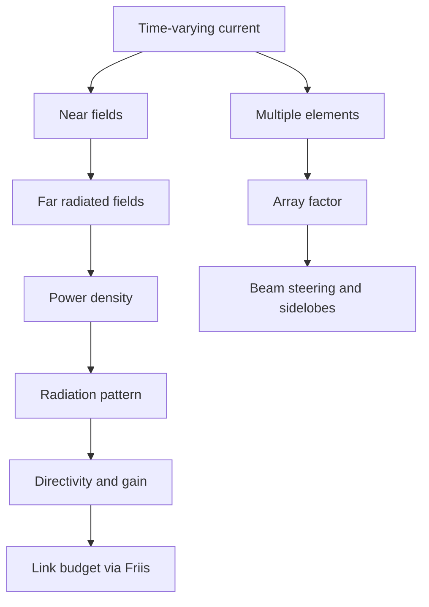

# Antennas, Radiation, and Arrays

Antennas convert guided electromagnetic energy into radiated waves and convert incoming waves into terminal voltages and currents. A transmitting antenna is not just a wire carrying current; it is a current distribution arranged so that time-varying fields detach and carry power into space. A receiving antenna samples the incoming field and delivers power to a load according to its effective area and polarization match.

Ulaby's antenna chapter develops the Hertzian dipole, half-wave dipole, radiation characteristics, Friis transmission, large apertures, and arrays. These topics are a practical culmination of Maxwell's equations, plane waves, power density, and boundary/guiding ideas from earlier pages.

## Definitions

The radiation pattern describes angular variation of radiated field or power. For a far-zone field, power density often has the form

$$
\langle S(r,\theta,\phi)\rangle=\frac{P_{\mathrm{rad}}}{4\pi r^2}F(\theta,\phi)
$$

with a normalized pattern factor. Directivity is

$$
D=\frac{4\pi U_{\max}}{P_{\mathrm{rad}}},
$$

where $U=r^2\langle S\rangle$ is radiation intensity in W/sr. Gain includes efficiency:

$$
G=\eta_{\mathrm{rad}}D.
$$

Radiation resistance is the equivalent resistance that would dissipate the radiated power for the same antenna current:

$$
P_{\mathrm{rad}}=\frac{1}{2}R_r|I_0|^2
$$

when $I_0$ is peak current.

For a Hertzian dipole of length $l\ll\lambda$, the far electric field has angular dependence

$$
E_\theta\propto \frac{I_0l}{r}\sin\theta.
$$

The pattern is maximum broadside to the dipole and zero along the dipole axis.

The effective area of a receiving antenna is related to gain by

$$
A_e=\frac{\lambda^2G}{4\pi}.
$$

Friis transmission formula for aligned polarization and matched antennas is

$$
P_r=P_tG_tG_r\left(\frac{\lambda}{4\pi R}\right)^2.
$$

For a uniform linear array, the total pattern is often written as

$$
\text{total pattern}=(\text{element pattern})(\text{array factor}).
$$

The far-field region is the region where angular field distribution is essentially independent of range and the radiated fields locally resemble plane waves. A common large-antenna estimate is

$$
R_{\mathrm{ff}}\gtrsim \frac{2D^2}{\lambda},
$$

where $D$ is the largest antenna dimension. Small dipoles may enter the far-field regime at shorter distances, but aperture antennas and arrays require care because their physical size can be many wavelengths.

## Key results

The far field of a small current element falls as $1/r$, not $1/r^2$. Its power density falls as $1/r^2$ because it is proportional to field magnitude squared. Near-field terms fall faster and store energy around the antenna, but the far-field term carries net radiated power.

Beamwidth describes the angular width of the main lobe, often measured between half-power points. Sidelobes are secondary maxima. Directivity increases when radiation is concentrated into a smaller angular region, but high directivity usually requires an antenna electrically larger than a wavelength or an array/aperture.

A half-wave dipole is a practical resonant antenna with directivity about $1.64$ (2.15 dBi) and radiation resistance about $73\ \Omega$ in free space. A quarter-wave monopole above a perfect ground plane behaves like half of a dipole plus its image; it has half the radiation resistance of the corresponding dipole and radiates into half-space.

Arrays control direction by phase. For $N$ isotropic elements spaced $d$ along $z$ with progressive phase $\alpha$, the array factor is

$$
AF(\theta)=\sum_{n=0}^{N-1}e^{jn(kd\cos\theta+\alpha)}.
$$

The main beam occurs approximately when

$$
kd\cos\theta_0+\alpha=0.
$$

Therefore electronic steering can be achieved by changing $\alpha$ without mechanically rotating the antenna. To avoid grating lobes over wide scan angles, element spacing is commonly kept at or below about $\lambda/2$.

Aperture antennas connect physical area to gain. For an aperture with effective area $A_e$, gain is

$$
G=\frac{4\pi A_e}{\lambda^2}.
$$

The effective area is smaller than the physical area when illumination is tapered, spillover occurs, polarization is mismatched, or losses are present. This relation explains why a fixed-size dish has higher gain at higher frequency, provided surface accuracy and pointing remain adequate.

Receiving and transmitting patterns are related by reciprocity for passive linear antennas in reciprocal media. The same antenna that forms a narrow transmit beam from a feed also has high receive sensitivity from that direction. This symmetry is why link budgets can use gain for either end of the link without separate transmit and receive theories.

Radiation efficiency separates useful radiation from loss. A small antenna can have low radiation resistance while conductor, dielectric, or matching-network losses remain significant. Even if such an antenna is impedance matched at its terminals, much of the accepted power may become heat rather than radiated power. Matching quality and radiation efficiency are therefore different performance measures.

Antenna polarization is part of the pattern. A field pattern can have co-polarized and cross-polarized components, and receiving systems care about both. Satellite links, radar polarimetry, and wireless systems often specify polarization to reduce interference or extract information about scattering targets.

Input impedance is the terminal view of the same radiating structure. At resonance the reactive part may be small, making matching easier, but the resistance includes both radiation resistance and loss resistance. A good antenna design therefore checks the field pattern, polarization, gain, efficiency, and feed match together. Optimizing only $S_{11}$ can produce a well-matched heater rather than an effective radiator.

## Visual



| Antenna concept | Meaning | Key formula |
|---|---|---|
| Directivity | concentration of radiation | $D=4\pi U_{\max}/P_{\mathrm{rad}}$ |
| Gain | directivity with efficiency | $G=\eta_{\mathrm{rad}}D$ |
| Effective area | receiving aperture equivalent | $A_e=\lambda^2G/(4\pi)$ |
| Friis link | received power in free space | $P_r=P_tG_tG_r(\lambda/4\pi R)^2$ |
| Array steering | phase-controlled main beam | $kd\cos\theta_0+\alpha=0$ |

## Worked example 1: Friis received power

Problem: A transmitter radiates $P_t=10$ W at $f=2.4$ GHz with gain $G_t=6$ dBi. A receiver $R=100$ m away has gain $G_r=2$ dBi. Assume free-space propagation and polarization match. Find received power in watts and dBm.

Step 1: Convert gains from dBi to linear:

$$
G_t=10^{6/10}=3.981,\qquad
G_r=10^{2/10}=1.585.
$$

Step 2: Wavelength:

$$
\lambda=\frac{c}{f}=\frac{3.0\times10^8}{2.4\times10^9}=0.125\ \mathrm{m}.
$$

Step 3: Free-space factor:

$$
\left(\frac{\lambda}{4\pi R}\right)^2
=\left(\frac{0.125}{4\pi(100)}\right)^2.
$$

The inner ratio is

$$
\frac{0.125}{1256.6}=9.95\times10^{-5}.
$$

Squaring gives

$$
9.90\times10^{-9}.
$$

Step 4: Friis formula:

$$
P_r=10(3.981)(1.585)(9.90\times10^{-9})
=6.25\times10^{-7}\ \mathrm{W}.
$$

Step 5: Convert to dBm:

$$
P_{\mathrm{dBm}}=10\log_{10}\left(\frac{P_r}{1\ \mathrm{mW}}\right)
=10\log_{10}(6.25\times10^{-4})
=-32.0\ \mathrm{dBm}.
$$

Check: A sub-microwatt received power at 100 m is plausible for this frequency and modest gains.

## Worked example 2: Steering a two-element array

Problem: Two identical elements are spaced $d=\lambda/2$ along the $z$ axis. Find the progressive phase $\alpha$ needed to steer the main beam to $\theta_0=60^\circ$ from the $+z$ axis.

Step 1: Use the main-beam condition:

$$
kd\cos\theta_0+\alpha=0.
$$

Step 2: Compute $kd$:

$$
k=\frac{2\pi}{\lambda},\qquad d=\frac{\lambda}{2}
\quad\Rightarrow\quad
kd=\pi.
$$

Step 3: Compute $\cos60^\circ=0.5$:

$$
kd\cos\theta_0=\pi(0.5)=\frac{\pi}{2}.
$$

Step 4: Solve for progressive phase:

$$
\alpha=-\frac{\pi}{2}=-90^\circ.
$$

Step 5: Interpret: each successive element along $+z$ must lag the previous element by $90^\circ$ for the maximum to occur at $\theta=60^\circ$.

Check: If $\alpha=0$, the beam is broadside at $\theta=90^\circ$ for this coordinate convention, so a negative phase shifts the beam toward smaller $\theta$.

## Code

```python
import numpy as np
import matplotlib.pyplot as plt

theta = np.linspace(0, np.pi, 1000)
N = 8
d_over_lambda = 0.5
theta0 = np.deg2rad(60)
kd = 2 * np.pi * d_over_lambda
alpha = -kd * np.cos(theta0)

n = np.arange(N)
AF = np.zeros_like(theta, dtype=complex)
for i, th in enumerate(theta):
    AF[i] = np.sum(np.exp(1j * n * (kd * np.cos(th) + alpha)))

AF_db = 20 * np.log10(np.abs(AF) / np.max(np.abs(AF)) + 1e-12)
plt.plot(np.rad2deg(theta), AF_db)
plt.ylim(-40, 0)
plt.xlabel("theta (degrees)")
plt.ylabel("array factor (dB)")
plt.grid(True)
plt.show()
```

## Common pitfalls

- Mixing dB and linear gain in Friis formula. Convert dBi to linear unless using the full dB link equation.
- Forgetting polarization mismatch. Friis assumes compatible polarization.
- Applying far-field formulas too close to an antenna. Near-field terms and aperture size matter.
- Confusing directivity and gain. Gain includes radiation efficiency; directivity is purely pattern concentration.
- Assuming a larger array always improves every direction. It narrows beams but also creates sidelobe and grating-lobe design issues.
- Using array steering formulas without stating the coordinate convention for $\theta$ and element indexing.
- Comparing antenna gains without checking whether values are dBi, dBd, or linear ratios.

## Connections

- [Plane waves, loss, polarization, and power](/physics/electromagnetics/plane-waves-lossless-lossy-polarization) for far-field wave and Poynting vector concepts.
- [Maxwell equations for time-varying fields](/physics/electromagnetics/maxwell-equations-time-varying-fields) for radiation as a consequence of time-varying currents.
- [Reflection, transmission, fibers, and waveguides](/physics/electromagnetics/reflection-transmission-fibers-waveguides) for aperture and guided-wave connections.
- [Radar, satellite links, and remote sensing](/physics/electromagnetics/radar-satellite-remote-sensing) for link budgets and radar range equations.
