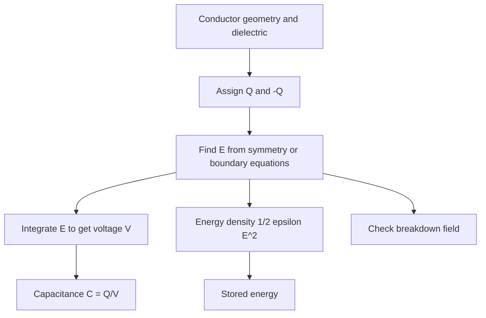

# Capacitance, Energy, and Image Method

Capacitance is the ability of a conductor arrangement to store charge for a given voltage difference. Its value depends only on geometry and material permittivity for linear electrostatic systems. In circuit diagrams a capacitor is a lumped element, but in electromagnetics it is a field configuration: charge on conductors creates $\vec E$, the field stores energy, and the potential difference is a line integral of that field.

The image method is a different but related tool. Conducting planes and spheres impose equipotential boundary conditions that can sometimes be satisfied by replacing the conductor with fictitious image charges. The field in the physical region is then computed with ordinary Coulomb methods. This page brings together capacitance, electrostatic energy, dielectric breakdown, and image-charge reasoning.

## Definitions

Capacitance is

$$
C=\frac{Q}{V},
$$

where $Q$ is the magnitude of charge on one conductor and $V$ is the potential difference between conductors. For a parallel-plate capacitor with plate area $A$, separation $d$, and uniform dielectric,

$$
C=\frac{\epsilon A}{d}
$$

when fringing is negligible.

For a coaxial capacitor or transmission line section of length $l$, inner radius $a$, outer conductor inner radius $b$, and dielectric $\epsilon$,

$$
C=\frac{2\pi\epsilon l}{\ln(b/a)},\qquad
C'=\frac{2\pi\epsilon}{\ln(b/a)}.
$$

Electrostatic energy stored in a capacitor is

$$
W_e=\frac{1}{2}CV^2=\frac{Q^2}{2C}=\frac{1}{2}QV.
$$

The field energy density in a linear dielectric is

$$
w_e=\frac{1}{2}\vec E\cdot\vec D=\frac{1}{2}\epsilon E^2.
$$

Total stored energy is

$$
W_e=\int_V \frac{1}{2}\epsilon E^2\,dv.
$$

Dielectric breakdown occurs when $\vert \vec E\vert $ exceeds the material's breakdown strength, causing conduction or irreversible damage.

Capacitance is always positive for a passive two-conductor system, even though one conductor carries $+Q$ and the other $-Q$. The sign is handled by defining $Q$ as the magnitude of charge and $V$ as the magnitude of the potential difference in $C=Q/V$. In multi-conductor systems, capacitance becomes a matrix because each conductor's charge can depend on several conductor voltages.

Real capacitors also have limits not present in the ideal electrostatic definition. Conductors have resistance, dielectrics have loss tangent and breakdown strength, and geometry has fringing. The ideal formulas are still essential because they provide the baseline field distribution and scaling before corrections, safety factors, and manufacturing constraints are added.

## Key results

The standard capacitance workflow is:

1. Assume charges $+Q$ and $-Q$ on conductors.
2. Use symmetry, Gauss's law, or a boundary-value solution to find $\vec E$.
3. Compute voltage difference:

$$
V=-\int_{\text{negative conductor}}^{\text{positive conductor}}\vec E\cdot d\vec l
$$

with sign handled consistently.

4. Form $C=Q/V$.

For a spherical capacitor with inner radius $a$ and outer radius $b$,

$$
C=\frac{4\pi\epsilon ab}{b-a}.
$$

For an isolated conducting sphere of radius $a$, take $b\to\infty$:

$$
C=4\pi\epsilon a.
$$

The image method for a point charge $q$ at height $d$ above an infinite grounded conducting plane replaces the conductor by an image charge $-q$ at height $-d$. In the region above the plane, the potential is

$$
V(\vec r)=\frac{1}{4\pi\epsilon}
\left(\frac{q}{R_+}-\frac{q}{R_-}\right),
$$

where $R_+$ is distance to the real charge and $R_-$ is distance to the image charge. On the plane, the distances are equal, so $V=0$, satisfying the grounded boundary condition.

The force on the real charge equals the Coulomb force from the image charge:

$$
F=\frac{q^2}{16\pi\epsilon d^2}
$$

directed toward the conducting plane.

The uniqueness theorem justifies the image method. If a proposed potential satisfies Poisson or Laplace equation in the physical region and satisfies all boundary conditions, then it is the unique solution in that region. The image charges do not need to represent the actual charge distribution inside the conductor; they only need to create the correct potential on the boundary and the correct singularities in the region where the solution is desired.

Energy can be used to compute forces in capacitor systems. If voltage is held fixed by a source, the mechanical force direction may be found from how capacitance changes with geometry, but the energy bookkeeping must include the source. If charge is held fixed on isolated conductors, $W=Q^2/(2C)$ is the relevant stored energy. Confusing fixed-voltage and fixed-charge conditions can give the wrong force sign.

Capacitance matrices extend the two-conductor idea to interconnects and sensors. For several conductors, the charge on conductor $i$ can be written as a linear combination of conductor voltages. Diagonal terms describe how much charge conductor $i$ stores relative to the reference, while off-diagonal terms describe electrostatic coupling to neighbors. Crosstalk in high-speed circuits and sensitivity in capacitive touch sensors both depend on these mutual capacitances.

In numerical electrostatics, capacitance is often extracted by setting one conductor to a known voltage, grounding the others, solving Laplace's equation, and integrating $\vec D\cdot d\vec S$ over conductor surfaces. This is the computational version of the analytical workflow used for parallel plates, coaxial lines, and spheres.

Energy density also reveals where breakdown risk is concentrated. Since $w_e=\frac{1}{2}\epsilon E^2$, high-field regions dominate stored energy and electrical stress. Edges, corners, voids in dielectrics, and material interfaces can raise the local field well above the average value $V/d$. Practical insulation design therefore uses field grading, rounded electrodes, layered dielectrics, and safety margins rather than relying only on average plate spacing.

The image method has a similar limitation: it gives exact fields only for geometries with boundaries that the image charges satisfy exactly. Infinite planes and certain spheres work beautifully. Finite plates, slots, layered dielectrics, and nearby grounded objects usually require approximate or numerical methods.

For any capacitance result, two limiting checks are useful. Increasing conductor area or permittivity should increase capacitance, while increasing separation should decrease it. If a formula fails these monotonic checks, the voltage integral or logarithmic geometry factor should be reexamined before using the result in an energy or breakdown calculation.

## Visual



ASCII image-charge sketch:

```text
        real region (z > 0)

             +q
              |
              | d
==============+============== grounded conducting plane, V = 0
              | d
              |
             -q       image charge, not physically present
```

## Worked example 1: Coaxial capacitance per unit length

Problem: A coaxial structure has inner radius $a=1$ mm, outer conductor inner radius $b=5$ mm, and dielectric $\epsilon_r=2.25$. Find capacitance per unit length.

Step 1: Use the coaxial capacitance formula:

$$
C'=\frac{2\pi\epsilon}{\ln(b/a)}.
$$

Step 2: Compute permittivity:

$$
\epsilon=\epsilon_r\epsilon_0=2.25(8.854\times10^{-12})
=1.992\times10^{-11}\ \mathrm{F/m}.
$$

Step 3: Compute the logarithmic ratio:

$$
\ln(b/a)=\ln(5/1)=\ln 5=1.609.
$$

Step 4: Substitute:

$$
C'=\frac{2\pi(1.992\times10^{-11})}{1.609}
=7.78\times10^{-11}\ \mathrm{F/m}.
$$

Answer:

$$
C'=77.8\ \mathrm{pF/m}.
$$

Check: Coaxial cables commonly have capacitance on the order of tens to hundreds of pF/m, so the result is reasonable.

## Worked example 2: Image force on a charge above a ground plane

Problem: A charge $q=2\ \mathrm{nC}$ is located $d=4$ cm above an infinite grounded conducting plane in air. Find the magnitude and direction of the force on the charge.

Step 1: Replace the grounded plane by an image charge $-q$ the same distance below the plane. The separation between real and image charges is

$$
R=2d=0.08\ \mathrm{m}.
$$

Step 2: Use Coulomb's law for the force magnitude:

$$
F=\frac{1}{4\pi\epsilon_0}\frac{q^2}{R^2}.
$$

Step 3: Substitute values:

$$
F=8.99\times10^9
\frac{(2\times10^{-9})^2}{(0.08)^2}.
$$

Step 4: Compute:

$$
(2\times10^{-9})^2=4\times10^{-18},\qquad
(0.08)^2=6.4\times10^{-3}.
$$

$$
F=8.99\times10^9(6.25\times10^{-16})
=5.62\times10^{-6}\ \mathrm{N}.
$$

Step 5: Direction is toward the image charge, hence downward toward the conducting plane.

Check: The equivalent compact formula gives $q^2/(16\pi\epsilon_0d^2)$, which is the same because $R=2d$.

## Code

```python
import numpy as np

eps0 = 8.8541878128e-12

def coax_cap_per_m(a, b, eps_r=1.0):
    return 2 * np.pi * eps0 * eps_r / np.log(b / a)

def image_force(q, d, eps_r=1.0):
    eps = eps0 * eps_r
    return q**2 / (16 * np.pi * eps * d**2)

print("C' =", coax_cap_per_m(1e-3, 5e-3, 2.25), "F/m")
print("image force =", image_force(2e-9, 0.04), "N")
```

## Common pitfalls

- Computing capacitance with the peak electric field instead of the conductor voltage difference.
- Forgetting fringing fields when plate separation is not small compared with plate dimensions.
- Using $W=CV^2$ instead of $W=\frac{1}{2}CV^2$.
- Treating image charges as real charges in the conductor. They are a mathematical device valid only in the physical region of interest.
- Applying a grounded-plane image solution to an isolated ungrounded conductor without checking the boundary condition.
- Ignoring dielectric breakdown after computing capacitance. A design can have the desired capacitance but fail at the required voltage.
- Using image methods after adding dielectric interfaces or finite conductor edges without rechecking the boundary conditions.

## Connections

- [Electrostatic fields and potential](/physics/electromagnetics/electrostatic-fields-and-potential) for potential and field integrals.
- [Gauss law, dielectrics, and boundaries](/physics/electromagnetics/gauss-law-dielectrics-and-boundaries) for conductor and dielectric boundary conditions.
- [Transmission-line models and wave equations](/physics/electromagnetics/transmission-line-models-and-wave-equations) for capacitance per unit length in distributed lines.
- [General electromagnetism](/physics/general/) for introductory capacitor concepts.
