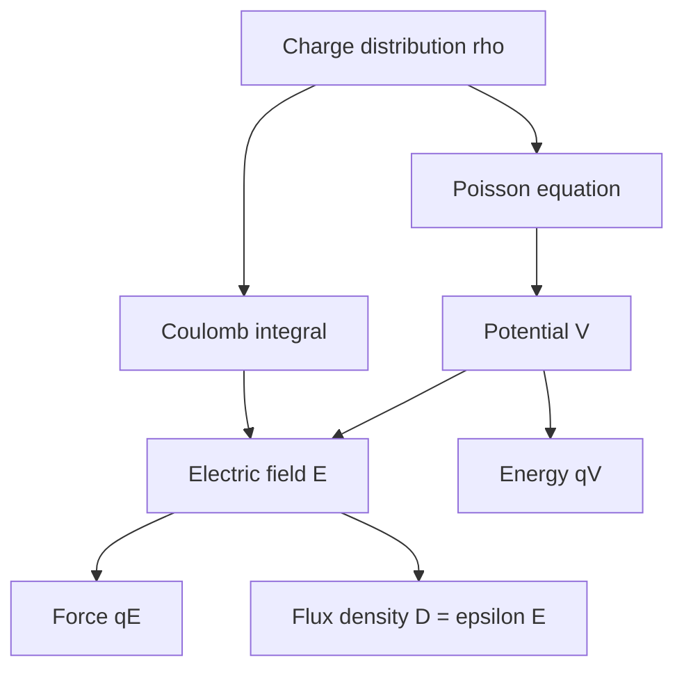

# Electrostatic Fields and Potential

Electrostatics studies electric fields produced by stationary charge distributions. It is a special case of Maxwell's equations in which fields do not vary with time and magnetic induction is absent from the electric-field equation. The central objects are charge density, electric field intensity $\vec E$, electric flux density $\vec D$, scalar potential $V$, and the force on charge.

The value of electrostatics is larger than "charges at rest." Capacitance, insulation design, electrostatic sensors, semiconductor depletion regions, and many boundary-value methods all begin here. Later, time-varying electromagnetics keeps the same electric field concepts but couples them to magnetic fields through Faraday's law and the displacement current.


*Figure: Dipole field lines make superposition, potential gradients, and boundary intuition visible. Image: [Wikimedia Commons](https://commons.wikimedia.org/wiki/File:VFPt_dipoles_electric.svg), Geek3, CC BY-SA 4.0.*

## Definitions

Charge can be modeled in several idealized ways:

$$
Q=\int_L \rho_l\,dl,\qquad
Q=\int_S \rho_s\,dS,\qquad
Q=\int_V \rho_v\,dv,
$$

where $\rho_l$ is line charge density in C/m, $\rho_s$ is surface charge density in C/m$^2$, and $\rho_v$ is volume charge density in C/m$^3$.

Coulomb's law for the force on $q_2$ due to $q_1$ is

$$
\vec F_{12}=\frac{q_1q_2}{4\pi\epsilon R^2}\hat R,
$$

where $\vec R=\vec r_2-\vec r_1$ points from $q_1$ to $q_2$. The electric field is force per unit test charge:

$$
\vec E=\frac{\vec F}{q}.
$$

For a point charge $q$ at the origin in a homogeneous medium,

$$
\vec E=\frac{q}{4\pi\epsilon r^2}\hat r.
$$

For many point charges,

$$
\vec E(\vec r)=\sum_n \frac{q_n}{4\pi\epsilon R_n^2}\hat R_n.
$$

For continuous charge,

$$
\vec E(\vec r)=\int \frac{\rho(\vec r')}{4\pi\epsilon R^2}\hat R\,d\ell',\ dS',\ \text{or}\ dv',
$$

with the proper density and source element.

Electric potential difference is related to the field by

$$
V_{ab}=V(a)-V(b)=-\int_b^a \vec E\cdot d\vec l.
$$

If the reference is infinity, the potential of a point charge is

$$
V(r)=\frac{q}{4\pi\epsilon r}.
$$

The electrostatic field is conservative:

$$
\nabla\times\vec E=0,\qquad \vec E=-\nabla V.
$$

The zero-curl statement has an important qualification: it holds for electrostatics, not for time-varying magnetic fields. Once $\partial\vec B/\partial t$ is nonzero, Faraday's law gives $\nabla\times\vec E=-\partial\vec B/\partial t$, and a single-valued scalar potential is not enough to describe the entire electric field. Electrostatic potential methods are therefore powerful but belong to the static limit or to quasistatic cases where induction is negligible.

## Key results

The superposition principle is the workhorse of electrostatics. Because the governing equations are linear in charge and field for ordinary media with constant $\epsilon$, fields and potentials from separate sources add. It is often easier to add scalar potentials and then take a gradient than to add vector fields directly:

$$
V(\vec r)=\int \frac{\rho(\vec r')}{4\pi\epsilon R}\,dv',
\qquad
\vec E=-\nabla V.
$$

For electrostatics in a homogeneous region,

$$
\nabla\cdot\vec D=\rho_v,\qquad \vec D=\epsilon\vec E.
$$

Combining this with $\vec E=-\nabla V$ gives Poisson's equation:

$$
\nabla^2V=-\frac{\rho_v}{\epsilon}.
$$

In charge-free regions, it reduces to Laplace's equation:

$$
\nabla^2V=0.
$$

Potential energy of a point charge in a potential is

$$
W=qV.
$$

The work done by the field moving charge $q$ from $a$ to $b$ is

$$
W_{\text{field}}=q[V(a)-V(b)].
$$

This sign convention is a common source of confusion. A positive charge naturally moves toward lower potential because its potential energy decreases.

The electric dipole is a useful far-field approximation for two equal and opposite charges separated by small distance. Its moment is

$$
\vec p=q\vec d,
$$

directed from negative to positive charge. Far from the dipole, the potential falls as $1/r^2$ rather than $1/r$, because the net charge is zero.

Potential is often the better design variable because conductor surfaces in electrostatic equilibrium are equipotentials. If the conductor voltages are known, a boundary-value problem for $V$ can be solved first, then $\vec E=-\nabla V$ gives the field. This sequence is used in capacitance extraction, insulation grading, electrostatic shielding, and semiconductor device approximations. The field is the physically force-producing quantity, but the potential is frequently the simpler mathematical unknown.

Dimensional checking is especially helpful in Coulomb integrals. A line charge contribution $\rho_l dl/(4\pi\epsilon R^2)$ has units of V/m after multiplying by $\hat R$, while a potential contribution $\rho_l dl/(4\pi\epsilon R)$ has units of volts. If a result for electric field scales as $1/R$ for an isolated point charge, or a result for potential scales as $1/R^2$, the integration or geometry has likely been mixed up.

The choice between field-first and potential-first methods is usually dictated by symmetry. If the vector directions from all source elements combine simply, a direct $\vec E$ integral is efficient. If directions vary but distances are simple, a scalar potential integral may be shorter. If conductor boundaries are specified by voltages, solving for $V$ is usually the natural route.

Electrostatic uniqueness is a powerful checking principle. If the potential satisfies the governing equation in the region and satisfies the specified conductor potentials or surface-charge conditions, then no second different electrostatic solution exists for the same problem. This is why boundary-value solutions can be trusted even when the intermediate mathematics looks indirect.

## Visual



| Source type | Density | Charge element | Typical symmetry |
|---|---:|---:|---|
| Point charge | $q$ | discrete | spherical |
| Line charge | $\rho_l$ | $\rho_l dl$ | cylindrical |
| Surface charge | $\rho_s$ | $\rho_s dS$ | planar or shell |
| Volume charge | $\rho_v$ | $\rho_v dv$ | bulk region |

## Worked example 1: Field of two point charges on an axis

Problem: Charges $q_1=4\ \mathrm{nC}$ at $x=0$ and $q_2=-1\ \mathrm{nC}$ at $x=3$ cm are in free space. Find $\vec E$ at $x=6$ cm.

Step 1: The observation point is to the right of both charges. Distances are

$$
R_1=0.06\ \mathrm{m},\qquad R_2=0.03\ \mathrm{m}.
$$

Step 2: Field from $q_1$ points in $+\hat x$ because $q_1$ is positive and the observation point is to its right:

$$
\vec E_1=\frac{1}{4\pi\epsilon_0}\frac{4\times10^{-9}}{(0.06)^2}\hat x.
$$

Using $1/(4\pi\epsilon_0)=8.99\times10^9$,

$$
\vec E_1=8.99\times10^9\frac{4\times10^{-9}}{0.0036}\hat x
=9.99\times10^3\hat x\ \mathrm{V/m}.
$$

Step 3: Field from $q_2$ points toward the negative charge, so at $x=6$ cm it points in $-\hat x$:

$$
\vec E_2=-8.99\times10^9\frac{1\times10^{-9}}{(0.03)^2}\hat x
=-9.99\times10^3\hat x\ \mathrm{V/m}.
$$

Step 4: Add fields:

$$
\vec E=\vec E_1+\vec E_2=0.
$$

Check: Although the charges are unequal, the observation point is twice as far from the larger charge, so the $q/R^2$ factors match.

## Worked example 2: Potential and field of a uniformly charged ring on its axis

Problem: A ring of radius $a$ carries total charge $Q$ uniformly. Find $V$ and $E_z$ at a point on the axis a distance $z$ from the center, using infinity as reference.

Step 1: Every ring element is the same distance from the observation point:

$$
R=\sqrt{a^2+z^2}.
$$

Step 2: The potential contribution is

$$
dV=\frac{dq}{4\pi\epsilon R}.
$$

Step 3: Integrate around the ring. Since $R$ is constant,

$$
V(z)=\frac{1}{4\pi\epsilon R}\int dq
=\frac{Q}{4\pi\epsilon\sqrt{a^2+z^2}}.
$$

Step 4: Use $\vec E=-\nabla V$. On the axis, only $z$ variation remains:

$$
E_z=-\frac{dV}{dz}.
$$

Step 5: Differentiate:

$$
\frac{d}{dz}(a^2+z^2)^{-1/2}
=-\frac{1}{2}(a^2+z^2)^{-3/2}(2z)
=-z(a^2+z^2)^{-3/2}.
$$

Thus

$$
E_z=\frac{Qz}{4\pi\epsilon(a^2+z^2)^{3/2}}.
$$

Check: At $z=0$, $E_z=0$ by symmetry. Far away, $E_z\approx Q/(4\pi\epsilon z^2)$, like a point charge.

## Code

```python
import numpy as np
import matplotlib.pyplot as plt

eps0 = 8.8541878128e-12
Q = 1e-9
a = 0.05
z = np.linspace(-0.2, 0.2, 500)

V = Q / (4 * np.pi * eps0 * np.sqrt(a**2 + z**2))
Ez = Q * z / (4 * np.pi * eps0 * (a**2 + z**2)**1.5)

fig, ax = plt.subplots(2, 1, sharex=True)
ax[0].plot(z, V)
ax[0].set_ylabel("V (volts)")
ax[0].grid(True)
ax[1].plot(z, Ez)
ax[1].set_xlabel("z (m)")
ax[1].set_ylabel("Ez (V/m)")
ax[1].grid(True)
plt.show()
```

## Common pitfalls

- Using $\vec R$ in the wrong direction. In field integrals, $\vec R$ points from source to observation point.
- Forgetting that potential is scalar. Add potentials algebraically, then compute $\vec E=-\nabla V$ if needed.
- Dropping the sign in $\vec E=-\nabla V$. The electric field points toward decreasing potential for positive charge.
- Applying point-charge formulas inside a continuous charge distribution without integrating.
- Using $\epsilon_0$ when the charge is embedded in another homogeneous dielectric with $\epsilon=\epsilon_r\epsilon_0$.
- Ignoring units for charge density. Line, surface, and volume densities use different dimensions.
- Treating the potential reference as physically measurable. Only potential differences affect work and circuit voltage.

## Connections

- [Vector algebra and coordinate systems](/physics/electromagnetics/vector-algebra-coordinate-systems) for source-to-observer vectors and volume elements.
- [Gradient, divergence, curl, and integral theorems](/physics/electromagnetics/gradient-divergence-curl-integral-theorems) for $\vec E=-\nabla V$ and Poisson's equation.
- [Gauss law, dielectrics, and boundaries](/physics/electromagnetics/gauss-law-dielectrics-and-boundaries) for high-symmetry electrostatic fields.
- [Capacitance, energy, and image method](/physics/electromagnetics/capacitance-energy-and-image-method) for applications of potential differences.
