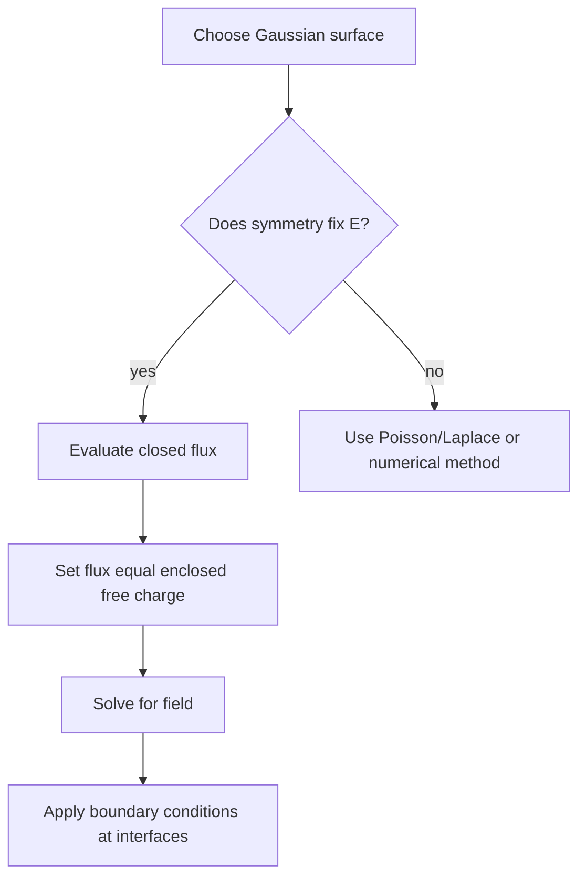

# Gauss Law, Dielectrics, and Boundaries

Gauss's law is the electrostatic statement that electric flux begins and ends on charge. In integral form it turns symmetry into computation: choose a closed surface on which the field has constant normal component, and the flux integral collapses. In differential form it describes the local source density of $\vec D$. Both versions are essential in applied electromagnetics.

Dielectrics add material response. Bound charges inside a polarized material reduce or reshape the electric field, so it is convenient to distinguish $\vec E$, $\vec D$, and polarization $\vec P$. Boundary conditions then tell us how normal and tangential field components change across interfaces. These rules are the foundation of capacitors, insulation design, dielectric wave propagation, and conductor shielding.

## Definitions

Gauss's law in integral form is

$$
\oint_S \vec D\cdot d\vec S=Q_{\text{free,enclosed}}.
$$

In differential form,

$$
\nabla\cdot\vec D=\rho_v.
$$

For a linear isotropic dielectric,

$$
\vec D=\epsilon\vec E=\epsilon_0\epsilon_r\vec E.
$$

The polarization field $\vec P$ is electric dipole moment per unit volume. In many materials,

$$
\vec D=\epsilon_0\vec E+\vec P,
$$

and for a linear dielectric,

$$
\vec P=\epsilon_0\chi_e\vec E,\qquad \epsilon_r=1+\chi_e.
$$

In a perfect conductor at electrostatic equilibrium,

$$
\vec E=0
$$

inside the conducting material, all excess charge resides on the surface, and the conductor is an equipotential body.

The phrase "electrostatic equilibrium" matters. During a transient, fields can exist inside real conductors over short times and finite skin depths. In the ideal static model, however, any internal field would accelerate free charges, so charges redistribute until the internal field vanishes. This redistribution is what makes conducting enclosures useful shields for static electric fields.

At an interface between media 1 and 2 with unit normal $\hat n$ from 1 to 2, electrostatic boundary conditions are

$$
\hat n\cdot(\vec D_2-\vec D_1)=\rho_s,
$$

and

$$
\hat n\times(\vec E_2-\vec E_1)=0.
$$

The first says normal $\vec D$ jumps by free surface charge density. The second says tangential $\vec E$ is continuous in electrostatics.

## Key results

Gauss's law is most useful when symmetry tells us the field direction and constancy before integration. For an infinite line charge in a homogeneous medium, cylindrical symmetry gives

$$
\vec E=\frac{\rho_l}{2\pi\epsilon\rho}\hat\rho.
$$

For an infinite sheet charge,

$$
\vec E=\frac{\rho_s}{2\epsilon}\hat n
$$

on each side, pointing away from a positive sheet. For a point charge or spherical shell outside the charged region,

$$
\vec E=\frac{Q}{4\pi\epsilon r^2}\hat r.
$$

Inside a conductor, $\vec E=0$ because any nonzero electrostatic field would drive free charge motion until the field is canceled. Just outside a conductor surface,

$$
\vec E=\frac{\rho_s}{\epsilon}\hat n
$$

when the surrounding medium has permittivity $\epsilon$. The field is normal to the surface because tangential field would move charges along the conductor.

For a charge-free dielectric boundary with no free surface charge, normal $D$ is continuous and tangential $E$ is continuous:

$$
D_{1n}=D_{2n},\qquad E_{1t}=E_{2t}.
$$

Therefore normal $E$ changes inversely with permittivity:

$$
\epsilon_1E_{1n}=\epsilon_2E_{2n}.
$$

This is why electric field tends to be lower in higher-permittivity material for the same normal displacement flux.

For tangential components, the electric field does not generally bend toward lower or higher permittivity by the same rule. Instead, $E_t$ is continuous while $D_t=\epsilon E_t$ changes. Combining normal and tangential rules gives a refraction-like relation for electrostatic field lines:

$$
\frac{\tan\theta_2}{\tan\theta_1}=\frac{\epsilon_2}{\epsilon_1},
$$

where $\theta$ is measured from the normal in a charge-free boundary. This is a useful qualitative picture: field lines change direction at dielectric interfaces because the material relation between $\vec D$ and $\vec E$ changes.

Gauss's law also explains why the field inside a uniformly charged spherical shell is zero, while outside it acts like a point charge at the center. The result depends on spherical symmetry, not on the shell being a conductor. Without symmetry, Gauss's law still holds, but it does not by itself reveal the field distribution.

Boundary conditions are local statements. They apply at a point on an interface using the normal direction at that point, even when the overall surface is curved. For a smooth conductor, the electric field just outside is normal to the surface, but its magnitude can vary from point to point according to local surface charge density. Sharp conductor features can create very large fields because charge crowds where curvature is high, which is why high-voltage hardware avoids small radii and sharp edges.

Flux-tube reasoning is often useful in dielectric problems. If no free charge lies inside a narrow tube bounded by field lines, the same normal displacement flux passes through every cross section of that tube. When the tube enters a higher-permittivity material, the electric field needed to carry that $\vec D$ flux is smaller. This picture supports the algebraic boundary condition without requiring a full solution.

In conductor problems, surface charge is usually not known in advance. It is whatever distribution is required to make the conductor an equipotential and to make the internal field zero. This is why assuming uniform surface charge on an arbitrary conductor is usually wrong; uniform charge appears only for highly symmetric cases such as an isolated sphere.

## Visual



| Boundary | Normal condition | Tangential condition | Practical consequence |
|---|---|---|---|
| Dielectric to dielectric | $\hat n\cdot(\vec D_2-\vec D_1)=\rho_s$ | $\vec E_{2t}=\vec E_{1t}$ | field refracts across materials |
| No free surface charge | $D_{2n}=D_{1n}$ | $E_{2t}=E_{1t}$ | $E_n$ changes with $\epsilon$ |
| Conductor surface | $D_n=\rho_s$ outside | $E_t=0$ | conductor is equipotential |
| Inside perfect conductor | $\vec E=0$ | none | no electrostatic volume field |

## Worked example 1: Infinite line charge by Gauss's law

Problem: An infinite line charge on the $z$ axis has $\rho_l=20\ \mathrm{nC/m}$ in free space. Find $\vec E$ at $\rho=5$ cm.

Step 1: Choose a cylindrical Gaussian surface of radius $\rho$ and length $L$ coaxial with the line charge.

Step 2: By symmetry, $\vec E=E_\rho(\rho)\hat\rho$ and is constant on the curved surface. The end caps have normals $\pm\hat z$, so $\vec E\cdot d\vec S=0$ there.

Step 3: Evaluate flux:

$$
\oint_S\vec D\cdot d\vec S
=D_\rho(2\pi\rho L).
$$

Step 4: Enclosed charge:

$$
Q_{\text{enc}}=\rho_l L.
$$

Step 5: Apply Gauss's law:

$$
D_\rho(2\pi\rho L)=\rho_l L
\quad\Rightarrow\quad
D_\rho=\frac{\rho_l}{2\pi\rho}.
$$

Step 6: Convert to electric field:

$$
E_\rho=\frac{D_\rho}{\epsilon_0}
=\frac{20\times10^{-9}}{2\pi(8.854\times10^{-12})(0.05)}
=7.19\times10^3\ \mathrm{V/m}.
$$

Answer:

$$
\vec E=7.19\times10^3\hat\rho\ \mathrm{V/m}.
$$

Check: The direction is outward because the charge density is positive.

## Worked example 2: Dielectric boundary field components

Problem: At a charge-free boundary, medium 1 has $\epsilon_{r1}=2$ and medium 2 has $\epsilon_{r2}=5$. In medium 1, $\vec E_1=30\hat n+40\hat t\ \mathrm{V/m}$, where $\hat n$ points from medium 1 to medium 2 and $\hat t$ is tangential. Find $\vec E_2$.

Step 1: Tangential electric field is continuous:

$$
E_{2t}=E_{1t}=40\ \mathrm{V/m}.
$$

Step 2: Normal displacement is continuous because $\rho_s=0$:

$$
D_{2n}=D_{1n}.
$$

Step 3: Substitute $\vec D=\epsilon\vec E$:

$$
\epsilon_2E_{2n}=\epsilon_1E_{1n}.
$$

Step 4: Solve:

$$
E_{2n}=\frac{\epsilon_1}{\epsilon_2}E_{1n}
=\frac{2}{5}(30)=12\ \mathrm{V/m}.
$$

Step 5: Assemble the field:

$$
\vec E_2=12\hat n+40\hat t\ \mathrm{V/m}.
$$

Check: The normal field is smaller in the higher-permittivity medium, while the tangential field is unchanged.

## Code

```python
import numpy as np

eps0 = 8.8541878128e-12
rho_l = 20e-9
rho = np.linspace(0.01, 0.2, 100)
E = rho_l / (2 * np.pi * eps0 * rho)

for r, e in zip(rho[::25], E[::25]):
    print(f"rho={r:.3f} m, E={e:.2e} V/m")

eps1, eps2 = 2 * eps0, 5 * eps0
E1n, E1t = 30.0, 40.0
E2n = eps1 / eps2 * E1n
E2t = E1t
print("E2 components:", E2n, E2t)
```

## Common pitfalls

- Choosing a Gaussian surface before checking symmetry. Gauss's law is always true, but it is only directly solvable when the field is simple on the surface.
- Including bound polarization charge as "free enclosed charge" in the $\vec D$ form of Gauss's law.
- Forgetting the end caps of a Gaussian cylinder; sometimes they contribute, sometimes symmetry makes their flux zero.
- Mixing $\vec E$ and $\vec D$ boundary conditions. Normal $\vec D$ and tangential $\vec E$ have the simple jump/continuity rules.
- Assuming electric field is zero outside a conductor. It is zero inside an ideal conductor in electrostatic equilibrium, not necessarily outside.
- Losing the sign of surface charge when choosing the boundary normal direction.
- Assuming high permittivity always reduces every component of $\vec E$. The statement is component and boundary-condition dependent.

## Connections

- [Electrostatic fields and potential](/physics/electromagnetics/electrostatic-fields-and-potential) for Coulomb and potential methods.
- [Gradient, divergence, curl, and integral theorems](/physics/electromagnetics/gradient-divergence-curl-integral-theorems) for the divergence theorem behind Gauss's law.
- [Capacitance, energy, and image method](/physics/electromagnetics/capacitance-energy-and-image-method) for conductor and dielectric applications.
- [Plane waves in media](/physics/electromagnetics/plane-waves-lossless-lossy-polarization) for dielectric parameters in wave propagation.
