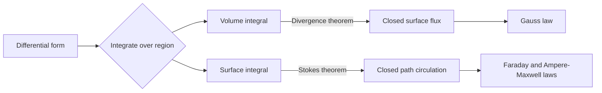

# Gradient, Divergence, Curl, and Integral Theorems

Maxwell's equations use two dialects of vector calculus. The differential dialect describes what fields do at a point: divergence detects sources and sinks, curl detects local circulation, and gradient points in the direction of fastest scalar increase. The integral dialect describes accumulated behavior over paths, surfaces, and volumes: voltage, flux, circulation, and total enclosed charge or current.

The two dialects are equivalent when fields are sufficiently smooth, but each highlights different physics. Gauss's law is often easiest as a flux integral when symmetry is high; Faraday's law is often clearest as a circulation integral when a changing magnetic flux threads a loop. This page summarizes the tools used throughout applied electromagnetics and connects to [vector differential calculus](/math/engineering-math/vector-differential-calculus) and [vector integral calculus](/math/engineering-math/vector-integral-calculus).

## Definitions

For a scalar field $V(x,y,z)$, the gradient is

$$
\nabla V=\frac{\partial V}{\partial x}\hat x+\frac{\partial V}{\partial y}\hat y+\frac{\partial V}{\partial z}\hat z.
$$

It points in the direction of maximum increase of $V$. The directional derivative in direction $\hat a$ is

$$
\frac{dV}{dl}=\nabla V\cdot\hat a.
$$

For a vector field $\vec A=A_x\hat x+A_y\hat y+A_z\hat z$, divergence is

$$
\nabla\cdot\vec A=
\frac{\partial A_x}{\partial x}
+\frac{\partial A_y}{\partial y}
+\frac{\partial A_z}{\partial z}.
$$

Divergence measures net outward flux density from an infinitesimal volume. Curl is

$$
\nabla\times\vec A=
\begin{vmatrix}
\hat x & \hat y & \hat z\\
\partial/\partial x & \partial/\partial y & \partial/\partial z\\
A_x & A_y & A_z
\end{vmatrix}.
$$

Curl measures local circulation density. The Laplacian of a scalar is

$$
\nabla^2 V=\nabla\cdot(\nabla V).
$$

In Cartesian coordinates,

$$
\nabla^2 V=
\frac{\partial^2 V}{\partial x^2}
+\frac{\partial^2 V}{\partial y^2}
+\frac{\partial^2 V}{\partial z^2}.
$$

The gradient has units of "scalar units per meter." If $V$ is electric potential in volts, then $\nabla V$ has units V/m, matching electric field units. Divergence has units of "vector-field units per meter"; for $\vec D$ in C/m$^2$, $\nabla\cdot\vec D$ has units C/m$^3$, matching volume charge density. Curl also divides by length; for $\vec E$ in V/m, $\nabla\times\vec E$ has units V/m$^2$, matching $-\partial\vec B/\partial t$ because tesla per second is equivalent to V/m$^2$.

Line, surface, and volume integrals are respectively written

$$
\int_C \vec A\cdot d\vec l,\qquad
\int_S \vec A\cdot d\vec S,\qquad
\int_V f\,dv.
$$

## Key results

The divergence theorem converts a closed-surface flux integral into a volume integral:

$$
\oint_S \vec A\cdot d\vec S=\int_V \nabla\cdot\vec A\,dv.
$$

Stokes's theorem converts a closed-path circulation integral into a surface integral of curl:

$$
\oint_C \vec A\cdot d\vec l=\int_S(\nabla\times\vec A)\cdot d\vec S.
$$

The orientation matters: the direction of $d\vec S$ and the positive traversal direction around $C$ are connected by the right-hand rule.

Three identities appear repeatedly in electromagnetics:

$$
\nabla\times(\nabla V)=0,
$$

$$
\nabla\cdot(\nabla\times\vec A)=0,
$$

and

$$
\nabla\cdot(f\vec A)=f\nabla\cdot\vec A+\vec A\cdot\nabla f.
$$

The first identity explains why electrostatic fields can be written as $\vec E=-\nabla V$ when $\nabla\times\vec E=0$. The second identity explains why a magnetic flux density can be written as $\vec B=\nabla\times\vec A$ because it automatically satisfies $\nabla\cdot\vec B=0$.

The best way to remember the physical roles is by testing small regions. Divergence asks whether more field leaves a tiny closed surface than enters it. Curl asks whether the field tends to push a tiny paddle wheel into rotation. Gradient asks which direction a scalar increases fastest. These tests are qualitative, but they prevent many sign and operator mistakes when reading Maxwell's equations.

Integral theorems also clarify when local and global statements can be exchanged. If $\nabla\cdot\vec D=\rho_v$ everywhere inside a volume except at an isolated point charge, the point must be handled as a singular source or by enclosing it in a small surface. Smooth-field assumptions are often hidden in short derivations, but electromagnetic point sources and surface currents frequently create discontinuities that need boundary conditions.

Curvilinear coordinates change the formulas because the unit vectors and scale factors vary. For example, cylindrical divergence is

$$
\nabla\cdot\vec A=
\frac{1}{\rho}\frac{\partial}{\partial \rho}(\rho A_\rho)
+\frac{1}{\rho}\frac{\partial A_\phi}{\partial \phi}
+\frac{\partial A_z}{\partial z}.
$$

Spherical divergence is

$$
\nabla\cdot\vec A=
\frac{1}{r^2}\frac{\partial}{\partial r}(r^2 A_r)
+\frac{1}{r\sin\theta}\frac{\partial}{\partial\theta}(A_\theta\sin\theta)
+\frac{1}{r\sin\theta}\frac{\partial A_\phi}{\partial\phi}.
$$

These forms are not memorization trivia; they encode the expanding area of cylindrical and spherical shells.

One practical study method is to connect each operator to a limiting integral definition. Divergence is closed flux divided by small volume as the volume shrinks. Curl is circulation around a small loop divided by loop area as the loop shrinks. Gradient is the vector that makes $dV=\nabla V\cdot d\vec l$ for small displacement. These limiting ideas explain why the integral theorems are not separate facts pasted onto the differential formulas; they are the finite-region versions of the same local measurements.

## Visual



| Operator | Input | Output | Physical reading in EM |
|---|---|---|---|
| $\nabla V$ | scalar | vector | Field from potential, steepest change |
| $\nabla\cdot\vec A$ | vector | scalar | Source density or flux expansion |
| $\nabla\times\vec A$ | vector | vector | Circulation density |
| $\nabla^2 V$ | scalar | scalar | Curvature, Poisson/Laplace equations |
| $\oint_C\vec A\cdot d\vec l$ | vector on path | scalar | Circulation, voltage-like integral |
| $\oint_S\vec A\cdot d\vec S$ | vector on surface | scalar | Flux through a closed surface |

## Worked example 1: Gradient and directional derivative

Problem: Let $V(x,y,z)=3x^2y+yz^2$. Find $\nabla V$ at $(1,2,-1)$ and the directional derivative in the direction $\hat a=(2\hat x+\hat y+2\hat z)/3$.

Step 1: Differentiate with respect to each coordinate:

$$
\begin{aligned}
\frac{\partial V}{\partial x} &= 6xy,\\
\frac{\partial V}{\partial y} &= 3x^2+z^2,\\
\frac{\partial V}{\partial z} &= 2yz.
\end{aligned}
$$

Step 2: Evaluate at $(1,2,-1)$:

$$
\nabla V=12\hat x+4\hat y-4\hat z.
$$

Step 3: Dot with $\hat a$:

$$
\frac{dV}{dl}=(12\hat x+4\hat y-4\hat z)\cdot
\frac{2\hat x+\hat y+2\hat z}{3}.
$$

Step 4: Compute:

$$
\frac{dV}{dl}=\frac{24+4-8}{3}=\frac{20}{3}.
$$

Check: The maximum possible directional derivative is $\vert \nabla V\vert =\sqrt{12^2+4^2+(-4)^2}=13.3$, and $20/3=6.67$ is less than that.

## Worked example 2: Verify the divergence theorem for a cube

Problem: For $\vec A=x\hat x+y\hat y+z\hat z$, verify the divergence theorem over the cube $0\le x,y,z\le a$.

Step 1: Compute divergence:

$$
\nabla\cdot\vec A=
\frac{\partial x}{\partial x}+\frac{\partial y}{\partial y}+\frac{\partial z}{\partial z}=3.
$$

Step 2: Integrate over the cube volume:

$$
\int_V \nabla\cdot\vec A\,dv=\int_0^a\int_0^a\int_0^a 3\,dx\,dy\,dz=3a^3.
$$

Step 3: Compute flux through faces. At $x=a$, $\vec A\cdot\hat x=a$, so flux is $a\cdot a^2=a^3$. At $x=0$, $\vec A\cdot(-\hat x)=-x=0$, so flux is zero.

Step 4: By symmetry, the $y=a$ and $z=a$ faces each contribute $a^3$, while the $y=0$ and $z=0$ faces contribute zero.

Step 5: Total closed-surface flux:

$$
\oint_S\vec A\cdot d\vec S=a^3+a^3+a^3=3a^3.
$$

Check: The surface and volume results agree, so the divergence theorem holds for this field and region.

## Code

```python
import sympy as sp

x, y, z = sp.symbols("x y z", real=True)
V = 3*x**2*y + y*z**2
grad_V = [sp.diff(V, var) for var in (x, y, z)]
point = {x: 1, y: 2, z: -1}
grad_at_point = [g.subs(point) for g in grad_V]

A = [x, y, z]
div_A = sum(sp.diff(Ai, var) for Ai, var in zip(A, (x, y, z)))

print("gradient =", grad_V)
print("gradient at point =", grad_at_point)
print("divergence =", sp.simplify(div_A))
```

## Common pitfalls

- Using Cartesian formulas in cylindrical or spherical problems without scale factors.
- Forgetting that Stokes's theorem requires a consistent path direction and surface normal.
- Treating $\nabla$ like an ordinary vector in every algebraic context. It is a differential operator, so product rules matter.
- Assuming zero divergence means zero field. It means no local net source, not no field.
- Assuming zero curl means zero field. It means locally conservative in a simply connected region, not necessarily absent.
- Applying integral theorems across singularities without isolating them. Point charges and line currents require care.
- Treating a zero closed integral as proof that the integrand is zero everywhere. Cancellation over a path or surface can hide local structure unless the result holds for every possible region.

## Connections

- [Vector differential calculus](/math/engineering-math/vector-differential-calculus) for operator derivations.
- [Vector integral calculus](/math/engineering-math/vector-integral-calculus) for Stokes and divergence theorem details.
- [Gauss law, dielectrics, and boundaries](/physics/electromagnetics/gauss-law-dielectrics-and-boundaries) for flux applications.
- [Maxwell equations for time-varying fields](/physics/electromagnetics/maxwell-equations-time-varying-fields) for the differential and integral Maxwell forms.
