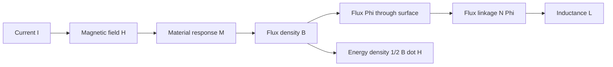

# Magnetic Materials, Inductance, and Energy

Magnetic materials determine how strongly a current produces magnetic flux and how much energy is stored or lost in a magnetic system. In free space, $\vec B=\mu_0\vec H$. In matter, electron orbital and spin moments contribute magnetization, so the relationship can be linear, nonlinear, hysteretic, or anisotropic. Engineering devices such as solenoids, transformers, inductive sensors, motors, and magnetic storage depend on these material effects.

Inductance is the circuit-level measure of magnetic flux linkage per current. Like capacitance, it is fundamentally geometric and material. A current creates $\vec H$, the medium produces $\vec B$, flux links conductors, and energy is stored in the magnetic field. This page covers magnetic materials, boundary conditions, self and mutual inductance, and magnetic energy.

## Definitions

Magnetization $\vec M$ is magnetic dipole moment per unit volume. The macroscopic fields satisfy

$$
\vec B=\mu_0(\vec H+\vec M).
$$

For a linear isotropic material,

$$
\vec M=\chi_m\vec H,\qquad
\vec B=\mu\vec H=\mu_0\mu_r\vec H,
$$

where

$$
\mu_r=1+\chi_m.
$$

Materials are often grouped as diamagnetic ($\chi_m\lt 0$ small), paramagnetic ($\chi_m\gt 0$ small), and ferromagnetic (large, nonlinear, often hysteretic).

Ferromagnetic behavior is especially important in engineering because large permeability can concentrate flux and greatly increase inductance. The tradeoff is nonlinearity. As $H$ increases, domains become increasingly aligned and the material approaches saturation; additional current then produces much less additional $B$. A design that assumes constant high $\mu_r$ beyond saturation can underpredict current, overpredict inductance, and miss heating or waveform distortion.

Magnetic boundary conditions follow from $\nabla\cdot\vec B=0$ and Ampere's law. At an interface with unit normal $\hat n$ from medium 1 to medium 2,

$$
\hat n\cdot(\vec B_2-\vec B_1)=0,
$$

and

$$
\hat n\times(\vec H_2-\vec H_1)=\vec J_s,
$$

where $\vec J_s$ is free surface current density.

Flux linkage is

$$
\Lambda=N\Phi,
$$

and self-inductance is

$$
L=\frac{\Lambda}{I}.
$$

Mutual inductance between circuits is

$$
M_{21}=\frac{\Lambda_{21}}{I_1},
$$

where $\Lambda_{21}$ is flux linkage of circuit 2 caused by current $I_1$.

Magnetic energy density in a linear medium is

$$
w_m=\frac{1}{2}\vec B\cdot\vec H=\frac{1}{2}\mu H^2.
$$

## Key results

For a long solenoid with $N$ turns, length $l$, current $I$, and core permeability $\mu$, Ampere's law gives approximately

$$
H=\frac{NI}{l}
$$

inside the solenoid. If the cross-sectional area is $A$, the flux is

$$
\Phi=BA=\mu HA=\mu\frac{NI}{l}A.
$$

Flux linkage is $N\Phi$, so

$$
L=\frac{N\Phi}{I}=\frac{\mu N^2A}{l}.
$$

This formula is approximate because it neglects fringing and assumes uniform field, but it captures the scaling: inductance increases with permeability, turns squared, and area, and decreases with magnetic path length.

For a coaxial line with inner radius $a$, outer conductor inner radius $b$, and nonmagnetic dielectric, the external magnetic field between conductors is

$$
H_\phi=\frac{I}{2\pi\rho}.
$$

The magnetic energy per unit length is

$$
W_m'=\int_a^b \frac{1}{2}\mu H_\phi^2(2\pi\rho\,d\rho),
$$

and setting $W_m'=\frac{1}{2}L'I^2$ gives

$$
L'=\frac{\mu}{2\pi}\ln\frac{b}{a}.
$$

Hysteresis in ferromagnetic materials means the $B$-$H$ curve depends on history. Energy is lost as heat over a cycle, with loss per unit volume equal to the area enclosed by the hysteresis loop.

Magnetic circuits provide a useful approximation for core devices. Reluctance $\mathcal R=l/(\mu A)$ plays a role analogous to resistance, flux $\Phi$ is analogous to current, and magnetomotive force $NI$ is analogous to voltage. The analogy is not exact because fringing, leakage flux, saturation, and hysteresis are field effects, but it gives fast estimates for transformers, inductors, relays, and electromagnets.

Mutual inductance depends on how much flux from one circuit links another. The coupling coefficient $k$ is defined by

$$
M=k\sqrt{L_1L_2},\qquad 0\le k\le1.
$$

Ideal transformers assume tight coupling, negligible winding resistance, and negligible core loss. Real transformers depart from this through leakage inductance, winding capacitance, finite permeability, and frequency-dependent losses.

Magnetic energy is sometimes counterintuitive in high-permeability cores. Since $w_m=\frac{1}{2}BH=\frac{B^2}{2\mu}$ for a linear material, a high-$\mu$ region can carry large flux density with relatively small $H$ and comparatively low energy density for a given $B$. Air gaps often store a significant fraction of the energy in inductors because the gap has low permeability and therefore requires larger $H$. This is why gapped cores are used when an inductor must store energy without saturating.

Boundary conditions explain flux concentration. Normal $\vec B$ is continuous across an interface, but tangential $\vec H$ changes according to permeability when there is no surface current. Flux tends to prefer high-permeability paths because they require less magnetomotive force for a given flux. The word "prefer" is only shorthand; the actual field still satisfies Maxwell's equations and material relations everywhere.

Core loss has multiple mechanisms. Hysteresis loss comes from cycling around a $B$-$H$ loop. Eddy-current loss comes from currents induced inside conducting magnetic material by time-varying flux. Laminated steel, ferrites, powdered iron, and gapped cores are different engineering responses to these losses and saturation limits. The best core material depends strongly on frequency, flux density, waveform, temperature, and required energy storage.

Inductance measurements can also be frequency dependent. At low frequency, winding resistance and core permeability may dominate. At high frequency, skin effect, proximity effect, inter-winding capacitance, and core dispersion alter the apparent impedance. A quoted inductance value is therefore incomplete without test frequency and bias conditions for precision work.

The polarity of mutual inductance is tracked with dot convention in circuits. If currents enter dotted terminals simultaneously and their fluxes reinforce, the mutual voltage terms have the same sign. The dot notation is a compact circuit symbol for magnetic-field orientation and winding sense; assigning it carelessly can reverse transformer or coupled-inductor behavior.

Always pair inductance formulas with the assumed flux path.

## Visual



| Quantity | Electric analogue | Magnetic expression |
|---|---|---|
| Permittivity/permeability | $\epsilon$ | $\mu$ |
| Stored energy density | $\frac{1}{2}\epsilon E^2$ | $\frac{1}{2}\mu H^2$ |
| Capacitance/inductance | $C=Q/V$ | $L=\Lambda/I$ |
| Boundary normal | $D_n$ jump from charge | $B_n$ continuous |
| Boundary tangential | $E_t$ continuous electrostatically | $H_t$ jumps by surface current |

## Worked example 1: Inductance of a long solenoid

Problem: A solenoid has $N=600$ turns, length $l=0.30$ m, cross-sectional area $A=4.0\times10^{-4}\ \mathrm{m^2}$, and a nonmagnetic core. Find $L$.

Step 1: Use the long-solenoid formula:

$$
L=\frac{\mu N^2A}{l}.
$$

Step 2: For a nonmagnetic core, $\mu=\mu_0=4\pi\times10^{-7}\ \mathrm{H/m}$.

Step 3: Substitute:

$$
L=\frac{(4\pi\times10^{-7})(600)^2(4.0\times10^{-4})}{0.30}.
$$

Step 4: Compute $N^2A$:

$$
(600)^2(4.0\times10^{-4})=360000(4.0\times10^{-4})=144.
$$

Step 5: Finish:

$$
L=\frac{(4\pi\times10^{-7})(144)}{0.30}
=6.03\times10^{-4}\ \mathrm{H}.
$$

Answer:

$$
L=0.603\ \mathrm{mH}.
$$

Check: If a high-$\mu_r$ core were inserted without saturation, $L$ would scale upward by approximately $\mu_r$.

## Worked example 2: Coaxial inductance per unit length

Problem: A coaxial line has $a=0.5$ mm and $b=2.5$ mm with nonmagnetic dielectric. Find $L'$ neglecting internal conductor inductance.

Step 1: Use the external inductance formula:

$$
L'=\frac{\mu}{2\pi}\ln\frac{b}{a}.
$$

Step 2: Substitute $\mu=\mu_0$ and $b/a=5$:

$$
L'=\frac{4\pi\times10^{-7}}{2\pi}\ln 5.
$$

Step 3: Simplify the coefficient:

$$
\frac{4\pi\times10^{-7}}{2\pi}=2.0\times10^{-7}\ \mathrm{H/m}.
$$

Step 4: Compute:

$$
L'=(2.0\times10^{-7})(1.609)=3.22\times10^{-7}\ \mathrm{H/m}.
$$

Answer:

$$
L'=0.322\ \mu\mathrm{H/m}.
$$

Check: Together with a typical coaxial capacitance of tens of pF/m, this gives a characteristic impedance in the tens of ohms, consistent with practical cables.

## Code

```python
import numpy as np

mu0 = 4 * np.pi * 1e-7

def solenoid_L(N, area, length, mu_r=1):
    return mu0 * mu_r * N**2 * area / length

def coax_L_per_m(a, b, mu_r=1):
    return mu0 * mu_r / (2 * np.pi) * np.log(b / a)

print("solenoid L =", solenoid_L(600, 4e-4, 0.30), "H")
print("coax L' =", coax_L_per_m(0.5e-3, 2.5e-3), "H/m")
```

## Common pitfalls

- Assuming $\mu_r$ is constant for ferromagnetic materials. Saturation and hysteresis can dominate real designs.
- Confusing flux $\Phi$ with flux linkage $\Lambda=N\Phi$.
- Forgetting the $N^2$ scaling of solenoid inductance.
- Using electric boundary-condition intuition for magnetic fields. Normal $\vec B$ is continuous; tangential $\vec H$ jumps with surface current.
- Ignoring fringing in short coils or magnetic gaps.
- Equating high permeability with unlimited energy storage. High-$\mu$ cores can saturate and often introduce loss.
- Forgetting that inductance can depend on current in nonlinear magnetic materials.

## Connections

- [Magnetostatic forces, Biot-Savart law, and Ampere law](/physics/electromagnetics/magnetostatic-forces-biot-savart-ampere) for magnetic field generation by currents.
- [Transmission-line models and wave equations](/physics/electromagnetics/transmission-line-models-and-wave-equations) for $L'$ and $C'$ in guided propagation.
- [Maxwell equations for time-varying fields](/physics/electromagnetics/maxwell-equations-time-varying-fields) for inductive voltage and transformer action.
- [Gauss law, dielectrics, and boundaries](/physics/electromagnetics/gauss-law-dielectrics-and-boundaries) for comparison with electric materials.
