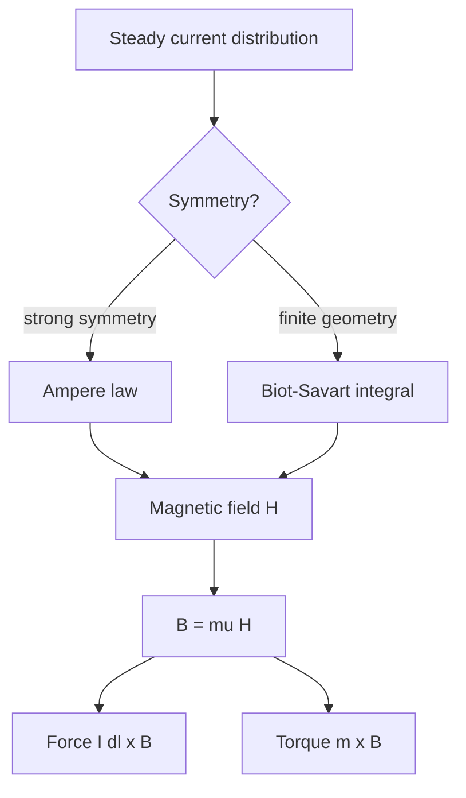

# Magnetostatic Forces, Biot-Savart Law, and Ampere Law

Magnetostatics studies magnetic fields produced by steady currents. The electrostatic source is charge density; the magnetostatic source is current density. Magnetic force differs sharply from electric force: it acts on moving charge or current, and its direction is perpendicular to both velocity and magnetic flux density. This cross-product geometry is why motors rotate, wires carrying parallel currents attract or repel, and current loops experience torque.

Two complementary field laws dominate the subject. Biot-Savart law is a source integral, useful for finite wires and loops. Ampere's law is an integral circulation law, powerful when symmetry makes the magnetic field simple along a closed path. Together they mirror the Coulomb/Gauss pairing from electrostatics.


*Figure: Magnetic field lines computed for a solenoid. Image: [Wikimedia Commons](https://commons.wikimedia.org/wiki/File:VFPt_Solenoid_correct2.svg), Geek3, CC BY-SA 3.0.*

## Definitions

The magnetic force on a charge $q$ moving with velocity $\vec u$ is

$$
\vec F_m=q\vec u\times\vec B.
$$

For a current element in a magnetic flux density,

$$
d\vec F=I\,d\vec l\times\vec B.
$$

The torque on a small current loop with magnetic dipole moment $\vec m$ is

$$
\vec T=\vec m\times\vec B,
$$

where

$$
\vec m=I S\hat n.
$$

The magnetic flux density $\vec B$ and magnetic field intensity $\vec H$ are related by

$$
\vec B=\mu\vec H
$$

in a linear isotropic medium.

Biot-Savart law for a filamentary current is

$$
\vec H(\vec r)=\frac{I}{4\pi}\int_C \frac{d\vec l'\times\hat R}{R^2}.
$$

For surface and volume current densities,

$$
\vec H=\frac{1}{4\pi}\int_S \frac{\vec J_s(\vec r')\times\hat R}{R^2}\,dS',
$$

and

$$
\vec H=\frac{1}{4\pi}\int_V \frac{\vec J(\vec r')\times\hat R}{R^2}\,dv'.
$$

Ampere's law for magnetostatics is

$$
\oint_C \vec H\cdot d\vec l=I_{\text{enc}},
$$

or in differential form,

$$
\nabla\times\vec H=\vec J.
$$

Gauss's law for magnetism is

$$
\nabla\cdot\vec B=0.
$$

The absence of magnetic monopoles in this model means magnetic flux lines close on themselves. A bar magnet's field may appear to leave one pole and enter another outside the material, but inside the material the flux continues. This is different from electric flux, which can begin on positive free charge and end on negative free charge.

## Key results

For an infinitely long straight wire carrying current $I$ in the $+z$ direction,

$$
\vec H=\frac{I}{2\pi\rho}\hat\phi,\qquad
\vec B=\frac{\mu I}{2\pi\rho}\hat\phi.
$$

The direction follows the right-hand rule: thumb in current direction, fingers curl in $\hat\phi$.

For an infinite current sheet with surface current density $\vec J_s=J_s\hat x$ in the plane $z=0$,

$$
\vec H=
\begin{cases}
-\frac{J_s}{2}\hat y, & z>0,\\
\frac{J_s}{2}\hat y, & z<0,
\end{cases}
$$

with directions set by the right-hand rule and boundary conditions.

The force per unit length between two parallel currents separated by distance $d$ in a homogeneous medium is

$$
\frac{F}{l}=\frac{\mu I_1I_2}{2\pi d}.
$$

Currents in the same direction attract; currents in opposite directions repel.

For a circular loop of radius $a$ carrying current $I$, the magnetic field intensity at the center is

$$
H=\frac{I}{2a}.
$$

On the axis of the loop,

$$
H_z=\frac{Ia^2}{2(a^2+z^2)^{3/2}}.
$$

These loop formulas are the magnetostatic analogue of ring-charge electrostatic fields.

Ampere's law and Biot-Savart law are not competing truths; they are different computational forms of the same magnetostatic physics. Ampere's law gives fast answers only when the chosen path can make $\vec H\cdot d\vec l$ simple. Biot-Savart works for less symmetric source distributions, but the vector integral can be longer. In practical modeling, finite coils, bends, and nearby magnetic materials often require numerical field solvers because neither hand method remains simple.

Magnetic force does no work on an isolated point charge in the ideal Lorentz-force sense because $\vec F_m$ is perpendicular to velocity. Motors still deliver mechanical work because sources maintain currents in conductors while magnetic forces act on the current-carrying structure. Energy flows from electrical sources through fields into mechanical motion, so the simple point-charge statement should not be misread as "magnetic devices cannot do work."

Current density notation matters in extended conductors. Volume current density $\vec J$ has units A/m$^2$, surface current density $\vec J_s$ has units A/m, and filament current $I$ has units A. They represent different idealizations of the same physical idea. Choosing the wrong density changes the dimensions of the integral and usually reveals the mistake before the final answer.

The vector magnetic potential $\vec A$ is often introduced after Ampere's law because $\nabla\cdot\vec B=0$ is automatically satisfied by $\vec B=\nabla\times\vec A$. In magnetostatics, $\vec A$ can simplify calculations for current distributions and becomes essential in time-varying field theory. Even when $\vec A$ is not unique, its curl gives the physical $\vec B$ field.

Magnetostatic approximations assume currents are steady enough that charge accumulation and displacement current are negligible. This is usually valid for dc coils and slowly varying currents in compact structures, but it breaks down when dimensions become comparable to wavelength or when capacitive effects between conductors become important.

When a result depends on "infinite" wire, sheet, or solenoid assumptions, treat it as a local approximation. It is accurate only far from ends and edges compared with the observation distance and structure dimensions.

## Visual



| Law | Best use | Integral |
|---|---|---|
| Biot-Savart | finite wire, circular loop, arbitrary known current | $\vec H=(I/4\pi)\int d\vec l'\times\hat R/R^2$ |
| Ampere | infinite wire, solenoid, toroid, current sheet | $\oint\vec H\cdot d\vec l=I_{\text{enc}}$ |
| Magnetic force | wire in known field | $d\vec F=I\,d\vec l\times\vec B$ |
| Torque | current loop in known field | $\vec T=\vec m\times\vec B$ |

## Worked example 1: Field around a long wire

Problem: A long straight wire carries $I=8$ A in free space. Find $\vec H$ and $\vec B$ at $\rho=4$ cm.

Step 1: Use cylindrical symmetry and Ampere's law. Choose a circular Amperian path of radius $\rho$ around the wire.

Step 2: $\vec H$ is tangential and constant on the path, so

$$
\oint_C\vec H\cdot d\vec l=H_\phi(2\pi\rho).
$$

Step 3: The enclosed current is $I$, hence

$$
H_\phi(2\pi\rho)=I
\quad\Rightarrow\quad
H_\phi=\frac{I}{2\pi\rho}.
$$

Step 4: Substitute:

$$
H_\phi=\frac{8}{2\pi(0.04)}=31.8\ \mathrm{A/m}.
$$

Step 5: Convert to $\vec B$:

$$
B_\phi=\mu_0H_\phi=(4\pi\times10^{-7})(31.8)
=4.00\times10^{-5}\ \mathrm{T}.
$$

Answer:

$$
\vec H=31.8\hat\phi\ \mathrm{A/m},\qquad
\vec B=40.0\ \mu\mathrm{T}\,\hat\phi.
$$

Check: This is comparable to Earth's magnetic field magnitude, which is reasonable for several amperes at a few centimeters.

## Worked example 2: Force between parallel conductors

Problem: Two long parallel wires in air are separated by $d=10$ cm. They carry $I_1=5$ A and $I_2=3$ A in the same direction. Find the force per meter on wire 2.

Step 1: Field produced by wire 1 at wire 2:

$$
B_1=\frac{\mu_0 I_1}{2\pi d}.
$$

Step 2: Substitute:

$$
B_1=\frac{4\pi\times10^{-7}(5)}{2\pi(0.10)}
=1.0\times10^{-5}\ \mathrm{T}.
$$

Step 3: Force on length $l$ of wire 2 is $F=I_2lB_1$ because the wire direction is perpendicular to $\vec B_1$.

Step 4: Per unit length:

$$
\frac{F}{l}=I_2B_1=3(1.0\times10^{-5})
=3.0\times10^{-5}\ \mathrm{N/m}.
$$

Step 5: Direction: currents in the same direction attract, so wire 2 is pulled toward wire 1.

Check: The compact formula gives $\mu_0I_1I_2/(2\pi d)$, the same result.

## Code

```python
import numpy as np

mu0 = 4 * np.pi * 1e-7

def long_wire_fields(I, rho):
    H = I / (2 * np.pi * rho)
    B = mu0 * H
    return H, B

def force_per_length(I1, I2, d):
    return mu0 * I1 * I2 / (2 * np.pi * d)

H, B = long_wire_fields(8, 0.04)
print(f"H = {H:.2f} A/m, B = {B:.3e} T")
print(f"F/l = {force_per_length(5, 3, 0.10):.3e} N/m")
```

## Common pitfalls

- Using $\vec B$ in Ampere's law instead of $\vec H$. The basic magnetostatic circulation law uses $\vec H$ and free current.
- Forgetting the cross-product direction in magnetic force. The force is perpendicular to current and field.
- Applying Ampere's law as a shortcut when symmetry does not make $\vec H$ constant or tangential on the chosen path.
- Confusing $\rho$ in cylindrical coordinates with charge density. Context and subscript notation matter.
- Treating magnetic field lines as starting or ending on currents. Magnetic flux has zero divergence; field lines form loops.
- Missing the sign of attraction or repulsion between parallel currents.
- Treating a finite straight wire as infinite without checking the observation distance relative to wire length.

## Connections

- [Vector algebra and coordinate systems](/physics/electromagnetics/vector-algebra-coordinate-systems) for cross products and cylindrical unit vectors.
- [Gradient, divergence, curl, and integral theorems](/physics/electromagnetics/gradient-divergence-curl-integral-theorems) for Stokes's theorem behind Ampere's law.
- [Magnetic materials, inductance, and energy](/physics/electromagnetics/magnetic-materials-inductance-and-energy) for $\mu$, magnetic energy, and inductors.
- [Maxwell equations for time-varying fields](/physics/electromagnetics/maxwell-equations-time-varying-fields) for the displacement-current extension.
