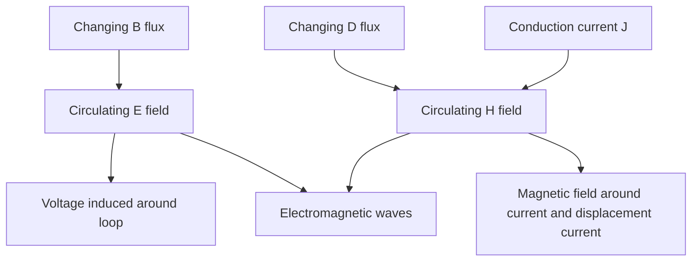

# Maxwell Equations for Time-Varying Fields

Time-varying electromagnetics is where electric and magnetic fields stop being separate subjects. A changing magnetic flux induces electric circulation, and a changing electric flux contributes to magnetic circulation. These two coupling mechanisms are the mathematical core of electromagnetic waves, transformers, generators, antennas, and capacitors at high frequency.

The static laws remain visible as limiting cases. Electrostatics keeps $\nabla\times\vec E=0$ because $\partial\vec B/\partial t=0$. Magnetostatics keeps $\nabla\times\vec H=\vec J$ because displacement current is absent or negligible. In the full theory, Faraday's law and the Ampere-Maxwell law join Gauss's laws to form a complete field description.

## Definitions

Maxwell's equations in differential form are

$$
\begin{aligned}
\nabla\times\vec E &= -\frac{\partial\vec B}{\partial t},\\
\nabla\times\vec H &= \vec J+\frac{\partial\vec D}{\partial t},\\
\nabla\cdot\vec D &= \rho_v,\\
\nabla\cdot\vec B &= 0.
\end{aligned}
$$

The corresponding integral forms are

$$
\begin{aligned}
\oint_C\vec E\cdot d\vec l &= -\frac{d}{dt}\int_S\vec B\cdot d\vec S,\\
\oint_C\vec H\cdot d\vec l &= \int_S\vec J\cdot d\vec S+\frac{d}{dt}\int_S\vec D\cdot d\vec S,\\
\oint_S\vec D\cdot d\vec S &= Q_{\text{enclosed}},\\
\oint_S\vec B\cdot d\vec S &= 0.
\end{aligned}
$$

Faraday's law defines induced electromotive force:

$$
\mathcal V_{\mathrm{emf}}=\oint_C\vec E\cdot d\vec l=-\frac{d\Phi_B}{dt}.
$$

For a moving conductor in a magnetic field, magnetic force separates charges and creates motional emf:

$$
\mathcal V_{\mathrm{emf}}=\int_C(\vec u\times\vec B)\cdot d\vec l.
$$

For a conducting loop that both moves and sits in a time-varying magnetic field, both transformer emf and motional emf can contribute.

The displacement current density is

$$
\vec J_d=\frac{\partial\vec D}{\partial t}.
$$

It is not conduction of free charge through an insulator; it is the term required for magnetic fields generated by changing electric flux.

In material media, the fields are connected by constitutive relations such as $\vec D=\epsilon\vec E$, $\vec B=\mu\vec H$, and $\vec J=\sigma\vec E$ for linear isotropic conductors and dielectrics. Maxwell's equations alone give the field structure; constitutive relations describe the medium. Changing the medium changes wave speed, attenuation, boundary behavior, and energy storage without changing the four Maxwell equations themselves.

## Key results

The continuity equation expresses local charge conservation:

$$
\nabla\cdot\vec J=-\frac{\partial\rho_v}{\partial t}.
$$

It follows from taking divergence of the Ampere-Maxwell law:

$$
\nabla\cdot(\nabla\times\vec H)=0
=\nabla\cdot\vec J+\frac{\partial}{\partial t}(\nabla\cdot\vec D)
=\nabla\cdot\vec J+\frac{\partial\rho_v}{\partial t}.
$$

This derivation shows why Maxwell's displacement current is not optional. Without it, Ampere's law would imply $\nabla\cdot\vec J=0$ even when charge density changes.

For time-harmonic fields with $e^{j\omega t}$ convention,

$$
\frac{\partial}{\partial t}\quad\Longleftrightarrow\quad j\omega.
$$

Maxwell's curl equations become

$$
\begin{aligned}
\nabla\times\tilde{\vec E} &= -j\omega\tilde{\vec B},\\
\nabla\times\tilde{\vec H} &= \tilde{\vec J}+j\omega\tilde{\vec D}.
\end{aligned}
$$

In a conducting medium, $\tilde{\vec J}=\sigma\tilde{\vec E}$ and $\tilde{\vec D}=\epsilon\tilde{\vec E}$, so

$$
\nabla\times\tilde{\vec H}=(\sigma+j\omega\epsilon)\tilde{\vec E}.
$$

The electromagnetic boundary conditions are

$$
\hat n\times(\vec E_2-\vec E_1)=0
$$

for finite magnetic flux density,

$$
\hat n\times(\vec H_2-\vec H_1)=\vec J_s,
$$

$$
\hat n\cdot(\vec D_2-\vec D_1)=\rho_s,
$$

and

$$
\hat n\cdot(\vec B_2-\vec B_1)=0.
$$

These are the full time-varying versions used at material boundaries.

The potentials also generalize in the time-varying case. Magnetic flux density can be written as

$$
\vec B=\nabla\times\vec A,
$$

and the electric field can be represented as

$$
\vec E=-\nabla V-\frac{\partial\vec A}{\partial t}.
$$

The extra vector-potential term is exactly what electrostatics did not need. For radiating systems, retarded potentials account for finite propagation speed: changes in source charge or current affect distant fields only after a delay $R/c$ in free space. This delay is the field-theory version of causality and is essential for antennas.

Maxwell's equations also contain a built-in energy statement, Poynting's theorem. In words, the decrease of electromagnetic energy in a volume equals the outward power flow plus the power dissipated in charges and currents. The associated power-flow vector is $\vec S=\vec E\times\vec H$, which becomes central in plane-wave and antenna analysis.

The quasistatic approximation is used when dimensions are small enough compared with wavelength that propagation delay across the device can be neglected. Circuit theory, electrostatics, and magnetostatics are all quasistatic approximations in appropriate limits. The approximation is not about frequency alone; it depends on both frequency and size. A 1 MHz signal may be quasistatic on a circuit board trace but not on a many-kilometer conductor.

Sign convention should be tracked consistently. These notes use phasors with $e^{j\omega t}$ time dependence, so Faraday's law becomes $\nabla\times\tilde{\vec E}=-j\omega\tilde{\vec B}$. Texts or software using $e^{-j\omega t}$ reverse the signs of the $j\omega$ terms. The physics is unchanged, but mixing conventions corrupts wave and impedance formulas.

## Visual



| Equation | Differential form | Integral reading |
|---|---|---|
| Faraday | $\nabla\times\vec E=-\partial_t\vec B$ | changing magnetic flux induces electric circulation |
| Ampere-Maxwell | $\nabla\times\vec H=\vec J+\partial_t\vec D$ | current and changing electric flux induce magnetic circulation |
| Gauss electric | $\nabla\cdot\vec D=\rho_v$ | electric flux equals enclosed free charge |
| Gauss magnetic | $\nabla\cdot\vec B=0$ | magnetic flux has no isolated source |

## Worked example 1: Sinusoidal transformer emf

Problem: A stationary single-turn loop has area $A=20\ \mathrm{cm^2}$ and normal aligned with a uniform magnetic flux density

$$
B(t)=0.05\cos(1000t)\ \mathrm{T}.
$$

Find the induced emf.

Step 1: Convert area:

$$
A=20\ \mathrm{cm^2}=20\times10^{-4}=2.0\times10^{-3}\ \mathrm{m^2}.
$$

Step 2: Magnetic flux through the loop is

$$
\Phi_B(t)=B(t)A=(0.05)(2.0\times10^{-3})\cos(1000t).
$$

Thus

$$
\Phi_B(t)=1.0\times10^{-4}\cos(1000t)\ \mathrm{Wb}.
$$

Step 3: Faraday's law:

$$
\mathcal V_{\mathrm{emf}}=-\frac{d\Phi_B}{dt}.
$$

Step 4: Differentiate:

$$
\frac{d\Phi_B}{dt}
=1.0\times10^{-4}[-1000\sin(1000t)]
=-0.1\sin(1000t).
$$

Step 5: Apply the minus sign:

$$
\mathcal V_{\mathrm{emf}}=0.1\sin(1000t)\ \mathrm{V}.
$$

Check: The induced emf is $90^\circ$ shifted from the magnetic flux, as differentiation requires.

## Worked example 2: Displacement current in a capacitor

Problem: A parallel-plate capacitor has plate area $A=5\ \mathrm{cm^2}$ and plate separation filled with dielectric $\epsilon_r=4$. The electric field between plates is

$$
E(t)=10^5\cos(2\pi\times10^6t)\ \mathrm{V/m}.
$$

Find the displacement current through the dielectric.

Step 1: Electric flux density is

$$
D(t)=\epsilon E(t)=\epsilon_0\epsilon_r E(t).
$$

Step 2: Displacement current density:

$$
J_d(t)=\frac{\partial D}{\partial t}
=\epsilon_0\epsilon_r\frac{dE}{dt}.
$$

Step 3: Differentiate $E(t)$:

$$
\frac{dE}{dt}
=-10^5(2\pi\times10^6)\sin(2\pi\times10^6t).
$$

Step 4: Multiply by area to get current:

$$
I_d(t)=A\epsilon_0\epsilon_r\frac{dE}{dt}.
$$

Step 5: Convert area:

$$
A=5\ \mathrm{cm^2}=5\times10^{-4}\ \mathrm{m^2}.
$$

Step 6: Amplitude:

$$
I_{d0}=(5\times10^{-4})(8.854\times10^{-12})(4)(10^5)(2\pi\times10^6).
$$

$$
I_{d0}=1.11\times10^{-2}\ \mathrm{A}.
$$

Answer:

$$
I_d(t)=-11.1\ \mathrm{mA}\,\sin(2\pi\times10^6t).
$$

Check: The current leads the voltage-like electric field by $90^\circ$, consistent with capacitor behavior.

## Code

```python
import numpy as np
import matplotlib.pyplot as plt

eps0 = 8.8541878128e-12
er = 4
A = 5e-4
E0 = 1e5
f = 1e6
omega = 2 * np.pi * f

t = np.linspace(0, 2/f, 1000)
E = E0 * np.cos(omega * t)
Id = A * eps0 * er * (-E0 * omega * np.sin(omega * t))

plt.plot(t * 1e6, E / E0, label="E / E0")
plt.plot(t * 1e6, Id / np.max(np.abs(Id)), label="Id normalized")
plt.xlabel("time (microseconds)")
plt.grid(True)
plt.legend()
plt.show()
```

## Common pitfalls

- Treating induced emf as caused only by a physical battery. A nonconservative electric field can circulate around a loop.
- Forgetting Lenz's law sign in Faraday's law. The induced effect opposes the change in magnetic flux.
- Thinking displacement current is optional in capacitors. It is required for Ampere's law to be consistent across surfaces.
- Mixing total current and current density. $\vec J_d=\partial\vec D/\partial t$ is A/m$^2$; current requires surface integration.
- Using static boundary conditions but forgetting possible surface current in the tangential $\vec H$ condition.
- Assuming time-varying fields can always be represented by scalar potential only. In general, vector potential is needed too.
- Forgetting that constitutive relations are material models, not additional Maxwell equations.

## Connections

- [Gradient, divergence, curl, and integral theorems](/physics/electromagnetics/gradient-divergence-curl-integral-theorems) for Stokes and divergence theorem links.
- [Magnetostatic forces, Biot-Savart law, and Ampere law](/physics/electromagnetics/magnetostatic-forces-biot-savart-ampere) for the static form of Ampere's law.
- [Plane waves in media](/physics/electromagnetics/plane-waves-lossless-lossy-polarization) for waves derived from Maxwell's equations.
- [Complex functions and analyticity](/math/engineering-math/complex-functions-and-analyticity) for phasor notation in time-harmonic fields.
