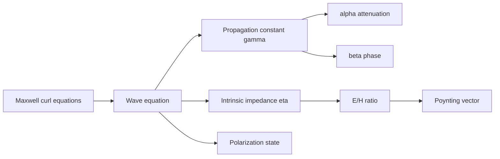

# Plane Waves, Loss, Polarization, and Power

Uniform plane waves are the simplest full electromagnetic waves. The fields are transverse to the direction of propagation, the wavefronts are infinite planes, and the field variation depends on one spatial coordinate. Real antennas and apertures do not create perfect plane waves everywhere, but far from a source or over a small region of a large wavefront, the plane-wave model is often the right local approximation.

This page develops plane waves in lossless and lossy media, polarization, skin depth, and electromagnetic power density. These ideas connect transmission-line wave impedance to free-space and material intrinsic impedance, and they prepare for reflection, refraction, waveguides, antennas, and radar.

## Definitions

For a time-harmonic uniform plane wave traveling in $+z$ with electric field polarized in $\hat x$,

$$
\tilde{\vec E}(z)=\hat x E_0 e^{-\gamma z},
$$

where

$$
\gamma=\alpha+j\beta.
$$

The magnetic field is

$$
\tilde{\vec H}(z)=\hat y\frac{E_0}{\eta}e^{-\gamma z},
$$

where $\eta$ is the intrinsic impedance:

$$
\eta=\sqrt{\frac{j\omega\mu}{\sigma+j\omega\epsilon}}.
$$

The propagation constant is

$$
\gamma=\sqrt{j\omega\mu(\sigma+j\omega\epsilon)}.
$$

For a lossless medium $(\sigma=0)$,

$$
\alpha=0,\qquad \beta=\omega\sqrt{\mu\epsilon},\qquad
\eta=\sqrt{\frac{\mu}{\epsilon}}.
$$

For a good conductor $(\sigma\gg\omega\epsilon)$,

$$
\alpha\approx\beta\approx\sqrt{\pi f\mu\sigma},
$$

and skin depth is

$$
\delta=\frac{1}{\alpha}.
$$

The time-average Poynting vector is

$$
\langle\vec S\rangle=\frac{1}{2}\mathrm{Re}\{\tilde{\vec E}\times\tilde{\vec H}^*\}.
$$

It gives average power flow density in W/m$^2$.

For a wave traveling in an arbitrary direction $\hat k$, the field directions must satisfy $\tilde{\vec E}\perp\hat k$, $\tilde{\vec H}\perp\hat k$, and $\tilde{\vec H}=(1/\eta)\hat k\times\tilde{\vec E}$ for a lossless medium. This compact vector relation is safer than memorizing separate $x$, $y$, and $z$ cases. It also makes polarization calculations easier because the electric-field vector can be decomposed into any two orthogonal transverse components.

## Key results

The wave equation in a source-free homogeneous medium follows from the phasor Maxwell curl equations:

$$
\nabla^2\tilde{\vec E}-\gamma^2\tilde{\vec E}=0,
$$

with the same form for $\tilde{\vec H}$. A uniform plane wave is transverse:

$$
\tilde{\vec E}\cdot\hat k=0,\qquad \tilde{\vec H}\cdot\hat k=0,
$$

and the propagation direction is set by

$$
\tilde{\vec E}\times\tilde{\vec H}.
$$

In a lossless medium, $\eta$ is real, so $\vec E$ and $\vec H$ are in time phase. The average power density magnitude is

$$
\langle S\rangle=\frac{|E_0|^2}{2\eta}
$$

for peak phasor amplitude. In a lossy medium, $\eta$ is complex and the fields are not exactly in phase. Power flow decays as $e^{-2\alpha z}$ because power is proportional to field magnitude squared.

Polarization describes the path traced by the electric-field vector at a fixed point. If orthogonal components have zero or $180^\circ$ phase difference, polarization is linear. If equal magnitudes have $\pm90^\circ$ phase difference, it is circular. The general case is elliptical:

$$
\tilde{\vec E}=\hat x E_x+\hat y E_y e^{j\delta}.
$$

The sign of $\delta$ and the viewing convention determine right-hand or left-hand circular polarization. The important engineering rule is to state the convention being used.

Lossy media are often characterized by loss tangent,

$$
\tan\delta_l=\frac{\sigma}{\omega\epsilon}.
$$

Low-loss dielectrics have $\tan\delta_l\ll1$, so conduction current is much smaller than displacement current. Good conductors have $\tan\delta_l\gg1$, so conduction dominates. This ratio is more informative than conductivity alone because the same material can behave differently as frequency changes.

The complex permittivity notation packages conduction loss into an effective material parameter:

$$
\epsilon_c=\epsilon-\frac{j\sigma}{\omega}
$$

for the $e^{j\omega t}$ convention. Then $\sigma+j\omega\epsilon=j\omega\epsilon_c$. This is a bookkeeping device, but it helps compare dielectric and conductive loss in wave equations and reflection formulas.

Polarization mismatch affects received power. If a receiving antenna is linearly polarized along $\hat a_r$ and the incoming electric field is polarized along $\hat a_i$, the received power is multiplied by $\vert \hat a_r\cdot\hat a_i\vert ^2$ for ideal linear polarizations. Orthogonal linear polarizations ideally deliver zero power, while a circularly polarized wave loses half its power into a linearly polarized antenna. Real antennas add axial-ratio and cross-polarization imperfections.

In lossy propagation, phase velocity, attenuation, and impedance can all be frequency dependent. A narrowband sinusoid may be described by one $\gamma$, but a pulse contains many frequencies, each with its own attenuation and phase delay. The resulting waveform distortion is dispersion, and it is important in soil propagation, seawater communication, and broadband dielectric materials.

Attenuation is often reported in dB per meter rather than Np per meter. For field amplitudes,

$$
\alpha_{\mathrm{dB/m}}=20\log_{10}(e)\alpha\approx8.686\alpha.
$$

For power, the same numerical dB loss over distance results from $e^{-2\alpha z}$ because power uses a $10\log_{10}$ ratio. Stating whether $\alpha$ is a field attenuation constant or a power-loss slope prevents double-counting loss.

A final consistency check is the direction of average power flow. For a passive medium with a wave attenuating in $+z$, $\langle\vec S\rangle$ should point in $+z$ and decrease with $z$. If the calculated $\vec E\times\vec H^*$ points backward, the assumed magnetic-field direction or propagation sign is likely reversed.

## Visual



| Medium | Condition | $\alpha$ | $\beta$ | $\eta$ behavior |
|---|---|---:|---:|---|
| Lossless dielectric | $\sigma=0$ | 0 | $\omega\sqrt{\mu\epsilon}$ | real |
| Low-loss dielectric | $\sigma\ll\omega\epsilon$ | small | near lossless value | nearly real |
| Good conductor | $\sigma\gg\omega\epsilon$ | $\sqrt{\pi f\mu\sigma}$ | approximately $\alpha$ | complex, small magnitude |
| Free space | $\epsilon_0,\mu_0,\sigma=0$ | 0 | $\omega/c$ | $377\ \Omega$ |

## Worked example 1: Plane wave in air

Problem: A $300$ MHz uniform plane wave in air has peak electric-field amplitude $E_0=10\ \mathrm{V/m}$ and travels in $+z$ with $\vec E$ along $\hat x$. Find wavelength, $\beta$, magnetic-field amplitude, and average power density.

Step 1: In air, take $u_p\approx c=3.0\times10^8\ \mathrm{m/s}$:

$$
\lambda=\frac{c}{f}=\frac{3.0\times10^8}{300\times10^6}=1.0\ \mathrm{m}.
$$

Step 2: Phase constant:

$$
\beta=\frac{2\pi}{\lambda}=2\pi\ \mathrm{rad/m}.
$$

Step 3: Intrinsic impedance of air is approximately $\eta_0=377\ \Omega$, so

$$
H_0=\frac{E_0}{\eta_0}=\frac{10}{377}=2.65\times10^{-2}\ \mathrm{A/m}.
$$

Step 4: Direction: $\vec E$ is $\hat x$ and propagation is $+\hat z$, so $\vec H$ must be $\hat y$ because $\hat x\times\hat y=\hat z$.

Step 5: Average power density:

$$
\langle S\rangle=\frac{E_0^2}{2\eta_0}
=\frac{100}{754}=0.133\ \mathrm{W/m^2}.
$$

Check: Units are W/m$^2$, and the power direction is $+\hat z$.

## Worked example 2: Skin depth in copper

Problem: Estimate the skin depth in copper at $f=10$ MHz. Use $\sigma=5.8\times10^7\ \mathrm{S/m}$ and $\mu\approx\mu_0$.

Step 1: For a good conductor,

$$
\alpha\approx\sqrt{\pi f\mu\sigma}.
$$

Step 2: Substitute:

$$
\alpha=\sqrt{\pi(10\times10^6)(4\pi\times10^{-7})(5.8\times10^7)}.
$$

Step 3: Compute the product inside the square root:

$$
\pi(10^7)(4\pi\times10^{-7})(5.8\times10^7)
\approx2.29\times10^9.
$$

Step 4: Square root:

$$
\alpha\approx4.79\times10^4\ \mathrm{m^{-1}}.
$$

Step 5: Skin depth:

$$
\delta=\frac{1}{\alpha}=2.09\times10^{-5}\ \mathrm{m}=20.9\ \mu\mathrm{m}.
$$

Check: Radio-frequency currents in copper are confined to a thin surface layer, so tens of micrometers at 10 MHz is plausible.

## Code

```python
import numpy as np
import matplotlib.pyplot as plt

mu0 = 4 * np.pi * 1e-7
eps0 = 8.8541878128e-12
sigma = 5.8e7

freq = np.logspace(3, 10, 400)
alpha = np.sqrt(np.pi * freq * mu0 * sigma)
delta = 1 / alpha

plt.loglog(freq, delta)
plt.xlabel("frequency (Hz)")
plt.ylabel("skin depth in copper (m)")
plt.grid(True, which="both")
plt.show()
```

## Common pitfalls

- Forgetting that $\vec E$, $\vec H$, and propagation direction form a right-handed triad for a forward plane wave.
- Using rms formulas with peak phasors or peak formulas with rms phasors. The factor of $1/2$ depends on convention.
- Treating attenuation of field amplitude and attenuation of power as the same exponent. Power decays as $e^{-2\alpha z}$.
- Calling any two-component field circularly polarized. Circular polarization requires equal magnitudes and a quadrature phase difference.
- Applying good-conductor approximations when $\sigma$ is not much larger than $\omega\epsilon$.
- Assuming plane waves have longitudinal field components. Uniform plane waves in homogeneous source-free media are transverse.
- Comparing penetration depths at different frequencies without noting that $\delta$ decreases as frequency increases in good conductors.

## Connections

- [Maxwell equations for time-varying fields](/physics/electromagnetics/maxwell-equations-time-varying-fields) for the wave-equation derivation.
- [Waves, phasors, and spectrum](/physics/electromagnetics/waves-phasors-spectrum) for $\alpha$, $\beta$, $\gamma$, and phasor notation.
- [Wave reflection, fibers, and waveguides](/physics/electromagnetics/reflection-transmission-fibers-waveguides) for what happens at material boundaries.
- [Antennas, radiation, and arrays](/physics/electromagnetics/antennas-radiation-arrays) for far-field waves from sources.
