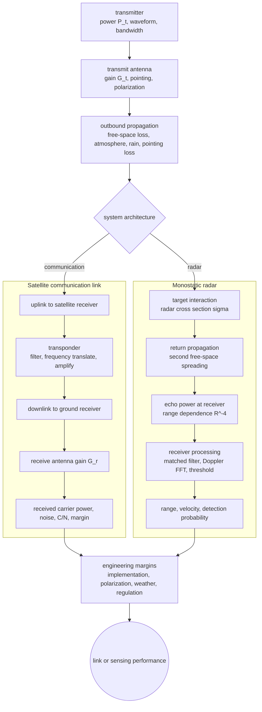

# Radar, Satellite Links, and Remote Sensing

Applied electromagnetics becomes system engineering in satellite communication and radar. The field formulas remain present, but they are embedded in link budgets, antenna beams, noise margins, range resolution, Doppler shifts, and target scattering. A satellite link asks how much transmitted power survives free-space spreading and antenna gains to become usable received power. A radar asks how much of the transmitted wave scatters from a target and returns to the receiver.

Ulaby's final chapter uses these systems as selected highlights rather than a complete communications or radar course. The goal of this page is the same: connect electromagnetic wave propagation, antennas, and power density to practical remote sensing and communication calculations.


*Figure: A radar dish gives remote sensing a physical aperture, beamwidth, and link-budget context. Image: [Wikimedia Commons](https://commons.wikimedia.org/wiki/File:C-band_Radar-dish_Antenna.jpg), NASA, public domain.*

## Definitions

Free-space path loss is the inverse of the Friis spreading factor:

$$
L_{\mathrm{fs}}=\left(\frac{4\pi R}{\lambda}\right)^2.
$$

In decibels,

$$
L_{\mathrm{fs,dB}}=20\log_{10}\frac{4\pi R}{\lambda}.
$$

A link budget tracks transmitted power, gains, losses, and received power. In dB units,

$$
P_r\text{(dBW)}=P_t\text{(dBW)}+G_t\text{(dB)}+G_r\text{(dB)}-L_{\mathrm{fs}}\text{(dB)}-L_{\mathrm{other}}\text{(dB)}.
$$

A radar cross section $\sigma$ is an effective area that represents how strongly a target scatters energy back toward the radar. For monostatic radar with the same antenna transmitting and receiving, the basic radar range equation is

$$
P_r=\frac{P_tG^2\lambda^2\sigma}{(4\pi)^3R^4}.
$$

The $R^{-4}$ dependence appears because the wave spreads as $R^{-2}$ on the outbound trip and the scattered wave spreads as $R^{-2}$ on the return trip.

Pulse radar range from time delay is

$$
R=\frac{c\Delta t}{2}.
$$

The factor of 2 accounts for round trip. Range resolution for pulse width $\tau$ is approximately

$$
\Delta R=\frac{c\tau}{2}.
$$

Doppler shift for radial speed $v_r$ in monostatic radar is approximately

$$
f_D=\frac{2v_r}{\lambda}.
$$

The sign depends on whether the target approaches or recedes and on receiver convention.

Noise is the other half of a link or radar calculation. Received power alone does not determine performance; it must be compared with noise power over the receiver bandwidth. Thermal noise is often estimated as

$$
P_n=kTB,
$$

where $k$ is Boltzmann's constant, $T$ is system noise temperature, and $B$ is bandwidth. Low-noise amplifiers, narrow filters, coding gain, and coherent integration are all ways to improve detectability when received signals are extremely weak.

## Key results

Satellite communication links use high-gain antennas because path distances are enormous. For a geostationary satellite range of roughly $3.6\times10^7$ m, free-space path loss at microwave frequencies can exceed 190 dB. This does not mean communication is impossible; it means every term in the link budget matters: transmit power, antenna gain, pointing, atmospheric loss, polarization, receiver noise, and modulation/coding margin.

The antenna beamwidth of an aperture scales roughly as

$$
\theta_{\mathrm{BW}}\sim\frac{\lambda}{D},
$$

where $D$ is aperture diameter. Larger dishes produce narrower beams and higher gain, but require better pointing. This is why satellite ground stations use parabolic reflectors and why radar angular resolution improves with aperture size.

Radar range resolution is controlled by bandwidth. A short pulse has large bandwidth and fine range resolution; pulse compression can combine high energy with large bandwidth by transmitting a coded waveform and processing the echo. Angular resolution is controlled primarily by antenna aperture and wavelength. Doppler processing separates moving targets by radial velocity.

Remote sensing uses interactions between waves and matter. Surface roughness, dielectric constant, moisture, vegetation structure, and geometry influence reflected or emitted signals. Microwave remote sensing is valuable because many microwave bands penetrate clouds and respond strongly to water content and surface structure.

Monopulse radar improves angle estimation by comparing signals in multiple antenna beams. Instead of scanning a beam and waiting for the maximum, it estimates target direction from simultaneous sum and difference patterns.

Radar ambiguity is a sampling problem in time and frequency. If pulses repeat every $T_r$, an echo arriving after the next pulse can be assigned to the wrong range unless the system design avoids or resolves ambiguity. The unambiguous range is approximately

$$
R_{\mathrm{unamb}}=\frac{cT_r}{2}.
$$

Similarly, Doppler estimation depends on pulse repetition frequency and coherent processing interval. Long coherent observation improves velocity resolution but may conflict with target maneuvering, scanning requirements, or range ambiguity constraints.

Remote-sensing interpretation must include polarization and incidence angle. A surface that is bright at one polarization or angle may be dark at another because roughness and dielectric contrast couple differently to field components. This is why radar images are not simple optical photographs; they are measurements of electromagnetic scattering geometry and material response.

Satellite transponders shift, amplify, and retransmit signals between uplink and downlink bands. Frequency translation prevents the strong transmitted downlink from interfering directly with the weak received uplink at the satellite. The antenna footprint, transponder bandwidth, polarization plan, and available power all shape how many channels or users the satellite can support.

In both radar and communication systems, margins matter. Rain attenuation, atmospheric absorption, pointing error, polarization loss, hardware aging, and implementation loss are usually added to the budget before declaring a link or detection range adequate. Electromagnetic formulas provide the ideal backbone; engineering budgets protect the design against nonideal operation.

System calculations should also respect regulatory and operational constraints. Transmit power, occupied bandwidth, antenna pointing, and frequency allocation are not chosen from physics alone. The electromagnetic model tells what is possible; spectrum rules and mission requirements decide what is allowed and useful.

## Visual



This system diagram shows why satellite links and radar share transmit and propagation blocks but diverge after the outbound path. The satellite branch adds a transponder, downlink, receive gain, and carrier-to-noise margin; the radar branch adds target cross section, return spreading, matched processing, Doppler, and detection. The final margin node records nonideal losses and regulatory constraints that decide whether the ideal electromagnetic calculation is usable.

| System quantity | Satellite link | Radar |
|---|---|---|
| Distance dependence | $R^{-2}$ one-way | $R^{-4}$ round-trip scattering |
| Main equation | Friis/link budget | radar range equation |
| Antenna role | close power budget, shape coverage | transmit beam, receive echo, angular resolution |
| Time measurement | propagation delay affects latency | delay gives range |
| Frequency shift | oscillator and motion compensation | Doppler gives radial velocity |

## Worked example 1: Satellite downlink received power

Problem: A satellite transmits $P_t=20$ W at $12$ GHz. The transmit antenna gain is $G_t=30$ dB, the ground receive antenna gain is $G_r=40$ dB, range is $R=3.8\times10^7$ m, and other losses total $3$ dB. Find received power in dBW.

Step 1: Convert transmit power to dBW:

$$
P_t\text{(dBW)}=10\log_{10}(20)=13.0\ \mathrm{dBW}.
$$

Step 2: Wavelength:

$$
\lambda=\frac{c}{f}=\frac{3.0\times10^8}{12\times10^9}=0.025\ \mathrm{m}.
$$

Step 3: Free-space path loss:

$$
L_{\mathrm{fs,dB}}=20\log_{10}\frac{4\pi R}{\lambda}.
$$

Step 4: Compute the ratio:

$$
\frac{4\pi R}{\lambda}
=\frac{4\pi(3.8\times10^7)}{0.025}
=1.91\times10^{10}.
$$

Step 5: Convert to dB:

$$
L_{\mathrm{fs,dB}}=20\log_{10}(1.91\times10^{10})
=205.6\ \mathrm{dB}.
$$

Step 6: Link budget:

$$
P_r=13.0+30+40-205.6-3=-125.6\ \mathrm{dBW}.
$$

Check: This is a very small power, about $2.75\times10^{-13}$ W, which is realistic for satellite receivers with low-noise front ends and bandwidth-aware detection.

## Worked example 2: Radar range and Doppler

Problem: A monostatic radar operates at $10$ GHz. An echo returns $40\ \mu$s after transmission, and the measured Doppler shift is $2$ kHz. Find target range and radial speed magnitude.

Step 1: Range from round-trip delay:

$$
R=\frac{c\Delta t}{2}.
$$

Step 2: Substitute:

$$
R=\frac{(3.0\times10^8)(40\times10^{-6})}{2}
=6.0\times10^3\ \mathrm{m}.
$$

Step 3: Wavelength:

$$
\lambda=\frac{c}{f}=\frac{3.0\times10^8}{10\times10^9}=0.03\ \mathrm{m}.
$$

Step 4: Doppler relation:

$$
|f_D|=\frac{2|v_r|}{\lambda}
\quad\Rightarrow\quad
|v_r|=\frac{|f_D|\lambda}{2}.
$$

Step 5: Substitute:

$$
|v_r|=\frac{(2000)(0.03)}{2}=30\ \mathrm{m/s}.
$$

Check: A 10 GHz radar has a 3 cm wavelength, so a 30 m/s target creates a few kilohertz of two-way Doppler shift, which is plausible.

## Code

```python
import numpy as np

c = 299_792_458.0

def fspl_db(R, f):
    wavelength = c / f
    return 20 * np.log10(4 * np.pi * R / wavelength)

def link_budget_dbw(Pt_w, Gt_db, Gr_db, R, f, other_losses_db=0):
    Pt_dbw = 10 * np.log10(Pt_w)
    return Pt_dbw + Gt_db + Gr_db - fspl_db(R, f) - other_losses_db

def radar_range(delay):
    return c * delay / 2

def radial_speed(fd, f):
    wavelength = c / f
    return abs(fd) * wavelength / 2

print("downlink Pr =", link_budget_dbw(20, 30, 40, 3.8e7, 12e9, 3), "dBW")
print("range =", radar_range(40e-6), "m")
print("speed =", radial_speed(2e3, 10e9), "m/s")
```

## Common pitfalls

- Forgetting the round-trip factor of 2 in radar range and Doppler.
- Using the one-way Friis equation for radar echo power. Monostatic radar has the $R^{-4}$ range dependence.
- Mixing dBW, dBm, and linear watts inside one link budget.
- Treating antenna gain as extra generated power. Gain redistributes radiated power spatially; it does not create energy.
- Ignoring wavelength in path loss comparisons. At the same range, higher frequency has larger free-space path loss for fixed antenna gains, but aperture-size constraints can change the system tradeoff.
- Confusing range resolution with maximum range. Resolution depends on pulse width or bandwidth; maximum range depends on power, noise, losses, and detection threshold.
- Interpreting radar cross section as literal physical area. It is an equivalent scattering measure and can be larger or smaller than the target's projected size.

## Connections

- [Antennas, radiation, and arrays](/physics/electromagnetics/antennas-radiation-arrays) for gain, effective area, and Friis formula.
- [Plane waves, loss, polarization, and power](/physics/electromagnetics/plane-waves-lossless-lossy-polarization) for power density and wavelength.
- [Reflection, transmission, fibers, and waveguides](/physics/electromagnetics/reflection-transmission-fibers-waveguides) for aperture and propagation concepts.
- [Signals and systems](/physics/signals-systems/) for bandwidth, pulses, Doppler processing, and filtering.
