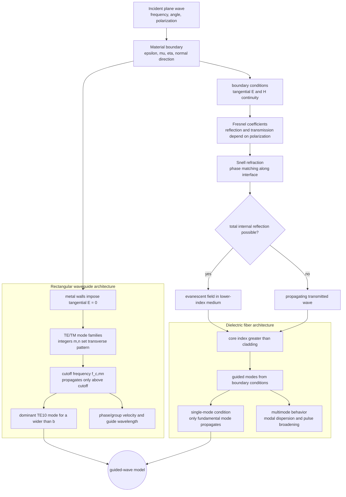

# Reflection, Transmission, Fibers, and Waveguides

When a plane wave meets a material boundary, Maxwell boundary conditions determine how much field reflects, how much transmits, and in what direction the transmitted wave travels. The same physical issue appeared earlier on transmission lines: a wave carrying one impedance reaches another impedance and partially returns. In space, impedance mismatch is joined by refraction, polarization dependence, total internal reflection, and Brewster-angle behavior.

Guided waves add geometry. Optical fibers guide light by total internal reflection or modal confinement. Metallic waveguides guide microwave fields with conducting boundaries and support discrete TE and TM modes. Cavities are closed waveguides that store energy at resonant frequencies. These topics show how fields, materials, and boundaries become engineered structures.

## Definitions

For normal incidence from medium 1 to medium 2, the electric-field reflection and transmission coefficients are

$$
\Gamma=\frac{\eta_2-\eta_1}{\eta_2+\eta_1},
$$

and

$$
\tau=1+\Gamma=\frac{2\eta_2}{\eta_2+\eta_1}
$$

for the transmitted electric field just across the boundary. For lossless media, the time-average reflected power fraction is $\vert \Gamma\vert ^2$.

Snell's law is

$$
n_1\sin\theta_i=n_2\sin\theta_t,
$$

where $n=\sqrt{\mu_r\epsilon_r}$ for simple media. For nonmagnetic dielectrics, $n\approx\sqrt{\epsilon_r}$.

Total internal reflection occurs for incidence from higher refractive index to lower refractive index when

$$
\theta_i>\theta_c,\qquad
\theta_c=\sin^{-1}\frac{n_2}{n_1}.
$$

For parallel polarization at a dielectric interface, the Brewster angle satisfies

$$
\theta_B=\tan^{-1}\frac{n_2}{n_1}
$$

for nonmagnetic lossless media.

Rectangular metallic waveguides have cross-section $a\times b$. Their cutoff wavenumber for mode indices $(m,n)$ is

$$
k_c=\sqrt{\left(\frac{m\pi}{a}\right)^2+\left(\frac{n\pi}{b}\right)^2}.
$$

The cutoff frequency is

$$
f_c=\frac{1}{2\pi\sqrt{\mu\epsilon}}k_c
=\frac{u_p}{2}\sqrt{\left(\frac{m}{a}\right)^2+\left(\frac{n}{b}\right)^2}.
$$

TE means the electric field has no component in the propagation direction, while TM means the magnetic field has no component in the propagation direction. TEM waves, like the ideal coaxial-line mode, require at least two conductors and have neither electric nor magnetic longitudinal components. A hollow single-conductor rectangular waveguide cannot support a true TEM mode because the boundary conditions and field topology do not allow the required static transverse potential solution.

## Key results

At oblique incidence, perpendicular and parallel polarizations have different reflection coefficients. The boundary conditions must be applied to tangential $\vec E$ and $\vec H$, producing Fresnel coefficients. The qualitative outcomes are:

- Reflection usually depends on angle and polarization.
- Transmitted angle follows Snell's law in lossless media.
- Above critical angle, transmitted power normal to the interface vanishes in the second medium, though an evanescent field exists near the boundary.
- At Brewster angle for parallel polarization, reflection can be zero for ideal lossless dielectrics.

For optical fibers, the numerical aperture for a step-index fiber in air is

$$
\mathrm{NA}=\sqrt{n_1^2-n_2^2},
$$

where $n_1$ is core index and $n_2$ is cladding index. It describes the acceptance cone for guided rays.

For rectangular waveguides, propagation occurs only when $f\gt f_c$ for a given mode. The propagation constant along the guide is

$$
\beta=\sqrt{k^2-k_c^2},
$$

where $k=\omega\sqrt{\mu\epsilon}$. Below cutoff, $\beta$ is imaginary and the mode decays instead of carrying power down the guide. The dominant mode in a standard rectangular guide with $a\gt b$ is usually TE$_{10}$ because it has the lowest cutoff:

$$
f_{c,10}=\frac{u_p}{2a}.
$$

Cavity resonators result when conducting walls close the guide, forcing standing-wave conditions in all dimensions. Their quality factor $Q$ measures stored energy relative to energy lost per radian.

Waveguide dispersion is another key difference from ordinary plane waves in unbounded media. The phase velocity along the guide is

$$
u_p=\frac{\omega}{\beta},
$$

and exceeds the material wave speed for propagating TE/TM modes, while the group velocity is lower. This does not violate relativity because information and energy move with group velocity, not phase velocity. Close to cutoff, group velocity becomes small and fields are strongly dispersive, so waveguides are usually operated comfortably above the dominant-mode cutoff but below the next mode's cutoff.

For fibers, ray optics gives intuition through total internal reflection, but full fiber analysis is modal. A single-mode fiber supports only the fundamental mode at a given wavelength and core size, reducing modal dispersion. A multimode fiber supports many paths or modes, which can broaden pulses and limit data rate unless graded-index design or digital compensation is used.

At a perfect electric conductor, the tangential electric field at the surface is zero. This boundary condition is what forces standing transverse field patterns in metallic waveguides. Surface currents on the walls support the required discontinuity in tangential $\vec H$. Real conductors have finite conductivity, so fields penetrate slightly and wall loss gives attenuation even above cutoff.

The transmission-line analogy remains useful but incomplete. Both lines and waveguides have propagation constants and characteristic impedances, yet waveguide impedance depends on mode type and frequency. Near cutoff, waveguide impedance can become very large or very small depending on TE or TM mode, which strongly affects coupling probes, irises, and transitions.

Mode excitation depends on source symmetry. A probe, loop, aperture, or transition couples efficiently only to modes with compatible field patterns. If the source field is orthogonal to a mode pattern over the cross section, coupling can be weak even when the frequency is above cutoff. Practical waveguide components therefore shape fields as carefully as they shape metal boundaries.

Single-mode operation is often a design goal because multiple propagating modes travel with different phase and group velocities. If more than one mode is excited, power can arrive with different delays or field patterns, complicating measurements and communication channels. Waveguide dimensions are therefore chosen to keep the operating band above the dominant cutoff and below the next cutoff.

## Visual



This diagram separates boundary scattering from guided-wave structure. The top pipeline applies electromagnetic boundary conditions to produce Fresnel reflection, transmission, refraction, and possible evanescent fields. The fiber and rectangular-waveguide subgraphs then show how those boundary facts become modal guidance, cutoff conditions, dominant modes, and dispersion.

| Phenomenon | Condition | Result |
|---|---|---|
| Normal reflection | $\eta_1\ne\eta_2$ | partial reflected wave |
| Total internal reflection | $n_1\gt n_2$, $\theta_i\gt \theta_c$ | guided or evanescent behavior |
| Brewster angle | parallel polarization, ideal dielectrics | zero reflected parallel field |
| Waveguide cutoff | $f\lt f_c$ | no propagating mode |
| Cavity resonance | standing waves in closed guide | discrete resonant frequencies |

## Worked example 1: Normal incidence from air to glass

Problem: A normally incident plane wave in air strikes lossless nonmagnetic glass with $\epsilon_r=4$. Find $\Gamma$, reflected power fraction, and transmitted electric-field coefficient.

Step 1: Intrinsic impedance in air is

$$
\eta_1=\eta_0.
$$

Step 2: For nonmagnetic glass,

$$
\eta_2=\frac{\eta_0}{\sqrt{\epsilon_r}}=\frac{\eta_0}{2}.
$$

Step 3: Reflection coefficient:

$$
\Gamma=\frac{\eta_2-\eta_1}{\eta_2+\eta_1}
=\frac{\eta_0/2-\eta_0}{\eta_0/2+\eta_0}
=\frac{-1/2}{3/2}=-\frac{1}{3}.
$$

Step 4: Reflected power fraction:

$$
|\Gamma|^2=\frac{1}{9}=0.111.
$$

Step 5: Electric-field transmission coefficient:

$$
\tau=1+\Gamma=1-\frac{1}{3}=\frac{2}{3}.
$$

Check: The transmitted electric-field amplitude is smaller, but power accounting also includes the impedance change.

## Worked example 2: TE10 cutoff in a rectangular waveguide

Problem: An air-filled rectangular waveguide has $a=2.286$ cm and $b=1.016$ cm. Find the TE$_{10}$ cutoff frequency and determine whether $10$ GHz propagates.

Step 1: For TE$_{10}$,

$$
f_c=\frac{c}{2a}.
$$

Step 2: Convert $a$:

$$
a=2.286\ \mathrm{cm}=0.02286\ \mathrm{m}.
$$

Step 3: Substitute:

$$
f_c=\frac{3.0\times10^8}{2(0.02286)}
=6.56\times10^9\ \mathrm{Hz}.
$$

Step 4: Compare $10$ GHz with cutoff:

$$
10\ \mathrm{GHz}>6.56\ \mathrm{GHz}.
$$

Therefore TE$_{10}$ propagates.

Step 5: Optional guide wavelength. First compute free-space wavelength:

$$
\lambda=\frac{c}{f}=0.03\ \mathrm{m}.
$$

For TE modes,

$$
\beta=k\sqrt{1-(f_c/f)^2}.
$$

Since $f_c/f=0.656$, propagation is above cutoff but phase behavior differs from free-space propagation.

Check: This dimension is the common WR-90 broad wall, whose useful band includes X-band near 10 GHz.

## Code

```python
import numpy as np

c = 299_792_458.0

def normal_incidence_gamma(er1, er2, mur1=1.0, mur2=1.0):
    eta1 = np.sqrt(mur1 / er1)
    eta2 = np.sqrt(mur2 / er2)
    return (eta2 - eta1) / (eta2 + eta1)

def rectangular_cutoff(a, b, m, n, eps_r=1.0, mu_r=1.0):
    vp = c / np.sqrt(eps_r * mu_r)
    return 0.5 * vp * np.sqrt((m / a)**2 + (n / b)**2)

print("Gamma air to er=4:", normal_incidence_gamma(1, 4))
print("TE10 cutoff:", rectangular_cutoff(0.02286, 0.01016, 1, 0), "Hz")
```

## Common pitfalls

- Using the transmission-line reflection coefficient formula with $Z$ but forgetting that plane waves use intrinsic impedance $\eta$.
- Assuming transmitted field coefficient squared is transmitted power fraction. Power depends on impedance and angle.
- Forgetting polarization dependence at oblique incidence.
- Applying total internal reflection when the wave goes from lower index to higher index. It requires incidence from higher index.
- Treating waveguide cutoff as material absorption. Below cutoff the mode is evanescent even in a perfectly conducting, lossless guide.
- Calling TE and TM modes by their electric-field direction relative to a wall. TE/TM are defined relative to the propagation direction.
- Assuming a waveguide can carry any low frequency if the source is strong enough. Below cutoff, increasing source power does not create a propagating mode of that type.

## Connections

- [Plane waves, loss, polarization, and power](/physics/electromagnetics/plane-waves-lossless-lossy-polarization) for $\eta$, $\gamma$, polarization, and Poynting vector.
- [Reflections, Smith chart, and matching](/physics/electromagnetics/reflections-smith-chart-and-matching) for the guided-wave impedance analogy.
- [Maxwell equations for time-varying fields](/physics/electromagnetics/maxwell-equations-time-varying-fields) for boundary conditions.
- [Antennas, radiation, and arrays](/physics/electromagnetics/antennas-radiation-arrays) for apertures and radiation from guided structures.
