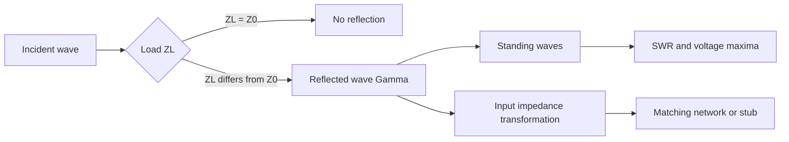

# Reflections, Smith Chart, and Matching

Reflections occur whenever a traveling wave reaches a discontinuity whose impedance differs from the wave impedance it has been carrying. On a transmission line, that discontinuity may be a load, a connector, a width change, a via, or another line section. The reflected wave interferes with the incident wave and creates standing-wave patterns, input-impedance transformations, and sometimes severe power-transfer loss.

Impedance matching is the practical response: choose a network or line section so the source sees the intended impedance and the load receives the intended power. Ulaby treats reflection coefficients, standing-wave ratio, special line lengths, the Smith chart, lumped matching, and single-stub matching. This page organizes those ideas in formula form while keeping the physical picture visible.


*Figure: Smith chart used for transmission-line impedance matching. Image: [Wikimedia Commons](https://commons.wikimedia.org/wiki/File:Smith_chart.svg), Cannabic, CC BY-SA 4.0.*

## Definitions

For a lossless line terminated by load $Z_L$, the voltage reflection coefficient at the load is

$$
\Gamma_L=\frac{Z_L-Z_0}{Z_L+Z_0}.
$$

The reflected and incident voltage amplitudes at the load satisfy

$$
\Gamma_L=\frac{V_0^-}{V_0^+}.
$$

The standing-wave ratio is

$$
S=\frac{V_{\max}}{V_{\min}}=\frac{1+|\Gamma_L|}{1-|\Gamma_L|}.
$$

The input impedance looking into a lossless line of length $l$ terminated by $Z_L$ is

$$
Z_{\mathrm{in}}=Z_0
\frac{Z_L+jZ_0\tan(\beta l)}
{Z_0+jZ_L\tan(\beta l)}.
$$

Special cases are especially useful:

$$
\begin{aligned}
Z_{\mathrm{in,short}} &= jZ_0\tan(\beta l),\\
Z_{\mathrm{in,open}} &= -jZ_0\cot(\beta l),\\
Z_{\mathrm{in}}(l=\lambda/4)&=\frac{Z_0^2}{Z_L}.
\end{aligned}
$$

The normalized load impedance is

$$
z_L=\frac{Z_L}{Z_0}=r+jx.
$$

The Smith chart is a plot of constant resistance and reactance circles in the $\Gamma$ plane. Moving away from the load toward the generator rotates clockwise on the chart for the common impedance-chart convention.

Although computer tools often replace manual chart use, the Smith chart is still valuable because it shows several quantities at once. The distance from the center is $\vert \Gamma\vert $, the angle gives reflection phase, circles around the center correspond to constant SWR, and rotations correspond to lossless line lengths. A matching problem becomes a geometric task: move along a constant-$\vert \Gamma\vert $ circle until a realizable series, shunt, or stub element can bring the point to the chart center.

## Key results

Reflection magnitude indicates mismatch severity, while reflection phase locates standing-wave maxima and minima. The voltage magnitude along a lossless line can be expressed as

$$
|\tilde V(z)|=|V_0^+|\left|e^{-j\beta z}+\Gamma_L e^{j\beta z}\right|,
$$

where $z=0$ is often taken at the load and $z\lt 0$ points toward the generator. Constructive interference gives maxima; destructive interference gives minima.

The load absorbs all incident power only when $\Gamma_L=0$, which occurs when $Z_L=Z_0$. A short circuit has $\Gamma_L=-1$, an open circuit has $\Gamma_L=+1$, and a purely reactive load has $\vert \Gamma_L\vert =1$, meaning no net time-average power is dissipated in the load.

A quarter-wave transformer matches a real load $R_L$ to a real line impedance $Z_0$ by inserting a $\lambda/4$ section with characteristic impedance

$$
Z_{0t}=\sqrt{Z_0R_L}.
$$

This match is narrowband because it relies on $\beta l=\pi/2$ at the design frequency. Lumped $L$ networks are compact at lower frequencies, while stubs are natural at microwave frequencies where line sections are easier to fabricate than ideal inductors and capacitors.

For admittance matching, use

$$
y=\frac{Y}{Y_0}=\frac{1}{z}.
$$

On the Smith chart, impedance-to-admittance conversion corresponds to a $180^\circ$ rotation in the reflection-coefficient plane.

Single-stub matching usually works in admittance form because a shunt stub adds susceptance directly. The design idea is to move from the load along the line until the normalized admittance has conductance $g=1$, then add a short- or open-circuited stub whose susceptance cancels the remaining imaginary part. There are generally two possible stub locations within a half wavelength, and the better one depends on layout, bandwidth, and whether open or short stubs are easier to fabricate.

Lumped matching is attractive when the required inductors and capacitors behave close to ideal components. At microwave frequencies, however, component parasitics and package dimensions can be comparable to wavelength effects. Distributed matching with line sections then becomes more predictable because it uses the propagation physics directly rather than fighting it.

Input impedance transformations also explain why moving a measurement reference plane changes the impedance reported by a network analyzer. The physical load has not changed, but the section of line between the calibration plane and the load rotates the reflection coefficient. Calibration, de-embedding, and fixture design are therefore part of microwave measurement rather than administrative details.

Bandwidth should be judged against the application, not against the existence of a mathematical match at one frequency. A high-Q matching network can produce a deep narrow reflection minimum but perform poorly across a modulated signal bandwidth. A deliberately less perfect match with flatter response may deliver more useful system performance.

Return loss is another way to report mismatch:

$$
RL=-20\log_{10}|\Gamma|\ \mathrm{dB}.
$$

Large positive return loss means small reflection. For example, $\vert \Gamma\vert =0.1$ corresponds to $20$ dB return loss and $1$ percent reflected power. Return loss is often easier to read on network-analyzer plots than raw complex reflection coefficient, but it hides reflection phase, which is still needed for matching-network design.

Voltage maxima and minima are also measurement tools. The distance from a voltage minimum to the load encodes the phase of $\Gamma_L$, while SWR gives its magnitude. Before vector network analyzers were routine, slotted-line measurements used this standing-wave geometry to infer unknown load impedances.

For passive loads on a lossless line, all physically valid reflection coefficients lie inside or on the unit circle. A calculated point outside the Smith chart's outer circle usually means an algebra or normalization error unless an active load is intentionally being modeled.

## Visual



| Load | $\Gamma_L$ | $\vert \Gamma_L\vert $ | SWR | Power behavior |
|---|---:|---:|---:|---|
| $Z_L=Z_0$ | $0$ | 0 | 1 | all incident power delivered |
| Short | $-1$ | 1 | infinite | no load dissipation |
| Open | $+1$ | 1 | infinite | no load dissipation |
| Pure reactance | phase only | 1 | infinite | stores and returns energy |
| Real mismatch | $(R_L-Z_0)/(R_L+Z_0)$ | between 0 and 1 | finite | partial delivery |

## Worked example 1: Reflection coefficient and SWR

Problem: A $50\ \Omega$ lossless line is terminated by $Z_L=100-j50\ \Omega$. Find $\Gamma_L$ and SWR.

Step 1: Substitute into the reflection formula:

$$
\Gamma_L=\frac{(100-j50)-50}{(100-j50)+50}
=\frac{50-j50}{150-j50}.
$$

Step 2: Divide complex numbers by multiplying numerator and denominator by $150+j50$:

$$
\Gamma_L=\frac{(50-j50)(150+j50)}{150^2+50^2}.
$$

Step 3: Expand the numerator:

$$
(50-j50)(150+j50)=7500+j2500-j7500+2500=10000-j5000.
$$

Step 4: Denominator:

$$
150^2+50^2=22500+2500=25000.
$$

Thus

$$
\Gamma_L=0.4-j0.2.
$$

Step 5: Magnitude:

$$
|\Gamma_L|=\sqrt{0.4^2+(-0.2)^2}=0.447.
$$

Step 6: SWR:

$$
S=\frac{1+0.447}{1-0.447}=2.62.
$$

Check: Since $\vert \Gamma_L\vert \lt 1$, the passive load absorbs some power. SWR above 1 indicates mismatch.

## Worked example 2: Quarter-wave transformer design

Problem: A $50\ \Omega$ line must feed a real $200\ \Omega$ load at $1\ \mathrm{GHz}$. The transformer section has phase velocity $2.0\times10^8\ \mathrm{m/s}$. Find the transformer impedance and physical length.

Step 1: For a quarter-wave transformer,

$$
Z_{0t}=\sqrt{Z_0R_L}=\sqrt{50\cdot200}=100\ \Omega.
$$

Step 2: Wavelength on the transformer line:

$$
\lambda_t=\frac{u_p}{f}=\frac{2.0\times10^8}{1.0\times10^9}=0.20\ \mathrm{m}.
$$

Step 3: Quarter wavelength:

$$
l=\frac{\lambda_t}{4}=0.050\ \mathrm{m}=5.0\ \mathrm{cm}.
$$

Step 4: Verify input impedance at the design frequency:

$$
Z_{\mathrm{in}}=\frac{Z_{0t}^2}{R_L}
=\frac{100^2}{200}=50\ \Omega.
$$

Check: The source-side line sees its own $Z_0$, so $\Gamma=0$ at the design frequency.

## Code

```python
import numpy as np

Z0 = 50
ZL = 100 - 1j * 50
Gamma = (ZL - Z0) / (ZL + Z0)
SWR = (1 + abs(Gamma)) / (1 - abs(Gamma))

print(f"Gamma = {Gamma.real:.3f} {Gamma.imag:+.3f}j")
print(f"|Gamma| = {abs(Gamma):.3f}")
print(f"SWR = {SWR:.2f}")

f = 1e9
vp = 2e8
Z0t = np.sqrt(50 * 200)
length = vp / f / 4
print(f"Quarter-wave transformer: Z0t={Z0t:.1f} ohms, length={length:.3f} m")
```

## Common pitfalls

- Using $Z_L-Z_0$ over $Z_L+Z_0$ with normalized impedance already substituted incorrectly. If $z_L=Z_L/Z_0$, then $\Gamma=(z_L-1)/(z_L+1)$.
- Confusing reflection coefficient for voltage with reflected power fraction. Reflected power fraction is $\vert \Gamma\vert ^2$ for a lossless line.
- Assuming a quarter-wave transformer matches complex loads directly. The simple formula requires a real load at the transformer input plane.
- Forgetting that Smith-chart rotation depends on whether you move toward the generator or toward the load.
- Ignoring bandwidth. A match can be exact at one frequency and poor nearby.
- Treating a high SWR as automatically destructive. The consequence depends on source tolerance, line loss, voltage breakdown, and power level.
- Forgetting that a perfect match at the load plane can be spoiled by connectors, vias, bends, or transitions placed between the matching network and the actual device.

## Connections

- [Transmission-line models and wave equations](/physics/electromagnetics/transmission-line-models-and-wave-equations) for $Z_0$, $\beta$, and traveling waves.
- [Transmission-line transients and power](/physics/electromagnetics/transmission-line-transients-and-power) for time-domain reflections.
- [Wave reflection, fibers, and waveguides](/physics/electromagnetics/reflection-transmission-fibers-waveguides) for the plane-wave analogue of impedance mismatch.
- [Complex functions and analyticity](/math/engineering-math/complex-functions-and-analyticity) for complex arithmetic behind $\Gamma$.
