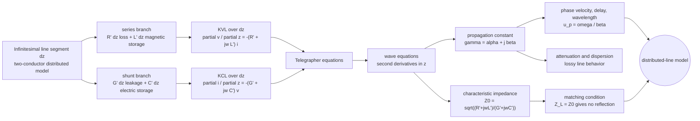

# Transmission-Line Models and Wave Equations

Transmission lines are the bridge from circuit theory to field theory. When a wire pair, coaxial cable, or microstrip is electrically short, the entire interconnect can be approximated by a lumped impedance. When its physical length is a significant fraction of wavelength, voltage and current vary along the structure, propagation delay matters, and reflections can dominate behavior. That is the moment when a wire stops being a simple node connection and becomes a distributed electromagnetic system.

The transmission-line model keeps the circuit variables $v(z,t)$ and $i(z,t)$, but lets them depend on position. Its distributed parameters $R'$, $L'$, $G'$, and $C'$ summarize the fields around the conductors per unit length. This page develops the telegrapher equations, wave propagation, characteristic impedance, and the lossless-line formulas used later for standing waves and matching.

## Definitions

A uniform transmission line is modeled by per-unit-length parameters:

| Parameter | Units | Meaning |
|---|---:|---|
| $R'$ | $\Omega/\mathrm{m}$ | conductor resistance per unit length |
| $L'$ | H/m | series inductance per unit length |
| $G'$ | S/m | shunt conductance through dielectric per unit length |
| $C'$ | F/m | shunt capacitance per unit length |

The phasor-domain telegrapher equations are

$$
\begin{aligned}
\frac{d\tilde V}{dz} &= -(R'+j\omega L')\tilde I,\\
\frac{d\tilde I}{dz} &= -(G'+j\omega C')\tilde V.
\end{aligned}
$$

Combining them gives wave equations:

$$
\frac{d^2\tilde V}{dz^2}=\gamma^2\tilde V,\qquad
\frac{d^2\tilde I}{dz^2}=\gamma^2\tilde I,
$$

where

$$
\gamma=\sqrt{(R'+j\omega L')(G'+j\omega C')}.
$$

The characteristic impedance is

$$
Z_0=\sqrt{\frac{R'+j\omega L'}{G'+j\omega C'}}.
$$

For a lossless line, $R'=0$ and $G'=0$, so

$$
\gamma=j\beta=j\omega\sqrt{L'C'},\qquad
Z_0=\sqrt{\frac{L'}{C'}},\qquad
u_p=\frac{1}{\sqrt{L'C'}}.
$$

The general lossless voltage and current phasors are

$$
\tilde V(z)=V_0^+e^{-j\beta z}+V_0^-e^{j\beta z},
$$

$$
\tilde I(z)=\frac{V_0^+}{Z_0}e^{-j\beta z}-\frac{V_0^-}{Z_0}e^{j\beta z}.
$$

The $+$ superscript denotes a wave traveling in the $+z$ direction; the $-$ superscript denotes a wave traveling in the $-z$ direction.

The current expression is not symmetric with the voltage expression because a backward voltage wave carries current in the negative $z$ direction. This sign convention is the source of many later formulas, including the reflection coefficient and input impedance. A forward wave alone has $\tilde V/\tilde I=Z_0$; a backward wave alone has $\tilde V/\tilde I=-Z_0$ when current is defined positive in the $+z$ direction.

## Key results

The telegrapher equations come from applying Kirchhoff voltage and current laws to a differential segment $\Delta z$ and then taking the limit $\Delta z\to 0$. Although the derivation looks like circuit theory, the parameters represent electromagnetic storage and loss:

$$
w_m=\frac{1}{2}L'|i|^2,\qquad
w_e=\frac{1}{2}C'|v|^2
$$

per unit length for instantaneous energy in the lossless case.

When a line is terminated by its characteristic impedance $Z_0$, the load absorbs the incident wave without reflection. The line then looks infinitely long from the source end because no returning wave reports the load or line end. This idea is the basis of matched interconnects, microwave terminations, and many measurement systems.

The wavelength on a line is

$$
\lambda=\frac{2\pi}{\beta}=\frac{u_p}{f}.
$$

Electrical length is usually more important than physical length:

$$
\theta=\beta l=\frac{2\pi l}{\lambda}.
$$

A $5$ cm trace is electrically short at low frequency and electrically long at microwave frequency. The rough engineering rule is that distributed effects become important when $l$ is not negligible compared with $\lambda$, often when $l\gtrsim \lambda/10$ for phase-sensitive work.

For a lossless microstrip or coaxial line, $Z_0$ and $u_p$ depend on geometry and material. The same telegrapher equations apply after the structure is summarized by its effective $L'$ and $C'$, or by an effective dielectric constant.

The distributed model is also an energy model. In a small section $\Delta z$, magnetic energy is associated with $L'\Delta z$ and electric energy with $C'\Delta z$. A traveling wave moves by exchanging these stored forms while carrying power forward. In a lossless matched line the average electric and magnetic stored energies are equal over a cycle, just as they are for a uniform plane wave in a lossless medium.

A lossy line changes the interpretation of $Z_0$. It can become complex because voltage and current are no longer exactly in phase for a single traveling wave. The attenuation constant $\alpha$ accounts for conductor heating through $R'$ and dielectric leakage through $G'$. At high frequency, practical lines may also have frequency-dependent $R'$ and $G'$, producing dispersion and waveform distortion even when the telegrapher form still applies locally.

The distributed viewpoint also changes how "ground" and "return current" are understood. A signal on a two-conductor line is not carried by one conductor alone; the electromagnetic field occupies the space between and around conductors, and the return path shapes both $L'$ and $C'$. In microstrip, for example, some field exists in the substrate and some in air, so an effective permittivity is used rather than simply the substrate permittivity. This is why layout geometry is part of the circuit at high frequency.

A line can be electrically long even in ordinary digital hardware. The fastest spectral content of an edge, not just the clock frequency, sets the shortest relevant wavelength. Controlled impedance, continuous return planes, and careful transitions keep the distributed parameters predictable so the telegrapher model remains useful.

## Visual



The transmission-line diagram starts from the per-unit-length equivalent circuit and derives the telegrapher equations through KVL and KCL. The wave-equation layer then exposes the propagation constant, attenuation, phase, characteristic impedance, delay, wavelength, and matching condition. The labeled branches make the energy-storage roles of $L'$ and $C'$ and the loss roles of $R'$ and $G'$ explicit.

| Case | $\gamma$ | $Z_0$ | Main behavior |
|---|---|---|---|
| General lossy | $\sqrt{(R'+j\omega L')(G'+j\omega C')}$ | $\sqrt{(R'+j\omega L')/(G'+j\omega C')}$ | attenuation plus phase |
| Lossless | $j\omega\sqrt{L'C'}$ | $\sqrt{L'/C'}$ | no attenuation, pure delay |
| Low-loss | $\alpha+j\beta$ with small $\alpha$ | nearly real | weak attenuation |
| Matched load | same line $\gamma$ | $Z_L=Z_0$ | no reflected wave |

## Worked example 1: Lossless line parameters

Problem: A lossless transmission line has $L'=250\ \mathrm{nH/m}$ and $C'=100\ \mathrm{pF/m}$. Find $Z_0$, phase velocity, wavelength at $100\ \mathrm{MHz}$, and electrical length of a $0.75$ m section.

Step 1: Compute characteristic impedance:

$$
Z_0=\sqrt{\frac{L'}{C'}}
=\sqrt{\frac{250\times10^{-9}}{100\times10^{-12}}}
=50\ \Omega.
$$

Step 2: Compute phase velocity:

$$
u_p=\frac{1}{\sqrt{L'C'}}
=\frac{1}{\sqrt{(250\times10^{-9})(100\times10^{-12})}}
=2.0\times10^8\ \mathrm{m/s}.
$$

Step 3: Compute wavelength:

$$
\lambda=\frac{u_p}{f}
=\frac{2.0\times10^8}{100\times10^6}
=2.0\ \mathrm{m}.
$$

Step 4: Compute electrical length:

$$
\theta=\beta l=\frac{2\pi}{\lambda}l
=\frac{2\pi}{2.0}(0.75)=0.75\pi\ \mathrm{rad}=135^\circ.
$$

Check: The line is much longer than $\lambda/10=0.2$ m, so distributed effects cannot be ignored.

## Worked example 2: Time delay and phase shift

Problem: A $3$ m cable has phase velocity $2.4\times 10^8\ \mathrm{m/s}$. A $200\ \mathrm{MHz}$ sinusoid enters the cable. Find the one-way delay and phase shift.

Step 1: Delay is length divided by phase velocity:

$$
t_d=\frac{l}{u_p}=\frac{3}{2.4\times10^8}=12.5\ \mathrm{ns}.
$$

Step 2: Period is

$$
T=\frac{1}{f}=\frac{1}{200\times10^6}=5\ \mathrm{ns}.
$$

Step 3: The delay is $12.5/5=2.5$ cycles. Convert to phase:

$$
\theta=2\pi(2.5)=5\pi\ \mathrm{rad}=900^\circ.
$$

Step 4: Phase is periodic, so the observed sinusoidal phase shift is equivalent to

$$
900^\circ \equiv 180^\circ \pmod{360^\circ}.
$$

Check: The absolute propagation delay is still $12.5$ ns. The reduced phase only describes a steady sinusoid, not the arrival time of a modulation envelope.

## Code

```python
import numpy as np

L_per_m = 250e-9
C_per_m = 100e-12
f = 100e6
length = 0.75

Z0 = np.sqrt(L_per_m / C_per_m)
vp = 1 / np.sqrt(L_per_m * C_per_m)
wavelength = vp / f
beta = 2 * np.pi / wavelength
theta_deg = np.rad2deg(beta * length)

print(f"Z0 = {Z0:.2f} ohms")
print(f"vp = {vp:.3e} m/s")
print(f"lambda = {wavelength:.3f} m")
print(f"electrical length = {theta_deg:.1f} degrees")
```

## Common pitfalls

- Treating a long line as a lumped wire because its dc resistance is small. Propagation delay and reflection are separate from resistance.
- Confusing $Z_0$ with the actual input impedance. $Z_0$ is a property of the line; input impedance also depends on load and length.
- Forgetting that the current expression has a minus sign for the reflected wave.
- Using free-space wavelength when the wave travels in a dielectric line.
- Assuming a matched line means no voltage or current. It means no reflected wave; power still travels to the load.
- Applying lossless formulas to a line where conductor or dielectric loss is important.
- Forgetting that $R'$, $L'$, $G'$, and $C'$ are per-unit-length values. Multiplying or dividing by length incorrectly changes units and physical meaning.

## Connections

- [Waves, phasors, and spectrum](/physics/electromagnetics/waves-phasors-spectrum) for sinusoidal traveling-wave notation.
- [Reflections, Smith chart, and matching](/physics/electromagnetics/reflections-smith-chart-and-matching) for load effects.
- [Transmission-line transients and power](/physics/electromagnetics/transmission-line-transients-and-power) for bounce diagrams and time-domain behavior.
- [Plane waves in media](/physics/electromagnetics/plane-waves-lossless-lossy-polarization) for the field analogue of guided propagation.
