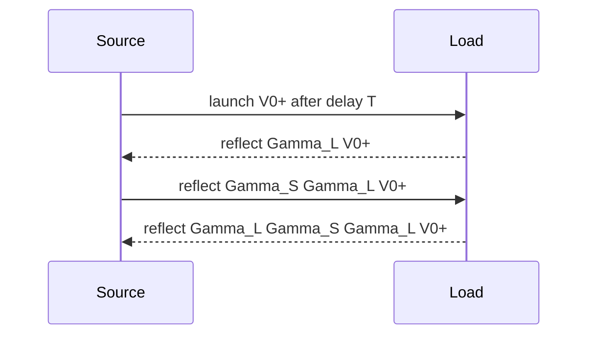

# Transmission-Line Power and Transients

Sinusoidal analysis shows steady standing waves, but real interconnects also carry pulses, steps, and digital edges. In the time domain, a voltage change launched by a source travels with finite velocity, reflects from impedance discontinuities, and may bounce between source and load several times before settling. These effects are central to oscilloscopes, time-domain reflectometry, high-speed digital design, pulse power, and microwave measurement.

Power is the complementary viewpoint. Voltage and current waves carry energy down the line, and reflected waves carry undelivered energy back. The same impedance mismatch that creates standing waves in phasor analysis creates bounce diagrams in transient analysis. This page ties those pictures together.

## Definitions

For a lossless line with forward and backward traveling time-domain waves,

$$
v(z,t)=v^+(t-z/u_p)+v^-(t+z/u_p),
$$

and

$$
i(z,t)=\frac{v^+(t-z/u_p)}{Z_0}-\frac{v^-(t+z/u_p)}{Z_0}.
$$

The instantaneous power is

$$
p(z,t)=v(z,t)i(z,t).
$$

For a single forward wave,

$$
p^+(z,t)=\frac{[v^+(t-z/u_p)]^2}{Z_0}.
$$

For sinusoidal phasors on a lossless line, the time-average power carried by a forward voltage amplitude $V_0^+$ is

$$
P^+=\frac{|V_0^+|^2}{2Z_0}
$$

when $V_0^+$ is peak amplitude. The reflected power magnitude is

$$
P^-=\frac{|V_0^-|^2}{2Z_0}=|\Gamma|^2P^+.
$$

At a resistive source with Thevenin voltage $V_s$ and source resistance $R_s$, the initially launched step voltage onto a line is determined by a voltage divider:

$$
V_0^+=V_s\frac{Z_0}{R_s+Z_0}.
$$

Load and source reflection coefficients for transients are

$$
\Gamma_L=\frac{R_L-Z_0}{R_L+Z_0},\qquad
\Gamma_S=\frac{R_S-Z_0}{R_S+Z_0},
$$

when the terminations are resistive.

For nonresistive terminations, the reflection is no longer just a constant multiplier in time. A capacitor, inductor, diode, or nonlinear load produces a response governed by a differential equation at the boundary. The bounce-diagram idea still helps, but each arrival must be processed through the load dynamics rather than multiplied by a fixed $\Gamma_L$. This is one reason high-speed digital interconnect simulation often uses time-domain circuit solvers with distributed line models.

## Key results

A bounce diagram tracks wave increments. A wave launched from the source reaches the load after one delay $T=l/u_p$, reflects by $\Gamma_L$, returns to the source after another delay, reflects by $\Gamma_S$, and repeats. The load voltage is updated whenever a wave arrives at the load:

$$
\Delta V_L=(1+\Gamma_L)V_{\text{incident at load}}.
$$

The source-end line voltage is updated whenever a wave arrives at the source:

$$
\Delta V_S=(1+\Gamma_S)V_{\text{incident at source}}.
$$

If $\vert \Gamma_L\Gamma_S\vert \lt 1$, the successive bounces decay and the line settles to the dc circuit result. If either end is perfectly open or short, the reflections may persist in an ideal lossless line; real loss eventually dissipates energy.

Power and reflection are connected through conservation. For a lossless line feeding a load,

$$
P_{\text{delivered}}=P^+(1-|\Gamma_L|^2).
$$

This formula is for time-average sinusoidal power or energy fractions of pulses when the line and load are real. A purely reactive load has $\vert \Gamma_L\vert =1$, so it takes no net average power, even though voltage and current at the load can be large.

Time-domain reflectometry uses the sign and timing of reflections to infer discontinuities. A positive reflection indicates an impedance higher than $Z_0$; a negative reflection indicates lower impedance. The round-trip time locates the discontinuity:

$$
d=\frac{u_p\Delta t}{2}.
$$

Energy conservation gives a useful check on transient calculations. At a matched load, the incoming wave energy is absorbed and no wave returns. At an open circuit, the load current must be zero, so the reflected current cancels the incident current and the voltage doubles. At a short circuit, the load voltage must be zero, so the reflected voltage cancels the incident voltage and the current doubles in magnitude. These boundary requirements are often easier to remember than the signs of $\Gamma$.

The steady-state value of a step response can be checked independently by replacing the lossless line with a wire after all transients settle. At dc, ideal $L'$ behaves as a short and ideal $C'$ behaves as an open, so only the Thevenin source and load resistances determine the final voltage. Any bounce calculation that converges to a different value has a sign, timing, or coefficient error.

Digital interconnects use the same physics even when no sinusoidal source is visible. A fast edge contains high-frequency components, and those components see the trace as an electrically long structure. Slowing the edge, adding source termination, using controlled-impedance routing, or placing a matched load all reduce harmful reflections. The relevant comparison is edge rise time against line delay, not just clock period against line length.

Source termination and load termination behave differently. A matched load prevents the first incident wave from reflecting at the load. A matched source absorbs waves that return from the load, so the load may not reach its final value until after a round trip, but subsequent bouncing is suppressed. The right choice depends on power, latency, dc loading, and whether the interconnect is point-to-point or multidrop.

Loss changes bounce diagrams gradually rather than changing the reflection logic at boundaries. Each traveling increment is attenuated while it propagates, so later bounces are smaller than ideal even if $\vert \Gamma_L\Gamma_S\vert $ is close to one. Real cables also disperse sharp edges, rounding the steps seen in measured TDR traces.

## Visual



| Termination | Reflection coefficient | Step response tendency |
|---|---:|---|
| Matched $R=Z_0$ | $0$ | one arrival, no bounce |
| Open circuit | $+1$ | voltage doubles at open load |
| Short circuit | $-1$ | voltage cancels at short load |
| High resistance | positive | upward reflected step |
| Low resistance | negative | downward reflected step |

## Worked example 1: Reflected power from SWR data

Problem: A lossless $50\ \Omega$ line carries $P^+=20\ \mathrm{W}$ toward a load. The measured SWR is $S=3$. Find $\vert \Gamma\vert $, reflected power, and delivered power.

Step 1: Solve the SWR formula for $\vert \Gamma\vert $:

$$
S=\frac{1+|\Gamma|}{1-|\Gamma|}
\quad\Rightarrow\quad
|\Gamma|=\frac{S-1}{S+1}.
$$

Step 2: Substitute $S=3$:

$$
|\Gamma|=\frac{3-1}{3+1}=0.5.
$$

Step 3: Reflected power fraction is $\vert \Gamma\vert ^2$:

$$
|\Gamma|^2=0.25.
$$

Step 4: Reflected power:

$$
P^-=0.25(20)=5\ \mathrm{W}.
$$

Step 5: Delivered power:

$$
P_L=P^+-P^-=20-5=15\ \mathrm{W}.
$$

Check: Delivered power is positive and less than incident power, as required for a passive load.

## Worked example 2: First bounces on a step-driven line

Problem: A $10$ V step source with $R_S=25\ \Omega$ drives a $50\ \Omega$ lossless line of one-way delay $T=5$ ns. The line is terminated by $R_L=100\ \Omega$. Find the initially launched wave and the first two load-voltage changes.

Step 1: Initial launched voltage:

$$
V_0^+=V_s\frac{Z_0}{R_S+Z_0}
=10\frac{50}{25+50}=6.667\ \mathrm{V}.
$$

Step 2: Load reflection coefficient:

$$
\Gamma_L=\frac{100-50}{100+50}=\frac{1}{3}.
$$

Step 3: First load-voltage change at $t=T=5$ ns:

$$
\Delta V_{L1}=(1+\Gamma_L)V_0^+
=\left(1+\frac{1}{3}\right)6.667=8.889\ \mathrm{V}.
$$

Step 4: Source reflection coefficient:

$$
\Gamma_S=\frac{25-50}{25+50}=-\frac{1}{3}.
$$

Step 5: Wave reflected from load back to source:

$$
V_1^-=\Gamma_LV_0^+=\frac{1}{3}(6.667)=2.222\ \mathrm{V}.
$$

Step 6: After reaching the source at $t=2T$, it reflects toward the load:

$$
V_1^+=\Gamma_SV_1^-=-\frac{1}{3}(2.222)=-0.741\ \mathrm{V}.
$$

Step 7: Second load-voltage change at $t=3T=15$ ns:

$$
\Delta V_{L2}=(1+\Gamma_L)V_1^+
=\frac{4}{3}(-0.741)=-0.988\ \mathrm{V}.
$$

Check: The load voltage first jumps to $8.889$ V, then drops to about $7.901$ V. The final dc value should be $10\cdot100/(25+100)=8$ V, so the direction is plausible.

## Code

```python
Vs = 10.0
Rs = 25.0
Z0 = 50.0
RL = 100.0
T = 5e-9

Gamma_L = (RL - Z0) / (RL + Z0)
Gamma_S = (Rs - Z0) / (Rs + Z0)
wave = Vs * Z0 / (Rs + Z0)
load_voltage = 0.0

for k in range(5):
    time = (2 * k + 1) * T
    delta_load = (1 + Gamma_L) * wave
    load_voltage += delta_load
    print(f"t={time*1e9:4.1f} ns, delta={delta_load: .4f} V, VL={load_voltage: .4f} V")
    wave = Gamma_S * Gamma_L * wave
```

## Common pitfalls

- Using voltage reflection coefficient magnitude directly as power reflection fraction. Power uses $\vert \Gamma\vert ^2$.
- Forgetting the initial source voltage divider with $Z_0$.
- Adding a reflected wave to the load voltage without multiplying by $(1+\Gamma_L)$ for the total boundary voltage change.
- Confusing one-way and round-trip delay in TDR distance estimates.
- Applying ideal lossless bounce diagrams to long lossy cables without accounting for attenuation and dispersion.
- Assuming transient final value must equal the matched-line first arrival. The final dc value is set by the source and load resistances after all bounces settle.
- Interpreting a TDR trace without knowing the velocity factor. A timing measurement becomes distance only after the line's propagation velocity is known.

## Connections

- [Transmission-line models and wave equations](/physics/electromagnetics/transmission-line-models-and-wave-equations) for the origin of $Z_0$ and $u_p$.
- [Reflections, Smith chart, and matching](/physics/electromagnetics/reflections-smith-chart-and-matching) for phasor reflection analysis.
- [Signals and systems](/physics/signals-systems/) for transient and frequency-domain views of pulses.
- [Plane waves in media](/physics/electromagnetics/plane-waves-lossless-lossy-polarization) for power flow through the Poynting vector.
