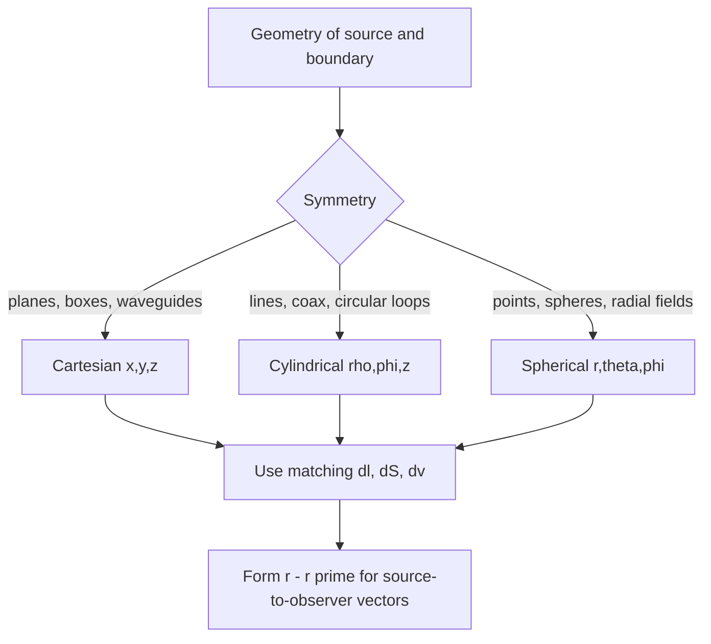

# Vector Algebra and Coordinate Systems

Electromagnetics is a field theory, so most quantities have direction as well as magnitude. The electric field $\vec E$, magnetic field intensity $\vec H$, flux densities $\vec D$ and $\vec B$, current density $\vec J$, force $\vec F$, and area vector $d\vec S$ are all vectors. Before differentiating or integrating fields, we need reliable notation for positions, distances, unit vectors, dot products, cross products, and coordinate transformations.

The practical reason to learn multiple coordinate systems is symmetry. A line charge is natural in cylindrical coordinates, a point charge is natural in spherical coordinates, and a rectangular waveguide is natural in Cartesian coordinates. Choosing coordinates that match the geometry usually turns a hard integral into a short calculation. This page supports the vector calculus page and connects directly to [vector differential calculus](/math/engineering-math/vector-differential-calculus).

## Definitions

A vector $\vec A$ has magnitude $\vert \vec A\vert $ and direction. In Cartesian coordinates,

$$
\vec A=A_x\hat x+A_y\hat y+A_z\hat z.
$$

The dot product measures projection:

$$
\vec A\cdot \vec B=|\vec A||\vec B|\cos\theta=A_xB_x+A_yB_y+A_zB_z.
$$

The cross product creates a vector normal to the plane of $\vec A$ and $\vec B$:

$$
\vec A\times \vec B=
\begin{vmatrix}
\hat x & \hat y & \hat z\\
A_x & A_y & A_z\\
B_x & B_y & B_z
\end{vmatrix}.
$$

Its magnitude is $\vert \vec A\vert \vert \vec B\vert \sin\theta$, and its direction follows the right-hand rule.

The position vector in Cartesian coordinates is

$$
\vec r=x\hat x+y\hat y+z\hat z.
$$

In cylindrical coordinates $(\rho,\phi,z)$,

$$
\vec r=\rho\hat \rho+z\hat z,\qquad x=\rho\cos\phi,\qquad y=\rho\sin\phi.
$$

In spherical coordinates $(r,\theta,\phi)$, where $\theta$ is measured from $+z$ and $\phi$ in the $x$-$y$ plane,

$$
x=r\sin\theta\cos\phi,\qquad y=r\sin\theta\sin\phi,\qquad z=r\cos\theta.
$$

The differential lengths are

$$
\begin{aligned}
d\vec l_{\text{cart}} &= dx\hat x+dy\hat y+dz\hat z,\\
d\vec l_{\text{cyl}} &= d\rho\hat\rho+\rho d\phi\hat\phi+dz\hat z,\\
d\vec l_{\text{sph}} &= dr\hat r+r d\theta\hat\theta+r\sin\theta d\phi\hat\phi.
\end{aligned}
$$

The corresponding volume elements are

$$
dv_{\text{cart}}=dx\,dy\,dz,\qquad
dv_{\text{cyl}}=\rho\,d\rho\,d\phi\,dz,\qquad
dv_{\text{sph}}=r^2\sin\theta\,dr\,d\theta\,d\phi.
$$

These extra factors are scale factors. Cartesian coordinates have scale factors $1,1,1$. Cylindrical coordinates have $1,\rho,1$, because moving through a small azimuthal angle $d\phi$ traces an arc length $\rho d\phi$. Spherical coordinates have $1,r,r\sin\theta$, because angular motion traces arcs whose radii depend on position. Whenever an integral looks suspiciously too simple in cylindrical or spherical coordinates, the missing scale factor is the first thing to check.

Coordinate singularities are not physical singularities by themselves. At $\rho=0$, the unit vectors $\hat\rho$ and $\hat\phi$ are not uniquely defined because every azimuth points to the same axis. At $r=0$, spherical angular directions are undefined. A field may be perfectly finite at these locations even if the coordinate description is awkward, so distinguish coordinate artifacts from actual point sources or infinite field values.

## Key results

Coordinate unit vectors in curvilinear systems depend on position. In cylindrical coordinates,

$$
\hat \rho=\cos\phi\hat x+\sin\phi\hat y,\qquad
\hat \phi=-\sin\phi\hat x+\cos\phi\hat y.
$$

In spherical coordinates,

$$
\begin{aligned}
\hat r &= \sin\theta\cos\phi\hat x+\sin\theta\sin\phi\hat y+\cos\theta\hat z,\\
\hat \theta &= \cos\theta\cos\phi\hat x+\cos\theta\sin\phi\hat y-\sin\theta\hat z,\\
\hat \phi &= -\sin\phi\hat x+\cos\phi\hat y.
\end{aligned}
$$

Distance vectors should be built carefully. If a source point is $\vec r'$ and an observation point is $\vec r$, the separation vector is

$$
\vec R=\vec r-\vec r',
$$

with magnitude $R=\vert \vec R\vert $ and direction $\hat R=\vec R/R$. Coulomb and Biot-Savart integrals repeatedly use this construction. A common error is to subtract coordinates in cylindrical or spherical form without accounting for changing unit vectors; when in doubt, convert to Cartesian components, subtract, then convert back if useful.

For areas, the vector direction is essential. Examples include

$$
d\vec S_{\rho}=\rho d\phi dz\,\hat\rho,\qquad
d\vec S_{r}=r^2\sin\theta d\theta d\phi\,\hat r.
$$

The sign of flux integrals depends on choosing the outward normal for closed surfaces or the normal specified by the right-hand rule for open surfaces bounded by a contour.

The unit-vector transformations also provide a reliable way to transform vector components. A physical vector does not change when coordinates change, but its component list does. For example, a vector in the $x$ direction has cylindrical components that vary with $\phi$ because

$$
\hat x=\cos\phi\hat\rho-\sin\phi\hat\phi.
$$

This position dependence explains why differentiating vector fields in cylindrical and spherical coordinates is more complicated than differentiating their scalar component functions.

Triple products appear often in force and power manipulations:

$$
\vec A\cdot(\vec B\times\vec C)=\vec B\cdot(\vec C\times\vec A),
$$

and

$$
\vec A\times(\vec B\times\vec C)=\vec B(\vec A\cdot\vec C)-\vec C(\vec A\cdot\vec B).
$$

These identities are not decorative; they simplify torque, magnetic force, and Poynting vector expressions.

As a final check, every coordinate choice should preserve physical length, area, volume, and direction. If two coordinate descriptions give different distances or fluxes for the same geometry, the error is in the representation, not in the physics.

## Visual



| Coordinate system | Best for | Length element | Volume element |
|---|---|---|---|
| Cartesian | planes, rectangular cavities, waveguides | $dx\hat x+dy\hat y+dz\hat z$ | $dx\,dy\,dz$ |
| Cylindrical | wires, coax, circular loops | $d\rho\hat\rho+\rho d\phi\hat\phi+dz\hat z$ | $\rho\,d\rho\,d\phi\,dz$ |
| Spherical | point charges, spheres, radiation distance | $dr\hat r+r d\theta\hat\theta+r\sin\theta d\phi\hat\phi$ | $r^2\sin\theta\,dr\,d\theta\,d\phi$ |

## Worked example 1: Distance vector in cylindrical coordinates

Problem: A source point is at $(\rho',\phi',z')=(2,30^\circ,1)$ m and an observation point is at $(\rho,\phi,z)=(5,120^\circ,4)$ m. Find $\vec R=\vec r-\vec r'$ and $R$.

Step 1: Convert each point to Cartesian coordinates. For the observation point,

$$
\begin{aligned}
x&=5\cos120^\circ=-2.5,\\
y&=5\sin120^\circ=4.330,\\
z&=4.
\end{aligned}
$$

For the source point,

$$
\begin{aligned}
x'&=2\cos30^\circ=1.732,\\
y'&=2\sin30^\circ=1.000,\\
z'&=1.
\end{aligned}
$$

Step 2: Subtract coordinates:

$$
\vec R=(-2.5-1.732)\hat x+(4.330-1.000)\hat y+(4-1)\hat z.
$$

Thus

$$
\vec R=-4.232\hat x+3.330\hat y+3\hat z\ \mathrm{m}.
$$

Step 3: Compute magnitude:

$$
R=\sqrt{(-4.232)^2+(3.330)^2+3^2}=6.16\ \mathrm{m}.
$$

Check: The vertical difference alone is $3$ m, so a total distance of $6.16$ m is plausible.

## Worked example 2: Surface area of a spherical cap

Problem: Find the area of the spherical surface $r=a$ between $0\le\theta\le\theta_0$ and $0\le\phi\le2\pi$.

Step 1: Use the spherical area element normal to $\hat r$:

$$
dS=a^2\sin\theta\,d\theta\,d\phi.
$$

Step 2: Integrate over the cap:

$$
S=\int_0^{2\pi}\int_0^{\theta_0}a^2\sin\theta\,d\theta\,d\phi.
$$

Step 3: Evaluate the inner integral:

$$
\int_0^{\theta_0}\sin\theta\,d\theta
=\left[-\cos\theta\right]_0^{\theta_0}
=1-\cos\theta_0.
$$

Step 4: Evaluate the outer integral:

$$
S=2\pi a^2(1-\cos\theta_0).
$$

Check: If $\theta_0=\pi$, the cap is the full sphere and $S=2\pi a^2(1-\cos\pi)=4\pi a^2$.

## Code

```python
import numpy as np

def cyl_to_cart(rho, phi_deg, z):
    phi = np.deg2rad(phi_deg)
    return np.array([rho * np.cos(phi), rho * np.sin(phi), z], dtype=float)

source = cyl_to_cart(2, 30, 1)
obs = cyl_to_cart(5, 120, 4)
R_vec = obs - source
R_mag = np.linalg.norm(R_vec)

print("source =", source)
print("observer =", obs)
print("R vector =", R_vec)
print("R magnitude =", R_mag)
```

## Common pitfalls

- Treating $\hat\rho$, $\hat\phi$, $\hat r$, and $\hat\theta$ as constant everywhere. They rotate with position.
- Omitting metric factors such as $\rho$, $r$, and $r\sin\theta$ from differential lengths, areas, or volumes.
- Using $\theta$ as the azimuth angle in spherical coordinates. In the convention used here, $\theta$ is measured down from $+z$ and $\phi$ is azimuth.
- Forgetting that $d\vec S$ has direction. Flux signs depend on the chosen normal.
- Subtracting curvilinear coordinate triples directly to form distance vectors.
- Reversing cross-product order. $\vec A\times\vec B=-(\vec B\times\vec A)$.
- Assuming a coordinate transformation changes the physical vector. Only the basis and component representation change.

## Connections

- [Vector differential calculus](/math/engineering-math/vector-differential-calculus) for gradient, divergence, and curl.
- [Vector integral calculus](/math/engineering-math/vector-integral-calculus) for line, surface, and volume integrals.
- [Electrostatic fields and potential](/physics/electromagnetics/electrostatic-fields-and-potential) for source-to-observer vectors in Coulomb integrals.
- [Magnetostatic forces and Ampere law](/physics/electromagnetics/magnetostatic-forces-biot-savart-ampere) for cross products in magnetic force and Biot-Savart law.
