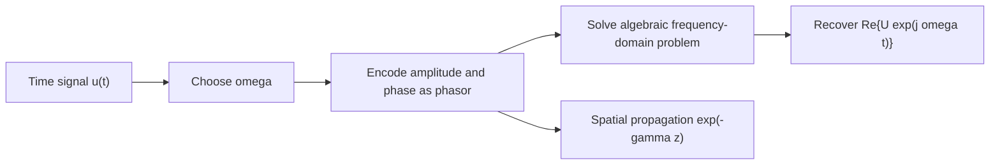

# Waves, Phasors, and the Electromagnetic Spectrum

Applied electromagnetics begins with a simple observation: fields carry influence through space, and when sources vary sinusoidally the influence often travels as a wave. A transmission-line voltage pulse, a radio signal, a beam of visible light, and a microwave oven field are different engineering faces of the same wave idea. The details differ because the medium, geometry, and boundary conditions differ, but the recurring quantities are phase, wavelength, frequency, attenuation, and power flow.

Phasors are the language that makes sinusoidal steady state manageable. Instead of carrying $\cos(\omega t+\phi)$ through every equation, we encode amplitude and phase in a complex number, solve algebraic equations in the frequency domain, and take the real part at the end. This page reviews the wave and phasor tools that support transmission lines, plane waves, antennas, and many frequency-domain views in [signals and systems](/physics/signals-systems/).


*Figure: The electromagnetic spectrum ties circuit-scale oscillations, radio links, optics, and thermal radiation into one continuum. Image: [Wikimedia Commons](https://commons.wikimedia.org/wiki/File:EM_Spectrum_Properties_edit.svg), Inductiveload, public domain.*

## Definitions

A one-dimensional traveling wave moving in the $+z$ direction can be written as

$$
u(z,t)=A\cos(\omega t-\beta z+\phi),
$$

where $A$ is amplitude, $\omega=2\pi f$ is angular frequency in rad/s, $f$ is frequency in Hz, $\beta=2\pi/\lambda$ is phase constant in rad/m, $\lambda$ is wavelength, and $\phi$ is phase at $z=0,t=0$. Constant phase points satisfy $\omega t-\beta z+\phi=\text{constant}$, so the phase velocity is

$$
u_p=\frac{\omega}{\beta}=f\lambda.
$$

A wave moving in the $-z$ direction uses $\omega t+\beta z+\phi$. In a lossy medium the amplitude changes with distance:

$$
u(z,t)=A e^{-\alpha z}\cos(\omega t-\beta z+\phi),
$$

where $\alpha$ is the attenuation constant in Np/m. The propagation constant is commonly written

$$
\gamma=\alpha+j\beta.
$$

For a time-harmonic scalar quantity $u(t)=A\cos(\omega t+\phi)$, the corresponding phasor is

$$
\tilde U=Ae^{j\phi}.
$$

The physical signal is recovered by

$$
u(t)=\mathrm{Re}\{\tilde U e^{j\omega t}\}.
$$

For a traveling wave, the phasor can carry spatial dependence:

$$
\tilde U(z)=A e^{-j\beta z}e^{j\phi}
$$

for lossless propagation in the $+z$ direction, or $\tilde U(z)=A e^{-\gamma z}e^{j\phi}$ when attenuation is present.

The electromagnetic spectrum classifies waves by frequency or wavelength. Radio, microwave, infrared, visible, ultraviolet, X-ray, and gamma-ray labels are not separate theories; they are engineering ranges in which source mechanisms, materials, detectors, and safety issues change.

Two amplitude conventions are common. A phasor may represent a peak amplitude, as it does in many electromagnetics texts, or an rms amplitude, as it often does in power engineering. The algebra is identical, but power formulas change by a factor of two if the convention is changed. In these notes, a sinusoid written as $A\cos(\omega t+\phi)$ uses peak amplitude $A$ unless a problem explicitly says rms.

Decibels are also common in wave work because attenuation, gain, and power ratios often span many orders of magnitude. For power ratios,

$$
L_{\mathrm{dB}}=10\log_{10}\frac{P_2}{P_1},
$$

while for field or voltage amplitude ratios across the same impedance,

$$
L_{\mathrm{dB}}=20\log_{10}\frac{A_2}{A_1}.
$$

The factor $20$ appears because power is proportional to amplitude squared.

## Key results

The main reason phasors are powerful is that differentiation and integration in time become algebraic operations:

$$
\frac{d}{dt}u(t)\quad \Longleftrightarrow \quad j\omega \tilde U,
$$

and

$$
\int u(t)\,dt\quad \Longleftrightarrow \quad \frac{\tilde U}{j\omega},
$$

up to any dc constant. This is why circuit impedances appear as $Z_R=R$, $Z_L=j\omega L$, and $Z_C=1/(j\omega C)$.

For a uniform plane electromagnetic wave in a simple lossless medium, later pages show that

$$
\begin{aligned}
\beta &= \omega\sqrt{\mu\epsilon},\\
u_p &= \frac{1}{\sqrt{\mu\epsilon}},\\
\lambda &= \frac{2\pi}{\beta}.
\end{aligned}
$$

In free space, $u_p=c\approx 3.0\times 10^8\ \mathrm{m/s}$ and $\eta_0=\sqrt{\mu_0/\epsilon_0}\approx 377\ \Omega$ is the intrinsic impedance. For a nonmagnetic dielectric with relative permittivity $\epsilon_r$, the speed is approximately $c/\sqrt{\epsilon_r}$ and the wavelength is shortened by the same factor.

Complex numbers provide both rectangular and polar descriptions:

$$
z=x+jy=|z|e^{j\theta},
$$

where $\vert z\vert =\sqrt{x^2+y^2}$ and $\theta=\tan^{-1}(y/x)$ with quadrant handled correctly. Multiplication adds phases and division subtracts phases, which matches how cascaded sinusoidal systems combine phase shifts.

Phasor methods assume all sources share one angular frequency $\omega$. They do not directly solve arbitrary transients; a pulse or modulated waveform must be represented through Fourier components, Laplace transforms, or time-domain methods.

The phasor transformation is linear. If $u_1(t)$ and $u_2(t)$ are sinusoids at the same $\omega$, then $a u_1(t)+b u_2(t)$ corresponds to $a\tilde U_1+b\tilde U_2$. That is why superposition, impedance division, and transfer functions work so cleanly in sinusoidal steady state. Nonlinear devices break this simple picture because they generate new frequencies, so a single phasor at one $\omega$ no longer contains the whole response.

A useful interpretation of $\beta z$ is accumulated phase delay. If two observation points are separated by $\Delta z$, the phase difference for a $+z$ traveling wave is $\beta\Delta z$. When $\Delta z=\lambda/4$, the phase shift is $90^\circ$; when $\Delta z=\lambda/2$, it is $180^\circ$. This is why quarter-wave and half-wave line sections have special impedance-transforming properties.

## Visual

| Quantity | Symbol | Units | Physical meaning | Common relation |
|---|---:|---:|---|---|
| Frequency | $f$ | Hz | Cycles per second | $\omega=2\pi f$ |
| Angular frequency | $\omega$ | rad/s | Phase rate in time | $\omega=2\pi/T$ |
| Wavelength | $\lambda$ | m | Distance per cycle | $\lambda=u_p/f$ |
| Phase constant | $\beta$ | rad/m | Phase rate in space | $\beta=2\pi/\lambda$ |
| Attenuation constant | $\alpha$ | Np/m | Amplitude decay rate | $e^{-\alpha z}$ |
| Propagation constant | $\gamma$ | 1/m | Combined decay and phase | $\gamma=\alpha+j\beta$ |
| Phasor | $\tilde U$ | same as signal | Complex amplitude | $u(t)=\mathrm{Re}\{\tilde Ue^{j\omega t}\}$ |



## Worked example 1: Phase and wavelength from a measured wave

Problem: A voltage wave on a lossless line is

$$
v(z,t)=8\cos(2\pi\times 10^9 t-20\pi z+30^\circ)\ \mathrm{V}.
$$

Find $f$, $\omega$, $\beta$, $\lambda$, and phase velocity $u_p$.

Step 1: Match the wave to $A\cos(\omega t-\beta z+\phi)$:

$$
\omega=2\pi\times 10^9\ \mathrm{rad/s},\qquad \beta=20\pi\ \mathrm{rad/m}.
$$

Step 2: Convert angular frequency to ordinary frequency:

$$
f=\frac{\omega}{2\pi}=10^9\ \mathrm{Hz}=1\ \mathrm{GHz}.
$$

Step 3: Convert phase constant to wavelength:

$$
\lambda=\frac{2\pi}{\beta}=\frac{2\pi}{20\pi}=0.1\ \mathrm{m}.
$$

Step 4: Compute phase velocity:

$$
u_p=f\lambda=(10^9)(0.1)=1.0\times 10^8\ \mathrm{m/s}.
$$

Check: The wave uses $\omega t-\beta z$, so it moves in $+z$. A velocity below $c$ is plausible for a dielectric-filled line.

## Worked example 2: Phasor solution of a sinusoidal circuit

Problem: A series $R$-$L$ circuit has $R=30\ \Omega$, $L=20\ \mathrm{mH}$, and source

$$
v_s(t)=100\cos(5000t)\ \mathrm{V}.
$$

Find the steady-state current.

Step 1: Encode the source as a phasor:

$$
\tilde V_s=100\angle 0^\circ\ \mathrm{V},\qquad \omega=5000\ \mathrm{rad/s}.
$$

Step 2: Compute the inductor impedance:

$$
Z_L=j\omega L=j(5000)(0.020)=j100\ \Omega.
$$

Step 3: Add the series impedance:

$$
Z=R+Z_L=30+j100\ \Omega.
$$

Step 4: Convert to polar form:

$$
\begin{aligned}
|Z|&=\sqrt{30^2+100^2}=104.4\ \Omega,\\
\angle Z&=\tan^{-1}(100/30)=73.3^\circ.
\end{aligned}
$$

Step 5: Divide phasors:

$$
\tilde I=\frac{\tilde V_s}{Z}=\frac{100\angle 0^\circ}{104.4\angle 73.3^\circ}
=0.958\angle -73.3^\circ\ \mathrm{A}.
$$

Step 6: Return to the time domain:

$$
i(t)=0.958\cos(5000t-73.3^\circ)\ \mathrm{A}.
$$

Check: The current lags the source because the load is inductive. The magnitude is less than $100/30$ A because the inductor adds reactance.

## Code

```python
import numpy as np
import matplotlib.pyplot as plt

A = 1.0
f = 1e9
omega = 2 * np.pi * f
beta = 20 * np.pi
alpha = 2.0

z = np.linspace(0, 0.25, 500)
t0 = 0.0
lossless = A * np.cos(omega * t0 - beta * z)
lossy = A * np.exp(-alpha * z) * np.cos(omega * t0 - beta * z)

plt.plot(z, lossless, label="lossless")
plt.plot(z, lossy, label="lossy")
plt.xlabel("z (m)")
plt.ylabel("wave amplitude")
plt.title("Snapshot of a traveling sinusoidal wave")
plt.grid(True)
plt.legend()
plt.show()
```

## Common pitfalls

- Confusing $\omega$ and $f$. The factor $2\pi$ matters because radians are used in derivatives and phasors.
- Reading $\cos(\omega t+\beta z)$ as a $+z$ wave. With the usual convention, $-\beta z$ means $+z$ propagation and $+\beta z$ means $-z$ propagation.
- Forgetting that phasor answers are not physical time signals until multiplied by $e^{j\omega t}$ and the real part is taken.
- Mixing degrees and radians inside calculator or code steps.
- Applying one phasor solution to sources with different frequencies. Each frequency component requires its own frequency-domain solve.
- Treating attenuation in dB/m and Np/m as identical. Power and amplitude decibel conversions use different factors.
- Assuming complex notation means the physical field is complex. The measurable field is the real time-domain quantity reconstructed from the phasor.

## Connections

- [Complex functions and analyticity](/math/engineering-math/complex-functions-and-analyticity) for complex arithmetic and Euler form.
- [Signals and systems](/physics/signals-systems/) for frequency response and Fourier viewpoints.
- [General electromagnetism](/physics/general/) for intro-level electric and magnetic fields.
- [Plane waves in media](/physics/electromagnetics/plane-waves-lossless-lossy-polarization) for the field version of the wave formulas.
- [Transmission-line models](/physics/electromagnetics/transmission-line-models-and-wave-equations) for guided waves in circuit form.
