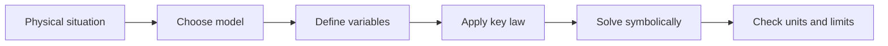

# Current, Resistance, and DC Circuits

Current, Resistance, and DC Circuits covers current, resistance, Ohm's law, power, Kirchhoff rules, and RC transients. The goal is to recognize the physical structure before choosing equations. In the HRW progression, this topic extends earlier mechanics and prepares later field, wave, or modern-physics reasoning by reusing the same habits: define the system, choose signs and variables, state assumptions, and check dimensions.

The core idea is not a list of formulas but a model. Once the model is chosen, the equations express conservation, response, geometry, or symmetry. If the physical assumptions change, the algebra must be revisited. This is especially important here because many formulas are compact but have narrow domains of validity.


*Figure: An oscilloscope grounds signal language in measured voltage traces, triggering, bandwidth, and time scales. Image: [Wikimedia Commons](https://commons.wikimedia.org/wiki/File:Tektronix_2235_100Mhz_Oscilloscope.png), Dennis van Zuijlekom, CC BY-SA 2.0.*

## Definitions

- **Scope:** current, resistance, Ohm's law, power, Kirchhoff rules, and RC transients.
- **Primary symbols:** $I$, $R$, $V$, $P$, $\rho$, $RC$.
- **Reference equations:** $I=dQ/dt$, $V=IR$, $R=\rho L/A$, $P=IV=I^2R=V^2/R$, $V_C=\mathcal E(1-e^{-t/RC})$.
- A **system** is the object, field region, circuit, gas, optical element, or particle collection being modeled.
- A **state** is specified by the variables that determine the relevant energy, momentum, phase, field, or thermodynamic condition.
- A **constraint** is a physical restriction such as no slip, fixed length, constant temperature, steady flow, fixed boundary, or symmetry.
- A **limiting case** is a simplified parameter choice used to test whether the result behaves sensibly.

The definitions in this page are meant to be operational. A symbol is useful only after you know how it would be measured, what units it carries, what sign convention is being used, and which idealizations are being assumed. Before substituting numbers, identify the system boundary and the relevant state variables. For a particle problem the state variables might be position and velocity; for a circuit they might be charge, current, and potential difference; for a thermodynamic process they might be pressure, volume, temperature, and internal energy.

A second habit is to separate model statements from algebra. A model statement says something physical, such as "air resistance is negligible", "the string is massless", "the gas is ideal", "the process is quasistatic", or "the field is uniform". Algebra then follows from those statements. If the model changes, the algebra may still look familiar but the result can become invalid. Write the model assumptions as part of the solution, not as an afterthought.

## Key results

The main relationships are

$$
\begin{aligned}
\text{core formulas} &: $I=dQ/dt$, $V=IR$, $R=\rho L/A$, $P=IV=I^2R=V^2/R$, $V_C=\mathcal E(1-e^{-t/RC})$.
\end{aligned}
$$

Use these relationships only after identifying which variables are known and which conditions are being assumed. Many problems can be solved by matching a physical phrase to a mathematical operation: balance forces or torques for equilibrium, integrate a rate for accumulated change, conserve a quantity when external transfer is absent, or apply a boundary condition when waves or fields must fit a geometry.

A useful solution pattern is: write the governing equation, substitute symbolic constraints, solve for the unknown, and only then insert numbers. This prevents units from becoming decorative and keeps the answer interpretable.

These formulas are conditional statements. Each equation is powerful inside its domain and misleading outside it. Constant-acceleration kinematics requires constant acceleration. Conservation of mechanical energy requires either no nonconservative work or an explicit accounting of it. Gauss's law is always true, but it directly gives an electric field only when symmetry lets the flux integral simplify. Bernoulli's equation assumes steady, incompressible, nonviscous flow along a streamline. Keeping the conditions attached to the formula is part of the formula.

For numerical work, solve symbolically before inserting values whenever possible. A symbolic expression exposes dimensions and limiting behavior. If a mass should cancel, it should cancel before arithmetic. If an answer should decrease when distance grows, the final expression should show that trend. If an answer becomes infinite in an unphysical limit, that usually marks the boundary where the model has stopped applying.

## Visual



| Quantity or idea | Use | Check |
|---|---|---|
| Main model | current, resistance, Ohm's law, power, Kirchhoff rules, and RC transients | assumptions must match the formula |
| Symbols | $I$, $R$, $V$, $P$, $\rho$, $RC$ | define each before use |
| Key formulas | $I=dQ/dt$, $V=IR$, $R=\rho L/A$, $P=IV=I^2R=V^2/R$, $V_C=\mathcal E(1-e^{-t/RC})$ | check dimensions term by term |
| Limiting case | simplify one parameter | result should match intuition |

## Worked example 1: Direct calculation

**Problem.** A $12\,\mathrm{V}$ battery drives $100\,\Omega$ and $220\,\Omega$ resistors in series. Find current and power in $220\,\Omega$.

**Method.** Select the listed governing relationship and solve symbolically before substituting numbers.

1. Write the relevant relation.
2. Substitute the known quantities with SI units or consistent derived units.
3. Solve algebraically for the requested quantity.
4. The calculation gives

$$
$R_{eq}=320\,\Omega$, $I=12/320=0.0375\,\mathrm{A}$, and $P=I^2(220)=0.309\,\mathrm{W}$..
$$

5. Interpret the magnitude and sign in the original physical situation.

**Checked answer.** The result has the expected units and changes in the expected direction when the main input is increased.

## Worked example 2: Rearranged calculation

**Problem.** A $10\,\mu\mathrm{F}$ capacitor charges through $200\,\mathrm{k\Omega}$ from $9.0\,\mathrm{V}$. Find $\tau$ and $V_C(\tau)$.

**Method.** Use the same modeling routine with a different unknown so the equation is not memorized in only one direction.

1. Identify the system and the applicable approximation.
2. Start from the governing equation.
3. Rearrange before substituting values.
4. The numerical work is

$$
$\tau=RC=(200\times10^3)(10\times10^{-6})=2.0\,\mathrm{s}$ and $V_C=9(1-e^{-1})=5.69\,\mathrm{V}$..
$$

5. Compare with a nearby limiting case or a familiar scale.

**Checked answer.** The answer is consistent with the qualitative trend predicted by the formula.

## Code

The snippet below is a small numerical check for the page. It uses only Python's standard library and keeps the physical constants visible so the assumptions can be changed.

```python
import math
I=12/(100+220)
print(I,I**2*220)
R=200e3; C=10e-6
print(R*C,9*(1-math.exp(-1)))
```

## Common pitfalls

- Confusing conventional current with electron drift.
- Mixing up resistor and capacitor combination rules.
- Ignoring loop sign conventions.
- Treating capacitors as open circuits during all transients.
- Always check units, signs, and limiting cases before treating a numerical result as finished.

A final check is to perturb one input mentally. Doubling a distance, mass, charge, stiffness, frequency, or temperature should change the answer in a way that matches the physical story. If the algebra says the opposite, revisit the setup before blaming arithmetic. Also remember that a negative answer is often information: it may indicate direction opposite to the chosen axis, work done by a system rather than on it, or a potential change that lowers the energy of a positive or negative charge differently.

When a problem feels difficult, the hidden issue is often not the last algebraic step but the first modeling decision. Re-read the words and mark what is being idealized: frictionless surface, ideal string, point charge, thin lens, small angle, steady flow, reversible process, nonrelativistic particle, or uniform field. Then mark what is conserved, if anything. Energy conservation, momentum conservation, angular momentum conservation, charge conservation, and entropy constraints are not interchangeable; each one has a system boundary and a transfer condition. If an external impulse acts, momentum may not be conserved for the chosen system. If friction acts within a block-floor system, mechanical energy is not conserved even though total energy is. If a Gaussian surface encloses no net charge, flux is zero, but the field at points on the surface need not be zero.

Another common pitfall is using a memorized equation in only its most familiar direction. A formula is a relationship, so practice solving it for different unknowns. In kinematics, solve for time, acceleration, or displacement depending on what the data support. In circuits, solve Ohm's law for voltage, current, or resistance and then check power. In optics, solve the thin-lens equation for image distance, object distance, or focal length and compare the sign with a ray diagram. In thermodynamics, rearrange the first law only after deciding whether work is done by the system or on the system. This flexibility prevents formula matching from replacing reasoning.

Finally, keep scale awareness. Introductory physics problems often use idealized numbers, but the answers should still sit on recognizable scales: walking speeds are meters per second, orbital speeds are kilometers per second, visible wavelengths are hundreds of nanometers, household currents are often amperes or less, and thermal energies per molecule at room temperature are small in joules but meaningful in electron-volts. When an answer is many orders of magnitude away from these anchors, check unit conversions first. Prefix errors such as nano versus micro, centimeters versus meters, and milliseconds versus seconds are among the fastest ways to turn correct physics into a wrong result.

For exam preparation, make the worked examples bidirectional. After solving a forward problem, change the target: ask what initial speed, resistance, angle, charge, temperature change, or wavelength would have produced the stated answer. This exposes whether you understand the structure or only followed the arithmetic once. Then make one assumption false and describe what would change. If air resistance is no longer negligible, projectile motion no longer separates into a constant horizontal speed. If a pulley has rotational inertia, the two string tensions need not match. If a lens is not thin, the thin-lens equation becomes an approximation. If a gas process is not reversible, entropy must be found from a reversible path connecting the same states, not from the literal irreversible path. These small variations turn a page of notes into a usable problem-solving tool.

Before leaving the problem, write one complete sentence that states the result in physical language. That sentence should name the object or system, the direction or sign when relevant, and the assumption under which the answer was obtained.

## Connections

- [Electric Potential and Capacitance](/physics/general/electric-potential-and-capacitance)
- [AC Circuits and EM Waves](/physics/general/ac-circuits-and-electromagnetic-waves)
