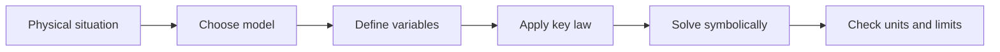

# One-Dimensional Kinematics

One-dimensional kinematics describes motion along a line without asking what caused the motion. It is the grammar of position, displacement, velocity, and acceleration. Because the path is a line, vectors can be represented by signed components: positive may mean right, upward, outward, or any chosen direction.

The topic is simple enough to solve exactly and important enough to reappear everywhere. Free fall, braking, elevators, oscillation near equilibrium, and charged particles in uniform fields reuse the same structure. The main skill is keeping instantaneous quantities, averages, signs, and graph meanings separate.


*Figure: Projectile motion is the standard visual model for decomposing one motion into horizontal and vertical components. Image: [Wikimedia Commons](https://commons.wikimedia.org/wiki/File:Projectile_motion.svg), Maxmath12, CC0 1.0.*

## Definitions

- **Position** $x(t)$ locates a particle on the chosen axis.
- **Displacement** is $\Delta x=x_f-x_i$, not total distance.
- **Average velocity** is $v_{avg}=\Delta x/\Delta t$.
- **Instantaneous velocity** is $v=dx/dt$.
- **Average acceleration** is $a_{avg}=\Delta v/\Delta t$.
- **Instantaneous acceleration** is $a=dv/dt=d^2x/dt^2$.
- **Free fall** near Earth uses $a=-g$ if upward is positive and air resistance is neglected.

The definitions in this page are meant to be operational. A symbol is useful only after you know how it would be measured, what units it carries, what sign convention is being used, and which idealizations are being assumed. Before substituting numbers, identify the system boundary and the relevant state variables. For a particle problem the state variables might be position and velocity; for a circuit they might be charge, current, and potential difference; for a thermodynamic process they might be pressure, volume, temperature, and internal energy.

A second habit is to separate model statements from algebra. A model statement says something physical, such as "air resistance is negligible", "the string is massless", "the gas is ideal", "the process is quasistatic", or "the field is uniform". Algebra then follows from those statements. If the model changes, the algebra may still look familiar but the result can become invalid. Write the model assumptions as part of the solution, not as an afterthought.

## Key results

For constant acceleration,

$$
\begin{aligned}
v &= v_0+at,\\
x &= x_0+v_0t+\frac12at^2,\\
v^2 &= v_0^2+2a(x-x_0),\\
x-x_0 &= \frac12(v_0+v)t.
\end{aligned}
$$

These equations are algebraic consequences of constant $a$, not independent laws. Choose the one that contains the desired unknown and avoids unnecessary unknowns. If acceleration varies, use calculus:

$$
v(t)=v_0+\int_0^t a(t')\,dt',\quad x(t)=x_0+\int_0^t v(t')\,dt'.
$$

Graphically, slope of $x(t)$ is velocity, slope of $v(t)$ is acceleration, area under $v(t)$ is displacement, and area under $a(t)$ is velocity change.

These formulas are conditional statements. Each equation is powerful inside its domain and misleading outside it. Constant-acceleration kinematics requires constant acceleration. Conservation of mechanical energy requires either no nonconservative work or an explicit accounting of it. Gauss's law is always true, but it directly gives an electric field only when symmetry lets the flux integral simplify. Bernoulli's equation assumes steady, incompressible, nonviscous flow along a streamline. Keeping the conditions attached to the formula is part of the formula.

For numerical work, solve symbolically before inserting values whenever possible. A symbolic expression exposes dimensions and limiting behavior. If a mass should cancel, it should cancel before arithmetic. If an answer should decrease when distance grows, the final expression should show that trend. If an answer becomes infinite in an unphysical limit, that usually marks the boundary where the model has stopped applying.

## Visual



| Quantity or idea | Use | Check |
|---|---|---|
| $x(t)$ | position function | slope is velocity |
| $v(t)$ | velocity function | area gives displacement |
| $a(t)$ | acceleration function | area gives velocity change |
| $g$ | free-fall acceleration | sign depends on axis |

## Worked example 1: Stopping distance

**Problem.** A car moving at $25\,\mathrm{m/s}$ brakes with constant acceleration $-6.0\,\mathrm{m/s^2}$. How far does it travel before stopping?

**Method.** Time is not requested, so use $v^2=v_0^2+2a\Delta x$.

1. Choose positive in the initial direction.
2. Known values:

$$
v_0=25\,\mathrm{m/s},\quad v=0,\quad a=-6.0\,\mathrm{m/s^2}.
$$

3. Solve:

$$
\Delta x=\frac{v^2-v_0^2}{2a}
=\frac{0-25^2}{2(-6.0)}=52.1\,\mathrm{m}.
$$

**Checked answer.** The displacement is positive because the car continues forward while slowing.

## Worked example 2: Vertical toss

**Problem.** A ball is thrown upward from ground level at $18\,\mathrm{m/s}$. Neglect air resistance. Find maximum height and time to reach it.

**Method.** Choose upward positive. At the top, $v=0$.

1. Use the time-free equation:

$$
0^2=18^2+2(-9.8)\Delta y.
$$

2. Solve:

$$
\Delta y=\frac{-18^2}{-19.6}=16.5\,\mathrm{m}.
$$

3. Use $v=v_0+at$:

$$
0=18-9.8t,\quad t=1.84\,\mathrm{s}.
$$

**Checked answer.** A rise time under two seconds and a height of several stories are plausible for this launch speed.

## Code

The snippet below is a small numerical check for the page. It uses only Python's standard library and keeps the physical constants visible so the assumptions can be changed.

```python
v0, a = 25.0, -6.0
stop_distance = (0.0 - v0**2)/(2*a)
v_throw, g = 18.0, 9.8
height = v_throw**2/(2*g)
time_up = v_throw/g
print(f"stopping distance = {stop_distance:.1f} m")
print(f"height = {height:.1f} m, time up = {time_up:.2f} s")
```

## Common pitfalls

- Confusing displacement with total distance.
- Using constant-acceleration equations when acceleration changes.
- Changing sign convention midway.
- Assuming zero acceleration means zero velocity.
- Always check units, signs, and limiting cases before treating a numerical result as finished.

A final check is to perturb one input mentally. Doubling a distance, mass, charge, stiffness, frequency, or temperature should change the answer in a way that matches the physical story. If the algebra says the opposite, revisit the setup before blaming arithmetic. Also remember that a negative answer is often information: it may indicate direction opposite to the chosen axis, work done by a system rather than on it, or a potential change that lowers the energy of a positive or negative charge differently.

When a problem feels difficult, the hidden issue is often not the last algebraic step but the first modeling decision. Re-read the words and mark what is being idealized: frictionless surface, ideal string, point charge, thin lens, small angle, steady flow, reversible process, nonrelativistic particle, or uniform field. Then mark what is conserved, if anything. Energy conservation, momentum conservation, angular momentum conservation, charge conservation, and entropy constraints are not interchangeable; each one has a system boundary and a transfer condition. If an external impulse acts, momentum may not be conserved for the chosen system. If friction acts within a block-floor system, mechanical energy is not conserved even though total energy is. If a Gaussian surface encloses no net charge, flux is zero, but the field at points on the surface need not be zero.

Another common pitfall is using a memorized equation in only its most familiar direction. A formula is a relationship, so practice solving it for different unknowns. In kinematics, solve for time, acceleration, or displacement depending on what the data support. In circuits, solve Ohm's law for voltage, current, or resistance and then check power. In optics, solve the thin-lens equation for image distance, object distance, or focal length and compare the sign with a ray diagram. In thermodynamics, rearrange the first law only after deciding whether work is done by the system or on the system. This flexibility prevents formula matching from replacing reasoning.

Finally, keep scale awareness. Introductory physics problems often use idealized numbers, but the answers should still sit on recognizable scales: walking speeds are meters per second, orbital speeds are kilometers per second, visible wavelengths are hundreds of nanometers, household currents are often amperes or less, and thermal energies per molecule at room temperature are small in joules but meaningful in electron-volts. When an answer is many orders of magnitude away from these anchors, check unit conversions first. Prefix errors such as nano versus micro, centimeters versus meters, and milliseconds versus seconds are among the fastest ways to turn correct physics into a wrong result.

For exam preparation, make the worked examples bidirectional. After solving a forward problem, change the target: ask what initial speed, resistance, angle, charge, temperature change, or wavelength would have produced the stated answer. This exposes whether you understand the structure or only followed the arithmetic once. Then make one assumption false and describe what would change. If air resistance is no longer negligible, projectile motion no longer separates into a constant horizontal speed. If a pulley has rotational inertia, the two string tensions need not match. If a lens is not thin, the thin-lens equation becomes an approximation. If a gas process is not reversible, entropy must be found from a reversible path connecting the same states, not from the literal irreversible path. These small variations turn a page of notes into a usable problem-solving tool.

Before leaving the problem, write one complete sentence that states the result in physical language. That sentence should name the object or system, the direction or sign when relevant, and the assumption under which the answer was obtained.

## Connections

- [Measurement and Vectors](/physics/general/measurement-units-and-vectors)
- [Two-Dimensional Motion](/physics/general/two-dimensional-motion)
- [Newton's Laws and Applications](/physics/general/newtons-laws-and-applications)
