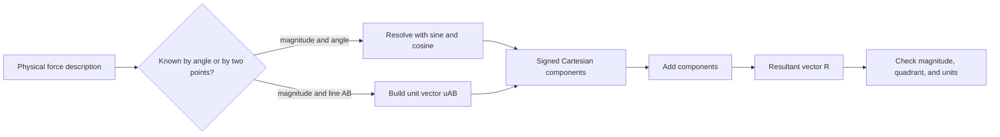

# Force Vectors, Resultants, and Components

Engineering mechanics starts by treating force as a vector: it has magnitude, direction, and a line of action. That one decision lets a single notation describe cable tensions, weights, contact reactions, distributed loads after reduction, and the resultant force from many applied effects. The same vector language also describes relative position, so forces and geometry can be combined later into moments.

This page builds the vector habits used everywhere else in statics and dynamics. Before drawing an equilibrium equation or an equation of motion, you usually resolve forces into components, add them into a resultant, and check whether the answer makes physical sense. A clean vector calculation is not cosmetic; it is what prevents sign errors, wrong angles, and accidental mixing of scalars with vectors.

## Definitions

A **scalar** has magnitude only. Mass, distance, time, speed, work, and energy are scalars. A **vector** has magnitude and direction. Force $\mathbf{F}$, position $\mathbf{r}$, velocity $\mathbf{v}$, acceleration $\mathbf{a}$, and moment $\mathbf{M}$ are vectors. In Cartesian components,

$$
\mathbf{F}=F_x\mathbf{i}+F_y\mathbf{j}+F_z\mathbf{k}
$$

where $\mathbf{i}$, $\mathbf{j}$, and $\mathbf{k}$ are unit basis vectors along the $x$, $y$, and $z$ axes. The magnitude is

$$
|\mathbf{F}|=\sqrt{F_x^2+F_y^2+F_z^2}.
$$

A **unit vector** has magnitude one. If a force of magnitude $F$ acts along a line from point $A$ to point $B$, first form the direction vector

$$
\mathbf{r}_{AB}=(x_B-x_A)\mathbf{i}+(y_B-y_A)\mathbf{j}+(z_B-z_A)\mathbf{k},
$$

then normalize it:

$$
\mathbf{u}_{AB}=\frac{\mathbf{r}_{AB}}{|\mathbf{r}_{AB}|}.
$$

The force vector is then

$$
\mathbf{F}=F\mathbf{u}_{AB}.
$$

A **resultant force** is a single force equal to the vector sum of a system of forces:

$$
\mathbf{R}=\sum_i\mathbf{F}_i.
$$

If all forces act at the same point, the resultant can replace them for force balance. If forces act at different points on a rigid body, the same resultant force alone may not preserve the moment effect; later pages add the associated moment.

The **components** of a force are the signed scalar multipliers of the basis vectors. In 2D, if a force $F$ makes an angle $\theta$ counterclockwise from the positive $x$ axis, then

$$
F_x=F\cos\theta,\qquad F_y=F\sin\theta.
$$

If the angle is measured from another axis, do not blindly use cosine for $x$ and sine for $y$. Draw the right triangle, attach signs from the chosen axes, and only then write the components.

The **dot product** measures projection:

$$
\mathbf{A}\cdot\mathbf{B}=|\mathbf{A}||\mathbf{B}|\cos\theta=A_xB_x+A_yB_y+A_zB_z.
$$

The scalar component of $\mathbf{F}$ along a unit direction $\mathbf{u}$ is $\mathbf{F}\cdot\mathbf{u}$. The vector projection is $(\mathbf{F}\cdot\mathbf{u})\mathbf{u}$.

The **cross product** produces a vector perpendicular to two vectors:

$$
\mathbf{A}\times\mathbf{B}=
\begin{vmatrix}
\mathbf{i} & \mathbf{j} & \mathbf{k}\\
A_x & A_y & A_z\\
B_x & B_y & B_z
\end{vmatrix}.
$$

For mechanics, the cross product matters because the moment of a force about a point is $\mathbf{M}=\mathbf{r}\times\mathbf{F}$.

## Key results

Vector addition is component-wise:

$$
\sum_i\mathbf{F}_i=
\left(\sum_i F_{ix}\right)\mathbf{i}
+\left(\sum_i F_{iy}\right)\mathbf{j}
+\left(\sum_i F_{iz}\right)\mathbf{k}.
$$

This is why most force problems become arithmetic after a good diagram. A force polygon may show the geometry, but component equations compute the answer reliably. In 2D,

$$
R_x=\sum_iF_{ix},\qquad R_y=\sum_iF_{iy},\qquad
R=\sqrt{R_x^2+R_y^2},\qquad
\theta=\tan^{-1}\left(\frac{R_y}{R_x}\right)
$$

with the angle placed in the correct quadrant. In code, use `atan2(R_y, R_x)` rather than a plain arctangent.

For 3D cable or link problems, unit-vector construction is usually safer than angle memorization. If a cable force $\mathbf{T}$ pulls from $A$ toward $B$, use

$$
\mathbf{T}=T\frac{\mathbf{r}_{AB}}{|\mathbf{r}_{AB}|}.
$$

This automatically gives all three component signs. The point order matters: $\mathbf{r}_{AB}$ points from $A$ to $B$, while $\mathbf{r}_{BA}$ points from $B$ to $A$.

Two common checks catch many errors. First, each component must be no larger in magnitude than the force magnitude:

$$
|F_x|\le F,\qquad |F_y|\le F,\qquad |F_z|\le F.
$$

Second, the components must reconstruct the magnitude:

$$
F_x^2+F_y^2+F_z^2=F^2.
$$

For a set of concurrent forces, equilibrium means $\mathbf{R}=\mathbf{0}$. For a set of nonconcurrent forces on a rigid body, $\mathbf{R}$ is still important, but not complete. The force system also has a moment about any chosen point:

$$
\mathbf{M}_O=\sum_i\mathbf{r}_{Oi}\times\mathbf{F}_i.
$$

Later pages use the pair $(\mathbf{R},\mathbf{M}_O)$ to represent equivalent force systems. The key point here is that a vector calculation has a location part and a direction part. Treating a force as only a magnitude and an angle loses information needed for moments.

## Visual



| Task | Reliable expression | Check |
|---|---:|---|
| Magnitude from components | $\vert \mathbf{F}\vert =\sqrt{F_x^2+F_y^2+F_z^2}$ | Magnitude is nonnegative |
| Component from angle to $+x$ | $F_x=F\cos\theta$, $F_y=F\sin\theta$ | Put $\theta$ in correct quadrant |
| Direction from two points | $\mathbf{u}_{AB}=\mathbf{r}_{AB}/\vert \mathbf{r}_{AB}\vert $ | $\vert \mathbf{u}_{AB}\vert =1$ |
| Projection along $\mathbf{u}$ | $\mathbf{F}\cdot\mathbf{u}$ | $\mathbf{u}$ must be a unit vector |
| Resultant | $\mathbf{R}=\sum\mathbf{F}_i$ | Add signed components, not magnitudes |

## Worked example 1: Resultant of three planar forces

**Problem.** Three forces act at a pin: $80$ N at $30^\circ$ above the positive $x$ axis, $55$ N at $120^\circ$ from the positive $x$ axis, and $40$ N downward. Find the resultant magnitude and direction.

**Method.** Resolve each force into $x$ and $y$ components, add components, then convert the resultant back to magnitude and angle.

1. Write the first force:

$$
\mathbf{F}_1=80\cos30^\circ\,\mathbf{i}+80\sin30^\circ\,\mathbf{j}.
$$

Using $\cos30^\circ=0.8660$ and $\sin30^\circ=0.5$,

$$
\mathbf{F}_1=69.28\mathbf{i}+40.00\mathbf{j}\ \text{N}.
$$

2. Write the second force:

$$
\mathbf{F}_2=55\cos120^\circ\,\mathbf{i}+55\sin120^\circ\,\mathbf{j}.
$$

Since $\cos120^\circ=-0.5$ and $\sin120^\circ=0.8660$,

$$
\mathbf{F}_2=-27.50\mathbf{i}+47.63\mathbf{j}\ \text{N}.
$$

3. Write the vertical force:

$$
\mathbf{F}_3=0\mathbf{i}-40.00\mathbf{j}\ \text{N}.
$$

4. Add components:

$$
\begin{aligned}
R_x&=69.28-27.50+0=41.78\ \text{N},\\
R_y&=40.00+47.63-40.00=47.63\ \text{N}.
\end{aligned}
$$

Thus

$$
\mathbf{R}=41.78\mathbf{i}+47.63\mathbf{j}\ \text{N}.
$$

5. Compute magnitude and direction:

$$
R=\sqrt{41.78^2+47.63^2}=63.36\ \text{N}.
$$

$$
\theta=\tan^{-1}\left(\frac{47.63}{41.78}\right)=48.7^\circ.
$$

Both components are positive, so the direction is in quadrant I. The checked answer is

$$
\boxed{\mathbf{R}=41.78\mathbf{i}+47.63\mathbf{j}\ \text{N},\quad R=63.36\ \text{N at }48.7^\circ.}
$$

The magnitude is less than $80+55+40=175$ N, which is plausible because the forces partly oppose each other.

## Worked example 2: Cable force in 3D

**Problem.** A cable runs from point $A=(1,2,0)$ m to point $B=(4,-1,6)$ m. The cable tension is $240$ N and pulls on the attachment at $A$ toward $B$. Find the Cartesian force vector at $A$.

**Method.** Build the direction vector from $A$ to $B$, normalize it, then multiply by the tension magnitude.

1. Compute the relative position vector:

$$
\mathbf{r}_{AB}=(4-1)\mathbf{i}+(-1-2)\mathbf{j}+(6-0)\mathbf{k}
=3\mathbf{i}-3\mathbf{j}+6\mathbf{k}\ \text{m}.
$$

2. Compute its length:

$$
|\mathbf{r}_{AB}|=\sqrt{3^2+(-3)^2+6^2}
=\sqrt{54}=7.348\ \text{m}.
$$

3. Form the unit vector:

$$
\mathbf{u}_{AB}=\frac{3}{7.348}\mathbf{i}-\frac{3}{7.348}\mathbf{j}+\frac{6}{7.348}\mathbf{k}
=0.4082\mathbf{i}-0.4082\mathbf{j}+0.8165\mathbf{k}.
$$

4. Multiply by the tension:

$$
\mathbf{T}=240\mathbf{u}_{AB}
=97.98\mathbf{i}-97.98\mathbf{j}+195.96\mathbf{k}\ \text{N}.
$$

5. Check the magnitude:

$$
\sqrt{97.98^2+(-97.98)^2+195.96^2}=240.0\ \text{N}.
$$

The checked answer is

$$
\boxed{\mathbf{T}=98.0\mathbf{i}-98.0\mathbf{j}+196.0\mathbf{k}\ \text{N}.}
$$

The negative $y$ component is not an algebra mistake; the cable goes from $y=2$ to $y=-1$, so it pulls toward decreasing $y$.

## Code

```python
import math

def components_from_angle(magnitude, degrees):
    theta = math.radians(degrees)
    return magnitude * math.cos(theta), magnitude * math.sin(theta)

forces = [
    components_from_angle(80.0, 30.0),
    components_from_angle(55.0, 120.0),
    (0.0, -40.0),
]

rx = sum(fx for fx, fy in forces)
ry = sum(fy for fx, fy in forces)
resultant = math.hypot(rx, ry)
angle = math.degrees(math.atan2(ry, rx))

print(f"R = ({rx:.2f}, {ry:.2f}) N")
print(f"|R| = {resultant:.2f} N")
print(f"direction = {angle:.2f} degrees")
```

## Common pitfalls

- Adding force magnitudes instead of signed components.
- Using $\sin$ and $\cos$ from memory without checking which axis the angle is measured from.
- Forgetting that a cable pulls away from the point being isolated, along the cable.
- Reversing $\mathbf{r}_{AB}$ and $\mathbf{r}_{BA}$ in 3D force construction.
- Reporting $\tan^{-1}(R_y/R_x)$ without checking the quadrant.
- Dropping units during component work, especially when geometry is in meters and force is in newtons.
- Treating a force resultant as a complete rigid-body replacement without also preserving moment.

## Connections

- [Particle equilibrium](/physics/mechanics/particle-equilibrium)
- [Rigid-body equilibrium](/physics/mechanics/rigid-body-equilibrium)
- [Particle kinematics](/physics/mechanics/particle-kinematics)
- [Impulse, momentum, and impact](/physics/mechanics/impulse-momentum-impact)

