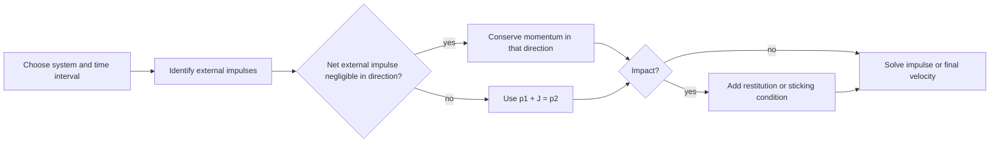

# Impulse, Momentum, and Impact

Impulse-momentum methods focus on force effects over time rather than over distance. They are especially useful for collisions, short-duration forces, impulsive loads, and systems where internal forces cancel when the whole system is chosen. The method is vector-based, so it preserves direction information that scalar energy methods may hide.

Energy and momentum are complementary, not interchangeable. Momentum balance can survive inelastic impact where mechanical energy is lost. Energy methods can find speeds when work and distance are known. In many collision problems, momentum gives the immediate post-impact velocity relation, while energy or a coefficient of restitution supplies the missing information.

## Definitions

The **linear momentum** of a particle is

$$
\mathbf{p}=m\mathbf{v}.
$$

For a system of particles,

$$
\mathbf{P}=\sum_i m_i\mathbf{v}_i=M\mathbf{v}_G,
$$

where $G$ is the center of mass and $M$ is total mass.

The **linear impulse** of a force over time interval $t_1$ to $t_2$ is

$$
\mathbf{J}=\int_{t_1}^{t_2}\mathbf{F}\,dt.
$$

The impulse-momentum relation is

$$
\int_{t_1}^{t_2}\sum\mathbf{F}\,dt=m\mathbf{v}_2-m\mathbf{v}_1.
$$

If the net external impulse on a system is zero in a direction, total linear momentum in that direction is conserved:

$$
\sum m_iv_{i1}=\sum m_iv_{i2}.
$$

Angular momentum of a particle about point $O$ is

$$
\mathbf{H}_O=\mathbf{r}_{O}\times m\mathbf{v}.
$$

Angular impulse-momentum about a fixed point $O$ is

$$
\int_{t_1}^{t_2}\sum\mathbf{M}_O\,dt=\mathbf{H}_{O2}-\mathbf{H}_{O1}.
$$

For direct central impact along a line of impact, the **coefficient of restitution** is

$$
e=\frac{\text{relative speed of separation}}{\text{relative speed of approach}}.
$$

For two particles $A$ and $B$ along the impact line,

$$
e=\frac{v_{B2}-v_{A2}}{v_{A1}-v_{B1}}
$$

when $A$ initially approaches $B$ from behind along the positive direction.

## Key results

The linear impulse-momentum equation can be written as

$$
\mathbf{p}_1+\mathbf{J}_{\text{ext}}=\mathbf{p}_2.
$$

This form is useful because it separates what the system already had from what external forces added. During very short impacts, large contact impulses dominate. Finite forces such as weight may have negligible impulse if the time interval is extremely small:

$$
J_W=mg\Delta t.
$$

For example, over $0.005$ s, the weight impulse of a $1$ kg object is only $0.049$ N s. Whether it can be neglected depends on the impact impulse scale.

For a system, internal impulses cancel in pairs if both interacting bodies are included. That is why conservation of momentum is often applied to two colliding bodies together, even though each body individually experiences a large impact force.

For perfectly plastic impact, the bodies stick together after collision. The shared final velocity follows from momentum conservation:

$$
v_2=\frac{m_Av_{A1}+m_Bv_{B1}}{m_A+m_B}.
$$

Mechanical energy is generally lost in such impacts. The lost energy becomes deformation, heat, sound, and vibration.

For elastic impact with $e=1$, relative speed of separation equals relative speed of approach. Momentum plus restitution determines two unknown final velocities in one-dimensional impact.

Angular impulse-momentum is useful when a force impulse has an unknown line of action but its moment about a selected point is zero. For example, during impact at a pin, taking angular momentum about the pin can eliminate the unknown pin impulse if the pin force passes through that point.

System choice is the main modeling decision. If two bodies collide and both are included in the system, the contact impulse between them is internal and cancels from the total linear momentum balance. If only one body is isolated, the same contact impulse is external and must be included. Neither approach is more correct in general; the useful one is the one that eliminates unknown impulses without hiding the quantity being asked for.

Momentum conservation is directional. A system can conserve horizontal momentum while not conserving vertical momentum, for example when the ground supplies a large vertical external impulse during impact. In two-dimensional impact, write separate component momentum equations and apply the restitution relation only along the common normal direction at contact. Tangential components may be unchanged for smooth contact, or may change if frictional impulse is significant.

Average-force calculations should be interpreted carefully. The average force

$$
F_{\text{avg}}=\frac{J}{\Delta t}
$$

gives a constant force with the same impulse over the same time interval. Real impact forces usually vary sharply with time. The peak force may be much larger than the average, and structural damage often depends on the peak, duration, material response, and contact area. For mechanics homework, average impulse is often the requested quantity; for engineering design, it is only the beginning of the impact model.

## Visual



| Method | Equation | Best for | Caution |
|---|---|---|---|
| Linear impulse-momentum | $\int\sum\mathbf{F}\,dt=m\mathbf{v}_2-m\mathbf{v}_1$ | Short forces, velocity change | Directional vector equation |
| Momentum conservation | $\mathbf{P}_1=\mathbf{P}_2$ | Isolated system direction | External impulse must be negligible |
| Angular impulse-momentum | $\int\sum\mathbf{M}_Odt=\Delta\mathbf{H}_O$ | Impacts with pins/rotation | Point choice matters |
| Restitution | $e=$ separation/approach speed | Collision closure | Applies along line of impact |

## Worked example 1: Bat impulse on a ball

**Problem.** A $0.145$ kg baseball approaches a bat horizontally at $35$ m/s to the left and leaves at $45$ m/s to the right. The contact time is $0.004$ s. Find the impulse delivered by the bat and the average bat force on the ball. Take right as positive.

**Method.** Use linear impulse-momentum in the horizontal direction. The ball's weight has no horizontal component, and air resistance during contact is negligible.

1. Initial velocity:

$$
v_1=-35\ \text{m/s}.
$$

2. Final velocity:

$$
v_2=45\ \text{m/s}.
$$

3. Change in momentum:

$$
J=m(v_2-v_1).
$$

Substitute:

$$
J=0.145(45-(-35)).
$$

$$
J=0.145(80)=11.6\ \text{N s}.
$$

The impulse is positive, so it acts to the right.

4. Average force:

$$
F_{\text{avg}}=\frac{J}{\Delta t}.
$$

$$
F_{\text{avg}}=\frac{11.6}{0.004}=2900\ \text{N}.
$$

The checked answer is

$$
\boxed{J=11.6\ \text{N s to the right},\qquad F_{\text{avg}}=2.90\ \text{kN to the right}.}
$$

The large average force is plausible because the time interval is very short.

## Worked example 2: One-dimensional impact with restitution

**Problem.** Cart $A$ has mass $2$ kg and moves right at $5$ m/s. Cart $B$ has mass $3$ kg and moves right at $1$ m/s. They collide directly on a horizontal track. The coefficient of restitution is $e=0.6$. Find the final velocities.

**Method.** Use conservation of momentum for the two-cart system and the restitution equation along the line of impact.

1. Momentum conservation:

$$
m_Av_{A1}+m_Bv_{B1}=m_Av_{A2}+m_Bv_{B2}.
$$

Substitute:

$$
2(5)+3(1)=2v_{A2}+3v_{B2}.
$$

$$
13=2v_{A2}+3v_{B2}.
$$

2. Restitution relation. Since $A$ approaches $B$ from behind,

$$
e=\frac{v_{B2}-v_{A2}}{v_{A1}-v_{B1}}.
$$

Thus

$$
0.6=\frac{v_{B2}-v_{A2}}{5-1}.
$$

$$
v_{B2}-v_{A2}=2.4.
$$

3. Solve the two equations. From restitution,

$$
v_{B2}=v_{A2}+2.4.
$$

4. Substitute into momentum:

$$
13=2v_{A2}+3(v_{A2}+2.4).
$$

$$
13=5v_{A2}+7.2.
$$

$$
5v_{A2}=5.8,\qquad v_{A2}=1.16\ \text{m/s}.
$$

5. Then

$$
v_{B2}=1.16+2.4=3.56\ \text{m/s}.
$$

The checked answer is

$$
\boxed{v_{A2}=1.16\ \text{m/s right},\qquad v_{B2}=3.56\ \text{m/s right}.}
$$

Cart $A$ slows down and cart $B$ speeds up, while the final relative separation speed is $2.4$ m/s as required.

## Code

```python
import numpy as np

# Bat impulse example.
m = 0.145
v1 = -35.0
v2 = 45.0
dt = 0.004
J = m * (v2 - v1)
Favg = J / dt
print(f"impulse = {J:.2f} N*s")
print(f"average force = {Favg:.0f} N")

# Two-cart impact with restitution.
mA, mB = 2.0, 3.0
vA1, vB1 = 5.0, 1.0
e = 0.6
A = np.array([[mA, mB], [-1.0, 1.0]])
b = np.array([mA * vA1 + mB * vB1, e * (vA1 - vB1)])
vA2, vB2 = np.linalg.solve(A, b)
print(f"vA2 = {vA2:.2f} m/s")
print(f"vB2 = {vB2:.2f} m/s")
```

## Common pitfalls

- Conserving momentum for one object while ignoring the external impulse from the other object.
- Conserving mechanical energy in inelastic impact without justification.
- Applying restitution in a direction not aligned with the line of impact.
- Forgetting signs when one object reverses direction.
- Neglecting an external impulse that is not actually small compared with the collision impulse.
- Confusing average force with peak force during impact.
- Using scalar momentum in a two-dimensional collision without resolving components.

## Connections

- [Particle kinetics with Newton's second law](/physics/mechanics/particle-kinetics-newton)
- [Work-energy methods](/physics/mechanics/work-energy-methods)
- [Planar rigid-body motion](/physics/mechanics/planar-rigid-body-motion)
- [Vibrations of single-degree-of-freedom systems](/physics/mechanics/vibrations-single-dof)
