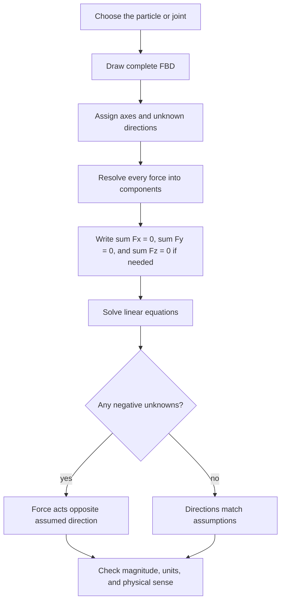

# Particle Equilibrium

Particle equilibrium is the statics model for a body whose size and rotational effects do not matter for the question being asked. All external forces are treated as concurrent at one point, so force balance is the entire mechanical statement. This model appears in cable joints, rings, pulleys treated as ideal pins, small collars on guides, and three-dimensional attachments where several members meet at one connector.

The topic is simple in principle and unforgiving in practice. The equation $\sum\mathbf{F}=\mathbf{0}$ is short, but the success of the solution depends on a complete free-body diagram, correct force directions, and enough independent scalar equations. A particle in 2D supplies two scalar equations; a particle in 3D supplies three.

## Definitions

A **particle** is an idealized body with position but no size or orientation. In statics, it has no acceleration, so linear momentum is constant and the force balance reduces to

$$
\sum\mathbf{F}=\mathbf{0}.
$$

In 2D Cartesian form,

$$
\sum F_x=0,\qquad \sum F_y=0.
$$

In 3D Cartesian form,

$$
\sum F_x=0,\qquad \sum F_y=0,\qquad \sum F_z=0.
$$

A **free-body diagram** for a particle shows the isolated point and every external force acting on it. It should include known forces, unknown reaction components, cable tensions, weights if the particle represents a small mass, and any applied loads. It should not include forces exerted by the particle on other bodies; those appear on the other bodies' diagrams.

A **two-force member** is a body loaded only at two points and in equilibrium. If its own weight is negligible or included at an end, the forces at its ends must be equal, opposite, and collinear. In particle problems, a two-force member attached to a joint contributes one unknown axial force along the member. A positive solved value may be interpreted as tension under the assumed direction; a negative value indicates compression or the opposite direction.

A **cable tension** is usually modeled as an unknown force along the cable, pulling away from the isolated particle. For a massless, frictionless cable over ideal pulleys, the same tension magnitude acts throughout a continuous cable segment. If friction, pulley inertia, or cable mass matters, this simplification no longer applies.

## Key results

The central result is that a stationary particle cannot have a nonzero resultant force:

$$
\mathbf{R}=\sum_i\mathbf{F}_i=\mathbf{0}.
$$

The vector equation is equivalent to independent scalar component equations. The number of unknown scalar force components that can be determined directly equals the number of independent component equations. A 2D particle gives two independent equations; a 3D particle gives three. If there are more unknowns than equations, additional constraints, known ratios, or other connected-body diagrams are needed. If there are fewer unknowns than equations, the data may be inconsistent or may determine a condition such as a required angle.

For a particle with three nonparallel forces in 2D, the force vectors form a closed triangle. This gives a geometric alternative to components:

$$
\mathbf{F}_1+\mathbf{F}_2+\mathbf{F}_3=\mathbf{0}.
$$

The triangle method is useful for insight, but component equations are usually more robust when signs and unknowns accumulate.

For 3D particle equilibrium, write every cable or member force using unit vectors:

$$
\mathbf{F}_i=T_i\mathbf{u}_i.
$$

Then assemble

$$
T_1\mathbf{u}_1+T_2\mathbf{u}_2+\cdots+\mathbf{W}+\mathbf{P}=\mathbf{0}.
$$

This gives a linear system in the unknown force magnitudes if the geometry is known. The coefficients are direction cosines, so each coefficient should lie between $-1$ and $1$.

Equilibrium is also a useful modeling test. If a proposed support arrangement provides only one direction of force but the load has components in two independent directions, a single particle cannot remain in equilibrium. In actual hardware, some unmodeled effect must then be present: friction, contact against another surface, stiffness of a member, or acceleration.

## Visual



| Model | Scalar equations | Typical unknowns | Warning sign |
|---|---:|---|---|
| 2D particle | 2 | Two cable tensions, or one tension plus one reaction component | Three unknown force magnitudes without more information |
| 3D particle | 3 | Three cable tensions, or three reaction components | Coplanar cable directions may not support an out-of-plane load |
| Smooth contact particle | 2 or 3 | Normal reaction perpendicular to surface | No tangential force unless friction is modeled |
| Pin-connected joint in truss | 2 | Member axial forces | Include only members and external joint loads |

## Worked example 1: Suspended ring with two cables

**Problem.** A ring supports a downward load of $500$ N. Two cables attach to the ring. Cable $AB$ is $35^\circ$ above the horizontal to the left, and cable $AC$ is $50^\circ$ above the horizontal to the right. Find the cable tensions.

**Method.** Isolate the ring. Assume both cable tensions pull away from the ring. Resolve each force into components and solve the two equilibrium equations.

1. Let $T_B$ be the left cable tension and $T_C$ be the right cable tension. With $+x$ to the right and $+y$ upward,

$$
\mathbf{T}_B=-T_B\cos35^\circ\mathbf{i}+T_B\sin35^\circ\mathbf{j},
$$

$$
\mathbf{T}_C=T_C\cos50^\circ\mathbf{i}+T_C\sin50^\circ\mathbf{j},
$$

and the load is

$$
\mathbf{W}=-500\mathbf{j}\ \text{N}.
$$

2. Write force balance in $x$:

$$
\sum F_x= -T_B\cos35^\circ+T_C\cos50^\circ=0.
$$

Therefore

$$
T_C=\frac{T_B\cos35^\circ}{\cos50^\circ}.
$$

3. Write force balance in $y$:

$$
\sum F_y=T_B\sin35^\circ+T_C\sin50^\circ-500=0.
$$

4. Substitute the relation for $T_C$:

$$
T_B\sin35^\circ+\frac{T_B\cos35^\circ}{\cos50^\circ}\sin50^\circ=500.
$$

5. Solve:

$$
T_B\left(\sin35^\circ+\cos35^\circ\tan50^\circ\right)=500.
$$

Using $\sin35^\circ=0.5736$, $\cos35^\circ=0.8192$, and $\tan50^\circ=1.1918$,

$$
T_B(0.5736+0.8192(1.1918))=500.
$$

$$
T_B(1.5501)=500,\qquad T_B=322.6\ \text{N}.
$$

Then

$$
T_C=\frac{322.6(0.8192)}{0.6428}=411.2\ \text{N}.
$$

6. Check vertical balance:

$$
322.6\sin35^\circ+411.2\sin50^\circ=185.1+315.0=500.1\ \text{N}.
$$

The small $0.1$ N difference is rounding. The checked answer is

$$
\boxed{T_B=323\ \text{N},\qquad T_C=411\ \text{N}.}
$$

The steeper right cable carries more load because it supplies more vertical component per unit horizontal balance requirement.

## Worked example 2: Three-dimensional cable support

**Problem.** A small joint at $O=(0,0,0)$ supports a $900$ N downward load. It is held by three cables attached to $A=(3,0,4)$ m, $B=(-2,3,6)$ m, and $C=(-2,-3,6)$ m. Find the cable tensions.

**Method.** Use unit vectors along each cable, then solve the three component equilibrium equations.

1. Direction to $A$:

$$
\mathbf{r}_{OA}=3\mathbf{i}+0\mathbf{j}+4\mathbf{k},\qquad |\mathbf{r}_{OA}|=5.
$$

$$
\mathbf{u}_A=0.6\mathbf{i}+0\mathbf{j}+0.8\mathbf{k}.
$$

2. Direction to $B$:

$$
\mathbf{r}_{OB}=-2\mathbf{i}+3\mathbf{j}+6\mathbf{k},
$$

$$
|\mathbf{r}_{OB}|=\sqrt{4+9+36}=7.
$$

$$
\mathbf{u}_B=-\frac{2}{7}\mathbf{i}+\frac{3}{7}\mathbf{j}+\frac{6}{7}\mathbf{k}.
$$

3. Direction to $C$:

$$
\mathbf{u}_C=-\frac{2}{7}\mathbf{i}-\frac{3}{7}\mathbf{j}+\frac{6}{7}\mathbf{k}.
$$

4. Equilibrium is

$$
T_A\mathbf{u}_A+T_B\mathbf{u}_B+T_C\mathbf{u}_C-900\mathbf{k}=\mathbf{0}.
$$

5. Write scalar equations:

$$
\sum F_x: 0.6T_A-\frac{2}{7}T_B-\frac{2}{7}T_C=0,
$$

$$
\sum F_y: \frac{3}{7}T_B-\frac{3}{7}T_C=0,
$$

$$
\sum F_z: 0.8T_A+\frac{6}{7}T_B+\frac{6}{7}T_C-900=0.
$$

6. From the $y$ equation, $T_B=T_C$. Let both equal $T$.

7. The $x$ equation becomes

$$
0.6T_A-\frac{4}{7}T=0,\qquad T_A=\frac{4}{7(0.6)}T=0.95238T.
$$

8. Substitute in $z$ balance:

$$
0.8(0.95238T)+\frac{12}{7}T=900.
$$

$$
0.76190T+1.71429T=900,
$$

$$
2.47619T=900,\qquad T=363.46\ \text{N}.
$$

Thus

$$
T_B=T_C=363.46\ \text{N},
$$

and

$$
T_A=0.95238(363.46)=346.15\ \text{N}.
$$

The checked answer is

$$
\boxed{T_A=346\ \text{N},\qquad T_B=T_C=363\ \text{N}.}
$$

The symmetry in points $B$ and $C$ correctly produces equal tensions and canceling $y$ components.

## Code

```python
import numpy as np

points = {
    "A": np.array([3.0, 0.0, 4.0]),
    "B": np.array([-2.0, 3.0, 6.0]),
    "C": np.array([-2.0, -3.0, 6.0]),
}

unit_vectors = []
for name in ["A", "B", "C"]:
    r = points[name]
    unit_vectors.append(r / np.linalg.norm(r))

# Columns are cable unit vectors. A @ tensions + load = 0.
A = np.column_stack(unit_vectors)
load = np.array([0.0, 0.0, -900.0])
tensions = np.linalg.solve(A, -load)

for name, tension in zip(["A", "B", "C"], tensions):
    print(f"T_{name} = {tension:.2f} N")
print("residual =", A @ tensions + load)
```

## Common pitfalls

- Drawing the force a cable exerts on the joint in the wrong direction.
- Including action-reaction pairs on the same free-body diagram.
- Treating a support as a particle when its moment balance is actually needed.
- Solving a 3D problem with only two equations because the sketch looks planar.
- Assuming a negative tension is impossible without first checking the assumed direction convention.
- Forgetting that a smooth surface supplies only a normal force.
- Using rounded unit vectors too early, which can noticeably disturb equilibrium in 3D systems.

## Connections

- [Force vectors, resultants, and components](/physics/mechanics/force-vectors-resultants-components)
- [Rigid-body equilibrium](/physics/mechanics/rigid-body-equilibrium)
- [Trusses, frames, and machines](/physics/mechanics/trusses-frames-machines)
- [Particle kinetics with Newton's second law](/physics/mechanics/particle-kinetics-newton)

