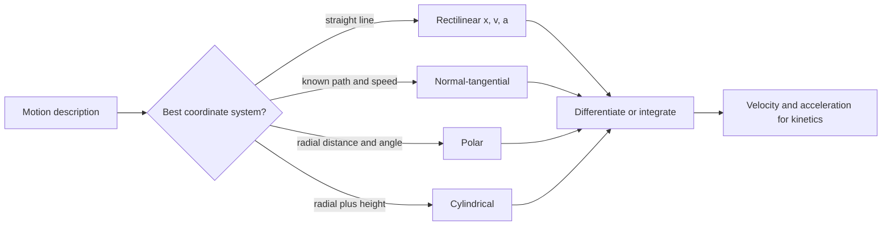

# Particle Kinematics

Kinematics describes motion without asking what force caused it. For a particle, the motion is captured by position, velocity, and acceleration as functions of time. These quantities are vectors, so a path can be described in rectangular, normal-tangential, polar, cylindrical, or other coordinates depending on the geometry.

This topic bridges statics and dynamics. In statics, acceleration is zero and the equations collapse to equilibrium. In dynamics, acceleration is usually the unknown that connects motion to force through Newton's second law. A clear kinematic description is therefore the setup step for every kinetics problem.

## Definitions

The position vector of a particle is

$$
\mathbf{r}(t)=x(t)\mathbf{i}+y(t)\mathbf{j}+z(t)\mathbf{k}.
$$

Velocity is the time derivative of position:

$$
\mathbf{v}=\frac{d\mathbf{r}}{dt}.
$$

Acceleration is the time derivative of velocity:

$$
\mathbf{a}=\frac{d\mathbf{v}}{dt}=\frac{d^2\mathbf{r}}{dt^2}.
$$

For rectilinear motion along one axis,

$$
v=\frac{dx}{dt},\qquad a=\frac{dv}{dt}=\frac{d^2x}{dt^2}.
$$

When acceleration is constant, the standard equations are

$$
v=v_0+at,
$$

$$
x=x_0+v_0t+\frac{1}{2}at^2,
$$

$$
v^2=v_0^2+2a(x-x_0).
$$

For path coordinates, let $s$ be distance along a curve. The velocity magnitude is

$$
v=\frac{ds}{dt}.
$$

In normal-tangential coordinates,

$$
\mathbf{a}=\dot{v}\mathbf{e}_t+\frac{v^2}{\rho}\mathbf{e}_n,
$$

where $\rho$ is the radius of curvature, $\mathbf{e}_t$ points tangent to the path, and $\mathbf{e}_n$ points toward the center of curvature.

In polar coordinates for planar motion,

$$
\mathbf{r}=r\mathbf{e}_r,
$$

$$
\mathbf{v}=\dot{r}\mathbf{e}_r+r\dot{\theta}\mathbf{e}_\theta,
$$

$$
\mathbf{a}=(\ddot{r}-r\dot{\theta}^2)\mathbf{e}_r+(r\ddot{\theta}+2\dot{r}\dot{\theta})\mathbf{e}_\theta.
$$

Cylindrical coordinates extend polar coordinates by adding $z$:

$$
\mathbf{v}=\dot{r}\mathbf{e}_r+r\dot{\theta}\mathbf{e}_\theta+\dot{z}\mathbf{k}.
$$

## Key results

The most important kinematic result is that coordinate choice must match the known motion. Rectangular coordinates are best when $x(t)$, $y(t)$, and $z(t)$ are directly known or independent. Normal-tangential coordinates are best when speed and path curvature are known. Polar or cylindrical coordinates are best when a particle moves relative to a rotating radial line, slot, arm, or circular guide.

The chain rule gives useful alternative forms. If acceleration is a function of position rather than time in rectilinear motion,

$$
a=\frac{dv}{dt}=\frac{dv}{dx}\frac{dx}{dt}=v\frac{dv}{dx}.
$$

This transforms

$$
a(x)=v\frac{dv}{dx}
$$

and can be integrated:

$$
\int_{v_0}^{v}v\,dv=\int_{x_0}^{x}a(x)\,dx.
$$

For projectile motion with no air resistance and constant gravity,

$$
a_x=0,\qquad a_y=-g.
$$

Therefore horizontal velocity is constant and vertical velocity changes linearly with time:

$$
x=x_0+v_{0x}t,
$$

$$
y=y_0+v_{0y}t-\frac{1}{2}gt^2.
$$

For circular motion with constant radius $R$,

$$
v=R\dot{\theta},
$$

$$
a_t=R\ddot{\theta},
$$

$$
a_n=\frac{v^2}{R}=R\dot{\theta}^2.
$$

Even if the speed is constant, acceleration is not zero unless the path is straight. Constant-speed circular motion has zero tangential acceleration but nonzero normal acceleration.

In polar coordinates, the term $2\dot{r}\dot{\theta}$ is often missed. It appears because the basis vectors themselves rotate. Any time the basis changes direction with time, differentiating components alone is incomplete.

Relative motion is another recurring kinematic idea. If the position of particle $B$ is described relative to particle $A$, then

$$
\mathbf{r}_B=\mathbf{r}_A+\mathbf{r}_{B/A}.
$$

When the reference axes are not rotating, differentiating gives

$$
\mathbf{v}_B=\mathbf{v}_A+\mathbf{v}_{B/A},
$$

and

$$
\mathbf{a}_B=\mathbf{a}_A+\mathbf{a}_{B/A}.
$$

This simple form is useful for moving platforms, boats in currents, and particles described relative to translating frames. If the frame rotates, extra terms appear, which is why polar and cylindrical formulas must be used with care.

Kinematic equations are also domain statements. A formula derived for constant acceleration does not become approximately true just because the problem is one-dimensional. A formula using radius of curvature assumes the path is smooth at the instant considered. A polar-coordinate expression assumes $\theta$ is measured in radians. Before substituting numbers, identify what is constant, what is a function of time, and what is known only at one instant.

A final useful check is reversibility of differentiation. If you integrate acceleration to get velocity, differentiating the velocity expression should return the original acceleration. If you integrate velocity to get position, differentiating position should return velocity. This simple check catches lost constants, sign errors, and inconsistent initial conditions.

## Visual



| Coordinate description | Velocity | Acceleration feature |
|---|---|---|
| Rectilinear | $v=\dot{x}$ | $a=\dot{v}=v\,dv/dx$ |
| Cartesian 2D | $\dot{x}\mathbf{i}+\dot{y}\mathbf{j}$ | Independent fixed basis vectors |
| Normal-tangential | $v\mathbf{e}_t$ | $\dot{v}\mathbf{e}_t+v^2\mathbf{e}_n/\rho$ |
| Polar | $\dot{r}\mathbf{e}_r+r\dot{\theta}\mathbf{e}_\theta$ | Includes $-r\dot{\theta}^2$ and $2\dot{r}\dot{\theta}$ |
| Cylindrical | polar velocity plus $\dot{z}\mathbf{k}$ | Polar acceleration plus $\ddot{z}\mathbf{k}$ |

## Worked example 1: Rectilinear motion with position-dependent acceleration

**Problem.** A slider moves along a straight track. At $x=0$, its speed is $v_0=3$ m/s. Its acceleration is $a(x)=2+0.5x$ m/s$^2$, with $x$ in meters. Find the speed at $x=8$ m.

**Method.** Because acceleration is given as a function of position, use $a=v\,dv/dx$.

1. Start from

$$
a=v\frac{dv}{dx}.
$$

Substitute $a(x)$:

$$
v\frac{dv}{dx}=2+0.5x.
$$

2. Separate variables:

$$
v\,dv=(2+0.5x)\,dx.
$$

3. Integrate from the initial state to the final state:

$$
\int_{3}^{v}v\,dv=\int_0^8(2+0.5x)\,dx.
$$

4. Evaluate the left side:

$$
\frac{1}{2}(v^2-3^2)=\frac{1}{2}(v^2-9).
$$

5. Evaluate the right side:

$$
\int_0^8(2+0.5x)\,dx=\left[2x+0.25x^2\right]_0^8.
$$

$$
=2(8)+0.25(64)=16+16=32.
$$

6. Equate and solve:

$$
\frac{1}{2}(v^2-9)=32.
$$

$$
v^2-9=64,\qquad v^2=73.
$$

$$
v=8.54\ \text{m/s}.
$$

The checked answer is

$$
\boxed{v=8.54\ \text{m/s at }x=8\ \text{m}.}
$$

The speed increased because acceleration was positive over the whole interval.

## Worked example 2: Polar acceleration in a rotating slot

**Problem.** A bead moves in a radial slot on a rotating arm. At an instant, $r=0.80$ m, $\dot{r}=0.50$ m/s, $\ddot{r}=0.20$ m/s$^2$, $\dot{\theta}=3.0$ rad/s, and $\ddot{\theta}=1.5$ rad/s$^2$. Find the radial and transverse acceleration components.

**Method.** Use the polar acceleration formula.

1. Radial component:

$$
a_r=\ddot{r}-r\dot{\theta}^2.
$$

Substitute:

$$
a_r=0.20-0.80(3.0)^2.
$$

$$
a_r=0.20-7.20=-7.00\ \text{m/s}^2.
$$

2. Transverse component:

$$
a_\theta=r\ddot{\theta}+2\dot{r}\dot{\theta}.
$$

Substitute:

$$
a_\theta=0.80(1.5)+2(0.50)(3.0).
$$

$$
a_\theta=1.20+3.00=4.20\ \text{m/s}^2.
$$

3. Optional magnitude:

$$
|\mathbf{a}|=\sqrt{(-7.00)^2+(4.20)^2}=8.16\ \text{m/s}^2.
$$

The checked answer is

$$
\boxed{\mathbf{a}=-7.00\mathbf{e}_r+4.20\mathbf{e}_\theta\ \text{m/s}^2.}
$$

The radial acceleration is inward because the centripetal term $r\dot{\theta}^2$ is larger than the outward radial acceleration $\ddot{r}$.

## Code

```python
import math

# Example 1: integrate a(x) = 2 + 0.5 x from x0 to x1.
v0 = 3.0
x0 = 0.0
x1 = 8.0
integral_a_dx = 2.0 * (x1 - x0) + 0.25 * (x1**2 - x0**2)
v1 = math.sqrt(v0**2 + 2.0 * integral_a_dx)
print(f"v1 = {v1:.3f} m/s")

# Example 2: polar acceleration.
r = 0.80
rdot = 0.50
rddot = 0.20
thetadot = 3.0
thetaddot = 1.5
ar = rddot - r * thetadot**2
atheta = r * thetaddot + 2.0 * rdot * thetadot
print(f"ar = {ar:.2f} m/s^2")
print(f"atheta = {atheta:.2f} m/s^2")
```

## Common pitfalls

- Treating speed and velocity as the same quantity in curved motion.
- Using constant-acceleration formulas when acceleration is not constant.
- Forgetting the chain-rule form $a=v\,dv/dx$ when acceleration depends on position.
- Omitting normal acceleration in constant-speed curved motion.
- Omitting polar acceleration terms caused by rotating basis vectors.
- Using degrees per second in formulas that require radians per second.
- Choosing a coordinate system because it is familiar rather than because it matches the motion constraints.

## Connections

- [Force vectors, resultants, and components](/physics/mechanics/force-vectors-resultants-components)
- [Particle kinetics with Newton's second law](/physics/mechanics/particle-kinetics-newton)
- [Work-energy methods](/physics/mechanics/work-energy-methods)
- [Planar rigid-body motion](/physics/mechanics/planar-rigid-body-motion)
