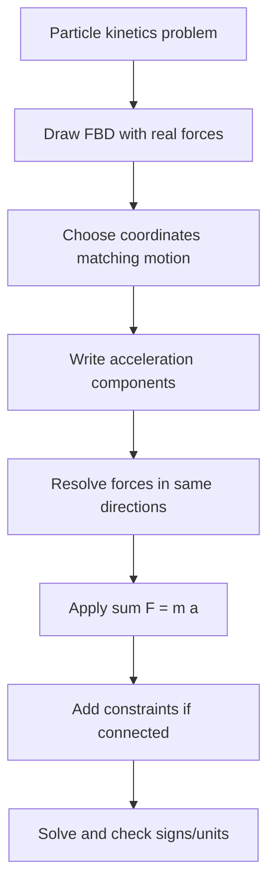

# Particle Kinetics with Newton's Second Law

Kinetics connects motion to the forces that cause it. For a particle, Newton's second law states that the resultant force equals mass times acceleration. The equation is vectorial, so the main work is choosing coordinates, drawing a complete free-body diagram, and writing the acceleration components in the same directions as the force components.

This page continues directly from particle equilibrium. Static equilibrium is the special case $\mathbf{a}=\mathbf{0}$. In dynamics, nonzero acceleration allows a nonzero resultant force, but the free-body diagram rules do not change. You still isolate the particle, draw real external forces, and write component equations.

## Definitions

For a particle of constant mass $m$, Newton's second law is

$$
\sum\mathbf{F}=m\mathbf{a}.
$$

In Cartesian coordinates,

$$
\sum F_x=ma_x,\qquad \sum F_y=ma_y,\qquad \sum F_z=ma_z.
$$

In normal-tangential coordinates,

$$
\sum F_t=m\dot{v},
$$

$$
\sum F_n=m\frac{v^2}{\rho}.
$$

The normal direction points toward the center of curvature. The normal acceleration magnitude $v^2/\rho$ is always nonnegative; its direction is what matters.

In polar coordinates,

$$
\sum F_r=m(\ddot{r}-r\dot{\theta}^2),
$$

$$
\sum F_\theta=m(r\ddot{\theta}+2\dot{r}\dot{\theta}).
$$

A **free-body diagram** in kinetics shows only real external forces. It does not show $m\mathbf{a}$ as a force unless using a special D'Alembert-style dynamic equilibrium method. In the standard Newton form, $m\mathbf{a}$ belongs on the right side of the equation.

A **constraint equation** relates accelerations or coordinates because of geometry. For example, a particle constrained to a circular path has fixed radius $R$, so $\dot{r}=\ddot{r}=0$ in polar coordinates.

The **weight** of a particle near Earth's surface is

$$
W=mg
$$

directed downward, where $g\approx9.81$ m/s$^2$.

## Key results

Newton's law is most useful when the force components and acceleration components are expressed in the same basis. A common error is to draw forces in $x,y$ but write acceleration in $t,n$ without projecting. If the path geometry is known, $t,n$ can make the acceleration simple; then all forces must be resolved along tangent and normal directions.

For a particle on a smooth incline, the normal force is perpendicular to the surface and the tangential equation gives acceleration:

$$
\sum F_t=ma_t.
$$

If there is kinetic friction during sliding,

$$
F_k=\mu_kN
$$

and it opposes relative motion along the surface.

For circular motion with constant speed, $\dot{v}=0$ but

$$
\sum F_n=m\frac{v^2}{R}.
$$

The resultant force is inward. If the available inward force is insufficient, the particle cannot maintain the circular path under the assumed contact or tension.

For several connected particles, each particle has its own free-body diagram and Newton equation. The connection gives constraints. If two blocks are linked by a taut massless cable over a frictionless pulley, their acceleration magnitudes along the cable are equal and their tension magnitudes may be equal. If the pulley has inertia or the cable slips, those simplifications must be revised.

Dimensional checking is especially helpful:

$$
\text{newton}=\text{kg}\cdot\text{m/s}^2.
$$

If a term in a force equation has units of energy or moment, it belongs somewhere else.

Apparent weight problems are direct applications of Newton's second law. In an elevator accelerating upward, the scale reading is the normal force $N$, not the gravitational weight $mg$. With upward positive,

$$
N-mg=ma.
$$

Thus $N=m(g+a)$ for upward acceleration and $N=m(g-a)$ for downward acceleration. The person has not changed mass; the support force required to produce the acceleration has changed. This distinction is a useful check whenever a normal force is not simply $mg$.

For circular motion, the phrase "centripetal force" can be misleading if it is treated as a new force to add to the free-body diagram. There is no separate centripetal-force object. The inward component of the real forces equals $mv^2/R$. Depending on the problem, that inward component may come from tension, gravity, a normal reaction, friction, or a combination of forces.

When multiple particles are connected, write one equation of motion for each body before eliminating unknowns. It is tempting to combine bodies immediately, but doing so can hide tensions, normal forces, or friction forces that the problem asks for. Combining bodies is powerful when the internal connection force is not needed; separating bodies is necessary when it is.

Finally, Newton equations are instantaneous. They describe the acceleration at a given configuration and velocity. To find later speed or position, the acceleration relation must be integrated or combined with kinematics. If forces depend on position, velocity, or time, the resulting differential equation may not have a constant-acceleration solution.

Equilibrium intuition still helps in kinetics. If acceleration is small compared with $g$, reactions and tensions may be close to their static values. If acceleration is large, the difference between static and dynamic force balance may dominate the answer. Before solving, estimate the likely acceleration direction and ask which forces should be larger or smaller than in equilibrium; after solving, compare the result with that expectation.

## Visual



| Motion description | Best components | Newton equations |
|---|---|---|
| Straight-line block | Along and normal to path | $\sum F_s=ma$, $\sum F_n=0$ |
| Projectile | Cartesian | $\sum F_x=ma_x$, $\sum F_y=ma_y$ |
| Curved path with known speed | Tangential-normal | $\sum F_t=m\dot{v}$, $\sum F_n=mv^2/\rho$ |
| Rotating arm or slot | Polar | $\sum F_r=m(\ddot r-r\dot\theta^2)$ |
| Connected particles | Coordinates along cables/paths | Newton equations plus acceleration constraints |

## Worked example 1: Block sliding down a rough incline

**Problem.** A $25$ kg block slides down a $20^\circ$ incline. The coefficient of kinetic friction is $\mu_k=0.18$. Find its acceleration down the plane. Use $g=9.81$ m/s$^2$.

**Method.** Draw weight, normal reaction, and kinetic friction. Use axes along and normal to the plane.

1. Weight:

$$
W=mg=25(9.81)=245.25\ \text{N}.
$$

2. Normal equation. The block has no acceleration normal to the plane:

$$
\sum F_n=0:\quad N-W\cos20^\circ=0.
$$

$$
N=245.25(0.9397)=230.46\ \text{N}.
$$

3. Kinetic friction:

$$
F_k=\mu_kN=0.18(230.46)=41.48\ \text{N}.
$$

Since the block slides down, friction acts up the plane.

4. Tangential equation, positive down the plane:

$$
\sum F_t=ma:\quad W\sin20^\circ-F_k=ma.
$$

5. Substitute:

$$
245.25(0.3420)-41.48=25a.
$$

$$
83.86-41.48=25a.
$$

$$
42.38=25a,\qquad a=1.695\ \text{m/s}^2.
$$

The checked answer is

$$
\boxed{a=1.70\ \text{m/s}^2\ \text{down the incline}.}
$$

The acceleration is less than the frictionless value $g\sin20^\circ=3.36$ m/s$^2$, as expected.

## Worked example 2: Tension in a pendulum cable at the bottom

**Problem.** A $3$ kg particle is attached to a light cable of length $1.2$ m and swings through the bottom of its path at speed $4.0$ m/s. Find the cable tension at that instant.

**Method.** At the bottom, the normal direction points upward toward the pivot. Use normal force balance.

1. Normal acceleration:

$$
a_n=\frac{v^2}{R}=\frac{(4.0)^2}{1.2}=13.33\ \text{m/s}^2.
$$

2. Forces in the normal direction. At the bottom, tension $T$ acts upward and weight $mg$ acts downward. Take upward as positive normal:

$$
\sum F_n=ma_n:\quad T-mg=m\frac{v^2}{R}.
$$

3. Solve for tension:

$$
T=mg+m\frac{v^2}{R}.
$$

4. Substitute:

$$
T=3(9.81)+3(13.33).
$$

$$
T=29.43+40.00=69.43\ \text{N}.
$$

The checked answer is

$$
\boxed{T=69.4\ \text{N}.}
$$

The tension is larger than the weight because the cable must both support the particle and provide inward centripetal acceleration.

## Code

```python
import math

def rough_incline_acceleration(mass, theta_deg, mu_k, g=9.81):
    theta = math.radians(theta_deg)
    normal = mass * g * math.cos(theta)
    friction = mu_k * normal
    driving = mass * g * math.sin(theta)
    acceleration = (driving - friction) / mass
    return normal, friction, acceleration

N, Fk, a = rough_incline_acceleration(25.0, 20.0, 0.18)
print(f"N = {N:.2f} N")
print(f"F_k = {Fk:.2f} N")
print(f"a = {a:.3f} m/s^2")

mass = 3.0
speed = 4.0
radius = 1.2
tension = mass * 9.81 + mass * speed**2 / radius
print(f"pendulum bottom tension = {tension:.2f} N")
```

## Common pitfalls

- Drawing $m\mathbf{a}$ as a real external force on a standard free-body diagram.
- Resolving forces in one coordinate system and acceleration in another.
- Forgetting kinetic friction direction is opposite relative sliding, not necessarily opposite velocity in every coordinate.
- Setting normal acceleration to zero in curved motion because the speed is constant.
- Assuming tension equals weight in a moving pendulum or cable system.
- Neglecting constraints between connected particles.
- Using mass in newtons or weight in kilograms.

## Connections

- [Particle equilibrium](/physics/mechanics/particle-equilibrium)
- [Particle kinematics](/physics/mechanics/particle-kinematics)
- [Work-energy methods](/physics/mechanics/work-energy-methods)
- [Impulse, momentum, and impact](/physics/mechanics/impulse-momentum-impact)
