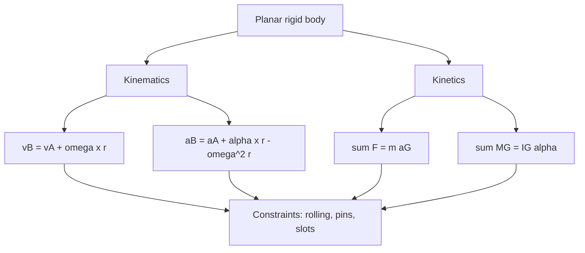

# Planar Rigid-Body Motion

Planar rigid-body motion combines translation of a body with rotation about an axis perpendicular to the plane. A wheel rolling, a link rotating, a sliding block connected to a crank, and a plate moving in a mechanism all require this topic. The kinematics describe velocity and acceleration relationships across the body; the kinetics relate forces and moments to the motion.

The central benefit of the rigid-body model is that distances between points remain fixed. Once the motion of one point and the angular motion are known, the velocity and acceleration of every other point can be related by vector equations. Once the acceleration of the mass center and angular acceleration are known, planar force and moment balance determine or check the required forces.


*Figure: The cart-pendulum setup is a classic benchmark for unstable dynamics, feedback, and hybrid simulation tests. Image: [Wikimedia Commons](https://commons.wikimedia.org/wiki/File:Cart-pendulum.svg), Krishnavedala, CC0 1.0.*

## Definitions

A rigid body in planar motion has angular velocity

$$
\boldsymbol{\omega}=\omega\mathbf{k}
$$

and angular acceleration

$$
\boldsymbol{\alpha}=\alpha\mathbf{k}.
$$

For two points $A$ and $B$ fixed in the same rigid body, the relative velocity equation is

$$
\mathbf{v}_B=\mathbf{v}_A+\boldsymbol{\omega}\times\mathbf{r}_{B/A}.
$$

The relative acceleration equation is

$$
\mathbf{a}_B=\mathbf{a}_A+\boldsymbol{\alpha}\times\mathbf{r}_{B/A}
+\boldsymbol{\omega}\times(\boldsymbol{\omega}\times\mathbf{r}_{B/A}).
$$

The second added term is tangential relative acceleration; the third is normal relative acceleration toward point $A$.

For a rigid body with mass center $G$, planar kinetics are

$$
\sum F_x=ma_{Gx},
$$

$$
\sum F_y=ma_{Gy},
$$

$$
\sum M_G=I_G\alpha.
$$

Moments may also be taken about an accelerating point, but extra terms are needed unless the point is fixed or the equation is written carefully. Taking moments about the mass center is usually safest.

For rolling without slipping between a wheel of radius $R$ and a fixed surface,

$$
v_G=R\omega,
$$

$$
a_G=R\alpha
$$

along the rolling direction when the radius is constant and the surface is fixed.

## Key results

Rigid-body velocity fields are determined by one point velocity and angular velocity. In 2D, the cross product can be evaluated as

$$
\boldsymbol{\omega}\times(x\mathbf{i}+y\mathbf{j})=
-\omega y\mathbf{i}+\omega x\mathbf{j}.
$$

This makes it easy to write components:

$$
v_{Bx}=v_{Ax}-\omega y_{B/A},
$$

$$
v_{By}=v_{Ay}+\omega x_{B/A}.
$$

The **instantaneous center of zero velocity** is a point, possibly outside the body, whose velocity is zero at a given instant. If located, velocities of all points are perpendicular to lines from that center and have magnitudes $v=\omega r$. This is a velocity tool only; the instantaneous center generally does not have zero acceleration.

Acceleration analysis cannot be done by using the instantaneous center as if it were a fixed pivot unless the center is actually fixed. The acceleration equation must include both tangential and normal relative terms:

$$
\mathbf{a}_{B/A}=\boldsymbol{\alpha}\times\mathbf{r}_{B/A}
-\omega^2\mathbf{r}_{B/A}.
$$

For planar kinetics, the mass center translates according to the resultant force, while the body rotates according to the resultant moment about the mass center. The equations are coupled by constraints. For example, in rolling without slipping, friction may be unknown but the constraint $a_G=R\alpha$ links translation and rotation.

The planar rigid-body kinetic energy formula is

$$
T=\frac{1}{2}mv_G^2+\frac{1}{2}I_G\omega^2.
$$

This works for any planar rigid-body motion. If the body rotates about a fixed point $O$, it may also be written as

$$
T=\frac{1}{2}I_O\omega^2
$$

using the parallel-axis theorem, because $v_G=\omega r_{G/O}$.

## Visual



| Situation | Kinematic relation | Kinetic relation |
|---|---|---|
| Pure translation | $\omega=0$ | $\sum\mathbf{F}=m\mathbf{a}_G$, no rotational acceleration |
| Fixed-axis rotation | $v=r\omega$, $a_t=r\alpha$, $a_n=r\omega^2$ | $\sum M_O=I_O\alpha$ if $O$ fixed |
| General planar motion | $\mathbf{v}_B=\mathbf{v}_A+\omega\times r$ | $\sum M_G=I_G\alpha$ |
| Rolling without slipping | $v_G=R\omega$, $a_G=R\alpha$ | Friction supplies torque as needed |

## Worked example 1: Velocity and acceleration of a rotating bar

**Problem.** A rigid bar $AB$ is $0.9$ m long and rotates counterclockwise in the plane. At an instant, point $A$ has velocity $\mathbf{v}_A=1.2\mathbf{i}$ m/s and acceleration $\mathbf{a}_A=0.5\mathbf{j}$ m/s$^2$. The vector from $A$ to $B$ is $\mathbf{r}_{B/A}=0.9\mathbf{i}$ m. The bar has $\omega=4$ rad/s counterclockwise and $\alpha=2$ rad/s$^2$ counterclockwise. Find $\mathbf{v}_B$ and $\mathbf{a}_B$.

**Method.** Use relative velocity and acceleration equations.

1. Angular velocity vector:

$$
\boldsymbol{\omega}=4\mathbf{k}.
$$

2. Relative velocity:

$$
\boldsymbol{\omega}\times\mathbf{r}_{B/A}
=4\mathbf{k}\times0.9\mathbf{i}
=3.6\mathbf{j}.
$$

3. Velocity of $B$:

$$
\mathbf{v}_B=1.2\mathbf{i}+3.6\mathbf{j}\ \text{m/s}.
$$

4. Tangential relative acceleration:

$$
\boldsymbol{\alpha}\times\mathbf{r}_{B/A}
=2\mathbf{k}\times0.9\mathbf{i}
=1.8\mathbf{j}.
$$

5. Normal relative acceleration:

$$
\boldsymbol{\omega}\times(\boldsymbol{\omega}\times\mathbf{r}_{B/A})
=-\omega^2\mathbf{r}_{B/A}
=-(4^2)(0.9\mathbf{i})
=-14.4\mathbf{i}.
$$

6. Acceleration of $B$:

$$
\mathbf{a}_B=\mathbf{a}_A+1.8\mathbf{j}-14.4\mathbf{i}.
$$

$$
\mathbf{a}_B=-14.4\mathbf{i}+(0.5+1.8)\mathbf{j}.
$$

$$
\mathbf{a}_B=-14.4\mathbf{i}+2.3\mathbf{j}\ \text{m/s}^2.
$$

The checked answer is

$$
\boxed{\mathbf{v}_B=1.2\mathbf{i}+3.6\mathbf{j}\ \text{m/s},\quad
\mathbf{a}_B=-14.4\mathbf{i}+2.3\mathbf{j}\ \text{m/s}^2.}
$$

The large negative $x$ acceleration is the centripetal part toward point $A$.

## Worked example 2: Rolling cylinder pulled by a horizontal force

**Problem.** A solid cylinder of mass $12$ kg and radius $0.20$ m rolls without slipping on a horizontal surface. A horizontal force $P=30$ N is applied at its center to the right. Find the acceleration of the center and the friction force. For a solid cylinder, $I_G=\frac{1}{2}mR^2$.

**Method.** Draw forces: $P$ right at the center, friction $F$ at the ground, normal $N$, and weight $mg$. Use translation, rotation about $G$, and rolling constraint.

1. Horizontal translation:

Assume friction positive to the right:

$$
\sum F_x=ma_G:\quad P+F=ma.
$$

2. Rotation about $G$. Force $P$ passes through $G$, so it creates no moment. Friction at the bottom creates the torque. With rightward rolling requiring clockwise angular acceleration, take clockwise positive for rotation. If $F$ acts left, it creates clockwise torque. The algebra can instead assume friction left with magnitude $f$:

$$
P-f=ma.
$$

Moment about $G$:

$$
fR=I_G\alpha.
$$

3. Rolling constraint:

$$
a=R\alpha.
$$

4. Substitute $\alpha=a/R$ into moment equation:

$$
fR=I_G\frac{a}{R}.
$$

$$
f=\frac{I_G}{R^2}a.
$$

For a solid cylinder,

$$
I_G=\frac{1}{2}mR^2,
$$

so

$$
f=\frac{1}{2}ma.
$$

5. Substitute in translation:

$$
P-\frac{1}{2}ma=ma.
$$

$$
P=\frac{3}{2}ma.
$$

$$
a=\frac{2P}{3m}=\frac{2(30)}{3(12)}=1.667\ \text{m/s}^2.
$$

6. Friction magnitude:

$$
f=\frac{1}{2}ma=\frac{1}{2}(12)(1.667)=10.0\ \text{N}.
$$

Because we assumed $f$ left, the friction force is $10$ N left. The checked answer is

$$
\boxed{a_G=1.67\ \text{m/s}^2\ \text{right},\qquad f=10.0\ \text{N left}.}
$$

Friction acts left even though the cylinder accelerates right because friction supplies the clockwise torque needed for rolling.

## Code

```python
import numpy as np

def planar_cross_omega_r(omega, r):
    x, y = r
    return np.array([-omega * y, omega * x])

vA = np.array([1.2, 0.0])
aA = np.array([0.0, 0.5])
rBA = np.array([0.9, 0.0])
omega = 4.0
alpha = 2.0

vB = vA + planar_cross_omega_r(omega, rBA)
aB = aA + planar_cross_omega_r(alpha, rBA) - omega**2 * rBA
print("vB =", vB)
print("aB =", aB)

m = 12.0
P = 30.0
a = 2.0 * P / (3.0 * m)
f = 0.5 * m * a
print(f"rolling acceleration = {a:.3f} m/s^2")
print(f"friction magnitude = {f:.2f} N left")
```

## Common pitfalls

- Using the instantaneous center to compute acceleration as if it were a fixed point.
- Dropping the normal relative acceleration term $-\omega^2\mathbf{r}$.
- Confusing angular velocity sign with angular acceleration sign.
- Taking moments about a moving point without accounting for extra terms.
- Assuming friction always opposes the center's motion in rolling problems.
- Forgetting the rolling constraint changes sign depending on the chosen positive angular direction.
- Using $I_G$ when the body rotates about a fixed point and the correct equation needs $I_O$ or a moment about $G$.

## Connections

- [Particle kinematics](/physics/mechanics/particle-kinematics)
- [Particle kinetics with Newton's second law](/physics/mechanics/particle-kinetics-newton)
- [Work-energy methods](/physics/mechanics/work-energy-methods)
- [Centroids and second moments](/physics/mechanics/centroids-second-moments)

