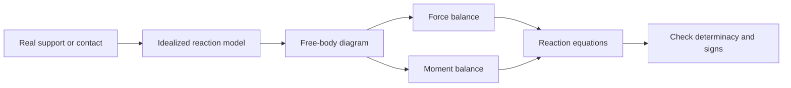

# Rigid-Body Equilibrium

A rigid body can translate and rotate, so force balance alone is not enough. A beam, bracket, ladder, frame member, or machine link may have zero resultant force and still tend to spin. Rigid-body equilibrium therefore combines force balance with moment balance, using a free-body diagram that preserves both the magnitudes and the points of application of external loads.

This page is the center of statics. Once you can isolate a body, replace supports by reactions, compute moments, and choose useful equilibrium equations, trusses, beams, friction, frames, and machines become variations on the same theme. The algebra can be short, but the modeling choices must be explicit.

## Definitions

A **rigid body** is an ideal body whose distances between material points do not change. It can have many forces applied at different points. In static equilibrium,

$$
\sum\mathbf{F}=\mathbf{0},\qquad \sum\mathbf{M}_O=\mathbf{0}
$$

about any point $O$. In 2D, these become three scalar equations:

$$
\sum F_x=0,\qquad \sum F_y=0,\qquad \sum M_O=0.
$$

In 3D, there are six scalar equations:

$$
\sum F_x=\sum F_y=\sum F_z=0,
$$

$$
\sum M_x=\sum M_y=\sum M_z=0.
$$

A **moment** measures the rotational tendency of a force about a point:

$$
\mathbf{M}_O=\mathbf{r}_{OP}\times\mathbf{F}.
$$

In 2D, the scalar moment about $O$ is positive counterclockwise by convention:

$$
M_O=xF_y-yF_x.
$$

The **line of action** of a force is the infinite line through the force vector. Sliding a force along its own line of action does not change its moment about any point. Moving it to a different parallel line does change the moment.

A **couple moment** is a pure moment produced by equal and opposite parallel forces separated by a distance. A couple has no resultant force. Its moment is the same about every point, so it may be treated as a free vector in rigid-body statics.

Common 2D support models include a roller, a pin, and a fixed support. A roller supplies one reaction normal to the contact surface. A pin supplies two force components and no couple moment. A fixed support supplies two force components and one couple moment.

## Key results

For a 2D rigid body, any one of these equation sets can be used if the equations are independent:

$$
\sum F_x=0,\qquad \sum F_y=0,\qquad \sum M_O=0,
$$

or

$$
\sum F_x=0,\qquad \sum M_A=0,\qquad \sum M_B=0,
$$

provided line $AB$ is not perpendicular to the direction of all unknown force information being eliminated, and similarly for other choices. The practical rule is simpler: take moments about a point through which unknown forces pass when you want to eliminate them.

For a force with perpendicular distance $d_\perp$ from point $O$ to its line of action,

$$
|M_O|=Fd_\perp.
$$

This scalar formula is often faster than the cross product in planar work, but it is only safe when the perpendicular distance and sign are clear. The component formula $M_O=xF_y-yF_x$ is slower but less ambiguous.

A distributed load can often be replaced by an equivalent resultant force. For a vertical distributed load $w(x)$ over $a\le x\le b$,

$$
R=\int_a^b w(x)\,dx,
$$

and its line of action is at

$$
\bar{x}=\frac{\int_a^b xw(x)\,dx}{\int_a^b w(x)\,dx}.
$$

For a uniform load $w_0$ over length $L$, the equivalent force is $w_0L$ acting at the midpoint. This replacement preserves total force and moment for external equilibrium, though it does not show internal shear and bending variation.

A body is **statically determinate** when equilibrium equations are enough to solve all support reactions. A body is **statically indeterminate** when additional deformation relations are needed. For example, a simply supported beam with a pin and a roller in 2D has three reaction unknowns and three equilibrium equations. A fixed-fixed beam has more reaction unknowns than equilibrium equations and requires mechanics of materials.

Equilibrium equations also check whether an assumed support can actually remain engaged. A roller can push but not usually pull; a cable can pull but not push; a unilateral contact can transmit compression but not tension. If an ideal reaction solves with the impossible sign for the real device, the original contact assumption must be revised. The algebraic solution is still useful because it identifies which support would have to reverse its physical role.

## Visual



| 2D support | Reaction components | Allows rotation? | Typical notation |
|---|---:|---:|---|
| Smooth roller on horizontal surface | $R_y$ | Yes | One normal reaction |
| Pin | $A_x,A_y$ | Yes | Two force components |
| Fixed end | $A_x,A_y,M_A$ | No | Two forces and a couple |
| Short cable | $T$ along cable | Yes | One tensile force |
| Smooth slot | Normal to slot | Yes | One constrained direction |

## Worked example 1: Simply supported beam with point load

**Problem.** A $6$ m beam is supported by a pin at $A$ on the left and a roller at $B$ on the right. A $12$ kN downward point load acts $2$ m from $A$. Find the support reactions.

**Method.** Draw the beam as a rigid body. The pin supplies $A_x$ and $A_y$. The roller supplies $B_y$. Use equilibrium.

1. List forces:

$$
A_x,\qquad A_y,\qquad B_y,\qquad 12\ \text{kN downward at }x=2\ \text{m}.
$$

2. Horizontal force balance:

$$
\sum F_x=0:\quad A_x=0.
$$

No external horizontal load is present.

3. Moment balance about $A$ eliminates $A_x$ and $A_y$:

$$
\sum M_A=0:\quad 6B_y-12(2)=0.
$$

Thus

$$
6B_y=24,\qquad B_y=4\ \text{kN}.
$$

4. Vertical force balance:

$$
\sum F_y=0:\quad A_y+B_y-12=0.
$$

Substitute:

$$
A_y+4-12=0,\qquad A_y=8\ \text{kN}.
$$

5. Check moments about $B$:

Taking counterclockwise positive, $A_y$ at $6$ m left of $B$ causes clockwise moment, while the load at $4$ m left of $B$ causes counterclockwise moment:

$$
-8(6)+12(4)=-48+48=0.
$$

The checked answer is

$$
\boxed{A_x=0,\qquad A_y=8\ \text{kN},\qquad B_y=4\ \text{kN}.}
$$

The closer support to the load carries the larger vertical reaction, which matches physical intuition.

## Worked example 2: Bracket with a moment and angled force

**Problem.** A rigid bracket is pinned at $A=(0,0)$ m and connected to a horizontal roller at $B=(0,0.8)$ m that supplies only a horizontal reaction. A $600$ N force acts at $C=(1.2,0.8)$ m, directed $30^\circ$ below the positive $x$ axis. A clockwise couple of $150$ N m is also applied. Find $A_x$, $A_y$, and the roller reaction $B_x$.

**Method.** Resolve the angled force. Use moment balance about $A$ to find $B_x$, then force balance.

1. Resolve the applied force:

$$
F_x=600\cos30^\circ=519.6\ \text{N},
$$

$$
F_y=-600\sin30^\circ=-300.0\ \text{N}.
$$

2. Draw reactions. The pin at $A$ has $A_x,A_y$. The roller at $B$ has $B_x$ only. Assume $B_x$ positive to the right.

3. Moment of the force at $C$ about $A$:

$$
M_A(C)=x_CF_y-y_CF_x=1.2(-300)-0.8(519.6).
$$

$$
M_A(C)=-360-415.7=-775.7\ \text{N m}.
$$

This is clockwise.

4. Moment of $B_x$ at $B=(0,0.8)$:

$$
M_A(B_x)=x_B(0)-y_BB_x=-0.8B_x.
$$

If $B_x$ is positive to the right, it also creates clockwise moment.

5. Include the applied clockwise couple as $-150$ N m. Moment balance about $A$:

$$
\sum M_A=0:\quad -0.8B_x-775.7-150=0.
$$

Thus

$$
-0.8B_x=925.7,\qquad B_x=-1157.1\ \text{N}.
$$

The negative sign means the roller force acts left, not right.

6. Horizontal force balance:

$$
\sum F_x=0:\quad A_x+B_x+519.6=0.
$$

$$
A_x-1157.1+519.6=0,\qquad A_x=637.5\ \text{N}.
$$

7. Vertical force balance:

$$
\sum F_y=0:\quad A_y-300=0,\qquad A_y=300\ \text{N}.
$$

The checked answer is

$$
\boxed{B_x=1157\ \text{N left},\quad A_x=638\ \text{N right},\quad A_y=300\ \text{N up}.}
$$

The moment equation demanded a leftward roller force because the applied force and couple were already clockwise.

## Code

```python
import math

# Beam example: reactions for a point load P at distance a from A on span L.
L = 6.0
P = 12.0  # kN
a = 2.0

By = P * a / L
Ay = P - By
Ax = 0.0

print(f"Ax = {Ax:.2f} kN")
print(f"Ay = {Ay:.2f} kN")
print(f"By = {By:.2f} kN")

# Independent moment check about B.
moment_about_B = -Ay * L + P * (L - a)
print(f"moment residual about B = {moment_about_B:.2e} kN*m")
```

## Common pitfalls

- Replacing a support with the wrong reaction model.
- Taking moments about a point but still including forces whose lines of action pass through that point.
- Forgetting that a couple moment is not multiplied by another lever arm.
- Treating a distributed load as acting at an endpoint instead of at its centroid.
- Mixing clockwise and counterclockwise signs in the same equation.
- Using equilibrium equations on a mechanism configuration that is not actually locked or in static equilibrium.
- Assuming every zero or negative reaction is wrong; often it simply means the assumed support direction is not engaged.

## Connections

- [Force vectors, resultants, and components](/physics/mechanics/force-vectors-resultants-components)
- [Particle equilibrium](/physics/mechanics/particle-equilibrium)
- [Internal forces in beams](/physics/mechanics/internal-forces-beams)
- [Friction: dry contact, belts, and screws](/physics/mechanics/friction-dry-belt-screws)
